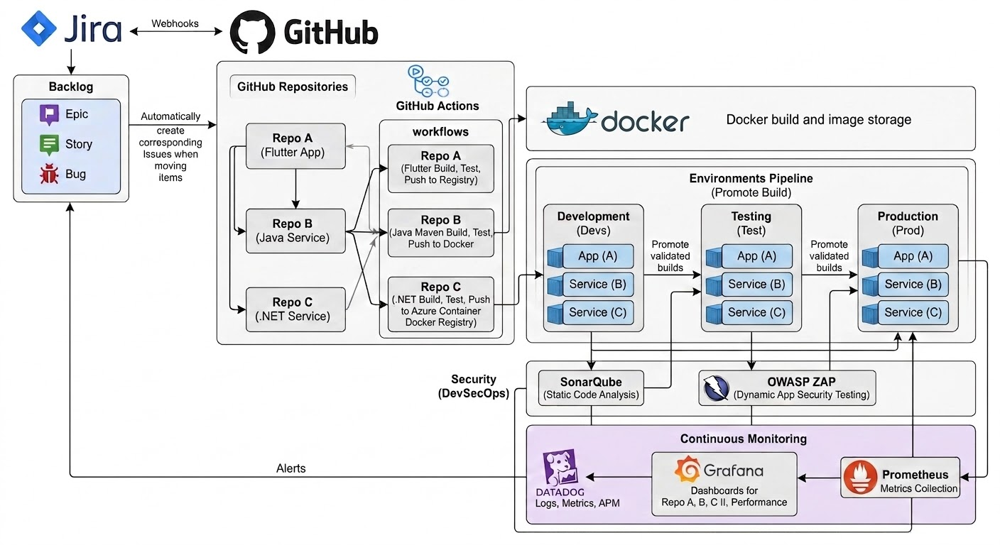
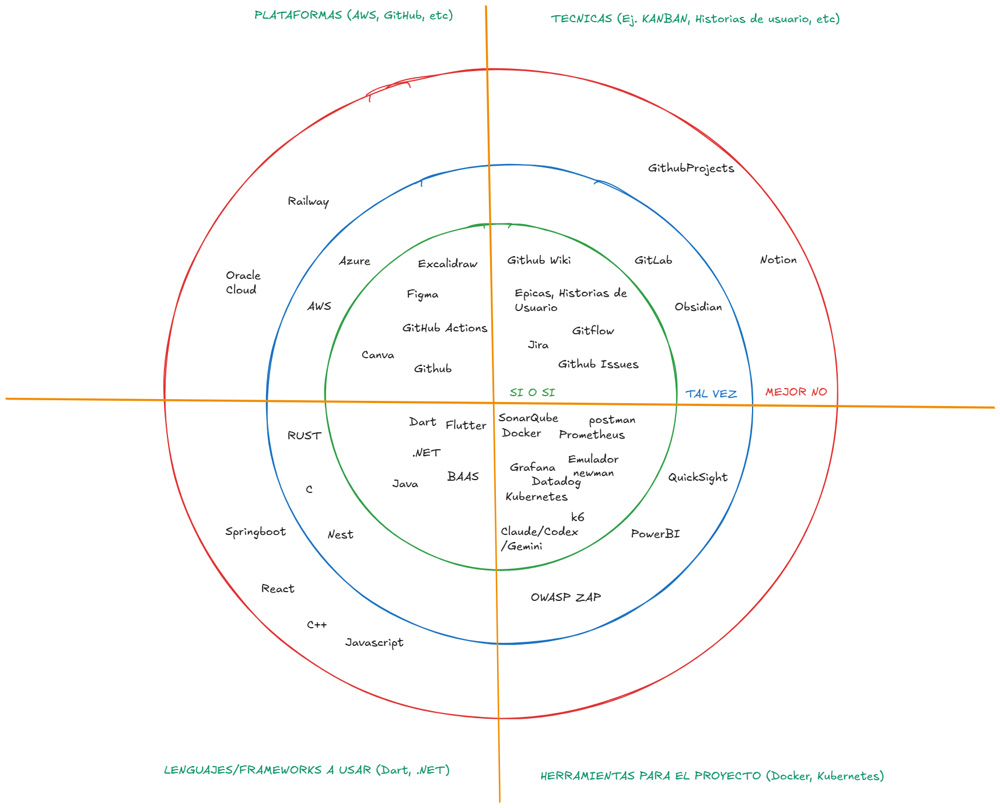
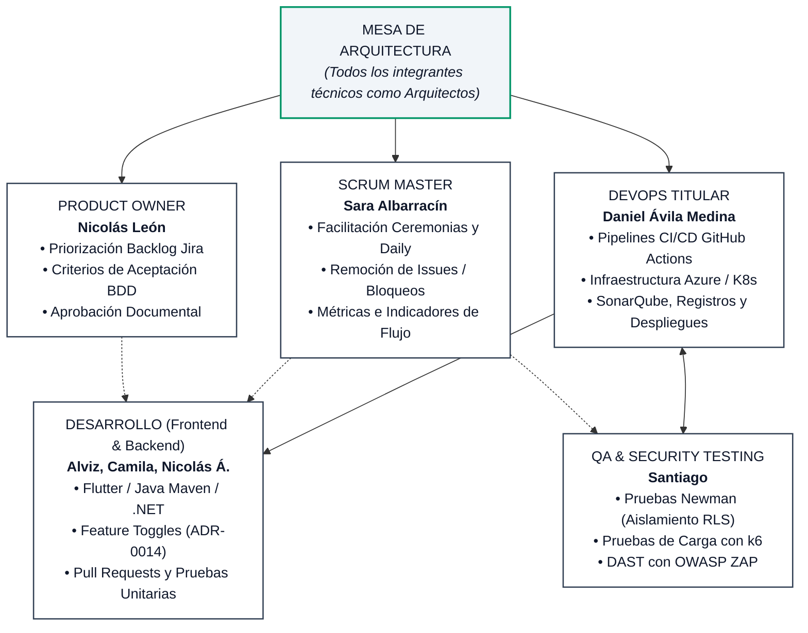

# TRAMA · MANI — Documento de Herramientas, Políticas y Lineamientos V2

**Proyecto:** MANI — Plataforma Multi-Tenant de Formalización y Gestión de Servicios  
**Organización:** TRAMA · Ingeniería de Software  
**Documento:** Herramientas, Políticas y Lineamientos V2 (Entregable Oficial Sprint 1 Review & Planning Sprint 2)  
**Versión:** 2.0 (Línea Base para Sprint 2 — Actualizado con ADR-0014, ADR-0018 y Diagrama HLD V2)  
**Fecha:** Septiembre 2026  
**Responsables:** Sara Albarracín (Scrum Master), Daniel Ávila (DevOps Titular), Nicolás León (Product Owner), Santiago (QA / Security Testing) y Mesa de Arquitectura.  
**Fuentes y Trazabilidad:** ADR-0001 a ADR-0018 (Repositorio `Trama-AS/MANI-docs`), SAD V1, SRS V2, Matriz de Herramientas V1, Gobierno del Equipo.

---

## Control de Versiones del Documento

| Versión | Fecha | Autor(es) | Descripción del Cambio | Estado |
| :---: | :---: | :--- | :--- | :---: |
| **1.0** | 2026-08-20 | Sara Albarracín, Daniel Ávila | Línea base preliminar de herramientas de proceso y desarrollo (Entrega 2 / Sprint 0). Múltiples tecnologías en estado "Evaluar" o pendientes de decisión. | Superada |
| **2.0** | 2026-09-02 | Daniel Ávila, Santiago, Camila Beltrán, Sara Albarracín, Nicolás León | Consolidación integral V2. Se formaliza el **Tech Radar V2** (ADR-0010), se incorpora la **Arquitectura Tecnológica de Alto Nivel V2** (Jira ↔ GitHub ↔ CI/CD ↔ Ambientes ↔ DevSecOps ↔ Observabilidad ↔ Jira Feedback Loop), se ratifican las políticas de DevSecOps (ADR-0005, ADR-0013, ADR-0015), Observabilidad (ADR-0006), Gobernanza de IA (ADR-0009), y se resuelven las incompatibilidades de persistencia y stack técnico (ADR-0011, ADR-0012). | Superada |
| **2.1** | 2026-09-02 | Daniel Ávila, Juan Sebastián Álvarez, Santiago, Mesa de Arquitectura | Actualización mayor: Incorporación del nuevo **Diagrama de Tecnologías de Alto Nivel V2** (estandarización de almacenamiento y compilación Docker), integración de **ADR-0014** (Patrón Feature Toggle para desacoplamiento de despliegue y control por tenant) y **ADR-0018** (Identificación criptográfica de tenant mediante JWT claims anti-spoofing y token relay), eliminación de diagramas ASCII en favor de diagramas formales en **Mermaid**, y reubicación centralizada de activos visuales en `/Diagramas/Tecnologías/`. | **Aprobada (Línea Base Sprint 2)** |

---

## 0. Propósito y Reglas de Gobierno

El presente documento constituye la especificación vinculante de las herramientas, tecnologías, políticas técnicas y lineamientos de ingeniería que rigen el desarrollo, aseguramiento de calidad, seguridad de la información y operaciones de la plataforma **MANI** durante el **Sprint 2** y subsecuentes.

### Reglas de Uso y Vigencia
1. **Lo que no está aquí, no se exige:** Ninguna validación, criterio de rechazo en Pull Requests ni evaluación de entregables puede fundamentarse en lineamientos que no consten explícitamente en este documento o en un ADR ratificado.
2. **Lo que está aquí, se cumple:** Las excepciones operativas o técnicas deben someterse a la Mesa de Arquitectura o dejarse registradas con responsable, justificación y fecha en el acta de la ceremonia correspondiente.
3. **Mecanismo de modificación:** Toda actualización a este documento requiere acuerdo en retrospectiva de sprint o ratificación formal en la Mesa de Arquitectura (quórum mínimo 5 de 7 integrantes) y entra en vigencia a partir del sprint siguiente.

---

# 1. Arquitectura Tecnológica de Alto Nivel y Comunicación entre Herramientas

Para garantizar la entrega continua, la trazabilidad sin fisuras y la seguridad por diseño (*Security by Design*), el proyecto MANI implementa un ecosistema de herramientas interconectadas que abarcan desde la concepción de requerimientos hasta la operación y monitoreo en tiempo real.


*Figura 1.1: Diagrama de Tecnologías de Alto Nivel V2 — Flujo de integración, compilación y almacenamiento en registros Docker, promoción de ambientes, DevSecOps y observabilidad con bucle cerrado hacia Jira.*

### 1.1 Ciclo de Gestión y Trazabilidad Bidireccional (Jira ↔ GitHub)
- **Rastreador y Backlog Unificado:** Conforme a **ADR-0002**, **Jira** es la herramienta única y oficial para la gestión ágil del proyecto, administración del Product Backlog (Épicas, Historias de Usuario, Tareas y Bugs) y control de tableros Kanban/Scrum para el Product Owner (PO) y Scrum Master (SM).
- **Sincronización vía Webhooks:** Se establece un canal de integración bidireccional mediante Webhooks entre Jira y la organización de GitHub.
- **Creación Automatizada de Issues y Ramas:** La transición de ítems en los tableros de Jira (por ejemplo, de *To Do* a *In Progress*) dispara automáticamente la generación de los Issues técnicos correspondientes en los repositorios de GitHub y habilita la creación de ramas normalizadas bajo la convención `feature/US-XX-descripcion` o `fix/BUG-XX-descripcion`.

### 1.2 Estructura Multi-Repositorio y Docker Image Storage
Siguiendo **ADR-0004** y el diseño consolidado en el Diagrama V2, MANI adopta un modelo desacoplado de múltiples repositorios especializados, estandarizando la compilación y el almacenamiento de imágenes mediante **Docker**:
- **Repo A (`mani-app-flutter`):** Código fuente de la aplicación cliente y portal de aliados desarrollado en **Flutter / Dart**. Su flujo automatizado compila, ejecuta pruebas y empaqueta el artefacto en el registro correspondiente.
- **Repo B (`mani-backend-java`):** Microservicio backend implementado en **Java** con gestión de dependencias y construcción en **Maven**. Empaqueta imágenes Docker y las publica en Docker Hub / Container Registry.
- **Repo C (`mani-backend-dotnet`):** Microservicio backend implementado en **.NET (C#)**. Automatiza su compilación, pruebas y publicación hacia Azure Container Docker Registry (ACR).

### 1.3 Workflows de Integración Continua (GitHub Actions)
Cada repositorio posee flujos de trabajo (*workflows*) declarativos e independientes en GitHub Actions:
- **Compilación y Pruebas:** Ejecución obligatoria de pruebas unitarias y de integración en cada *Push* y *Pull Request*.
- **Empaquetado de Contenedores:** Construcción automatizada de imágenes Docker reproducibles e inmutables (*Build Once, Deploy Anywhere*).
- **Publicación en Registros:** Envío controlado a Docker Hub (Repo B) y Azure Container Registry (Repo C y Repo A).

### 1.4 Pipeline de Promoción de Ambientes (Promote Build)
El despliegue hacia infraestructura cloud en **Microsoft Azure** se estructura en tres entornos secuenciales estrictamente segregados (**ADR-0004**):
1. **Development (Devs / rama `develop`):** Ambiente de integración continua para desarrolladores. Despliegue automático de las imágenes contenerizadas (`App A`, `Service B`, `Service C`) validadas por CI.
2. **Testing (Test / rama `release`):** Ambiente de pruebas de QA. Recepción de builds promovidos tras superar las pruebas unitarias y de integración. En este entorno se ejecutan las pruebas de contrato (Newman/Postman), pruebas de carga (k6) y pruebas dinámicas de seguridad (DAST).
3. **Production (Prod / rama `main`):** Entorno productivo de alta disponibilidad alojado en Azure. Ningún artefacto llega a producción sin haber sido promovido y validado exitosamente en Testing. La liberación requiere aprobación manual (*Environment Protection Rules*) por parte del DevOps titular.
- **Orquestación con Kubernetes:** Conforme al requerimiento curricular y de arquitectura (PROY-08 / ADR-0004), los contenedores en ambientes superiores se orquestan mediante **Kubernetes** (AKS en Azure), garantizando escalabilidad y alta disponibilidad.

### 1.5 DevSecOps: Seguridad Continua (SAST y DAST)
De acuerdo con **ADR-0005**, la seguridad se integra de forma nativa en el flujo de entrega:
- **SAST (Static Application Security Testing) con SonarQube:** Inspección estática del código fuente en las ramas de desarrollo y en cada Pull Request. Bloquea de manera vinculante la mezcla de código si se detectan vulnerabilidades de severidad *Blocker* o *Critical*.
- **DAST (Dynamic Application Security Testing) con OWASP ZAP:** Pruebas dinámicas ejecutadas sobre los servicios web y endpoints activos en el ambiente de Testing. Detecta vulnerabilidades en tiempo de ejecución (inyección SQL, XSS, headers inseguros, fallos de autenticación) previo a autorizar el paso a Producción.

### 1.6 Observabilidad Continua y Bucle de Retroalimentación de Incidentes
Conforme a **ADR-0006** y reflejado en el Diagrama V2, la telemetría se extrae de todos los ambientes (Devs, Test y Prod), cerrando el ciclo de retroalimentación hacia la gestión del proyecto:
- **Prometheus:** Recolección continua de métricas a nivel de infraestructura, clúster y endpoints de microservicios (latencias, throughput, uso de recursos).
- **Grafana:** Cuadros de mando y tableros centralizados para la visualización gráfica de rendimiento por repositorio (Repo A, Repo B, Repo C) y métricas globales de plataforma.
- **Datadog:** Agregación centralizada de logs estructurados en JSON, monitoreo de rendimiento de aplicaciones (APM) y trazabilidad distribuida entre microservicios.
- **Cierre del Bucle (Feedback Loop cerrado hacia Jira):** Ante la detección de anomalías operacionales o incidentes críticos en producción, Datadog despacha automáticamente alertas que generan issues de tipo **Bug/Incidente** directamente en el Backlog de Jira, priorizando su atención inmediata por el equipo.

---

# 2. Tech Radar V2 del Proyecto MANI

El **Tech Radar V2** consolida y oficializa el portafolio tecnológico de MANI. Conforme a lo establecido en **ADR-0010**, se adopta esta estructura para brindar una visión global del stack, orientar el diseño arquitectónico y prevenir decisiones aisladas o informales.


*Figura 2.1: Tech Radar V2 — Clasificación de tecnologías, plataformas, técnicas y herramientas del proyecto MANI.*

### 2.1 Metodología y Anillos de Confianza
El Tech Radar se estructura en tres anillos concéntricos que representan el nivel de confianza y madurez en el proyecto:
- 🟢 **SÍ O SÍ (Adoptar / En Producción):** Tecnologías ratificadas por ADR, con decisiones arquitectónicas aprobadas, de uso obligatorio y plenamente integradas en los flujos del equipo.
- 🔵 **TAL VEZ (Probar / Evaluar / En Espera):** Tecnologías viables, en etapa de prueba de concepto (*spike*), o condicionadas a necesidades de escala, presupuesto o requerimientos futuros.
- 🔴 **MEJOR NO (Descartado / Contener):** Herramientas y tecnologías que han sido formalmente descartadas tras evaluación de trade-offs, incompatibilidad técnica con los drivers de calidad o exceso de sobrecarga operativa.

---

### 2.2 Detalle por Cuadrantes del Tech Radar

#### Cuadrante I: Plataformas (Cloud, Infraestructura y Diseño)
| Tecnología | Anillo | Justificación y Criterio en MANI | ADR Relacionado |
| :--- | :---: | :--- | :---: |
| **GitHub** | **SÍ O SÍ** | Plataforma central para alojamiento de código fuente, gestión de Pull Requests, control de versiones y repositorio oficial de documentación técnica y ADRs en Markdown. | ADR-0001, ADR-0007 |
| **GitHub Actions** | **SÍ O SÍ** | Motor oficial de integración y despliegue continuo (CI/CD). Automatiza pipelines de compilación, ejecución de suites de pruebas y publicación de imágenes. | ADR-0004 |
| **Figma** | **SÍ O SÍ** | Herramienta estándar para diseño de experiencia de usuario (UX/UI), prototipado de alta fidelidad y mockups interactivos de la aplicación móvil y portales. | ADR-0008, SAD |
| **Excalidraw** | **SÍ O SÍ** | Plataforma para diagramación ágil, bocetos conceptuales y sesiones colaborativas de arquitectura en la Mesa de Arquitectura. | ADR-0008 |
| **Canva** | **SÍ O SÍ** | Plataforma para diseño de activos gráficos corporativos, presentaciones institucionales e infografías de entrega. | — |
| **Microsoft Azure** | **TAL VEZ** | Infraestructura Cloud de referencia para el alojamiento de ambientes (Devs/Test/Prod), Azure Container Registry y servicios gestionados. Permanece en "Tal vez" para dimensionar costos frente a la capa gratuita/académica. | ADR-0004, ADR-0010 |
| **AWS** | **TAL VEZ** | Proveedor cloud alternativo evaluado como plan de contingencia frente a límites de suscripción en Azure. | ADR-0010 |
| **Railway** | **TAL VEZ** | Plataforma PaaS ágil evaluada para despliegues temporales de prototipos rápidos y pruebas tempranas de concepto. | ADR-0010 |
| **Oracle Cloud** | **MEJOR NO** | Descartado por complejidad innecesaria en la curva de configuración de redes y cuotas frente a las necesidades del proyecto. | ADR-0010 |

#### Cuadrante II: Técnicas (Metodologías, Gobierno y Prácticas)
| Técnica | Anillo | Justificación y Criterio en MANI | ADR Relacionado |
| :--- | :---: | :--- | :---: |
| **Jira** | **SÍ O SÍ** | Herramienta única de gestión ágil. Administra el Backlog, sprints, historias de usuario, estimaciones en puntos y seguimiento de métricas del equipo. | ADR-0002 |
| **Épicas e Historias de Usuario (BDD)** | **SÍ O SÍ** | Técnica estándar para especificación de requerimientos funcionales, estructurados con criterios de aceptación en formato Gherkin / BDD (Dado / Cuando / Entonces). | SRS V2, SAD |
| **Gitflow** | **SÍ O SÍ** | Estrategia de ramas obligatoria para el control de versiones: `main`, `develop`, `release/*`, `feature/*`, `fix/*`, `spike/*`. | ADR-0004 |
| **GitHub Issues** | **SÍ O SÍ** | Trazabilidad técnica de bajo nivel vinculada a Pull Requests, commits y disparada por transiciones de Jira vía webhooks. | ADR-0004 |
| **GitHub Wiki** | **SÍ O SÍ** | Espacio complementario dentro de los repositorios para guías de instalación rápida (*Getting Started*) y documentación de referencia técnica. | ADR-0007 |
| **Feature Toggles** | **SÍ O SÍ** | Patrón para desacoplar el despliegue de código de la activación de funcionalidades por tenant (RNF-02), habilitando entrega continua incremental. | ADR-0014 |
| **GitLab** | **TAL VEZ** | Evaluado en fase inicial; se mantiene como alternativa teórica pero no se adopta para evitar duplicidad frente a GitHub. | ADR-0002, ADR-0010 |
| **Obsidian** | **TAL VEZ** | Uso personal permitido para toma de notas de ingeniería local en Markdown, sin valor como repositorio oficial. | ADR-0001, ADR-0007 |
| **GitHub Projects** | **TAL VEZ** | Evaluado para seguimiento puramente técnico interno; descartado para la gestión del producto para no competir con Jira. | ADR-0002, ADR-0010 |
| **Notion** | **MEJOR NO** | Descartado para la documentación y gestión del proyecto para evitar dispersión documental fuera de GitHub y OneDrive. | ADR-0001, ADR-0007 |

#### Cuadrante III: Lenguajes y Frameworks
| Lenguaje / Framework | Anillo | Justificación y Criterio en MANI | ADR Relacionado |
| :--- | :---: | :--- | :---: |
| **Dart** | **SÍ O SÍ** | Lenguaje primario adoptado tanto para la aplicación cliente multiplataforma como para el ecosistema móvil y backend Serverpod. | ADR-0010, ADR-0012 |
| **Flutter** | **SÍ O SÍ** | Framework multiplataforma oficial para la construcción de la aplicación cliente y la aplicación de aliados (Repo A). | ADR-0004, ADR-0010 |
| **.NET (C#)** | **SÍ O SÍ** | Requerimiento de proyecto (PROY-07). Microservicio de backend (Repo C) para lógica de alta concurrencia y contratos transaccionales. | ADR-0004, ADR-0010 |
| **Java (Maven)** | **SÍ O SÍ** | Requerimiento de proyecto (PROY-07). Microservicio de backend (Repo B) para lógica de negocio empresarial empaquetada con Maven. | ADR-0004, ADR-0010 |
| **BaaS (Supabase / Serverpod)** | **SÍ O SÍ** | Backend-as-a-Service sobre PostgreSQL gestionado, proveyendo Row-Level Security (RLS) para aislamiento multi-tenant estricto (RNF-01), autenticación JWT y Supabase Storage para documentos KYC. | ADR-0012, ADR-0013, ADR-0017, ADR-0018 |
| **Rust** | **TAL VEZ** | Lenguaje evaluado para módulos críticos de despacho o criptografía en caso de requerirse optimización extrema de memoria. | ADR-0010 |
| **C** | **TAL VEZ** | Evaluado únicamente como referencia académica de bajo nivel; sin aplicación directa en el alcance del MVP. | ADR-0010 |
| **NestJS** | **TAL VEZ** | Framework Node.js/TypeScript evaluado en Sprint 0; desplazado del núcleo de persistencia por ADR-0012 en favor de Serverpod/Supabase Postgres. | ADR-0010, ADR-0012 |
| **Spring Boot** | **MEJOR NO** | Descartado para el servicio Java en favor de frameworks livianos / Java estándar para reducir consumo de memoria en contenedores. | ADR-0010 |
| **React** | **MEJOR NO** | Descartado para la interfaz de usuario al consolidarse Flutter como solución multiplataforma única. | ADR-0010 |
| **C++** | **MEJOR NO** | Descartado por sobrecarga en gestión de memoria y falta de drivers de calidad que lo justifiquen. | ADR-0010 |
| **JavaScript** | **MEJOR NO** | Descartado como lenguaje no tipado en favor de Dart, C# y Java para garantizar contratos estrictos de datos. | ADR-0010 |

#### Cuadrante IV: Herramientas para el Proyecto
| Herramienta | Anillo | Justificación y Criterio en MANI | ADR Relacionado |
| :--- | :---: | :--- | :---: |
| **SonarQube** | **SÍ O SÍ** | Herramienta oficial de SAST integrada en GitHub Actions. Aplica Quality Gates bloqueantes sobre el código de Flutter, Java y .NET. | ADR-0005 |
| **Docker** | **SÍ O SÍ** | Estándar de contenerización y almacenamiento de imágenes para todos los microservicios y ambientes locales y cloud. | ADR-0004 |
| **Prometheus** | **SÍ O SÍ** | Motor de recolección continua de métricas operacionales de contenedores, nodos y servicios. | ADR-0006 |
| **Postman + Newman** | **SÍ O SÍ** | Diseño, especificación y ejecución automatizada de pruebas funcionales de API y validación de contratos y aislamiento RLS en CI. | ADR-0004, ADR-0015 |
| **Grafana** | **SÍ O SÍ** | Cuadros de mando centralizados para la visualización de métricas de rendimiento y salud de la plataforma. | ADR-0006 |
| **Datadog** | **SÍ O SÍ** | Plataforma de APM, centralización de logs distribuidos y despacho automatizado de alertas de incidentes hacia Jira. | ADR-0006 |
| **Kubernetes** | **SÍ O SÍ** | Orquestador de contenedores requerido curricularmente (PROY-08). Gestiona escalado, auto-recuperación y balanceo en Azure. | ADR-0004, ADR-0010 |
| **Emuladores Móviles** | **SÍ O SÍ** | Emuladores oficiales Android e iOS para validación funcional de interfaces en QA y desarrollo Frontend. | Gobierno QA |
| **k6** | **SÍ O SÍ** | Herramienta para pruebas de carga, concurrencia determinista y estrés de endpoints críticos (despacho y mensajería en tiempo real). | ADR-0010, Matriz V1 |
| **IAs: Claude / ChatGPT / Gemini** | **SÍ O SÍ** | Asistentes de ingeniería autorizados bajo la política estricta de gobernanza de IA para aceleración técnica y documentación. | ADR-0009 |
| **OWASP ZAP** | **TAL VEZ** | Herramienta de DAST para escaneos de seguridad dinámica en Testing. Se encuentra en proceso de calibración de scripts en CI. | ADR-0005, ADR-0010 |
| **QuickSight / PowerBI** | **TAL VEZ** | Plataformas de Business Intelligence evaluadas para tableros de analítica de negocio futura de los tenants. | ADR-0010 |

---

# 3. Matriz Integral de Herramientas (Proceso y Producto)

A continuación se resume la matriz operativa unificada del proyecto MANI, clasificando cada herramienta por su naturaleza, etapa del ciclo de vida y responsable asignado.

| Herramienta | Naturaleza | Etapa DevSecOps | Propósito Principal en MANI | Responsable Titular | Estado Operativo |
| :--- | :--- | :--- | :--- | :--- | :---: |
| **Jira** | Proceso | Plan | Backlog, gestión de sprints, épicas, estimaciones y tableros Scrum/Kanban. | Nicolás León (PO) / Sara Albarracín (SM) | **Adoptada** |
| **GitHub** | Proceso / Producto | Code | Control de código fuente, Pull Requests, ADRs en Markdown y C4. | Daniel Ávila (DevOps) | **Adoptada** |
| **OneDrive** | Proceso | Governance | Documentación formal administrativa, actas, balances y hojas de cálculo Excel. | Sara Albarracín (SM) | **Adoptada** |
| **Discord** | Proceso | Plan / Daily | Canales de comunicación en tiempo real, daily escrita y coordinación. | Sara Albarracín (SM) | **Adoptada** |
| **GitHub Actions** | Proceso | Build / Deploy | Automatización de flujos de CI/CD, Quality Gates y empaquetado Docker. | Daniel Ávila (DevOps) | **Adoptada** |
| **Flutter / Dart** | Producto | Code | Interfaz móvil multiplataforma para clientes y aliados (Repo A). | Camila Beltrán / Nicolás Álvarez | **Adoptada** |
| **Java (Maven)** | Producto | Code / Build | Microservicio backend de reglas de negocio transaccionales (Repo B). | Juan Sebastián Álvarez / Daniel Ávila | **Adoptada** |
| **.NET (C#)** | Producto | Code / Build | Microservicio backend para módulos de alto rendimiento (Repo C). | Daniel Ávila / Juan Sebastián Álvarez | **Adoptada** |
| **Supabase / Postgres** | Producto | Data / Security | Persistencia relacional, RLS multi-tenant, Supabase Storage y Auth. | Juan Sebastián Álvarez | **Adoptada** |
| **Docker** | Proceso / Producto | Build / Package | Contenerización estándar de microservicios y almacenamiento de imágenes. | Daniel Ávila (DevOps) | **Adoptada** |
| **Kubernetes (AKS)** | Producto | Operate / Scale | Orquestación, escalado automático y resiliencia en Azure. | Daniel Ávila (DevOps) | **Adoptada** |
| **Postman / Newman** | Proceso | Test | Pruebas funcionales de API y verificación automática de RLS en CI. | Santiago (QA) | **Adoptada** |
| **k6** | Proceso | Test (Perf) | Pruebas de carga, concurrencia determinista y latencia de endpoints. | Santiago (QA) | **Adoptada** |
| **SonarQube** | Proceso | Security (SAST) | Análisis estático de vulnerabilidades, code smells y Quality Gate. | Daniel Ávila / Santiago | **Adoptada** |
| **OWASP ZAP** | Proceso | Security (DAST) | Análisis dinámico de seguridad sobre el ambiente de Testing. | Santiago (QA) | **En Calibración** |
| **Prometheus** | Proceso / Producto | Monitor | Recolección continua de métricas operacionales de contenedores. | Daniel Ávila (DevOps) | **Adoptada** |
| **Grafana** | Proceso | Monitor | Visualización de tableros operativos de salud de servicios. | Daniel Ávila (DevOps) | **Adoptada** |
| **Datadog** | Proceso / Producto | APM / Alertas | Trazas distribuidas, logs centralizados y retroalimentación a Jira. | Daniel Ávila (DevOps) | **Adoptada** |
| **Figma** | Proceso | UX / Design | Prototipos, mockups interactivos y diseño visual de componentes. | Nicolás León / Camila Beltrán | **Adoptada** |
| **Claude / Codex / Gemini** | Proceso | Cross-Dev | Aceleración asistida de código, pruebas y documentación técnica. | Todo el Equipo | **Regulada (ADR-0009)** |
| **Feature Toggles** | Técnica / Producto | Release / Deploy | Desacoplamiento de release y activación granular por tenant. | Juan Sebastián Álvarez / Devs | **Adoptada (ADR-0014)** |
| **Token Relay / JWT Claims** | Técnica / Seguridad | Security / Data | Identificación criptográfica de tenant y propagación inter-servicio. | Daniel Ávila (DevOps) | **Adoptada (ADR-0018)** |

---

# 4. Políticas y Lineamientos de Ingeniería (V2)

## 4.1 Política de Control de Versiones y Gestión de Ramas (Gitflow)
Conforme a **ADR-0004**, todo repositorio de MANI implementa estrictamente el modelo **Gitflow**:

1. **Ramas Principales:**
   - `main`: Representa el código en Producción. Solo recibe mezclas (*merges*) provenientes de ramas `release/*` o `hotfix/*`. Queda protegida contra escrituras directas.
   - `develop`: Rama de integración continua. Refleja el trabajo acumulado para el siguiente sprint.
2. **Ramas Temporales de Trabajo:**
   - `feature/US-XX-descripcion-corta`: Para nuevas historias de usuario. Nace de `develop` y se integra de vuelta en `develop` vía Pull Request.
   - `fix/BUG-XX-descripcion`: Para corrección de defectos detectados en desarrollo o testing. Nace de `develop` y se reintegra en `develop`.
   - `release/vX.Y.Z`: Rama de estabilización previa a producción. Se congela para pruebas finales de QA en el ambiente Testing y auditoría de seguridad.
   - `hotfix/HOTFIX-XX-descripcion`: Corrección urgente de incidentes críticos en producción. Nace de `main` y se reintegra tanto en `main` como en `develop`.
   - `spike/SP-XX-descripcion`: Ramas de exploración técnica. No requieren cumplir con la suite completa de producción, pero su código no se fusiona a `develop` directamente sin un PR formal y su ADR resultante.
3. **Reglas Vinculantes de Pull Requests (PR):**
   - Prohibido cualquier `commit` directo a `develop` o `main`.
   - Todo PR debe estar vinculado a un Issue de GitHub y su correspondiente clave de Jira en el título o descripción (ej. `[SCRUM-104] feat: implementacion login multi-tenant`).
   - Requiere como mínimo **una aprobación obligatoria** de un revisor técnico del equipo.
   - El pipeline de CI debe finalizar en **verde** (pruebas unitarias aprobadas, build exitoso).
   - El Quality Gate de SonarQube debe encontrarse en estado **Passed**.

---

## 4.2 Política de Promoción de Ambientes y Despliegues
Siguiendo el principio *Build Once, Deploy Anywhere* (**ADR-0004**), el pipeline de promoción entre ambientes se modela formalmente de la siguiente manera:

```mermaid
flowchart LR
    subgraph DEV ["Development (Devs)"]
        D_App["App (A)"]
        D_B["Service (B)"]
        D_C["Service (C)"]
    end

    subgraph TEST ["Testing (Test)"]
        T_App["App (A)"]
        T_B["Service (B)"]
        T_C["Service (C)"]
    end

    subgraph PROD ["Production (Prod)"]
        P_App["App (A)"]
        P_B["Service (B)"]
        P_C["Service (C)"]
    end

    DEV -->|"Promote validated builds (CI Verde + Unit Tests)"| TEST
    TEST -->|"Promote validated builds (QA Passed + DAST ZAP + Aprobación)"| PROD

    classDef envBox fill:#f8fafc,stroke:#334155,stroke-width:1.5px,color:#0f172a;
    class DEV,TEST,PROD envBox;
```



1. **Inmutabilidad del Artefacto:** La misma imagen de contenedor Docker compilada y probada en el pipeline de desarrollo es la que se promueve a Testing y posteriormente a Producción. Queda estrictamente prohibido recompilar código entre ambientes.
2. **Segregación de Ambientes:**
   - **Development:** Se actualiza automáticamente tras cada merge exitoso en `develop`.
   - **Testing:** Se actualiza al cortar una rama `release/*`. En este entorno se ejecutan las pruebas funcionales de Newman, validación de aislamiento multi-tenant y escaneos de OWASP ZAP.
   - **Production:** Solo se despliega tras la aprobación formal del **DevOps titular** (Daniel Ávila) con validación previa de **QA** (Santiago) y el visto bueno del **Product Owner** (Nicolás León).
3. **Manejo de Variables y Secretos:** Queda prohibido incluir configuraciones específicas de entorno dentro de las imágenes. Estas deben inyectarse en tiempo de ejecución mediante *ConfigMaps* y *Secrets* gestionados en Azure / Kubernetes y GitHub Secrets.

---

## 4.3 Política de DevSecOps, Seguridad y Pruebas de Aislamiento

### 4.3.1 Análisis Estático (SAST) con SonarQube (ADR-0005)
- **Quality Gate Vinculante:** Ningún Pull Request podrá integrarse si introduce vulnerabilidades catalogadas como **Blocker** o **Critical**.
- Se exige un umbral de deuda técnica menor a 5% y ausencia de secretos o credenciales expuestas en el código.
- Los fallos menores catalogados como *Minor* o *Info* se registran como deuda técnica en el backlog de Jira para su refactorización en futuros sprints.

### 4.3.2 Análisis Dinámico (DAST) con OWASP ZAP (ADR-0005)
- Se ejecutan escaneos dinámicos automatizados sobre la API desplegada en el ambiente de Testing.
- Las APIs de Java y .NET deben exponer de forma obligatoria su especificación OpenAPI/Swagger actualizada para que OWASP ZAP pueda indexar las rutas y verificar inyecciones SQL, Cross-Site Scripting (XSS) y configuraciones inseguras de cabeceras HTTP.

### 4.3.3 Pruebas Automatizadas de Aislamiento Multi-Tenant (ADR-0015)
- Como salvaguarda del driver crítico **RNF-01** (Aislamiento Multi-Tenant) y para evitar revisiones manuales aisladas:
- Todo Pull Request que modifique código de autenticación, políticas de Row-Level Security (RLS), endpoints de datos o esquemas relacionales ejecuta obligatoriamente en GitHub Actions una suite de **6 casos de prueba de acceso cruzado** automatizados en **Newman**:
  1. Lectura de registros de otro tenant (debe retornar 0 resultados o 403 Forbidden).
  2. Listado de recursos ajenos (debe mostrar únicamente los recursos del tenant autenticado).
  3. Intento de escritura en un tenant ajeno (debe ser rechazado por RLS).
  4. Intento de borrado de recursos de otro tenant (debe ser rechazado por RLS).
  5. Invocación de endpoints con tokens expirados o alterados.
  6. Validación de aislamiento de documentos KYC en Supabase Storage.
- Si cualquiera de estas pruebas falla, el pipeline se bloquea de inmediato.

### 4.3.4 Identificación y Propagación Criptográfica de Tenant Anti-Spoofing (ADR-0018)
Conforme a **ADR-0018**, se erradica la vulnerabilidad de suplantación de tenant mediante un esquema híbrido Token-Driven:
1. **Pre-Autenticación:** En solicitudes públicas de resolución de empresa o inicio de sesión, el cliente envía la cabecera contextual `X-Tenant-Slug: nombre-empresa`.
2. **Autenticación y Token JWT:** Tras verificar credenciales y membresía activa, Supabase Auth expide un JWT firmado conteniendo el identificador inmutable en sus claims privados:
   ```json
   {
     "sub": "usr_987654",
     "role": "authenticated",
     "app_metadata": {
       "tenant_id": "b3f2e1a0-4c5d-6e7f-8a9b-0c1d2e3f4a5b",
       "user_role": "aliado"
     },
     "exp": 1756857600
   }
   ```
3. **Validación en Base de Datos (RLS):** Las políticas de PostgreSQL extraen el tenant directamente de la función criptográfica del motor:
   ```sql
   (auth.jwt() -> 'app_metadata' ->> 'tenant_id')::uuid = tabla.tenant_id
   ```
   **Regla vinculante:** Los servicios nunca confían en cabeceras de tenant editables enviadas por el cliente.
4. **Propagación Inter-Servicios (*Token Relay*):** Cuando un microservicio invoca a otro (Java ↔ .NET), retransmite la cabecera original `Authorization: Bearer <token>`, garantizando trazabilidad y contexto de seguridad de extremo a extremo.

### 4.3.5 Almacenamiento Seguro de Documentos KYC (ADR-0013)
- Los documentos de verificación de identidad de aliados (cédula, antecedentes, certificaciones) se almacenan en un **único bucket privado de Supabase Storage**.
- Cada archivo se almacena bajo una ruta estricta parametrizada:
  `ruta = tenant_id/aliado_id/documento.ext`
- El acceso se restringe mediante políticas RLS declarativas a nivel de base de datos sobre la tabla `storage.objects`, garantizando que ningún aliado ni tenant pueda consultar documentos ajenos, satisfaciendo **RNF-01** y **RNF-10**.

### 4.3.6 Gestión de Secretos y Dependencias
- **Prohibición de Secretos en Repositorio:** Queda prohibido commitear contraseñas, tokens JWT, claves de acceso cloud o cadenas de conexión en el repositorio.
- **Inyección de Secretos:** Toda credencial se administra a través de **GitHub Repository Secrets** y variables de entorno del servidor.
- **Auditoría de Dependencias:** El análisis continuo de librerías de terceros se apoya en SonarQube y las alertas automatizadas de GitHub Dependabot para mitigar vulnerabilidades en dependencias de Maven, NuGet y Pub.

---

## 4.4 Política de Observabilidad, Monitoreo y Gestión de Incidentes (ADR-0006)

1. **Estandarización de Logs:**
   - Todos los microservicios (Java, .NET y Serverpod) deben emitir registros en formato **JSON estructurado**.
   - Los campos mínimos obligatorios por cada log son: `timestamp` (ISO-8601), `level` (INFO, WARN, ERROR), `service_id` (Repo A, B o C), `trace_id` (identificador único para trazabilidad distribuida), `tenant_id` y `message`.
2. **Monitoreo Continuo:**
   - Prometheus recolecta métricas operativas de CPU, memoria, tasa de peticiones y latencia de endpoints cada 15 segundos en todos los ambientes.
   - Grafana centraliza los cuadros de mando para visualización en tiempo real.
3. **Gestión Automatizada de Incidentes (Feedback Loop):**
   - Datadog supervisa en tiempo real la tasa de errores HTTP 5xx y fallos de infraestructura en Producción.
   - Cuando se activa una alerta crítica (ej. latencia sostenida > 2s o tasa de errores > 3% en una ventana de 5 minutos), el webhook de Datadog genera automáticamente un Issue de tipo **Bug/Incidente** en el Backlog de Jira.
   - El Scrum Master y el DevOps titular notifican la alerta en el canal `#issues` de Discord y la resolución debe atenderse en un plazo máximo de **4 horas hábiles**.

---

## 4.5 Política de Gobernanza para el Uso de Inteligencia Artificial (ADR-0009)

Conforme a **ADR-0009**, se autoriza el uso de modelos y herramientas de Inteligencia Artificial generativa (**Claude, OpenAI Codex / ChatGPT, Google Gemini, GitHub Copilot**) en el equipo de MANI bajo los siguientes lineamientos estrictos:

1. **Casos de Uso Autorizados:**
   - Generación de código base o plantillas de microservicios (*boilerplate*).
   - Apoyo en la redacción y formato de documentación técnica y borradores de ADR.
   - Generación de scripts de automatización para pipelines o suites de prueba.
   - Creación de código fuente para diagramas en formato Mermaid (`.mmd`).
   - Exploración comparativa de alternativas arquitectónicas y trade-offs.
2. **Restricciones y Prohibiciones Inviolables:**
   - **Confidencialidad de Datos:** Queda terminantemente prohibido introducir credenciales, secretos, API keys, información confidencial del cliente o datos de personas reales en plataformas de IA externas.
   - **Responsabilidad y Autoría Humana:** Todo código, diagrama o documentación generado por una IA debe ser revisado, entendido y validado línea por línea por la persona que lo incorpora al repositorio. La responsabilidad del commit y de cualquier defecto introducido recae exclusivamente en el autor humano.
   - **Gobernanza Arquitectónica:** Ninguna decisión de arquitectura se considerará oficial por el mero hecho de haber sido recomendada o generada por una IA. Toda decisión técnica estructural debe ser llevada a la **Mesa de Arquitectura**, evaluarse formalmente frente a alternativas y plasmarse en un **ADR numerado**.

---

## 4.6 Política de Gestión Documental y Diagramas (ADR-0001, ADR-0007, ADR-0008)

1. **Repositorio Único de Documentación Técnica:** Conforme a **ADR-0007**, toda la documentación técnica oficial del proyecto se centraliza en el repositorio `MANI-docs` en formato **Markdown (`.md`)**. Se descartan Confluence o Google Drive como fuentes primarias.
2. **Estructura Oficial de Carpetas:**
   - `/ADR/`: Decisiones de arquitectura numeradas en formato `ADR-NNNN-titulo.md`.
   - `/Product/`: Especificación de producto, SRS, SAD, análisis de requerimientos y glosario.
   - `/Project/`: Gobierno del equipo, matriz de herramientas y actas de la mesa.
   - `/Entregas/`: Documentos y entregables consolidados por cada hito académico/curricular (`Entrega1`, `Entrega2`, `Entrega3`).
   - `/Diagramas/`: Repositorio central de diagramas de arquitectura (**ADR-0008**), subdividido en:
     - `/Diagramas/c4/`: Diagramas de contexto, contenedores y componentes en C4.
     - `/Diagramas/flujos/`: Diagramas de proceso, flujos de servicio y pipelines.
     - `/Diagramas/Tecnologías/`: Diagramas de tecnologías, arquitectura de herramientas y Tech Radar.
3. **Nomenclatura y Versionado de Diagramas:**
   - Los archivos de diagrama deben nombrarse con la convención: `[tipo]_[nombre-descriptivo]_v[N].[ext]` (ej. `DiagramaTecnologiasAltoNivel_V2.jpg`).
   - Todo diagrama de arquitectura debe elaborarse en **Mermaid** para versionar su código fuente editable directamente en el repositorio Git, erradicando representaciones en ASCII.

---

## 4.7 Criterios de Calidad: Definition of Ready (DoR) y Definition of Done (DoD)

### Definition of Ready (DoR) para Sprint 2
Una historia de usuario se considera lista para ser estimada e ingresada al Sprint Planning únicamente si cumple:
- [ ] Descripción clara en formato estándar (*Como [actor], quiero [acción], para [beneficio]*).
- [ ] Criterios de aceptación detallados en formato **BDD / Gherkin** (*Dado / Cuando / Entonces*).
- [ ] Prioridad de negocio asignada por el Product Owner (Crítica, Alta, Media, Baja).
- [ ] Estimación de esfuerzo acordada por el equipo de desarrollo en puntos de historia (Fibonacci).
- [ ] Dependencias técnicas identificadas y sin bloqueos por spikes abiertos.

### Definition of Done (DoD) para Sprint 2
Un ítem de trabajo se considera terminado (*Done*) únicamente cuando satisface:
- [ ] Criterios de aceptación funcionales verificados y aprobados por el Product Owner.
- [ ] Código alojado en la rama correspondiente mediante Pull Request aprobado por pares.
- [ ] Pipeline de CI/CD en estado exitoso (compilación sin errores).
- [ ] Cobertura de pruebas unitarias cumplida y suite de pruebas de regresión en verde.
- [ ] Quality Gate de **SonarQube** aprobado (0 fallos Blocker / Critical).
- [ ] Suite de pruebas de aislamiento multi-tenant aprobada en Newman (cuando aplique a endpoints/datos).
- [ ] Documentación técnica, contratos de API o diagramas actualizados en `/docs` si el cambio lo requirió.
- [ ] Ítem de Jira actualizado con enlaces a PRs, evidencias de pruebas y marcado como *Done*.

---

## 4.8 Política de Feature Toggles y Desacoplamiento de Entregas (ADR-0014)

Conforme a **ADR-0014**, el equipo adopta el patrón de **Feature Toggles** como directriz técnica para habilitar la entrega continua y satisfacer el driver de adaptabilidad **RNF-02** (configuración por tenant sin redespliegue de código):

1. **Desacoplamiento de Despliegue vs. Activación:** El código de funcionalidades en desarrollo (incluyendo historias del 2º incremento RF-24 a RF-28) puede integrarse y desplegarse a Producción dentro de ramas principales sin exponerse a los usuarios finales hasta que el Product Owner lo autorice.
2. **Activación Granular por Tenant:** Los toggles permiten encender o apagar funcionalidades de manera independiente para cada empresa cliente (`tenant_id`), facilitando lanzamientos piloto, pruebas A/B y esquemas graduales de activación.
3. **Ciclo de Vida y Limpieza de Toggles:** Para evitar acumulación de deuda técnica o código muerto:
   - Todo toggle debe asociarse a una historia de Jira con fecha de caducidad.
   - Una vez estabilizada una funcionalidad en producción para todos los tenants, el toggle debe retirarse del código fuente en el sprint subsiguiente.
4. **Verificación en Pruebas:** La configuración de toggles por tenant se incorpora en la suite de pruebas automatizadas de aislamiento (ADR-0015 / QS-17).

---

# 5. Roles y Responsabilidades del Equipo en el Ciclo de Herramientas

Para evitar solapamientos y asegurar la rendición de cuentas (*accountability*), la estructura de gobernanza y roles técnicos del equipo MANI se define formalmente mediante el siguiente esquema:



---

# 6. Resumen de Aprobación y Trazabilidad

El presente **Documento de Herramientas, Políticas y Lineamientos V2** ha sido revisado por los roles líderes y aprobado de forma unánime por la Mesa de Arquitectura como línea base técnica para el Sprint 2:

| Rol | Integrante | Responsabilidad en este Documento | Estado |
| :--- | :--- | :--- | :---: |
| **Product Owner** | Nicolás León | Aprobación de alcance, alineación con requerimientos de negocio y prioridades. | **Aprobado** |
| **Scrum Master** | Sara Albarracín | Aprobación de políticas de proceso, ceremonias, gestión de issues y gobierno. | **Aprobado** |
| **DevOps Titular** | Daniel Ávila | Aprobación de arquitectura de integración, CI/CD, infraestructura, DevSecOps y ADR-0018. | **Aprobado** |
| **QA Lead / Security** | Santiago | Aprobación de estrategia de pruebas funcionales, k6, SonarQube, ZAP y RLS (ADR-0015). | **Aprobado** |
| **Frontend Leads** | Camila Beltrán / Nicolás Álvarez | Aprobación de lineamientos de Flutter/Dart, UI/UX en Figma y emuladores. | **Aprobado** |
| **Backend Lead** | Juan Sebastián Álvarez (Alviz) | Aprobación de persistencia Supabase/Postgres, Serverpod, Feature Toggles (ADR-0014) y APIs. | **Aprobado** |
| **Mesa de Arquitectura** | Equipo Pleno (7 de 7 integrantes) | Ratificación técnica y cumplimiento de estándares de arquitectura (ADR-0001 a ADR-0018). | **Ratificado** |
