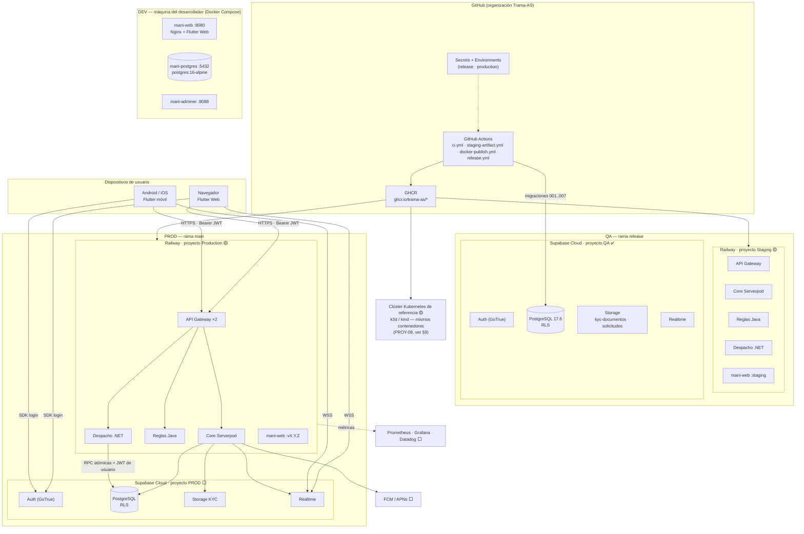
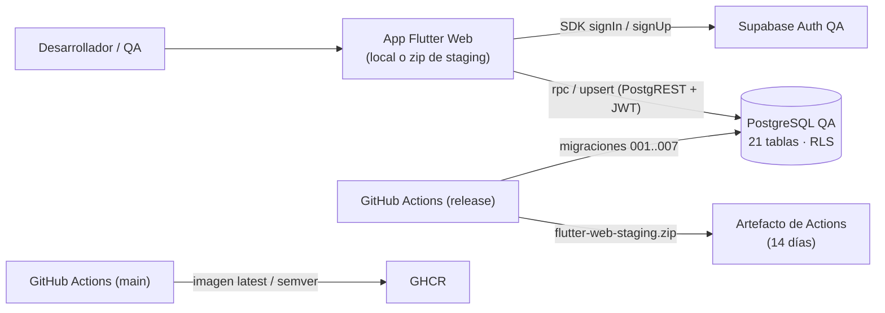
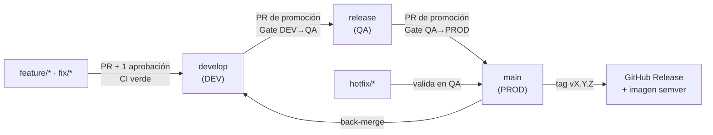
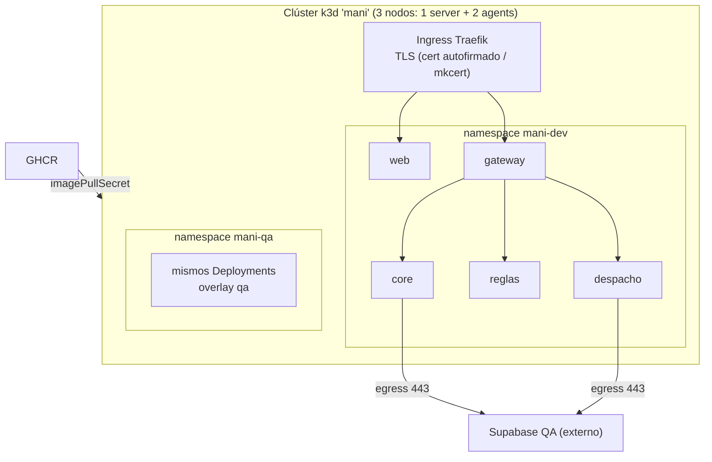

# TRAMA · MANI — Documento de Infraestructura V1
## Vista Física: seguridad y configuración de ambientes DEV, QA y PROD

| Metadato | Valor |
| :--- | :--- |
| **Proyecto** | MANI — Plataforma SaaS multi-tenant de formalización de operaciones de servicio |
| **Organización** | TRAMA · Ingeniería de Software |
| **Documento** | Documento de Infraestructura (Vista Física del modelo 4+1) |
| **Versión** | 1.0 — Entrega 4 (Sprint 2 Review / Planning Sprint 3) |
| **Fecha** | 2026-09-23 |
| **Estado** | Borrador para revisión de la Mesa de Arquitectura |
| **Responsables** | Daniel Ávila (DevOps titular), Nicolás León (DevOps secundario), Santiago (QA / Security), Sara Albarracín (Scrum Master) |
| **Fuentes** | DOC-08 (topología de ambientes, aprobada 2026-09-21), `Product/SADV2.md` (sección de infraestructura, DOC-15 / SCRUM-946), `Product/SDD-MANI.md` §9–§12, `Product/DD-MANI.md` §8–§9, ADR-0004, 0005, 0006, 0012, 0013, 0015, 0018, 0022, 0023, `Project/Test/Inf_test-002.md`, `Entregas/Entrega4/Inf_PoC-001.md`, código de `MANI-Flutter` (ramas `main`, `develop`, `release`) |
| **Nota IA** | Consolidado con asistencia de IA (ADR-0009). Las secciones marcadas 🟡 son propuestas que requieren ratificación de la Mesa (PROY-05) antes de implementarse. |

---

## Control de versiones

| Versión | Fecha | Descripción | Estado |
| :---: | :---: | :--- | :---: |
| 1.0 | 2026-09-23 | Primera versión. Consolida DOC-08 + sección de infraestructura del SAD V2 + estado real de los pipelines. Agrega: vista física por ambiente, matriz de configuración, controles de seguridad por capa, custodia de secretos, propuesta de ubicación de Kubernetes (PROY-08) y registro de brechas verificadas. | Borrador |

## Convenciones

| Marca | Significado |
| :--- | :--- |
| ✅ | Implementado y verificado en el repositorio o en un informe de prueba |
| ◐ | Parcial: existe pero incompleto, solo en PoC o sin verificar |
| ⬜ | No existe todavía |
| 🟢 | Decidido por ADR Aceptado o documento Aprobado |
| 🔵 | Respaldado por ADR Propuesto |
| 🟡 | Propuesta de este documento — requiere ADR / Mesa |

---

## Índice

1. [Propósito y alcance](#1-propósito-y-alcance)
2. [Principios de la vista física](#2-principios-de-la-vista-física)
3. [Diagrama de despliegue](#3-diagrama-de-despliegue)
4. [Configuración por ambiente](#4-configuración-por-ambiente)
5. [Qué se comparte y qué se aísla](#5-qué-se-comparte-y-qué-se-aísla)
6. [Pipeline de promoción y gates](#6-pipeline-de-promoción-y-gates)
7. [Seguridad de la infraestructura](#7-seguridad-de-la-infraestructura)
8. [Gestión de secretos y variables de entorno](#8-gestión-de-secretos-y-variables-de-entorno)
9. [Kubernetes (PROY-08) — ubicación propuesta 🟡](#9-kubernetes-proy-08--ubicación-propuesta-)
10. [Base de datos y migraciones](#10-base-de-datos-y-migraciones)
11. [Observabilidad y operación](#11-observabilidad-y-operación)
12. [Brechas verificadas y plan de cierre](#12-brechas-verificadas-y-plan-de-cierre)
13. [Decisiones pendientes para la Mesa](#13-decisiones-pendientes-para-la-mesa)
14. [Trazabilidad](#14-trazabilidad)

---

## 1. Propósito y alcance

Este documento es la **vista física** de MANI dentro del marco de modelado del SDD V1
(4+1 realizado con C4, ver `SDD_V1.md` §3): describe **dónde corre** cada contenedor del C4
Nivel 2, **cómo se configura** en cada ambiente y **qué controles de seguridad** lo protegen.

Reemplaza, en lo relativo a infraestructura, a la vista de despliegue de `DD-MANI.md` §9
(que asumía un namespace de Kubernetes por ambiente sin proveedor definido) y consolida
DOC-08, que sigue siendo la fuente aprobada de la segregación de ambientes.

**Fuera de alcance:** dimensionamiento fino de nodos (depende de SP-TO-11), operador de pagos
(2º incremento, REST-03) y la infraestructura de observabilidad en detalle (ADR-0006).

---

## 2. Principios de la vista física

| # | Principio | Origen |
| :-: | :--- | :--- |
| P1 | **Build once, deploy anywhere:** la misma imagen se promueve entre ambientes; nunca se recompila. | ADR-0004 |
| P2 | **Paridad de esquema, aislamiento de datos:** el DDL y las políticas RLS son idénticos en los tres ambientes; los datos, la identidad, los archivos y los secretos nunca se comparten. | DOC-08 §3 |
| P3 | **Sin costos fijos de nube:** capas gratuitas y cómputo sin costo fijo. | ADR-0019, ADR-0023 |
| P4 | **Tenant solo desde el JWT verificado:** ninguna capa de infraestructura inyecta ni confía en cabeceras de tenant. | ADR-0018 |
| P5 | **Promoción sin saltos:** `develop → release → main`; nada llega a PROD sin pasar por DEV y QA con CI en verde. | Gobierno §2.5, DOC-08 §5.2 |
| P6 | **Schema-first:** ningún cambio de esquema se hace a mano en Supabase; todo pasa por `database/migrations/`. | DOC-08 §5.1 |
| P7 | **Configuración fuera de la imagen:** toda configuración específica de ambiente se inyecta en tiempo de ejecución. | Herramientas V2 §4.2 |

---

## 3. Diagrama de despliegue

### 3.1 Estado objetivo (to-be)



### 3.2 Estado actual (as-is, 2026-09-23)



Hoy la app habla directo con Supabase (estilo BaaS que ADR-0019 descartó como destino final;
aceptado como andamiaje de Sprint 1–2 — SDD brecha B-01). No hay backends desplegados en
Railway todavía: Serverpod, Java, .NET y el gateway están en estado ⬜.

---

## 4. Configuración por ambiente

### 4.1 Tabla maestra

| Dimensión | DEV | QA (Testing / Staging) | PROD |
| :--- | :--- | :--- | :--- |
| **Rama Gitflow** | `develop` (+ `feature/*`, `fix/*`) | `release` (rama persistente, desvío consciente de ADR-0004 — Inf_test-002) | `main` (+ `hotfix/*`) |
| **Destinatarios** | Desarrolladores | QA, PO, automatizaciones (Newman, k6, ZAP) | Tenants, clientes, aliados |
| **Cómputo app web** | `docker compose` → `mani-web` :8080 (Nginx) ✅ | `flutter-web-staging.zip` ✅ · imagen `:staging` en Railway 🟡 | Imagen `:latest` / `:vX.Y.Z` en Railway 🟡 · tiendas (móvil) ⬜ |
| **Cómputo backends** | Docker Compose local 🟡 | Railway proyecto Staging 🟡 | Railway proyecto Production 🟡 |
| **Base de datos** | `postgres:16-alpine` local + Adminer :8088 ✅ | Supabase Cloud proyecto QA (PostgreSQL 17.6) ✅ | Supabase Cloud proyecto PROD ⬜ |
| **Esquema** | `database/init` + `database/migrations` 001–007 | Migraciones 001–007 aplicadas por CI (`schema_migrations`) ✅ | Mismas migraciones, mismo orden ⬜ |
| **Datos** | Seed `02-seed.sql` (tenant ficticio "TRAMA Servicios Demo", zonas Bogotá) | Sintéticos: seeds CFG-04/09/12, normalizados por 007 | Reales |
| **Identidad** | Mock / JWT estático (DOC-08) · ◐ hoy `.env.example` apunta a un proyecto cloud (SDD D-05) | GoTrue QA, usuarios dummy, hook `custom_access_token_hook` (PoC-002) | GoTrue PROD, verificación real de correo |
| **Storage KYC** | Mock / filesystem | Bucket `kyc-documentos` + `solicitudes` | Bucket KYC productivo ⬜ |
| **Red / dominio** | `localhost:8080`, `:5432`, `:8088` | Dominio de staging (ej. `staging-app.mani.trama.com`) ⬜ | Dominio productivo (ej. `app.mani.trama.com`) ⬜ |
| **TLS** | No aplica (localhost) | TLS gestionado por Railway / Supabase | TLS gestionado; HSTS en gateway 🟡 |
| **Registro de imágenes** | Build local | GHCR tags `staging`, `testing`, `release`, `staging-<sha>` 🟡 (el workflow actual publica solo desde `main`) | GHCR `latest`, `vX.Y.Z`, `X.Y` ✅ |
| **Gates de CI** | format, analyze, test + cobertura, integración, build | Igual + migraciones a QA + artefacto QA · Newman/k6/ZAP (manual hoy) | Igual + **SonarCloud Quality Gate vinculante** ✅ |
| **Secretos** | `.env` local (en `.gitignore`) | GitHub Secrets (`SUPABASE_QA_DB_URL` configurado 2026-09-23) | GitHub Environment `production` con aprobación ⬜ |
| **Acceso humano a BD** | Total (`postgres:postgres` local) | QA (Santiago) al dashboard; DevOps con credenciales maestras | Solo DevOps titular |

### 4.2 DEV — detalle

Configuración real (`docker-compose.yml`, rama `release`/`develop`):

| Servicio | Imagen | Puerto | Notas |
| :--- | :--- | :--- | :--- |
| `mani-web` | Build multi-stage (`ghcr.io/cirruslabs/flutter:stable` → `nginx:alpine`) | 8080→80 | `depends_on: postgres (healthy)` |
| `postgres` | `postgres:16-alpine` | `${POSTGRES_PORT:-5432}` | Volumen `mani_postgres_data`; monta `./database/init` en `docker-entrypoint-initdb.d` (solo lectura); healthcheck `pg_isready` cada 5 s |
| `adminer` | `adminer:latest` | `${ADMINER_PORT:-8088}`→8080 | Solo para DEV |

Reglas:

- Las credenciales por defecto (`postgres/postgres`) **solo** son válidas en DEV; nunca se
  reutilizan en QA ni PROD.
- `migrate-local.sh` aplica la cadena de migraciones. Inf_test-002 §3.2 encontró que `004`
  falla sobre un Postgres limpio sin el shim de Supabase (`auth.uid()`, roles `anon`,
  `authenticated`): DEV necesita ese shim para ser fiel a QA — ver brecha I-07.
- 🟡 Propuesta: agregar al Compose los backends (gateway, core, reglas, despacho) con perfiles
  (`docker compose --profile backend up`) para que DEV reproduzca el C4 Nivel 2 completo.

### 4.3 QA — detalle

- **Supabase QA** es el único ambiente cloud operativo. Estado al 2026-09-23 (Inf_test-002
  §4.2): 21 tablas, 25 políticas (`public` + `storage`), 34 índices, 32 funciones, buckets
  `kyc-documentos` y `solicitudes`, migraciones 001–007 registradas en `schema_migrations`.
- **Workflow `CI - Release & Staging Validation`:** format → analyze → test + cobertura →
  integración → build web → verificación del secret `SUPABASE_QA_DB_URL` → aplicación de
  migraciones (corregido en `MANI-Flutter#23`; antes el paso salía `skipped` siempre).
- **Workflow `Staging - Build Web Artifact`:** empaqueta `flutter-web-staging.zip`, retención
  14 días.
- **Pruebas ejecutadas contra QA:** suites Newman CFG-12 + ADR-0015 → **135/135 aserciones**;
  verificación `database/verify/11` → **21/21** (Inf_test-002 §4.4–4.6).
- **Datos:** sintéticos únicamente, reseteables. Prohibido cargar datos reales (RNF-01).

### 4.4 PROD — detalle

- **Workflow `CI - Production Validation (main)`:** format → analyze → test + cobertura →
  SonarCloud scan → **Quality Gate** (timeout 5 min) → build web.
- **Workflow `Build & Publish Docker Image to GHCR`:** en push a `main` o tag `v*.*.*`,
  publica `latest` (solo `main`), tag de rama y tags semver `X.Y.Z` / `X.Y`.
- **Workflow `Release`:** en tag semver crea el GitHub Release con `flutter-web-release.zip`.
- **Estado:** `main` todavía contiene la plantilla "Flutter Demo" (SDD brecha B-09). El
  proyecto Supabase PROD y el hosting productivo **no están aprovisionados**. La promoción
  `release → main` es requisito del cierre de sprint.
- **Requisitos antes del primer despliegue real** (todos ⬜): GitHub Environment
  `production` con revisor obligatorio (DevOps titular), proyecto Supabase PROD con políticas
  RLS versionadas (brecha I-01), dominio + TLS, backups verificados contra el plan contratado.

---

## 5. Qué se comparte y qué se aísla

Resumen de la matriz aprobada en DOC-08 §3, con el estado real verificado:

| # | Componente | Estado | Implementación | Verificado |
| :-: | :--- | :---: | :--- | :---: |
| 1 | Motor de base de datos | Aislado | Docker local / Supabase QA / Supabase PROD | ◐ (PROD ⬜) |
| 2 | Esquema DDL | Compartido | Migraciones 001–007, mismo orden | ◐ (políticas `tenant_isolation_*` sin versionar — I-01) |
| 3 | Datos | Aislado | Seeds / sintéticos / reales | ✅ |
| 4 | Identidad | Aislado | Mock / GoTrue QA / GoTrue PROD — JWT independientes por proyecto | ✅ QA |
| 5 | Storage KYC | Aislado | Mock / bucket QA / bucket PROD | ◐ — nombre real `kyc-documentos`; DOC-08 dice `kyc-documents-staging` (I-09) |
| 6 | Registro de contenedores | Compartido, tags segregados | GHCR `ghcr.io/trama-as/*` | ◐ — solo publica desde `main` |
| 7 | Secretos | Aislado | `.env` / Secrets `release` / Environment `production` | ◐ — Environment `production` no creado |
| 8 | Políticas RLS | Reglas compartidas, ejecución aislada | Mismo código, BD distinta | ◐ — ver I-01 |
| 9 | Red y dominios | Aislado | localhost / staging / prod | ⬜ dominios |
| 10 | Pipeline y gates | Diferenciado | Ver §6 | ✅ |

---

## 6. Pipeline de promoción y gates



### 6.1 Gate DEV → QA (merge a `release`)

| Criterio | Fuente | Estado en la última promoción (Inf_test-002) |
| :--- | :--- | :---: |
| CI de `develop` en verde (format, analyze, 313 tests, 18 de integración, build) | DOC-08 §5.2 | ✅ Cumple |
| PR revisado y aprobado por un par; sin commits directos | Gobierno §2.3, Herramientas §4.1 | ❌ No cumple — #9 y #14 sin revisión, 8 commits directos (SCRUM-1056) |
| DoR cumplida, criterios de aceptación validados | ADR-0026 (Propuesto) | ❌ No cumple — 8 de 9 historias sin criterios (SCRUM-1055) |
| SonarQube | ADR-0005 | ⚠️ No verificable fuera de `main` |

### 6.2 Gate QA → PROD (merge a `main`)

| Criterio | Fuente |
| :--- | :--- |
| Sin defectos Crítica/Alta abiertos en QA | DOC-08 §5.2 |
| Suites Newman de aislamiento (ADR-0015) y claims (CFG-12) en verde contra QA | ADR-0015, ADR-0025 (Propuesto) |
| Artefacto `flutter-web-staging.zip` validado por QA | DOC-08 §5.2 |
| Aceptación del PO | Gobierno §1.1.3 |
| Quality Gate de SonarCloud aprobado | ADR-0005 |
| DAST OWASP ZAP sin hallazgos High sobre QA | ADR-0005 — ⬜ ZAP aún no integrado |
| Merge ejecutado por el DevOps titular con aprobación del Environment `production` | ADR-0004 — ⬜ Environment no creado |

---

## 7. Seguridad de la infraestructura

### 7.1 Defensa en capas

Ninguna capa confía en la anterior (SDD §9).

| Capa | Control | Decisión | Estado |
| :--- | :--- | :--- | :---: |
| 1. Identidad | Supabase Auth emite JWT (ES256) con `app_metadata.tenant_id` y `user_role` vía `custom_access_token_hook`, *fail-closed* | 🟢 ADR-0022, ADR-0018 | ◐ hook solo en PoC (promover — I-04) |
| 2. Borde | API Gateway valida firma/expiración/emisor contra JWKS; CORS por ambiente; rate limiting por `tenant_id` y usuario | 🟡 ADR-0027 (propuesto en SDD) | ⬜ |
| 3. Servicio | Cada backend revalida el JWT y autoriza por rol; nunca lee `tenant_id` del body ni de cabeceras | 🟢 ADR-0018, DD §8.3 | ⬜ |
| 4. Datos | RLS `tenant_isolation_*` con `auth.jwt() -> 'app_metadata' ->> 'tenant_id'` en toda tabla salvo `tenant` y `zona` | 🟢 ADR-0012 | ◐ en QA, sin versionar (I-01) y sin restricción de rol (I-02) |
| 5. Archivos | Bucket privado, ruta `tenant_id/<uid>/archivo`, política `kyc_isolation`, URL firmada de vida corta | 🔵 ADR-0013 | ◐ validado en PoC-003 con 3 hallazgos |
| 6. Entre servicios | *Token relay* (JWT del usuario en cada salto); rutas `/internal/v1/*` no expuestas en el gateway; red privada de Railway | 🟢 ADR-0018 | ⬜ |
| 7. Red | TLS en todo tráfico externo; `/health` y `/metrics` solo en red privada; en K8s `NetworkPolicy` *default deny* | 🟡 este documento | ⬜ |
| 8. Cadena de suministro | SonarCloud SAST; Dependabot (pub, Maven, NuGet); imágenes base oficiales (`nginx:alpine`, `postgres:16-alpine`) | 🟢 ADR-0005 | ◐ Sonar solo en `main` |
| 9. Proceso | Branch protection + PR obligatorio + Environments con aprobación | 🟢 ADR-0004, Gobierno §2.3 | ◐ solo `main` protegido (I-05) |

### 7.2 Evidencia de seguridad medida

| Control | Evidencia | Resultado |
| :--- | :--- | :--- |
| Aislamiento entre tenants (lectura, listado, escritura, borrado, inserción) | PoC-002, suite `mani-aislamiento` | 0 fugas, 36/36 |
| Anti-suplantación del tenant | PoC-002 | 4/4 vectores rechazados (401 con payload alterado o firma inválida) |
| Propagación de claims | PoC-002, `mani-claims` | 100 % de logins; control negativo: 13/40 fallan con hook apagado |
| Aislamiento KYC en Storage (caso 6 de ADR-0015) | PoC-003 | 95/95; control negativo 20 en rojo |
| Regresión tras promoción | Inf_test-002 | 135/135 en QA |
| Verificación de firma ES256 | PoC-002 | p95 0,10 ms en caliente; 160 ms en frío (fetch JWKS → cachear) |

### 7.3 Hallazgos de seguridad abiertos

| ID | Hallazgo | Severidad | Origen | Acción |
| :--- | :--- | :---: | :--- | :--- |
| S-01 | Las 16 políticas `tenant_isolation_*` viven solo en QA, no en `database/migrations/`. Reconstruir un ambiente desde la cadena lo dejaría **sin aislamiento**. | 🔴 Crítica | Inf_PoC-001, Inf_test-002 (SCRUM-1051) | Versionar como migración 008 antes de aprovisionar PROD |
| S-02 | `tenant_isolation_solicitud` tiene `roles = {public}`: un `cliente` puede autoasignarse una solicitud de su tenant. | 🔴 Alta | PoC-001 H-02, DOC-14 D-03 | Política por rol o chequeo de rol en la RPC `aceptar_solicitud`; ejecutar SP-TO-06 |
| S-03 | La URL firmada de Storage es un token al portador. | 🟠 Media | PoC-003 H-01 | TTL corto (≤ 60 s) y emisión solo desde el Core |
| S-04 | `kyc_isolation` es `FOR ALL`: `admin_tenant` puede escribir y borrar documentos KYC, no solo leer. | 🟠 Media | PoC-003 H-04 | Decidir en Mesa; si no es intencional, separar en `FOR SELECT` para admin |
| S-05 | `develop` y `release` sin protección de rama ni regla `pull_request`; sin Environments. | 🟠 Media | Gobierno §2.3.1, Inf_test-002 | Rulesets en las tres ramas; Environments `release` y `production` |
| S-06 | SonarCloud solo corre en `main` (403 del Quality Gate desde el 20/09). | 🟡 Baja | Inf_test-002 §2.4 | Evaluar SonarCloud en PR hacia `release` o SonarQube CE self-hosted en CI |
| S-07 | OWASP ZAP no integrado en ningún workflow. | 🟡 Baja | Herramientas V2 ("En calibración") | Job `zap-baseline` sobre QA tras cada promoción |

### 7.4 Reglas vinculantes

1. La `service_role` key de Supabase **solo** existe en el entorno del Core, y solo para
   tareas administrativas explícitas. Nunca en la app, el gateway, Reglas ni Despacho.
2. Toda función `SECURITY DEFINER` obtiene el tenant desde `auth.jwt()`, nunca desde un
   parámetro.
3. `tenant_id` en logs sí; datos personales en logs no (`StructuredLogger`).
4. Ningún secreto en el repositorio ni en imágenes. Los reportes de Newman que se versionan
   van **redactados** (`*.redactado.json`, como en PoC-002).
5. Ninguna credencial real ni dato personal se introduce en herramientas de IA (ADR-0009).

---

## 8. Gestión de secretos y variables de entorno

### 8.1 Inventario

| Variable | Consumidor | DEV | QA | PROD | Custodio |
| :--- | :--- | :--- | :--- | :--- | :--- |
| `SUPABASE_URL` | App, backends | `.env` | Secret `release` | Env `production` | DevOps titular |
| `SUPABASE_ANON_KEY` | App | `.env` | Secret `release` | Env `production` | DevOps titular |
| `SUPABASE_SERVICE_ROLE_KEY` | **Solo Core** | `.env` | Secret `release` | Env `production` | DevOps titular |
| `SUPABASE_QA_DB_URL` | Job de migraciones | — | Secret ✅ (2026-09-23) | — | DevOps titular |
| `SUPABASE_PROD_DB_URL` | Job de migraciones | — | — | Env `production` ⬜ | DevOps titular |
| `SUPABASE_JWKS_URL` | Gateway, backends | `.env` | Variable | Variable | DevOps |
| `CORE_URL`, `RULES_URL`, `DISPATCH_URL` | Gateway | `.env` | Variables Railway | Variables Railway | DevOps |
| `ALLOWED_ORIGINS` | Gateway | `http://localhost:8080` | Dominio staging | Dominio prod | DevOps |
| `SONAR_TOKEN` | CI | — | — | Secret ✅ | DevOps titular |
| `GITHUB_TOKEN` | Publicación GHCR | — | automático | automático | GitHub |
| `POSTGRES_*`, `ADMINER_PORT` | Compose DEV | `.env` | — | — | Cada desarrollador |

### 8.2 Reglas

- **DEV:** `.env` fuera de Git (`.gitignore`); `.env.example` sin valores reales. 🟡 Alinear
  `.env.example` con DOC-08 (DEV no debe apuntar a un proyecto cloud — brecha I-08).
- **QA:** GitHub Repository Secrets consumidos solo por workflows de `release`.
- **PROD:** GitHub Environment `production` con *required reviewers* = DevOps titular;
  secretos invisibles para ramas distintas de `main`.
- **Rotación:** al salir un integrante del equipo, al exponerse un secreto o cada fin de
  corte académico. Registro de la rotación en Jira.
- **Detección:** GitHub secret scanning + push protection activados en la organización 🟡.

---

## 9. Kubernetes (PROY-08) — ubicación propuesta 🟡

### 9.1 El problema

- PROY-08: Kubernetes es **obligatorio** (requisito curricular, SRS §1.4). El "sí" está
  resuelto (ADR-0010, KI-03).
- ADR-0023 eligió Railway como hosting sin costo fijo y dejó abierto "dónde correr
  Kubernetes fuera de Azure". DOC-08 no menciona Kubernetes. SP-TO-11 (techo de Railway)
  sigue sin ejecutarse.

### 9.2 Alternativas

| Opción | A favor | En contra | Resultado |
| :--- | :--- | :--- | :--- |
| **A. Clúster local k3d/kind con los mismos contenedores de GHCR + Railway para QA/PROD del MVP** | Costo cero; cumple PROY-08 con manifiestos reales versionados; demostrable en la sustentación; no bloquea el MVP | K8s no sirve tráfico productivo real | **Propuesta (P-03 del SDD)** |
| B. K3s en una VM gratuita (Oracle Free Tier / crédito académico) | Clúster "de verdad" accesible en red | Oracle Cloud está en "Mejor no" (ADR-0010); operación y parches a cargo del equipo | Alternativa si la Mesa exige clúster remoto |
| C. Clúster gestionado (AKS/GKE/EKS) | Estándar industrial | Costo fijo — viola ADR-0019/0023 | Descartada |
| D. Solo Railway | Simple | Incumple PROY-08 | Descartada |

### 9.3 Diseño de la opción A



Estructura propuesta de manifiestos (repositorio de infraestructura o carpeta `deploy/` de
cada repo):

```
deploy/k8s/
├── base/                     # Deployment, Service, ConfigMap, NetworkPolicy por servicio
│   ├── web.yaml
│   ├── gateway.yaml
│   ├── core.yaml
│   ├── reglas.yaml
│   ├── despacho.yaml
│   ├── networkpolicy-default-deny.yaml
│   └── kustomization.yaml
└── overlays/
    ├── dev/                  # réplicas 1, recursos mínimos, imagen :dev-<sha>
    ├── qa/                   # réplicas 1, imagen :staging-<sha>
    └── prod/                 # réplicas 2 del gateway, imagen :vX.Y.Z, PodDisruptionBudget
```

Controles de seguridad obligatorios en los manifiestos:

| Control | Valor |
| :--- | :--- |
| `securityContext` | `runAsNonRoot: true`, `readOnlyRootFilesystem: true`, `allowPrivilegeEscalation: false`, `capabilities.drop: [ALL]` |
| Recursos | `requests` y `limits` de CPU/memoria en todo contenedor (JVM del gateway y de Reglas con `-XX:MaxRAMPercentage`) |
| Probes | `readinessProbe` y `livenessProbe` sobre `/health` |
| Red | `NetworkPolicy` *default deny*; permitido: ingress→web/gateway, gateway→core/reglas/despacho, despacho→reglas/core, core/despacho→egress 443 (Supabase) |
| Secretos | `Secret` creados desde el pipeline (nunca en Git); `service_role` solo montado en `core` |
| Imágenes | Referenciadas por tag inmutable (`vX.Y.Z` o `sha`), nunca `latest` en `prod` |

Criterio de aceptación de la opción A (propuesto): `kubectl apply -k overlays/qa` levanta los
cinco servicios con probes en verde y la suite `mani-aislamiento` pasa contra el gateway del
clúster.

**ADR requerido:** ADR-0029 "Ubicación y configuración del clúster Kubernetes" (número
tentativo; ver §13). Debe citar el resultado de SP-TO-11.

---

## 10. Base de datos y migraciones

| Tema | Regla / estado |
| :--- | :--- |
| Fuente de verdad del esquema | `database/migrations/` en `MANI-Flutter` hasta que exista el Core Serverpod; luego migra al Core (SDD §10) |
| Cadena actual | 001 esquema inicial · 002 verificación de aliados · 003 categorías · 004 aliado-categorías · 005 aceptar/rechazar solicitud · 006 crear solicitud · 007 normalización de dominios |
| Idempotencia | Cada migración debe poder correr dos veces (`database/migrations/README.md`); verificado en Inf_test-002 |
| Flujo | Script en Git → Docker DEV → Supabase QA (CI) → Supabase PROD (CI con aprobación) |
| Verificación | Scripts de solo lectura en `database/verify/` (ej. `11-normalizacion-dominios.sql`, 21/21) |
| Valores de dominio | MAYÚSCULA en español en la BD (`ALIADO`, `ACTIVO`, `VERIFICADO`, `ASIGNADA`); minúscula en el JWT (`lower(rol)`, contrato de ADR-0018) — migración 007 |
| Índices pendientes | `(tenant_id, zona_id)` en `cobertura_aliado` y `(tenant_id, categoria_id)` en `aliado_categoria` — sin ellos la cobertura no cumple 50 ms a 100k aliados (PoC-004, SCRUM-1054) |
| Backups | DOC-08 declara backups diarios y cifrado en reposo en PROD. 🟡 Verificar contra el plan de Supabase que se contrate antes de declararlo cumplido; si el plan gratuito no lo incluye, programar `pg_dump` cifrado desde CI hacia almacenamiento privado |

---

## 11. Observabilidad y operación

| Tema | Definición | Estado |
| :--- | :--- | :---: |
| Endpoints | `/health` y `/metrics` en cada backend; `/actuator/prometheus` en el gateway | ⬜ |
| Logs | JSON: `timestamp`, `level`, `service_id`, `trace_id`, `tenant_id`, `message`; sin datos personales | ◐ (`StructuredLogger` en la app) |
| Trazas | `traceparent` W3C de punta a punta | ⬜ |
| Métricas mínimas | Latencia p95 por ruta y tenant, tasa de errores, `409` de despacho | ⬜ |
| Alertas | Latencia > 2 s sostenida o errores > 3 % en 5 min → issue en Jira (ADR-0006) | ⬜ |
| Disponibilidad objetivo | ≥ 99,5 % mensual, detección < 5 min (QS-16) | Sin medir (SP-TO-11) |
| Huella de agentes | < 10 % del techo del plan (SP-TO-04) | Sin medir |

---

## 12. Brechas verificadas y plan de cierre

| ID | Brecha | Evidencia | Prioridad | Responsable | Ticket |
| :-: | :--- | :--- | :---: | :--- | :--- |
| I-01 | Políticas `tenant_isolation_*` sin versionar | Inf_test-002 §4.2 | 🔴 | Backend Lead | SCRUM-1051 |
| I-02 | RLS sin restricción de rol en `solicitud` | PoC-001 H-02 | 🔴 | Backend Lead | Crear (DOC-14 D-03) |
| I-03 | Proyecto Supabase PROD y hosting productivo no aprovisionados | SDD §12 | 🔴 | DevOps titular | Crear |
| I-04 | Hook de claims, RPC `aceptar_solicitud` y bucket KYC solo en scripts de PoC | SDD B-05 | 🟠 | Backend Lead | Crear |
| I-05 | Rulesets solo en `main`; sin Environments | Gobierno §2.3.1 | 🟠 | DevOps titular | SCRUM-1056 |
| I-06 | GHCR solo publica desde `main`; sin tags `dev`/`staging` | `docker-publish.yml` | 🟠 | DevOps | Crear |
| I-07 | `004` falla sin shim de Supabase en Postgres limpio | Inf_test-002 §3.2 | 🟡 | DevOps | Crear |
| I-08 | `.env.example` apunta a Supabase cloud; DOC-08 dice que DEV no se conecta | SDD D-05 | 🟡 | DevOps | Crear |
| I-09 | Nombre del bucket: `kyc-documentos` (real) vs `kyc-documents-staging/prod` (DOC-08) | PoC-003 vs DOC-08 | 🟡 | DevOps + QA | Corregir DOC-08 |
| I-10 | Registro de imágenes: GHCR (código) vs Docker Hub (ADR-0023) | SDD P-04 | 🟡 | Mesa | Ratificar |
| I-11 | Kubernetes sin ubicación ni manifiestos | §9 | 🟠 | DevOps titular | ADR-0029 + SP-TO-11 |
| I-12 | ZAP y Newman no automatizados en el workflow de `release` | Herramientas V2 | 🟡 | QA | Crear |

---

## 13. Decisiones pendientes para la Mesa

| # | Decisión | Propuesta |
| :-: | :--- | :--- |
| M-01 | Ubicación de Kubernetes (PROY-08, KI-03) | Opción A de §9: k3d/kind con los mismos contenedores y overlays por ambiente; Railway sirve QA/PROD del MVP. Formalizar en ADR-0029. |
| M-02 | Registro de imágenes | Unificar en GHCR (ya operativo; permisos de la organización). Enmendar ADR-0023 en ese punto. |
| M-03 | Rama `release` persistente vs `release/vX.Y.Z` | Formalizar el desvío ya aplicado (Inf_test-002) como enmienda de ADR-0004. |
| M-04 | Alcance de escritura de `admin_tenant` sobre KYC (S-04) | Solo lectura para `admin_tenant`, salvo decisión contraria documentada. |
| M-05 | Numeración de ADR propuestos | El SDD 0.1 propuso "ADR-0025" (gateway) y "ADR-0026" (Java/.NET), pero esos números ya los usan DoD y DoR. Asignar ADR-0027 (API Gateway), ADR-0028 (alcance Java/.NET) y ADR-0029 (Kubernetes). |

---

## 14. Trazabilidad

| Requisito / decisión | Dónde se atiende en este documento |
| :--- | :--- |
| RNF-01 / REST-04 (aislamiento) | §5, §7.1 capas 1–6, §7.3 S-01/S-02 |
| REST-02 (KYC aislado por aliado) | §4.3, §7.1 capa 5, §7.3 S-03/S-04 |
| RNF-07 / QS-08 (capacidad) | §10 índices, §11, SP-TO-11 |
| QS-16 (disponibilidad) | §11, §9.3 réplicas en prod |
| QS-17 (verificabilidad en CI) | §6, §7.2 |
| PROY-07 (Java y .NET) | §3.1, §9.3 |
| PROY-08 (Kubernetes) | §9 |
| ADR-0004 (promoción) | §2 P1/P5, §6 |
| ADR-0005 (SAST/DAST) | §6.2, §7.1 capa 8, S-06/S-07 |
| ADR-0006 (observabilidad) | §11 |
| ADR-0012 / 0018 / 0022 (RLS, tenant en JWT, IdP) | §7.1 capas 1, 3, 4 |
| ADR-0013 (Storage KYC) | §7.1 capa 5, S-03/S-04 |
| ADR-0015 (pruebas de aislamiento) | §4.3, §7.2 |
| ADR-0023 (sin Azure, Railway) | §3, §9, M-02 |
| DOC-08 (topología) | §4, §5 (se conserva como fuente aprobada; I-09 pide corregirla) |
