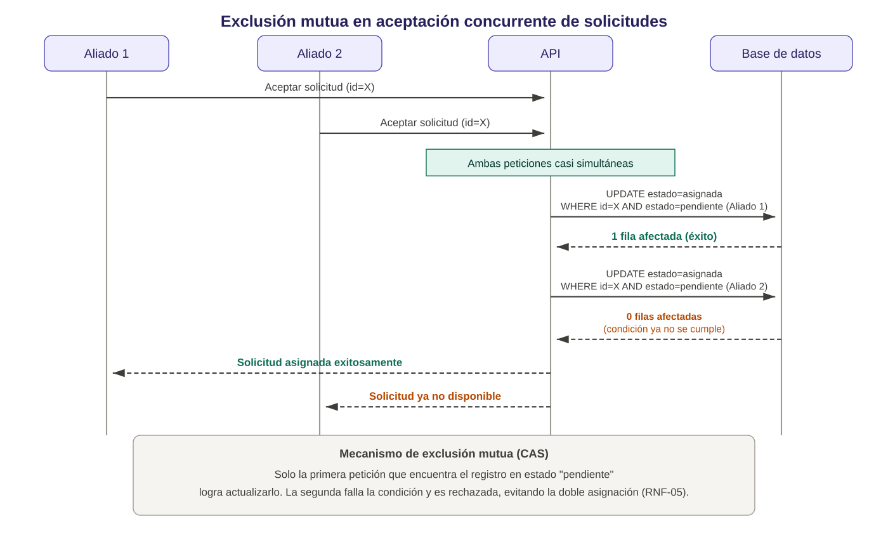

# MANI SAD — V3

| Metadato | Valor |
| :--- | :--- |
| **Proyecto** | MANI — Plataforma SaaS multi-tenant de formalización de operaciones de servicio |
| **Organización** | TRAMA · Ingeniería de Software |
| **Documento** | SAD V3 (ADD + ATAM) — Entrega 4 |
| **Fecha** | 2026-09-23 |
| **Estado** | Borrador para revisión de la Mesa de Arquitectura |
| **Base** | SAD V2 = `Product/SAD-MANI.md` (tras DOC-14) + `Product/SADV2.md` (sección de infraestructura, DOC-15 / SCRUM-946). **Todo el contenido de V2 se conserva**; lo agregado en V3 va marcado con 🆕. |

## Historial de versiones

| Versión | Momento | Cambios principales |
| :--- | :--- | :--- |
| **V1** | Entrega 3 (Sprint 1 Review) | Drivers, killers, 16 ADR, atributos ISO 25010, escenarios de calidad, 8 trade-offs, arquitectura de negocio, C4 contenedores. |
| **V2** | Sprint 2, 2026-09-22 (DOC-14 / DOC-15) | 24 ADR consolidados; trade-offs de 8 a 12 con nivel de evidencia (Tabla D) y spikes; vista de procesos (exclusión mutua); sección de infraestructura DEV/QA/PROD (`SADV2.md`). |
| **V3** 🆕 | Entrega 4, 2026-09-23 | Sobre V2 se añade: resultados de **PoC-002, PoC-003 y PoC-004** en killers, ADR, escenarios y Tabla D; nuevos **KI-12** (RLS sin versionar) y **KI-13** (RLS sin rol); **ADR-0025/0026** (DoD/DoR) y borradores **ADR-0027/0028/0029**; **QS-21/QS-22** para AC-12/AC-14 (hueco DOC-14 D-07); **§9 Vistas 4+1 ↔ C4** (ADR-0024); **§10 Vista física** (integra `SADV2.md` + Documento de Infraestructura V1); **§11 Pendientes para la Mesa**. Se corrige la doble sección "7" (Vista de Contenedores pasa a §8.1). |

## Índice

1. [Drivers](#1-drivers)
2. [Killers](#2-killers)
3. [ADR](#3-adr)
4. [Atributos_Calidad](#4-atributos-calidad)
5. [Escenarios_Calidad](#5-escenarios-calidad)
6. [Trade-offs](#6-trade-offs)
7. [Arquitectura_de_Negocio](#7-arquitectura-de-negocio)
8. [Vista de Contenedores y Vista de Procesos](#8-vista-de-contenedores-y-vista-de-procesos)
9. 🆕 [Vistas de arquitectura 4+1 ↔ C4](#9-vistas-de-arquitectura-41--c4)
10. 🆕 [Vista física e infraestructura](#10-vista-física-e-infraestructura)
11. 🆕 [Pendientes para la Mesa](#11-pendientes-para-la-mesa)

---

## 1. Drivers

**Drivers Arquitectónicos**

*Objetivos de Diseño: qué debe lograr la arquitectura de MANI (Parte 1.1 del SAD)*

**Tabla A — Prioridad y trazabilidad**

| # | Prioridad | Fuente (trazabilidad) |
|---|---|---|
| 1 | Crítica | RF-01 |
| 2 | Crítica | RF-02 |
| 3 | Crítica | RF-03 |
| 4 | Crítica | RF-05 |
| 5 | Alta | RF-07 |
| 6 | Crítica | RF-12 |
| 7 | Alta | RF-13 |
| 8 | Crítica | RF-14 |
| 9 | Alta | RF-15 / RF-17 |
| 10 | Media | RF-18 |
| 11 | Media | RF-19 |
| 13 | Crítica | RNF-01 |
| 14 | Crítica | RNF-02 |
| 15 | Alta | RNF-03 |
| 16 | Alta | RNF-05 |
| 17 | Media | RNF-07 |
| 18 | Alta | RNF-04 |
| 19 | Media | RNF-08 |
| 20 | Alta | RNF-09 |
| 21 | Alta | RNF-10 |
| 22 | Alta | RNF-06 / RNF-11 |

> No existe el # 12: numeración original del equipo, no se reasigna (ver SRS §4.2).

**Tabla B — Descripción de cada driver**

| # | Descripción del driver |
|---|---|
| 1 | Registro y administración de tenants con aislamiento de datos garantizado. |
| 2 | Configuración de reglas propias por tenant (documentos, orden de listado, categorías, tarifas) sin desarrollo específico. |
| 3 | Autenticación y control de acceso restringido por tenant y por rol. |
| 4 | Registro de aliados diferenciando persona natural, empresa y empleado directo, con documentos configurables por tenant. |
| 5 | Declaración de cobertura de aliados por zonas geográficas, no por radio. |
| 6 | Creación de solicitudes de servicio y presentación de aliados válidos según categoría y cobertura. |
| 7 | Ordenamiento del listado de aliados según regla configurable por tenant (cobertura, calificación o comisión). |
| 8 | Aceptación/rechazo de solicitud por el aliado, sin dobles asignaciones. |
| 9 | Elaboración de cotización (mano de obra y materiales separados) y su aceptación/rechazo/ajuste por el cliente. |
| 10 | Registro cronológico de eventos durante la ejecución (log del servicio). |
| 11 | Calificación bidireccional cliente–aliado al cierre del servicio. |
| 13 | Aislamiento estricto de datos; un usuario o mecanismo de acceso de un tenant no puede acceder a información de otro. |
| 14 | Cada tenant configura sus reglas sin requerir código específico ni nuevo despliegue de la plataforma. |
| 15 | Idempotencia en operaciones críticas (aceptar solicitud, aceptar cotización, calificar) ante reintentos. |
| 16 | El despacho debe resolver aceptaciones concurrentes garantizando exactamente una asignación válida. |
| 17 | Soportar concurrencia de usuarios en búsqueda de aliados y comunicación (candidato a riesgo crítico de diseño). |
| 18 | Trazabilidad suficiente para reconstruir eventos del ciclo del servicio; registro financiero inmutable en el 2º incremento. |
| 19 | Interfaz utilizable desde dispositivos móviles por clientes y aliados. |
| 20 | Cobertura declarada por zonas, no por radio geográfico. |
| 21 | KYC, tiempos y comisiones configurables por tenant, no codificados. |
| 22 | Responsabilidad PCI-DSS delegada al operador de pagos certificado; modelo de pagos centralizado, priorizando integración sobre construcción propia. |

---

## 2. Killers

**Killers Arquitectónicos**

*Objetivos de Diseño: limitaciones y riesgos que pueden invalidar la arquitectura (Parte 1.2 del SAD)*

**Tabla A — Identificación**

| ID | Killer | Categoría |
|---|---|---|
| KI-01 | MongoDB sin RLS nativo | Incompatibilidad técnica |
| KI-03 | Dimensionamiento de cómputo para alojar el clúster Kubernetes, sin proveedor ni configuración de nodos ratificada | Restricción económica |
| KI-04 | Ventana de riesgo entre revisiones manuales de seguridad | Seguridad de proceso |
| KI-05 | Aislamiento en Storage depende de la disciplina del backend al construir la ruta | Seguridad |
| KI-06 | Volumen de tenants desconocido | Escalabilidad |
| KI-07 | Sin soporte para cobertura parcial de una localidad | Limitación de producto |
| KI-08 | Dependencia de datos oficiales de división político-administrativa | Dependencia externa |
| KI-09 | Volumen concurrente de búsqueda + mensajería sin cifra conocida | Rendimiento |
| KI-10 | ADR-0016/0017 incompletos (Redactor, Disenso, Quórum [completar]) | Gobernanza |
| KI-11 | Observabilidad instrumentada sobre Java Spring/.NET, en riesgo si prevalece Dart/Serverpod | Mantenibilidad |
| 🆕 KI-12 | Políticas RLS `tenant_isolation_*` sin versionar en migraciones | Seguridad |
| 🆕 KI-13 | RLS no restringe el rol dentro del tenant | Seguridad |

**Tabla B — Descripción del riesgo**

| ID | Descripción |
|---|---|
| KI-01 | El backend propuesto originalmente (MongoDB) no soporta RLS, quedando incompatible con DR-01 |
| KI-03 | **Resuelto el "si": Kubernetes se adopta** — es requisito curricular no negociable (PROY-08) y no tiene costo de licencia (software open source; ver SRS_MANI.md §1.4). Lo único abierto es el "cómo": dónde y con qué nodos corre el clúster (ya no ligado a Azure/AKS, retirado por ADR-0023) |
| KI-04 | Sin automatización, un cambio que rompa el aislamiento puede llegar a producción sin detectarse, alguien puede pasar devops a main sin revision |
| KI-05 | La ruta tenant_id/aliado_id/archivo no tiene límite físico de respaldo como un bucket separado. Hacer bien las conexiones entre repositorios "Clean Arqui" para hacer el llamado correcto |
| KI-06 | Condiciona si el aislamiento lógico por RLS sobre esquema compartido basta a futuro, o si hará falta separar por base/esquema |
| KI-07 | El modelo de zonas obliga a declarar la localidad completa o nada |
| KI-08 | El modelo de zonas depende de que exista esa información por ciudad |
| KI-09 | RNF-07 señalado como riesgo crítico en el SRS pese a prioridad Media, sin volumen definido para fijar umbrales |
| KI-10 | No cumplen el checklist de cierre del Gobierno del Equipo §2.6, pese a que ya se están usando como base de diseño |
| KI-11 | La instrumentación completa (ADR-0006) quedaría sin destinatario técnico si KI-02 se resolviera eliminando Java/.NET |
| 🆕 KI-12 | Las 16 políticas `tenant_isolation_*` viven solo en la base de QA; la cadena `database/migrations/` no contiene ningún `CREATE POLICY` de aislamiento. Reconstruir un ambiente (p. ej. PROD) desde la cadena lo dejaría sin aislamiento (Inf_PoC-001, Inf_test-002, SCRUM-1051) |
| 🆕 KI-13 | `tenant_isolation_solicitud` tiene `roles = {public}`: aísla por tenant pero no por rol; un `cliente` puede autoasignarse una solicitud de su tenant, contra DD §5.4 (PoC-001 H-02) |

**Tabla C — Mitigación / estado**

| ID | Mitigación / Estado |
|---|---|
| KI-01 | Resuelto — migración completa a PostgreSQL/Supabase (ADR-0012) |
| KI-03 | Kubernetes adoptado (Sí o sí, ADR-0010) — abierto solo el ADR de dimensionamiento/hosting del clúster |
| KI-04 | Mitigación diseñada, ADR-0015 aún Propuesto |
| KI-05 | Riesgo residual aceptado conscientemente (ADR-0013) |
| KI-06 | No resuelto — deuda declarada (ADR-0012) |
| KI-07 | Aceptado con condiciones explícitas de reapertura (ADR-0011) |
| KI-08 | Degrada a nivel ciudad si no existe (ADR-0011) |
| KI-09 | Sin resolver — Análisis de Requerimientos §7 no fija cifra |
| KI-10 | Abierto — requiere sesión formal de la Mesa |
| KI-11 | Resuelto — KI-02 cerrado por ADR-0023: Java/.NET preservados, ADR-0006 conserva destinatario técnico |
| 🆕 KI-12 | Abierto, **bloqueante para aprovisionar PROD** — migración 008 (DD V2 §4.1, SCRUM-1051) |
| 🆕 KI-13 | Abierto — patrón RLS por rol propuesto en DD V2 §8.1 + chequeo de rol en la RPC `aceptar_solicitud`; SP-TO-06 prioridad 1 (DOC-14 D-03) |

> 🆕 **Actualización de estado V3 (evidencia de PoC):**
> - **KI-03:** propuesta de "cómo" en ADR-0029 (borrador): Railway para QA/PROD del MVP + clúster k3d/kind de referencia con las mismas imágenes y manifiestos Kustomize (Documento de Infraestructura V1 §9). Depende de SP-TO-11.
> - **KI-04:** la suite de ADR-0015 ya existe y pasa en QA (PoC-002: 36/36; PoC-003: 95/95 con el caso 6; Inf_test-002: 135/135), pero **no corre automáticamente en cada PR** y `develop`/`release` no tienen protección de rama (Gobierno §2.3.1).
> - **KI-05:** PoC-003 midió 0 accesos cruzados entre tenants; deja 3 hallazgos sobre ADR-0013 (H-01 URL firmada al portador, H-02 `aliado_id` vs `auth.uid()`, H-04 política `FOR ALL`).
> - **KI-09:** primera cifra sintética (PoC-004): a 100k aliados/tenant la consulta de cobertura pasa de 123,91 ms a 9,48 ms p95 con 2 índices; extremo a extremo 296 ms p95 con 20 usuarios. Sigue sin cifra real de negocio; listado sin paginación no escala (H-03).

---

## 3. ADR

**ADR Consolidados**

*Los 24 ADR de la carpeta `ADR/` del repositorio Trama-AS/MANI-docs, consolidados en
DOC-14 (2026-09-22). La versión anterior de esta sección listaba 16 y afirmaba que no
existía ADR-0014: sí existe. Se incorporan aquí ADR-0014, ADR-0018 y los seis ADR nuevos
del Sprint 2 (ADR-0019 a ADR-0024).*

🔴 **Colisión de numeración pendiente de ratificar.** La carpeta tiene dos documentos que
han sido llamados "ADR-0021": `ADR-0021-exclusion-concurrente-despacho.md` (mecanismo de
exclusión concurrente, SP-04.1.2) y la consolidación del stack sin Azure, cuyo archivo es
`ADR-0023-consolidacion-stack-backend-sin-azure.md` pero cuyo título interno dice
"ADR-002". El README también usa "ADR-0021" para referirse al stack sin Azure. Esta sección
adopta la numeración de los **nombres de archivo** (0021 = exclusión concurrente, 0023 =
stack sin Azure) y corrige las referencias del propio SAD en consecuencia. La Mesa debe
ratificar esa lectura; el banner de `ADR-0021-exclusion-concurrente-despacho.md` lo pide
explícitamente.

Cada ADR se presenta como una tabla de 2 columnas (Campo / Valor) en vez de una fila de
una tabla ancha, para mantener legible el resumen y el detalle a la vez.

**ADR-0001 — Gestión documental**

| Campo | Valor |
|---|---|
| Estado | 🟢 Aceptado |
| Decisión (resumen) | GitHub (código/ADR) + OneDrive (documentos formales), dividido por tipo de contenido |
| Alternativas descartadas | Todo en GitHub; Confluence + Jira |
| Objetivo de Diseño | DR-11 |
| AC / Escenario | — |
| Trade-off | — |

**ADR-0002 — Herramientas de gestión: Jira**

| Campo | Valor |
|---|---|
| Estado | 🟢 Aceptado |
| Decisión (resumen) | Jira para gestión de proyecto + GitHub para lo técnico, separados |
| Alternativas descartadas | Todo en GitHub Projects; GitLab Issues |
| Objetivo de Diseño | DR-08 |
| AC / Escenario | — |
| Trade-off | — |

**ADR-0003 — Mesa de Arquitectura**

| Campo | Valor |
|---|---|
| Estado | 🟢 Aceptado |
| Decisión (resumen) | Mesa con Arquitecto transversal y rotación de autoría de ADR; quórum 5/7, disenso documentado |
| Alternativas descartadas | Responsable único (SM); sin reglamento formal |
| Objetivo de Diseño | DR-09 |
| AC / Escenario | — |
| Trade-off | — |

**ADR-0004 — Pipeline CI/CD multi-repositorio**

| Campo | Valor |
|---|---|
| Estado | 🟢 Aceptado, alcance aclarado por ADR-0023 (Azure reemplazado por Docker Hub + Railway) |
| Decisión (resumen) | GitHub Actions + Webhooks Jira↔GitHub + promoción de contenedores, sobre 3 repos (Flutter/Java/.NET) + backend Serverpod |
| Alternativas descartadas | Monorepositorio; Jenkins auto-hospedado |
| Objetivo de Diseño | DR-08 |
| AC / Escenario | — |
| Trade-off | Cierra KI-02 vía ADR-0023 (coexistencia, no reemplazo) |

**ADR-0005 — DevSecOps: SAST + DAST**

| Campo | Valor |
|---|---|
| Estado | 🟢 Aceptado, alcance aclarado por ADR-0023 |
| Decisión (resumen) | SonarQube (SAST) + OWASP ZAP (DAST) en GitHub Actions, sobre Flutter/Java/.NET y backend Serverpod |
| Alternativas descartadas | Revisión manual; plataformas comerciales unificadas |
| Objetivo de Diseño | DR-07 |
| AC / Escenario | — |
| Trade-off | Cierra KI-02 vía ADR-0023 (coexistencia, no reemplazo) |

**ADR-0006 — Observabilidad**

| Campo | Valor |
|---|---|
| Estado | 🟢 Aceptado, alcance aclarado por ADR-0023 (Azure reemplazado por Docker Hub + Railway) |
| Decisión (resumen) | Prometheus + Grafana + Datadog, instrumentando Java Spring/.NET (y backend Serverpod si aplica) |
| Alternativas descartadas | Stack ELK auto-alojado; Azure Monitor/App Insights exclusivo |
| Objetivo de Diseño | KI-11 |
| AC / Escenario | AC-11 / QS-18 |
| Trade-off | TO-04 · KI-11 resuelto (Java/.NET preservados, ver ADR-0023) |

**ADR-0007 — Documentación en el repositorio**

| Campo | Valor |
|---|---|
| Estado | 🟢 Aceptado |
| Decisión (resumen) | Carpeta /docs versionada junto al código, reemplaza Confluence/Drive/Discord |
| Alternativas descartadas | Confluence como fuente única; Google Drive compartido |
| Objetivo de Diseño | DR-11 |
| AC / Escenario | — |
| Trade-off | — |

**ADR-0008 — Carpeta de diagramas**

| Campo | Valor |
|---|---|
| Estado | 🟢 Aceptado |
| Decisión (resumen) | /docs/diagramas con subcarpetas por tipo; Mermaid versionado como texto (.mmd) |
| Alternativas descartadas | Solo en herramientas de origen (Figma/Miro); imágenes sueltas en Confluence |
| Objetivo de Diseño | DR-11 |
| AC / Escenario | — |
| Trade-off | — |

**ADR-0009 — Política de uso de IA**

| Campo | Valor |
|---|---|
| Estado | 🟢 Aceptado |
| Decisión (resumen) | Uso de IA permitido bajo lineamientos del equipo; ninguna sugerencia de IA es decisión válida sin pasar por la Mesa |
| Alternativas descartadas | Prohibición total; uso libre sin lineamientos |
| Objetivo de Diseño | DR-09 |
| AC / Escenario | — |
| Trade-off | — |

**ADR-0010 — Tech Radar del proyecto**

| Campo | Valor |
|---|---|
| Estado | 🟢 Aceptado |
| Decisión (resumen) | Radar visual consolidado (círculos de confianza, cuadrantes por categoría); Kubernetes en "Sí o sí" (PROY-08, sin costo de licencia — actualizado 2026-09-03) |
| Alternativas descartadas | Mantener disperso en ADR individuales |
| Objetivo de Diseño | KI-03 |
| AC / Escenario | — |
| Trade-off | — |

**ADR-0011 — Modelo de cobertura geográfica**

| Campo | Valor |
|---|---|
| Estado | 🟢 Aceptado |
| Decisión (resumen) | Catálogo de zonas administrativas, relación N:M aliado↔zona, sin geometría propia |
| Alternativas descartadas | Radio de cobertura; polígonos dibujados; catálogo con geometría asociada |
| Objetivo de Diseño | DR-02, DR-03 |
| AC / Escenario | AC-01 / QS-05 |
| Trade-off | KI-07, KI-08 |

**ADR-0012 — Backend Dart, motor de persistencia y aislamiento multi-tenant**

| Campo | Valor |
|---|---|
| Estado | 🟢 Aceptado, alcance aclarado por ADR-0023 |
| Decisión (resumen) | Serverpod (Dart) + Supabase (PostgreSQL) + RLS nativo — capa de persistencia/identidad, coexiste con Java (Repo B) y .NET (Repo C) |
| Alternativas descartadas | NestJS+MongoDB; BaaS puro; filtrado manual sin RLS; base/esquema separado por tenant |
| Objetivo de Diseño | DR-01 |
| AC / Escenario | AC-01, AC-02 / QS-02 |
| Trade-off | TO-01, TO-02, TO-06 · resuelve KI-01 · KI-02 cerrado (ADR-0023) · abre KI-06 |

**ADR-0013 — Almacenamiento de documentos KYC**

| Campo | Valor |
|---|---|
| Estado | 🟡 Propuesto |
| Decisión (resumen) | Bucket único de Storage con ruta tenant_id/aliado_id/archivo + RLS sobre storage.objects |
| Alternativas descartadas | Bucket privado por tenant; aislamiento solo en capa de aplicación |
| Objetivo de Diseño | DR-05, DR-01 |
| AC / Escenario | AC-01 / QS-04 |
| Trade-off | KI-05 |

**ADR-0014 — Adopción del patrón Feature Toggle**

| Campo | Valor |
|---|---|
| Estado | 🟡 Propuesto |
| Decisión (resumen) | Feature toggles para desacoplar el despliegue del código de la activación de la funcionalidad, por tenant y sin nuevo despliegue |
| Alternativas descartadas | Feature branching de larga duración; despliegue coordinado sin toggles |
| Objetivo de Diseño | DR-14 (RNF-02) |
| AC / Escenario | AC-07 / QS-07 |
| Trade-off | TO-02, TO-05 · deuda de ciclo de vida de los toggles |

**ADR-0015 — Estrategia de pruebas de aislamiento multi-tenant**

| Campo | Valor |
|---|---|
| Estado | 🟡 Propuesto |
| Decisión (resumen) | Colección Postman con 6 casos de acceso cruzado, automatizada con Newman en GitHub Actions |
| Alternativas descartadas | Revisión manual periódica; k6 u OWASP ZAP |
| Objetivo de Diseño | DR-06 |
| AC / Escenario | AC-10 / QS-17 |
| Trade-off | TO-05, TO-08 · mitiga KI-04 |

**ADR-0016 — Estrategia de despacho de solicitudes**

| Campo | Valor |
|---|---|
| Estado | 🟡 Propuesto, incompleto |
| Decisión (resumen) | Despacho simultáneo (broadcast) con UPDATE condicional atómico |
| Alternativas descartadas | Despacho secuencial según orden de RF-13 |
| Objetivo de Diseño | DR-04 |
| AC / Escenario | AC-04 / QS-09 |
| Trade-off | TO-03 · pendiente en KI-10 · el mecanismo de exclusión que activó (SP-04.1.2) está formalizado en ADR-0021 y validado por PoC-001 |

**ADR-0017 — Mensajería y notificaciones en tiempo real**

| Campo | Valor |
|---|---|
| Estado | 🟡 Propuesto, condicionado |
| Decisión (resumen) | Supabase Realtime (Broadcast) + push notifications (FCM/APNs) |
| Alternativas descartadas | WebSockets propios (Socket.io); Polling |
| Objetivo de Diseño | — |
| AC / Escenario | AC-13 / QS-14 |
| Trade-off | TO-06 · pendiente en KI-10 |

**ADR-0018 — Identificación y propagación de tenant en peticiones**

| Campo | Valor |
|---|---|
| Estado | 🟢 Aceptado |
| Decisión (resumen) | Fuente única de verdad del tenant = claim `app_metadata.tenant_id` del JWT firmado por Supabase Auth; cabecera `X-Tenant-Slug` solo en pre-autenticación; *token relay* entre microservicios |
| Alternativas descartadas | Subdominio por tenant (costo DNS/TLS y fricción en la app móvil única); cabecera `X-Tenant-ID` como mecanismo primario (*tenant spoofing* trivial) |
| Objetivo de Diseño | DR-01 (RNF-01) |
| AC / Escenario | AC-01, AC-16 / QS-01, QS-02 |
| Trade-off | TO-10 · habilita el predicado RLS de ADR-0012 |

**ADR-0019 — Estilo macroarquitectónico distribuido orientado a servicios multi-tenant**

| Campo | Valor |
|---|---|
| Estado | 🟢 Aceptado |
| Decisión (resumen) | Estilo distribuido orientado a servicios desacoplados: cliente Flutter + microservicios backend independientes + capa de persistencia multi-tenant sobre Supabase/PostgreSQL |
| Alternativas descartadas | Monolito modular (viola el *killer* contractual); microservicios sobre Kubernetes gestionado en la nube (*killer* financiero); *serverless* puro / BaaS exclusivo (*vendor lock-in*) |
| Objetivo de Diseño | DR-01, DR-14 · *killer* arquitectónico contractual |
| AC / Escenario | AC-12 (sin QS propio — ver §6, nota de Tabla A) |
| Trade-off | **TO-09** · sobrecarga de red, consistencia y trazabilidad distribuida |

**ADR-0020 — Herramientas de documentación visual y presentaciones**

| Campo | Valor |
|---|---|
| Estado | 🟢 Aceptado |
| Decisión (resumen) | Canva (presentaciones ejecutivas), Figma (UI/UX), Excalidraw (bocetos de mesa técnica) y Draw.io (diagramación técnica formal) |
| Alternativas descartadas | Unificar en Lucidchart/draw.io de pago (tope de 60 objetos en capa gratuita); generación automática por IA (artefactos rígidos, sin edición fina); diagramar en Canva o Paint (sin notación C4/UML) |
| Objetivo de Diseño | DR-11 |
| AC / Escenario | — |
| Trade-off | **TO-12** · fragmentación en plataformas externas, exportación manual |

**ADR-0021 — Mecanismo de exclusión concurrente en el despacho (SP-04.1.2)**

| Campo | Valor |
|---|---|
| Estado | 🟡 Propuesto — con validación empírica completa, pendiente solo de aprobación colegiada, rotación de autoría (ADR-0003) y revisor |
| Decisión (resumen) | `UPDATE` condicional sobre la solicitud (`status = 'pending' AND aliado_id IS NULL`) como único mecanismo de exclusión concurrente, sin bloqueo pesimista ni cola de reintento en este incremento |
| Alternativas descartadas | Bloqueo pesimista `SELECT ... FOR UPDATE` (contención bajo aceptaciones simultáneas); cola de mensajes con reintento (infraestructura nueva sin driver que la justifique hoy) |
| Objetivo de Diseño | DR-16 (RNF-05), DR-15 (RNF-03) |
| AC / Escenario | AC-04, AC-05 / QS-09 |
| Trade-off | **TO-03** — único trade-off del SAD con evidencia empírica: PoC-001 (SCRUM-926) |

**ADR-0022 — Supabase Auth como proveedor de identidad multi-tenant**

| Campo | Valor |
|---|---|
| Estado | 🟢 Aceptado — 🔴 sin revisor asignado (incumple Gobierno del Equipo §2.6, punto 7) |
| Decisión (resumen) | Supabase Auth como IdP para login, registro y acceso de Clientes, Aliados y Backoffice |
| Alternativas descartadas | Auth0/Okta (precio de Organizations fuera de la capa gratuita); Firebase Authentication (Custom Claims + Cloud Functions, acoplamiento a GCP) |
| Objetivo de Diseño | DR-03 (RNF-01) |
| AC / Escenario | AC-16 / QS-01 |
| Trade-off | **TO-10** · *vendor lock-in* moderado sobre la integración Auth↔Database |

**ADR-0023 — Consolidación del stack de backend distribuido y eliminación de Azure (cierre de KI-02)**

| Campo | Valor |
|---|---|
| Estado | 🟢 Aceptado — 🔴 el título interno del archivo dice "ADR-002"; corregir al ratificar la numeración |
| Decisión (resumen) | Java (Repo B), .NET (Repo C) y el backend Serverpod/Supabase de ADR-0012 **coexisten** como módulos distintos (reglas de negocio, transaccional de alta concurrencia, y persistencia/identidad, respectivamente); se elimina Microsoft Azure como proveedor de infraestructura, migrando a Docker Hub + Railway |
| Alternativas descartadas | Mantener la contradicción sin trazar; declarar ADR-0012 reemplazo total de Java/.NET; mantener Azure como proveedor |
| Objetivo de Diseño | Cierra KI-02 |
| AC / Escenario | — |
| Trade-off | **TO-11** · migración del registro de contenedores (.NET) de Azure Container Registry a Docker Hub; Railway con menor techo de escala que Azure |

**ADR-0024 — Framework de modelado arquitectónico**

| Campo | Valor |
|---|---|
| Estado | 🟢 Aprobado — 🔴 sin revisor asignado (incumple Gobierno del Equipo §2.6, punto 7) |
| Decisión (resumen) | Framework híbrido: C4 para arquitectura de software, UML para bajo nivel, BPMN (en Miro) para procesos de negocio y MER para el modelo relacional |
| Alternativas descartadas | Modelo 4+1 / UML estricto (diagramas monolíticos, ilegibles para perfiles de negocio); solo C4 (insuficiente para procesos de negocio y base de datos) |
| Objetivo de Diseño | DR-11 |
| AC / Escenario | — |
| Trade-off | **TO-12** · documentación fragmentada entre herramientas, exige disciplina de sincronización |

✅ **KI-02 — resuelto (2026-09-03).** ADR-0004/0005/0006 (Java/.NET, CI/CD/DevSecOps/
Observabilidad) y ADR-0012 (Dart/Serverpod/Supabase) **no son mutuamente excluyentes**: la
contradicción real estaba en el proveedor de infraestructura (Azure, fijado por ADR-0004/0006),
no en el lenguaje de backend. **ADR-0023** lo aclara explícitamente sin declarar `supersedes`
sobre ninguno de los cuatro: Java, .NET y Serverpod/Dart gobiernan módulos distintos de la
arquitectura y coexisten; solo la porción de infraestructura Azure de ADR-0004/0006 queda
reemplazada (Docker Hub + Railway). Ver la nota de alcance agregada en ADR-0005 y ADR-0012.

📌 **Cobertura de esta sección tras DOC-14.** 24 de 24 ADR de la carpeta están listados.
Estados: 18 Aceptados/Aprobados, 6 Propuestos (ADR-0013, ADR-0014, ADR-0015, ADR-0016,
ADR-0017, ADR-0021 — este último ya con evidencia empírica). Pendientes de gobernanza:
ADR-0022 y ADR-0024 sin revisor, ADR-0016 y ADR-0017 incompletos (KI-10), ADR-0021 sin
rotación de autoría ni revisor, ADR-0023 con el título interno mal numerado.

🔴 **Discrepancia con el README.** La tabla del README marca ADR-0014 y ADR-0015 como
"Aceptado"; los archivos de ambos dicen "Propuesto". Esta sección refleja el estado del
archivo, que es la fuente normativa según Gobierno del Equipo §2.6. Corregir el README al
ratificar la numeración.

### 🆕 3.1 ADR agregados en V3

**ADR-0025 — Definición de Terminado (DoD) para pases a main**

| Campo | Valor |
|---|---|
| Estado | 🟡 Propuesto (2026-09-22, SCRUM-945) |
| Decisión (resumen) | Pase a `main` exige pipelines en verde + suites según la arquitectura afectada (Maestro, Newman, aislamiento multi-tenant) + regresión manual enfocada en dependencias |
| Alternativas descartadas | Aprobar solo si el ticket funciona aislado; automatizar toda la regresión sin criterio humano |
| Objetivo de Diseño | DR-06 (verificabilidad del aislamiento) |
| AC / Escenario | AC-10 / QS-17 |
| Trade-off | Más tiempo de validación y mantenimiento de scripts a cambio de menos regresiones |

**ADR-0026 — Definición de Listo (DoR) para paso a QA**

| Campo | Valor |
|---|---|
| Estado | 🟡 Propuesto (2026-09-22, SCRUM-945) |
| Decisión (resumen) | Antes de pasar a QA, el desarrollador adjunta evidencia funcional, pruebas trazables a criterios de aceptación y comprobación de aislamiento multi-tenant |
| Alternativas descartadas | Confiar solo en el pipeline (falsos positivos de pruebas generadas por IA); prohibir IA para pruebas; una única herramienta de prueba para todo |
| Objetivo de Diseño | DR-09 (gobierno) |
| AC / Escenario | AC-10 / QS-17 |
| Trade-off | Menor velocidad percibida de desarrollo a cambio de menos rechazos en QA. Inf_test-002 muestra que la última promoción **no lo cumplió** (8 de 9 historias sin criterios, SCRUM-1055) |

**ADR-0027 — API Gateway como punto de entrada único** *(borrador, SDD V1 Anexo A)*

| Campo | Valor |
|---|---|
| Estado | ⚪ Borrador — requiere Mesa (PROY-05) |
| Decisión (resumen) | Spring Cloud Gateway: enrutamiento a Core/Reglas/Despacho, validación temprana de JWT contra JWKS, CORS, rate limiting por `tenant_id`, correlación W3C |
| Alternativas descartadas | YARP (válida); KrakenD CE y Kong OSS (funciones clave solo Enterprise); Nginx; sin gateway |
| Objetivo de Diseño | DR-01, DR-03 |
| AC / Escenario | AC-12 / QS-21, AC-16 |
| Trade-off | TO-09 — un salto de red más; punto único de falla (2 réplicas en PROD) |

**ADR-0028 — Alcance de los módulos Java y .NET** *(borrador, SDD V1 Anexo A)*

| Campo | Valor |
|---|---|
| Estado | ⚪ Borrador — requiere Mesa |
| Decisión (resumen) | Java (Repo B) = Motor de Reglas por Tenant (RF-02, RF-05, RF-13, RF-16); .NET (Repo C) = Motor de Despacho y Asignación (RF-12, RF-14), con acceso a datos solo por RPC atómicas con el JWT del usuario |
| Alternativas descartadas | Reparto inverso; módulos "de cumplimiento" sin requisitos reales |
| Objetivo de Diseño | DR-14, DR-16 |
| AC / Escenario | AC-04, AC-07 / QS-07, QS-09 |
| Trade-off | TO-09 · excepción acotada a "un solo dueño de datos" |

**ADR-0029 — Ubicación y configuración del clúster Kubernetes** *(borrador, SDD V1 Anexo A)*

| Campo | Valor |
|---|---|
| Estado | ⚪ Borrador — requiere Mesa y resultado de SP-TO-11 |
| Decisión (resumen) | Railway para QA/PROD del MVP + clúster k3d/kind de referencia con manifiestos Kustomize (base + overlays dev/qa/prod), mismas imágenes GHCR, `NetworkPolicy` *default deny*, contenedores no-root |
| Alternativas descartadas | Clúster gestionado (costo fijo, viola ADR-0019); K3s en VM gratuita (Oracle en "Mejor no"); solo Railway (incumple PROY-08) |
| Objetivo de Diseño | KI-03 |
| AC / Escenario | AC-06 / QS-16 |
| Trade-off | TO-11 — el clúster no sirve tráfico productivo real |

### 🆕 3.2 Estado de los ADR tras las PoC del Sprint 2

| ADR | Estado V2 | Evidencia nueva | Acción propuesta |
|---|---|---|---|
| ADR-0011 | Aceptado | PoC-004: confirmado, no se reabre; no cumple 50 ms a 100k sin 2 índices | Agregar índices (SCRUM-1054); si se activa §6, usar PostGIS y descartar geohash (93,78 % de precisión) |
| ADR-0013 | Propuesto | PoC-003: carga 1 MB p95 1180 ms, URL firmada p95 423 ms, 95/95, control negativo 20 en rojo | Corregir H-01/H-02/H-04 y pasar a Aceptado |
| ADR-0015 | Propuesto | Suite ejecutada (casos 1–6): 36/36, 95/95, 135/135 en QA | Pasar a Aceptado; automatizar en PR |
| ADR-0018 | Aceptado | PoC-002: decidido pero no implementado; la PoC construyó `custom_access_token_hook`; 4/4 suplantaciones rechazadas; firma ES256 p95 0,10 ms | Promover el hook a migraciones |
| ADR-0021 | Propuesto | PoC-001 (ya en V2) | Aceptar con revisor (DOC-14 D-02) |
| ADR-0012 | Aceptado | **Adversa** (H-02, KI-13) | Condicionar TO-06; migración 008 con rol |

**Cobertura tras V3:** 26 ADR en la carpeta (18 Aceptados/Aprobados, 8 Propuestos) + 3
borradores. Nota de numeración: el SDD 0.1 había llamado "ADR-0025/0026" al gateway y a
Java/.NET; esos números ya pertenecen a DoD/DoR, por eso los borradores usan 0027–0029.

---

## 4. Atributos_Calidad

**Atributos de Calidad**

*ISO/IEC 25010:2023 — Categoría y Subcategoría siempre nombradas; incluye atributos sin ADR marcados para discusión de la Mesa*

| ID | Categoría | Subcategoría |
|---|---|---|
| AC-01 | Seguridad | Confidencialidad |
| AC-02 | Seguridad | Integridad |
| AC-03 | Seguridad | No repudio / Rendición de cuentas |
| AC-04 | Fiabilidad | Tolerancia a fallos (despacho concurrente) |
| AC-05 | Fiabilidad | Tolerancia a fallos (idempotencia) |
| AC-06 | Fiabilidad | Disponibilidad |
| AC-07 | Flexibilidad | Adaptabilidad (configuración por tenant) |
| AC-08 | Eficiencia de desempeño | Capacidad |
| AC-09 | Eficiencia de desempeño | Utilización de recursos |
| AC-10 | Mantenibilidad | Verificabilidad (Testability) |
| AC-11 | Mantenibilidad | Analizabilidad |
| AC-12 | Mantenibilidad | Modularidad |
| AC-13 | Compatibilidad | Interoperabilidad |
| AC-14 | Portabilidad | Adaptabilidad |
| AC-15 | Usabilidad | Capacidad de aprendizaje |
| AC-16 | Seguridad | Autenticación |
| AC-17 | Idoneidad funcional | Corrección |
| AC-18 | Usabilidad | Atractivo |
| AC-19 | Seguridad | Cumplimiento normativo |

> Excluidos deliberadamente: RNF-06 (responsabilidad PCI DSS) y RNF-11 (modelo de pagos) no son atributos de calidad ISO 25010 por sí mismos — están representados vía AC-19. RNF-09 (cobertura por zonas) es una restricción de producto (REST-01/DR-02), no un atributo de calidad.

> 🆕 V3: AC-12 (Modularidad) y AC-14 (Portabilidad) reciben escenario propio — QS-21 y QS-22
> (§5). AC-09 y AC-18 siguen sin escenario; AC-19 corresponde al 2º incremento.

---

## 5. Escenarios_Calidad

**Escenarios de Calidad**

*24 escenarios organizados por módulo funcional — cubren RF-01 a RF-28 completos, con formato Source/Stimulus/Artifact/Environment/Response/Response Measure*

Cada escenario se presenta como una tabla de 2 columnas (Campo / Valor) en vez de una fila
de una tabla de 13 columnas, para que Source/Stimulus/Response se puedan leer completos.

**QS-01 — Mód. 1 — Acceso (RF-01)**

| Campo | Valor |
|---|---|
| Atributo | Seguridad / Confidencialidad |
| Source (Fuente) | Admin. plataforma |
| Stimulus (Estímulo) | Da de alta una nueva empresa (tenant) en la plataforma |
| Artifact (Artefacto) | Módulo de administración de tenants |
| Environment (Entorno) | Producción, operación normal |
| Response (Respuesta) | El sistema crea el tenant con su propio espacio de datos, aislado desde el primer momento |
| Response Measure (Medida) | El tenant queda operativo en menos de 5 minutos; 0 datos de otros tenants visibles desde su creación |
| Prioridad / Impacto / Complejidad | Alta / Alto / Media |

**QS-02 — Mód. 1 — Acceso (RF-03)**

| Campo | Valor |
|---|---|
| Atributo | Seguridad / Confidencialidad |
| Source (Fuente) | Usuario ya registrado (Cliente, Aliado o Admin.) |
| Stimulus (Estímulo) | Inicia sesión y navega la app |
| Artifact (Artefacto) | Capa de acceso a datos (RLS en Supabase) + módulo de autenticación |
| Environment (Entorno) | Producción, uso normal |
| Response (Respuesta) | El sistema autentica al usuario y solo le muestra datos del tenant al que pertenece |
| Response Measure (Medida) | 0 registros de otro tenant visibles en el 100% de 6 pruebas automáticas de acceso cruzado, ejecutadas en cada cambio que toque autenticación, RLS o el esquema |
| Prioridad / Impacto / Complejidad | Alta / Alto / Media |

**QS-03 — Mód. 1 — Acceso (RF-04)**

| Campo | Valor |
|---|---|
| Atributo | Seguridad / Autenticación |
| Source (Fuente) | Usuario que olvidó su contraseña |
| Stimulus (Estímulo) | Solicita recuperar el acceso a su cuenta |
| Artifact (Artefacto) | Flujo de recuperación de contraseña |
| Environment (Entorno) | Producción, cualquier hora |
| Response (Respuesta) | El sistema verifica la identidad del usuario antes de permitir el cambio de contraseña |
| Response Measure (Medida) | 0 cambios de contraseña sin verificación exitosa; el código o enlace de verificación expira antes de 15 minutos |
| Prioridad / Impacto / Complejidad | Media / Alto / Baja |

**QS-04 — Mód. 2 — Directorio (RF-05, RF-06)**

| Campo | Valor |
|---|---|
| Atributo | Idoneidad funcional / Corrección |
| Source (Fuente) | Admin. tenant revisando la bandeja de verificación |
| Stimulus (Estímulo) | Un aliado envía su registro con los documentos que el tenant exige |
| Artifact (Artefacto) | Bandeja de verificación de aliados |
| Environment (Entorno) | Producción, operación normal |
| Response (Respuesta) | El sistema muestra el registro pendiente con todos sus documentos, y permite aprobarlo o rechazarlo |
| Response Measure (Medida) | 100% de los registros nuevos aparecen en la bandeja en menos de 1 minuto; el aliado ve el resultado sin tener que preguntar |
| Prioridad / Impacto / Complejidad | Alta / Alto / Media |

**QS-05 — Mód. 2 — Directorio (RF-07)**

| Campo | Valor |
|---|---|
| Atributo | Idoneidad funcional / Corrección |
| Source (Fuente) | Aliado configurando su perfil |
| Stimulus (Estímulo) | Declara las zonas donde presta servicio |
| Artifact (Artefacto) | Selector de zonas (catálogo jerárquico ciudad → localidad → barrio) |
| Environment (Entorno) | Producción, primera configuración o edición posterior |
| Response (Respuesta) | El sistema guarda la selección y la usa después para las búsquedas de cobertura de RF-12 |
| Response Measure (Medida) | El aliado completa la selección en menos de 2 minutos; 0 errores al guardar |
| Prioridad / Impacto / Complejidad | Alta / Medio / Baja |

**QS-06 — Mód. 2 — Directorio (RF-08, RF-09)**

| Campo | Valor |
|---|---|
| Atributo | Flexibilidad / Adaptabilidad |
| Source (Fuente) | Cliente empresa con varios sitios |
| Stimulus (Estímulo) | Registra un nuevo sitio con reglas propias (ej. horario de acceso) |
| Artifact (Artefacto) | Módulo de gestión de sitios del cliente |
| Environment (Entorno) | Producción, operación normal |
| Response (Respuesta) | El sistema guarda el sitio con sus reglas y se las muestra al aliado antes de que acepte una solicitud de ese sitio |
| Response Measure (Medida) | 100% de las reglas del sitio visibles para el aliado antes de aceptar la solicitud |
| Prioridad / Impacto / Complejidad | Media / Medio / Media |

**QS-07 — Mód. 3 — Catálogo (RF-02, RF-10, RF-11)**

| Campo | Valor |
|---|---|
| Atributo | Flexibilidad / Adaptabilidad |
| Source (Fuente) | Admin. tenant |
| Stimulus (Estímulo) | Activa o desactiva una categoría de servicio, o ajusta una regla del tenant (documentos, tarifas, orden de listado) |
| Artifact (Artefacto) | Módulo de configuración de categorías y reglas del tenant |
| Environment (Entorno) | Producción, operación normal |
| Response (Respuesta) | El cambio se refleja de inmediato para clientes y aliados de ese tenant, sin necesidad de desplegar código nuevo |
| Response Measure (Medida) | Tiempo entre guardar el cambio y que quede activo < 1 min; 0 despliegues de código requeridos |
| Prioridad / Impacto / Complejidad | Alta / Alto / Alta |

**QS-08 — Mód. 4 — Ciclo servicio (RF-12, RF-13)**

| Campo | Valor |
|---|---|
| Atributo | Eficiencia de desempeño / Capacidad |
| Source (Fuente) | Cliente creando una solicitud de servicio |
| Stimulus (Estímulo) | Pide ver los aliados disponibles para su categoría y zona, en hora pico |
| Artifact (Artefacto) | Módulo de búsqueda y listado de aliados |
| Environment (Entorno) | Producción, pico de tráfico |
| Response (Respuesta) | El sistema muestra el listado de aliados válidos, ordenado según la regla configurada por el tenant |
| Response Measure (Medida) | Objetivo propuesto: listado entregado en menos de 1 segundo con 20 usuarios buscando a la vez; pendiente validar con volumen real |
| Prioridad / Impacto / Complejidad | Alta / Alto / Alta |

**QS-09 — Mód. 4 — Ciclo servicio (RF-14)**

| Campo | Valor |
|---|---|
| Atributo | Fiabilidad / Tolerancia a fallos |
| Source (Fuente) | Varios aliados recibiendo la misma solicitud a la vez |
| Stimulus (Estímulo) | Dos o más aliados aceptan la solicitud al mismo tiempo |
| Artifact (Artefacto) | Tabla solicitud (columnas status, aliado_id) |
| Environment (Entorno) | Producción, alta concurrencia (la solicitud se envía a todos los aliados válidos a la vez) |
| Response (Respuesta) | El sistema asigna la solicitud a un solo aliado y avisa "ya no disponible" a los demás |
| Response Measure (Medida) | Exactamente 1 asignación válida por solicitud en el 100% de los casos; el aliado recibe respuesta en menos de 500 ms |
| Prioridad / Impacto / Complejidad | Alta / Alto / Media |

**QS-10 — Mód. 4 — Ciclo servicio (RF-15, RF-16)**

| Campo | Valor |
|---|---|
| Atributo | Idoneidad funcional / Corrección |
| Source (Fuente) | Aliado elaborando una cotización |
| Stimulus (Estímulo) | Ingresa el valor de mano de obra y materiales, y el total queda fuera del rango de tarifas del tenant |
| Artifact (Artefacto) | Formulario de cotización + tarifario de referencia |
| Environment (Entorno) | Producción, operación normal |
| Response (Respuesta) | El sistema muestra una alerta visible antes de que el aliado envíe la cotización |
| Response Measure (Medida) | 100% de las cotizaciones fuera de rango muestran la alerta antes del envío; el evento queda disponible para el reporte de QS-15 |
| Prioridad / Impacto / Complejidad | Media / Medio / Baja |

**QS-11 — Mód. 4 — Ciclo servicio (RF-17)**

| Campo | Valor |
|---|---|
| Atributo | Fiabilidad / Tolerancia a fallos (idempotencia) |
| Source (Fuente) | Cliente revisando una cotización, con conexión inestable |
| Stimulus (Estímulo) | Toca "aceptar" y, por un reintento de red, el sistema recibe la misma acción dos veces |
| Artifact (Artefacto) | Capa de API con clave de idempotencia por solicitud |
| Environment (Entorno) | Producción, condición de red inestable |
| Response (Respuesta) | El sistema procesa la aceptación una sola vez, sin duplicar el efecto |
| Response Measure (Medida) | 0 aceptaciones duplicadas en el 100% de reintentos con la misma clave de idempotencia |
| Prioridad / Impacto / Complejidad | Media / Medio / Baja |

**QS-12 — Mód. 4 — Ciclo servicio (RF-18)**

| Campo | Valor |
|---|---|
| Atributo | Seguridad / No repudio |
| Source (Fuente) | Cualquier actor del ciclo de servicio (Cliente, Aliado, Admin. tenant) |
| Stimulus (Estímulo) | Ocurre un evento relevante del servicio (cambio de estado, mensaje, cotización) |
| Artifact (Artefacto) | Log cronológico del servicio |
| Environment (Entorno) | Producción |
| Response (Respuesta) | El sistema registra el evento con actor, fecha/hora y descripción, visible en la línea de tiempo del servicio |
| Response Measure (Medida) | 100% de los eventos del ciclo de servicio quedan registrados; tiempo de escritura < 200 ms adicionales sobre la operación original |
| Prioridad / Impacto / Complejidad | Media / Alto / Media |

**QS-13 — Mód. 4 — Ciclo servicio (RF-19)**

| Campo | Valor |
|---|---|
| Atributo | Fiabilidad / Tolerancia a fallos (idempotencia) |
| Source (Fuente) | Cliente o Aliado al cierre del servicio |
| Stimulus (Estímulo) | Envía su calificación del otro actor |
| Artifact (Artefacto) | Módulo de calificación mutua |
| Environment (Entorno) | Producción, cierre del servicio |
| Response (Respuesta) | El sistema guarda una sola calificación por actor y por servicio, incluso si el botón se toca más de una vez |
| Response Measure (Medida) | Máximo 1 calificación registrada por actor y servicio en el 100% de los casos |
| Prioridad / Impacto / Complejidad | Media / Medio / Baja |

**QS-14 — Mód. 5 — Comunicación (RF-20, RF-21)**

| Campo | Valor |
|---|---|
| Atributo | Compatibilidad / Interoperabilidad |
| Source (Fuente) | Cliente o Aliado con un servicio activo |
| Stimulus (Estímulo) | Envía un mensaje, o se genera una notificación del ciclo de servicio |
| Artifact (Artefacto) | Supabase Realtime (Broadcast) + servicio de push (FCM/APNs) |
| Environment (Entorno) | Producción, app en primer o segundo plano |
| Response (Respuesta) | El mensaje llega por WebSocket si el otro actor está conectado, o por notificación push si no lo está |
| Response Measure (Medida) | Latencia de entrega < 2 s en clientes conectados; 100% de mensajes con al menos un canal de entrega exitoso |
| Prioridad / Impacto / Complejidad | Media / Medio / Media |

**QS-15 — Mód. 6 — Tarifario (RF-22, RF-23)**

| Campo | Valor |
|---|---|
| Atributo | Mantenibilidad / Analizabilidad |
| Source (Fuente) | Admin. tenant |
| Stimulus (Estímulo) | Consulta el reporte de cotizaciones fuera de rango en un período |
| Artifact (Artefacto) | Módulo de reportes, con filtro por fecha |
| Environment (Entorno) | Producción, operación normal |
| Response (Respuesta) | El sistema entrega la tabla filtrada, apoyada en los eventos registrados en QS-10 |
| Response Measure (Medida) | Reporte generado en menos de 3 segundos para un rango de hasta 12 meses |
| Prioridad / Impacto / Complejidad | Media / Medio / Baja |

**QS-16 — Transversal (todos los módulos)**

| Campo | Valor |
|---|---|
| Atributo | Fiabilidad / Disponibilidad |
| Source (Fuente) | Infraestructura (Supabase, hosting del backend Serverpod) |
| Stimulus (Estímulo) | Falla o cae un componente (base de datos, backend, Storage) |
| Artifact (Artefacto) | Sistema completo (backend + Supabase) |
| Environment (Entorno) | Producción, horario operativo del tenant |
| Response (Respuesta) | El sistema se recupera automáticamente o entra en modo degradado documentado |
| Response Measure (Medida) | Disponibilidad objetivo ≥ 99.5% mensual (≈ 3.6 h de indisponibilidad/mes); tiempo de detección de fallo < 5 min |
| Prioridad / Impacto / Complejidad | Media / Alto / Media |

**QS-17 — Transversal (protege RF-01 a RF-28)**

| Campo | Valor |
|---|---|
| Atributo | Mantenibilidad / Verificabilidad |
| Source (Fuente) | Cualquier integrante del equipo de desarrollo |
| Stimulus (Estímulo) | Un Pull Request modifica autenticación, políticas RLS o el esquema de datos |
| Artifact (Artefacto) | Pipeline de CI (GitHub Actions + Newman) |
| Environment (Entorno) | Pipeline de CI, antes de fusionar a la rama principal |
| Response (Respuesta) | GitHub Actions ejecuta automáticamente la colección Postman de aislamiento multi-tenant |
| Response Measure (Medida) | 6 casos de prueba ejecutados en el 100% de los PR que tocan auth/RLS/esquema; el pipeline bloquea el merge si algún caso falla |
| Prioridad / Impacto / Complejidad | Alta / Alto / Media |

**QS-18 — Transversal (todos los módulos)**

| Campo | Valor |
|---|---|
| Atributo | Mantenibilidad / Analizabilidad |
| Source (Fuente) | Cualquier servicio instrumentado |
| Stimulus (Estímulo) | Ocurre una anomalía o error en producción |
| Artifact (Artefacto) | Stack de observabilidad (Prometheus + Grafana + Datadog) |
| Environment (Entorno) | Producción |
| Response (Respuesta) | El sistema genera una alerta y, para anomalías críticas, crea automáticamente un issue en Jira |
| Response Measure (Medida) | Tiempo de detección de la anomalía < 5 min desde que ocurre; tasa de falsos positivos aún sin umbral definido |
| Prioridad / Impacto / Complejidad | Media / Alto / Alta |

**QS-19 — Transversal (RF-12, flujo crítico)**

| Campo | Valor |
|---|---|
| Atributo | Usabilidad / Capacidad de aprendizaje |
| Source (Fuente) | Cliente o Aliado nuevo, primera sesión en la app |
| Stimulus (Estímulo) | Completa su primer flujo crítico (solicitar un servicio / aceptar una solicitud) |
| Artifact (Artefacto) | Interfaz de usuario (Flutter) |
| Environment (Entorno) | Primer uso, sin capacitación previa |
| Response (Respuesta) | El usuario completa el flujo guiado por la interfaz, sin soporte externo |
| Response Measure (Medida) | ≥ 80% de usuarios nuevos completan el flujo crítico sin abandonar en su primera sesión; tiempo promedio < 3 min |
| Prioridad / Impacto / Complejidad | Media / Medio / Baja |

**QS-20 — Transversal (todos los módulos)**

| Campo | Valor |
|---|---|
| Atributo | Portabilidad / Adaptabilidad |
| Source (Fuente) | Cliente o Aliado instalando/usando la app |
| Stimulus (Estímulo) | Abre la aplicación desde Android o iOS |
| Artifact (Artefacto) | Cliente Flutter |
| Environment (Entorno) | Dispositivo móvil del usuario final |
| Response (Respuesta) | La aplicación se ejecuta con la misma base de código, sin rama de plataforma específica |
| Response Measure (Medida) | 1 sola base de código para Android e iOS; 0 líneas de UI condicionadas por plataforma fuera de lo estrictamente necesario |
| Prioridad / Impacto / Complejidad | Baja / Medio / Baja |

> Cobertura funcional: los 24 escenarios cubren RF-01 a RF-28 completos — RF-01 a RF-23 (MVP) en QS-01 a QS-15, y RF-24 a RF-28 (2º incremento) en QS-21 a QS-24. QS-16 a QS-20 son transversales: no prueban un RF puntual, sino una condición de calidad que protege a todos los módulos a la vez.

> 🆕 **Corrección V3:** la nota anterior anuncia QS-21..QS-24 para el 2º incremento, pero esos
> escenarios nunca se redactaron en V1 ni V2. En V3, **QS-21 y QS-22 se asignan a AC-12
> (Modularidad) y AC-14 (Portabilidad)**, que no tenían escenario propio (hueco declarado en
> DOC-14 D-07). RF-24..RF-28 quedan sin escenarios hasta que se diseñen.

**🆕 QS-21 — Transversal (AC-12 Modularidad)**

| Campo | Valor |
|---|---|
| Atributo | Mantenibilidad / Modularidad |
| Source (Fuente) | Equipo de desarrollo |
| Stimulus (Estímulo) | Se despliega una nueva versión de un backend (Reglas, Despacho o Core) |
| Artifact (Artefacto) | Backends distribuidos + API Gateway |
| Environment (Entorno) | QA / Producción, operación normal |
| Response (Respuesta) | Los demás servicios siguen operando sin redespliegue coordinado |
| Response Measure (Medida) | 0 despliegues coordinados; latencia adicional por salto de servicio ≤ 50 ms p95 |
| Prioridad / Impacto / Complejidad | Media / Medio / Media — validación: SP-TO-09 |

**🆕 QS-22 — Transversal (AC-14 Portabilidad)**

| Campo | Valor |
|---|---|
| Atributo | Portabilidad / Adaptabilidad |
| Source (Fuente) | Mesa de Arquitectura |
| Stimulus (Estímulo) | Se decide migrar de Supabase Auth a otro IdP compatible con OIDC |
| Artifact (Artefacto) | Capa de autenticación, hook de claims y políticas RLS |
| Environment (Entorno) | Planificación de cambio de proveedor |
| Response (Respuesta) | La autorización se adapta sin reescribir las políticas RLS, gracias a funciones de indirección `app.tenant_id()` / `app.user_role()` sobre `auth.jwt()` (DD V2 §8.1) |
| Response Measure (Medida) | Esfuerzo estimado ≤ 1 sprint; 0 políticas RLS modificadas |
| Prioridad / Impacto / Complejidad | Baja / Medio / Media — validación: SP-TO-10 |

**🆕 Estado de validación de los escenarios (evidencia de PoC)**

| QS | Validación | Resultado |
|---|---|---|
| QS-02 | ✅ PoC-002, Inf_test-002 | 0 fugas; 4/4 suplantaciones rechazadas; 135/135 aserciones en QA |
| QS-04 | ◐ PoC-003 | Aislamiento KYC validado (95/95); tiempo de bandeja sin medir |
| QS-08 | ✅ PoC-004 | E2E p95 296 ms con 20 VUs (objetivo < 1 s); BD 9,48 ms a 100k **solo con 2 índices** |
| QS-09 | ✅ PoC-001 | 1 asignación de 50; control negativo 10 en 136 ms. La latencia medida (alineación artificial de 3 s) no es representativa de producción |
| QS-11 | ✅ PoC-001 r5 | Reintento del ganador → 200, 0 filas nuevas (aceptación de solicitud) |
| QS-17 | ◐ | Suite de 6 casos existe y pasa; no está en el workflow de PR |
| QS-20 | ✅ | Una base de código Flutter (web operativa; móvil sin publicar) |
| Resto | ⬜ | Sin medición; ver spikes en §6 Tabla D |

---

## 6. Trade-offs

**Trade-offs Explícitos**

*Tensiones documentadas entre escenarios de calidad y la decisión tomada o propuesta.
Actualizado en DOC-14 (2026-09-22): cada trade-off declara ahora el nivel de evidencia que
respalda su decisión y el spike que la produce cuando esa evidencia no existe.*

**Tabla A — Escenarios en tensión**

| ID | Escenarios en tensión |
|---|---|
| TO-01 | QS-02 (Confidencialidad, login) vs. QS-08 (Capacidad, búsqueda) |
| TO-02 | QS-02 (Confidencialidad) vs. QS-07 (Adaptabilidad, catálogo/config) |
| TO-03 | QS-09 (Tolerancia a fallos, despacho) vs. QS-16 (Disponibilidad) |
| TO-04 | QS-16 (Disponibilidad) vs. QS-18 (Analizabilidad) |
| TO-05 | QS-07 (Adaptabilidad) vs. QS-17 (Verificabilidad) |
| TO-06 | QS-02 (Confidencialidad) vs. QS-14 (Interoperabilidad, mensajería) |
| TO-07 | QS-07 (Adaptabilidad) vs. QS-19 (Aprendizaje) |
| TO-08 | QS-17 (Verificabilidad) vs. QS-08 (Capacidad) |
| TO-09 | QS-08 (Capacidad, latencia extremo a extremo) vs. AC-12 (Modularidad, despliegue independiente — sin QS propio) |
| TO-10 | QS-01/QS-02 (Autenticación y confidencialidad) vs. AC-14 (Portabilidad — sin QS propio) |
| TO-11 | QS-16 (Disponibilidad) vs. restricción financiera del proyecto (KI-03) |
| TO-12 | QS-18 (Analizabilidad de la documentación) vs. DR-11 (gestión documental centralizada) |

> TO-09 a TO-12 se incorporan en DOC-14. No son tensiones nuevas del sistema: estaban ya
> declaradas en prosa dentro de los ADR del Sprint 2 (ADR-0019, ADR-0020, ADR-0022,
> ADR-0023, ADR-0024) sin haber llegado a esta sección. TO-09 y TO-10 se tensionan contra
> AC-12 y AC-14, atributos de calidad que hoy no tienen escenario propio en §5 — queda
> declarado como hueco de cobertura para la Mesa.

**Tabla B — Naturaleza de la tensión**

| ID | Naturaleza de la tensión |
|---|---|
| TO-01 | RLS evalúa una política en cada consulta; a mayor número de políticas y tablas protegidas, mayor costo de cómputo por request, presionando la latencia bajo carga |
| TO-02 | Cuanto más configurable es una regla por tenant, más difícil es garantizar que ninguna combinación de configuración rompa el aislamiento |
| TO-03 | El UPDATE atómico exige que la base de datos esté disponible en el momento exacto del despacho; si la base cae, el despacho completo se detiene |
| TO-04 | Más agentes de observabilidad (Prometheus/Datadog) consumen recursos de cómputo que compiten con el servicio principal |
| TO-05 | Más puntos de configuración por tenant significan más combinaciones que la suite de pruebas debe cubrir |
| TO-06 | Reutilizar RLS como mecanismo de autorización de canal en mensajería (ADR-0017) acopla la seguridad del canal en tiempo real a la misma política que protege los datos |
| TO-07 | Mientras más configurable es la plataforma para el Admin. tenant, más superficie de interfaz debe aprender un usuario no técnico |
| TO-08 | Ejecutar 6+ casos de prueba en cada PR que toque auth/RLS/esquema añade tiempo al pipeline de CI, no al sistema en producción |
| TO-09 | El estilo distribuido de ADR-0019 permite desplegar y escalar cada módulo por separado, a costa de un salto de red HTTP/REST en cada frontera de servicio y de la necesidad de reconstruir flujos que cruzan tres repositorios |
| TO-10 | La integración Auth↔Database de Supabase es lo que hace posible que RLS resuelva el aislamiento en el motor (ADR-0012, ADR-0018); esa misma integración es lo que ata el proyecto al proveedor |
| TO-11 | Railway se eligió por no tener costo fijo de infraestructura (ADR-0023), pero su techo de recursos es menor que el del proveedor que reemplaza, y sobre él corre además la instrumentación de ADR-0006 |
| TO-12 | Usar la herramienta óptima para cada audiencia (ADR-0020, ADR-0024) maximiza la claridad de cada artefacto y dispersa la documentación en seis plataformas externas que solo la disciplina manual mantiene sincronizadas |

**Tabla C — Decisión tomada / propuesta**

| ID | Decisión tomada / propuesta |
|---|---|
| TO-01 | Se acepta el costo de RLS porque DR-01 es innegociable (Crítica); si QS-08 se degrada, la mitigación es indexación y no relajar RLS (ADR-0012) |
| TO-02 | La configurabilidad (QS-07) debe validarse contra la misma suite de QS-17 antes de habilitarse — no se resuelve, se declara como requisito cruzado |
| TO-03 | Aceptado y **validado empíricamente**: el mecanismo cumple su métrica (PoC-001). La ausencia de cola de reintento sigue siendo deuda técnica declarada, ahora formalizada en ADR-0021 y no solo en KI-06 |
| TO-04 | Aceptado como costo operativo; ADR-0006 lo reconoce explícitamente como desventaja de la opción elegida |
| TO-05 | Se declara que la suite de QS-17 debe crecer junto con cada nueva regla configurable — no queda como pendiente, es una regla del proceso |
| TO-06 | Aceptado deliberadamente porque evita duplicar lógica de autorización (ADR-0017), a cambio de concentrar el riesgo en un solo mecanismo. ⚠️ El hallazgo H-02 de PoC-001 muestra que la política vigente no restringe el rol que opera sobre `solicitud`: el riesgo concentrado ya se materializó en la capa de datos |
| TO-07 | Sin decisión tomada — se deja como tensión abierta para que la Mesa la resuelva junto con el diseño de UX. **Único trade-off del SAD sin ADR asociado** |
| TO-08 | Aceptado — el costo se paga en CI, no en producción; ADR-0015 no lo considera bloqueante |
| TO-09 | Aceptado por obligación: la arquitectura distribuida es un *killer* contractual no negociable (ADR-0019). Lo gobernable no es el "si" sino el costo, que hoy no está medido |
| TO-10 | Aceptado conscientemente en ADR-0022 ("acoplamiento moderado") a cambio de velocidad de desarrollo. Sin estimación del costo de salida |
| TO-11 | Aceptado en ADR-0023 como consecuencia directa del *killer* financiero (KI-03). El techo del sustituto no está caracterizado |
| TO-12 | Aceptado en ADR-0020 y ADR-0024 por separado, con la disciplina manual de exportación como única mitigación. Ningún control automático lo verifica |

**Tabla D — Evidencia que respalda la decisión** *(nueva en DOC-14)*

Niveles: **Empírica** = medición reproducible con umbral y control · **Documental** =
razonamiento trazado a un requisito o restricción verificable, sin medición · **Ninguna** =
la decisión se sostiene solo en criterio de la Mesa.

| ID | Nivel | Evidencia citada | Spike que la produce |
|---|---|---|---|
| TO-01 | Ninguna | — | SP-TO-01 |
| TO-02 | Ninguna | — | SP-TO-02 |
| TO-03 | **Empírica** | [PoC-001](../../Project/PoC/PoC-001-exclusion-concurrente-aceptacion.md) (SCRUM-926, 2026-09-21): 1 asignación de 50 aceptaciones simultáneas, 0 dobles, contra un control negativo que bajo idéntica carga produjo 10 asignaciones en 136 ms | SP-TO-03 — solo el residual: saturación sostenida y caída de base |
| TO-04 | Ninguna | — | SP-TO-04 |
| TO-05 | Ninguna | — | SP-TO-05 |
| TO-06 | **Adversa** | [PoC-001 §H-02](../../Project/PoC/PoC-001-exclusion-concurrente-aceptacion.md): `tenant_isolation_solicitud` tiene `roles = {public}` y no restringe el rol, contra lo que exige `DD-MANI.md` §5.4 | SP-TO-06 |
| TO-07 | Ninguna | — | SP-TO-07 |
| TO-08 | Ninguna | — | SP-TO-05 (misma decisión que TO-05, ADR-0015) |
| TO-09 | Documental | ADR-0019 (§Consecuencias): la latencia HTTP/REST y la trazabilidad distribuida se declaran como consecuencia negativa asumida | SP-TO-09 |
| TO-10 | Documental | ADR-0022 (§Trade-off asumido): renuncia explícita a la portabilidad a un Postgres *vanilla* sin rehacer la capa de autenticación | SP-TO-10 |
| TO-11 | Documental | ADR-0023 (§Trade-off): "Railway con menor techo de escala que Azure", sin cifra | SP-TO-11 |
| TO-12 | Documental | ADR-0020 y ADR-0024 (§Trade-off asumido y §Consecuencias negativas): fragmentación declarada en ambos, sin inventario | SP-TO-12 |

> **Estado de la evidencia al cerrar DOC-14 (2026-09-22).** De 12 trade-offs, **1 tiene
> evidencia empírica** (TO-03), 1 tiene evidencia **adversa** que contradice parcialmente la
> decisión vigente (TO-06), 4 tienen evidencia documental y **6 no tienen ninguna**. Los
> once spikes de `Entregas/Spikes/` están abiertos y suman 57 h de timebox: la Mesa debe
> priorizarlos, no ejecutarlos todos. Ver `Project/DOC-14-mesa-arquitectura-2026-09-22.md`.

**🆕 Tabla E — Evidencia agregada en V3 (PoC-002, PoC-003, PoC-004 e Inf_test-002)**

La Tabla D se conserva como estaba al cerrar DOC-14. Esta tabla registra solo los cambios de
nivel producidos por las PoC que terminaron después.

| ID | Nivel en V2 | Nivel en V3 | Evidencia nueva | Qué sigue faltando |
|---|---|---|---|---|
| TO-01 | Ninguna | **Parcial** | PoC-004 midió la consulta de cobertura **con RLS activo** como `authenticated`: 9,48 ms p95 a 100k aliados con índices | Delta contra la misma consulta sin RLS (SP-TO-01) |
| TO-06 | Adversa | Adversa | Sin cambio; KI-13 lo formaliza como killer | SP-TO-06 |
| TO-08 | Ninguna | **Parcial** | Inf_test-002: 135 aserciones Newman + 313 pruebas Flutter corren en el CI actual sin bloquear el flujo | Proyección de crecimiento (SP-TO-05) |
| TO-09 | Documental | Documental | El borrador ADR-0027 (gateway) agrega un salto de red; QS-21 le da umbral (≤ 50 ms p95 por salto) | Medición (SP-TO-09) |
| TO-10 | Documental | **Parcial** | PoC-002 midió el costo de la integración Auth↔DB: firma ES256 p95 0,10 ms, delta E2E 0,07 ms; QS-22 le da umbral | Costo de salida (SP-TO-10) |
| TO-11 | Documental | Documental | Borrador ADR-0029 propone dónde correr Kubernetes | Techo de Railway (SP-TO-11) |
| TO-12 | Documental | Documental | SDD V1 §3.3 fija una fuente editable única por tipo de diagrama | Inventario (SP-TO-12) |

> 🆕 **Estado de la evidencia en V3 (2026-09-23).** De 12 trade-offs: **1 empírica** (TO-03),
> **3 parciales** (TO-01, TO-08, TO-10), **1 adversa** (TO-06), **3 documentales** (TO-09,
> TO-11, TO-12) y **4 sin evidencia** (TO-02, TO-04, TO-05, TO-07). Los 11 spikes siguen
> abiertos.

---

## 7. Arquitectura_de_Negocio

**Diseño de Arquitectura de Negocio**

*Capacidades, actores, cadena de valor y procesos que sustentan los Drivers (§1) y se
traducen en los Escenarios de Calidad (§5). Fuente: SRS_MANI.md §2, Analisis_de_
Requerimientos.md §1-3, Perfil_de_Proyecto_MANI.md §2-3, Glosario_Terminos_MANI.md. No
introduce actores, procesos ni entidades que no existan ya en esos documentos.*

### 7.0 Diagramas de esta sección

| # | Diagrama | Ruta | Descrito en | Estado |
|---|---|---|---|---|
| 1 | Mapa de capacidades de negocio | `Diagramas/Negocio/v1/MAPA DE CAPACIDADES.jpg` | §7.3 | 🟢 Incluido |
| 2 | Cadena de valor del ciclo del servicio | `Diagramas/Negocio/v1/CADENA DE VALOR.jpg` | §7.4 | 🟢 Incluido |
| 3 | BPMN — Alta y verificación de aliado | `Diagramas/Negocio/v1/VERIFICACION ALIADO.jpg` | §7.5.1 | 🟢 Incluido |
| 4 | BPMN — Ciclo completo del servicio | `Diagramas/Negocio/v1/BPMN CICLO SERVICIO.jpg` | §7.5.2 | 🟢 Incluido |
| 5 | Modelo de dominio conceptual | `Diagramas/Negocio/negocio-modelo-dominio_conceptual_v1.png` (+ `.mmd`) | §7.6 | 🔴 Pendiente |

Convención de nombres y carpeta según ADR-0008 (`[tipo]_[nombre-descriptivo]_v[N]`);
`Diagramas/Negocio/` es la tercera subcarpeta junto a `c4` y `flujos`, porque un mapa de
capacidades y un modelo de dominio conceptual no son ni diagramas C4 ni diagramas de flujo
técnico. Los 4 diagramas ya provistos viven en `Diagramas/Negocio/v1/` (existe además una
carpeta `v2/` vacía, reservada para su próxima revisión); pendiente renombrarlos a la
convención `[tipo]_[nombre-descriptivo]_v[N]` de ADR-0008 cuando se regeneren desde la
fuente.

### 7.1 Contexto de negocio

MANI tiene una **doble naturaleza de negocio**: TRAMA opera MANI como plataforma SaaS
multi-tenant que se ofrece a terceros, y el cliente actual del proyecto opera su propia
empresa de servicios sobre esa misma plataforma como su **primer tenant**. Cada tenant
(empresa suscrita) mantiene datos, configuración y usuarios estrictamente aislados de los
demás (RNF-01). El problema de negocio que resuelve MANI es la formalización digital de una
operación hoy informal (coordinación por WhatsApp y llamadas, sin trazabilidad ni
auditabilidad) mediante un ciclo de servicio completo: solicitud, cotización, ejecución,
calificación y cierre.

### 7.2 Actores de negocio

| Actor | Rol de negocio | Gobierna / configura |
|---|---|---|
| Administrador de plataforma | Opera MANI como negocio SaaS; no participa en la operación diaria de un tenant | Alta y estado de tenants |
| Administrador de tenant | Dueño operativo de la empresa suscrita | Categorías de servicio, tarifas, documentos KYC exigidos, orden del listado, comisión |
| Aliado (persona natural / empresa / empleado directo) | Presta el servicio | Zonas de cobertura, categorías atendidas, cotización, ejecución |
| Cliente (persona natural / empresa) | Solicita el servicio; el cliente empresa administra múltiples sitios | Sitios de servicio, aceptación/ajuste de cotización, calificación |

> Matriz completa de actor × función (quién hace qué en cada capacidad): ver
> `SRS_MANI.md` §2.2.1 — no se duplica aquí para evitar que ambos documentos diverjan.

### 7.3 Mapa de capacidades de negocio

| Dominio de negocio | Capacidad | Módulo | Épica | Incremento |
|---|---|---|---|---|
| Plataforma | Gestión de tenants y aislamiento | M-01 | EP-01 | MVP |
| Identidad | Autenticación y control de acceso por rol/tenant | M-01 | EP-01 | MVP |
| Directorio | Registro y verificación de aliados (KYC) | M-02 | EP-02 | MVP |
| Directorio | Registro de clientes y sitios de servicio | M-03 | EP-02 | MVP |
| Catálogo | Categorías de servicio y reglas de cobertura | M-04 | EP-03 | MVP |
| Ciclo de servicio | Despacho y asignación de solicitudes | M-05..M-08 | EP-04 | MVP |
| Ciclo de servicio | Cotización y ajuste | M-05..M-08 | EP-04 | MVP |
| Ciclo de servicio | Ejecución y trazabilidad (log) | M-05..M-08 | EP-04 | MVP |
| Ciclo de servicio | Calificación bidireccional | M-05..M-08 | EP-04 | MVP |
| Comunicación | Mensajería y notificaciones | M-09 | EP-05 | MVP |
| Tarifario | Tarifas de referencia y reportes de desviación | M-11 | EP-06 | MVP |
| Financiero | Cobro y liquidación | M-10 | EP-07 | 2º incremento |
| Operación | Quejas, comercialización, administración avanzada | M-12..M-14 | EP-08 | 2º incremento |

**📊 Mapa de capacidades de negocio (Business Capability Map).**
Cuadrícula de las 13 capacidades de la tabla anterior, agrupadas por dominio, con distinción
visual entre capacidades MVP vigentes y capacidades de 2º incremento fuera de este corte.

### 7.4 Cadena de valor del ciclo del servicio

| Etapa | Actor que dispara | Entrada | Resultado / Salida | RF relacionados |
|---|---|---|---|---|
| Solicitud | Cliente | Categoría + sitio con zona | Solicitud visible a aliados válidos (match de cobertura) | RF-12, RF-13 |
| Despacho | Sistema (broadcast) | Solicitud creada | Exactamente 1 aliado asignado, resto notificado "ya no disponible" | RF-14, RNF-05 |
| Cotización | Aliado | Solicitud asignada | Cotización (mano de obra + materiales separados) | RF-15, RF-16 |
| Aceptación de cotización | Cliente | Cotización enviada | Cotización aceptada, rechazada o ajustada | RF-17 |
| Ejecución | Aliado | Cotización aceptada | Log cronológico de eventos del servicio | RF-18 |
| Calificación y cierre | Cliente y Aliado | Servicio ejecutado | Calificación bidireccional; el servicio no cierra hasta que ambas partes califiquen | RF-19 |

**📊 Cadena de valor / Value Stream Map del ciclo del servicio.**
Flujo horizontal de las 6 etapas de la tabla anterior, con el actor y el artefacto de negocio
bajo cada etapa; marcar explícitamente el punto de despacho concurrente (broadcast, ver
ADR-0016) como una bifurcación, no un paso lineal más.

### 7.5 Procesos de negocio clave

#### 7.5.1 Alta y verificación de aliado

El aliado se registra diferenciando persona natural, empresa o empleado directo, y adjunta
los documentos KYC que exige el tenant (configurables, RF-05). El registro entra a una
bandeja de verificación del administrador de tenant, quien lo aprueba o rechaza (RF-06); los
documentos de un aliado nunca son visibles para otro aliado del mismo tenant ni para usuarios
de otro tenant (REST-02).

**📊 BPMN: Alta y verificación de aliado.**
Swimlanes: Aliado / Administrador de tenant / Sistema. Incluir el nodo de decisión
aprobar/rechazar y los documentos KYC como artefacto adjunto al registro.

#### 7.5.2 Ciclo completo del servicio

Desde la creación de la solicitud hasta el cierre: la solicitud se presenta simultáneamente a
todos los aliados válidos (broadcast); el sistema resuelve la primera aceptación como
asignación única y notifica al resto (ADR-0016); el aliado cotiza y el cliente puede aceptar,
rechazar o pedir ajuste (bucle, RF-17); durante la ejecución se registra cada evento
(RF-18); el cierre queda condicionado a que ambas partes hayan calificado (join, RF-19).

**📊 BPMN: Ciclo completo del servicio (solicitud→cierre).**
Swimlanes: Cliente / Aliado(s) / Sistema. Incluir el gateway paralelo de despacho con
resolución "primera aceptación válida", el bucle de ajuste de cotización, y el join de
calificación bidireccional antes del cierre.

### 7.6 Modelo de dominio conceptual

Entidades de negocio y sus relaciones, a nivel conceptual — sin tipos de dato ni claves
técnicas, eso corresponde al Documento de Diseño (DD), no al SAD:

- **Tenant** (1) —< **Usuario** (con rol: Admin. tenant, Aliado, Cliente)
- **Tenant** (1) —< **Aliado** ; **Tenant** (1) —< **Cliente**
- **Cliente** (1) —< **Sitio** de servicio
- **Aliado** (N) —< **Zona de cobertura** (M) ; **Aliado** (N) —< **Categoría** (M)
- **Solicitud** (1) → **Cotización** (1) → **Ejecución** (1..N eventos de log) →
  **Calificación** (1..2, una por parte)
- **Categoría** (1) —< **Tarifa de referencia**

**📊 Diagrama pendiente 5 — Modelo de dominio conceptual (diagrama de clases de negocio).**
Entidades: Tenant, Usuario, Aliado, Cliente, Sitio, Categoría, Zona de Cobertura, Solicitud,
Cotización, Evento, Calificación, Tarifa, con las cardinalidades listadas arriba.

### 7.7 Trazabilidad: negocio → arquitectura técnica

| Capacidad de negocio | Contenedor C4 / Repo | ADR relacionado |
|---|---|---|
| Gestión de tenants y aislamiento | Backend Serverpod + Supabase (RLS) | ADR-0012, ADR-0018 |
| Directorio de aliados / KYC | Supabase Storage + Backend | ADR-0013 |
| Catálogo y cobertura | Backend / catálogo de zonas en base de datos | ADR-0011 |
| Despacho de solicitudes | Backend Serverpod (UPDATE condicional atómico) | ADR-0016 |
| Mensajería y notificaciones | Supabase Realtime + FCM/APNs | ADR-0017 |
| Reglas de negocio empresariales | Repo B — microservicio Java | ADR-0004, ADR-0019, ADR-0023 |
| Transaccional de alta concurrencia | Repo C — microservicio .NET | ADR-0004, ADR-0019, ADR-0023 |

---
## 8. Vista de Contenedores y Vista de Procesos

> 🆕 V3: en V2 esta sección estaba numerada "7" por error (duplicaba Arquitectura de Negocio, DOC-14 D-07). Se renumera sin cambiar su contenido.

### 8.1 Vista de Contenedores
 
**Diagrama C4 — Nivel 2 (Contenedores)**
 
*Vista de alto nivel de la arquitectura de MANI: cliente móvil, backend principal, infraestructura
compartida de CI/CD y observabilidad, y los módulos adicionales exigidos por el enunciado del
proyecto (PROY-07).*
 

 

*Fuente: `diagramas/c4/c4-contenedores_arquitectura-alto-nivel_v1.jpg` — ver ADR-0008 para
convención de versionado. 🆕 Exportación versionada en el repositorio: `Diagramas/c4/C2-Contenedores.png`; fuente editable `Diagramas/c4/workspace-as-built.dsl`.*
 
### Lectura del diagrama
 
| Bloque | Contenido | ADR / requerimiento relacionado |
|---|---|---|
| Cliente | Flutter App (Android/iOS) | PROY-07 (constraint de plataforma), RNF-08 |
| Backend principal | Serverpod (Dart) + Supabase PostgreSQL/RLS + Supabase Storage (KYC) + Supabase Realtime Broadcast | ADR-0012, ADR-0013, ADR-0017 |
| Infraestructura compartida | SonarQube + OWASP ZAP (SAST/DAST) ×2, Prometheus + Grafana + Datadog, GitHub Actions CI/CD multi-repositorio, FCM/APNs | ADR-0004, ADR-0005, ADR-0006 |
| Módulos adicionales | Módulo en Java Spring, Módulo en .NET, persistencia del módulo (pendiente de definir) | PROY-07 (constraint crítico), ADR-0004 |

---

### 8.2 Vista de Procesos

El sistema garantiza exclusión mutua mediante una actualización condicional (compare-and-swap) sobre el campo estado de la solicitud. Solo la primera petición que encuentra el registro en estado pendiente logra actualizarlo; cualquier petición posterior falla la condición y recibe rechazo, evitando así la doble asignación (RNF-05).

> 🆕 **Validado por PoC-001** (SCRUM-926, 2026-09-21): 50 aceptaciones simultáneas → 1
> asignación, 49 × `409 ya_no_disponible`; el control negativo sin el mecanismo produjo 10
> asignaciones en 136 ms. Secuencias adicionales (login con resolución de tenant, despacho
> con gateway/Reglas/Despacho, cotización con validación de tarifario) en SDD V1 §6.

### 🆕 8.3 Contenedores objetivo tras V3

La lectura del diagrama de §8.1 queda así con los borradores ADR-0027/0028 (SDD V1 §5.3):

| Bloque | Contenido | ADR |
|---|---|---|
| Cliente | Flutter App (Web servida por Nginx + Android/iOS) | ADR-0019, RNF-08 |
| Borde | API Gateway (Spring Cloud Gateway) | ADR-0027 (borrador) |
| Backend Core | Serverpod (Dart): tenants, directorio, KYC, catálogo, cotización, ejecución, calificación, mensajería, tarifario | ADR-0012, ADR-0023 |
| Módulo Java | Motor de Reglas por Tenant (ranking, requisitos KYC, validación de tarifario) — sin base propia | PROY-07, ADR-0028 (borrador) |
| Módulo .NET | Motor de Despacho y Asignación (crear solicitud, aliados válidos, aceptación concurrente) — solo RPC atómicas con el JWT del usuario | PROY-07, ADR-0028 (borrador), ADR-0021 |
| Plataforma externa | Supabase Auth, PostgreSQL/RLS, Storage KYC, Realtime, Data API | ADR-0012, 0013, 0017, 0018, 0022 |

Esto resuelve el "persistencia del módulo (pendiente de definir)" de §8.1: ni Java ni .NET
tienen base propia.

---

## 🆕 9. Vistas de arquitectura 4+1 ↔ C4

ADR-0024 fija la **notación** (C4 + UML + BPMN + MER) y descartó 4+1/UML estricto como notación
única. En V3 se usa 4+1 como **índice de vistas** (qué preguntas debe responder la
arquitectura) y C4 como forma de dibujar la estructura. El desarrollo completo está en el
SDD V1 §3–§8.

| Vista 4+1 | Pregunta | Realización (ADR-0024) | Dónde |
|---|---|---|---|
| Escenarios (+1) | ¿Qué valida la arquitectura? | Escenarios de calidad QS-01..QS-22 + BPMN | §5, §7.5 |
| Lógica | ¿Qué hace y con qué abstracciones? | C4 L1 Contexto + L2 Contenedores; modelo de dominio; MER | §7.6, §8.1, §8.3; SDD V1 §5; `Modelo_Datos_MANI.md` |
| Procesos | ¿Cómo interactúa en ejecución y con qué concurrencia? | Secuencias UML | §8.2; SDD V1 §6; DD V2 §6 |
| Desarrollo | ¿Cómo se organiza el código? | C4 L3 Componentes; repositorios; Clean Architecture | SDD V1 §7 |
| Física | ¿Dónde corre y cómo se protege? | C4 Deployment + tablas de configuración | §10; Documento de Infraestructura V1 |

Fuente editable única por tipo de diagrama (mitiga TO-12): C4 en
`Diagramas/c4/workspace-as-built.dsl`; secuencias en `Diagramas/Negocio/flujos/*.mmd`; BPMN en
Miro con exportación en `Diagramas/Negocio/v1/`; MER en `Product/DDL_MANI.sql`.

---

## 🆕 10. Vista física e infraestructura

### 10.1 Sección de infraestructura de SAD V2 (DOC-15 / SCRUM-946) — se conserva completa

*Texto original de `Product/SADV2.md`.*

> La infraestructura de MANI se organiza en tres ambientes — DEV, QA y PROD — según la topología ratificada en DOC-08 (Aprobada, 2026-09-21), que reemplaza la vista de despliegue previa de DD-MANI §9 en todo lo relativo a segregación de ambientes. DEV opera con Docker local autocontenido; QA y PROD son proyectos independientes de Supabase Cloud con cómputo en Railway (QA) y en una plataforma de hosting oficial aún no nombrada por DOC-08 (PROD). El esquema DDL y las políticas RLS son homogéneos entre ambientes; datos, identidad, almacenamiento KYC, secretos y red están estrictamente aislados. **Queda abierta y sin resolver la ubicación de Kubernetes (PROY-08, obligatorio) dentro de esta topología** — DOC-08 no lo menciona pese a ser posterior a la resolución que lo confirma como requisito innegociable. El SAD (KI-03) ya da por resuelto el "sí" de Kubernetes y remite el "cómo" (proveedor de cómputo, nodos) al spike SP-TO-11 (DOC-14), aún no ejecutado; esta sección de infraestructura debe actualizarse en cuanto ese spike produzca resultado, y hasta entonces se remite a la Mesa de Arquitectura antes de considerar cerrada esta sección.

#### 1. Topología de ambientes (DEV / QA / PROD)

| Ambiente | Rama Gitflow | Cómputo backend | Persistencia | Registro de imágenes | Observabilidad/Gate |
|---|---|---|---|---|---|
| **DEV** | `develop` | Docker local del desarrollador (Docker Compose) | PostgreSQL 16 Alpine local + Adminer | GHCR `ghcr.io/trama-as/mani-flutter`, tags `dev`, `dev-<sha>` | Linter, formato, tests con cobertura (sin SonarCloud) |
| **QA (Testing/Staging)** | `release` | Railway, contenedores GHCR tag `staging`/`testing`/`release` | Proyecto dedicado Supabase Cloud (QA) | Mismo GHCR, tags de staging | CI + DAST (OWASP ZAP) + Newman/Postman (aislamiento multi-tenant, ADR-0015) |
| **PROD** | `main` | Plataforma de hosting oficial (DOC-08 no nombra el proveedor — ver §4.1), contenedores GHCR tag `latest`/`vX.Y.Z` | Proyecto dedicado Supabase Cloud (PROD), aislado de QA | Mismo GHCR, tags inmutables | CI + **SonarCloud SAST/Quality Gate vinculante** (ADR-0005) + Release oficial |

Promoción: `develop → release → main`, sin saltos — ningún despliegue a PROD sin pasar por DEV y QA con CI en verde (Gobierno del Equipo §2.5).

#### 2. Qué se comparte vs. qué se aísla (resumen — matriz completa en DOC-08 §3)

- **Compartido y homogéneo:** esquema DDL (17 tablas, mismo script versionado en los 3 ambientes — paridad de ambientes); definición de políticas RLS (idénticas en código, ejecución aislada por ambiente); registro de contenedores GHCR (mismo repo, tags mutuamente excluyentes).
- **Aislado:** motor de base de datos (Docker local en DEV vs. proyectos Supabase Cloud distintos en QA/PROD), datos y registros, autenticación/identidad (mock/bypass en DEV, Supabase GoTrue con usuarios dummy en QA, GoTrue productivo en PROD), almacenamiento KYC (buckets `kyc-documents-staging` vs. `kyc-documents-prod`), variables de entorno/secretos (`.env` local → GitHub Secrets `release` → GitHub Environment Secrets `production` con aprobación), red y dominios (`localhost` → dominio de staging → dominio productivo, con aislamiento DNS/TLS).

#### 3. Backend distribuido sobre esta topología

La topología de DOC-08 es agnóstica del reparto de módulos backend (Serverpod/Dart, Java/Repo B, .NET/Repo C — ADR-0012, ADR-0004, PROY-07): los tres coexisten (ver ADR-0023 para consolidación de stack) y cada uno se empaqueta y promueve bajo el mismo esquema de tags GHCR por ambiente descrito en §1. DOC-08 no detalla el mecanismo de contenerización específico de Serverpod (Dart) — mismo vacío documental que ya señalaba el diagrama de despliegue anterior; se mantiene como pendiente, no se asume.

### 🆕 10.2 Actualización V3 — estado verificado y cierres

Detalle completo en `Documento_Infraestructura_V1.md`. Cambios respecto de §10.1:

| Punto de §10.1 | Estado verificado al 2026-09-23 | Fuente |
|---|---|---|
| Kubernetes sin ubicación | Propuesta: Railway para QA/PROD del MVP + clúster k3d/kind de referencia con manifiestos Kustomize (base + overlays), mismas imágenes, `NetworkPolicy` *default deny* — ADR-0029 (borrador), depende de SP-TO-11 | Infraestructura V1 §9 |
| DEV con tags GHCR `dev` | El workflow `docker-publish.yml` **solo publica desde `main`** (`latest`, semver); no existen tags `dev`/`staging` | Infraestructura V1 I-06 |
| QA con Railway | Ningún backend desplegado todavía; QA consiste en Supabase QA + `flutter-web-staging.zip` (artefacto de Actions, 14 días) | Infraestructura V1 §4.3 |
| QA con ZAP + Newman | Newman corrido manualmente (135/135); ZAP no integrado en ningún workflow | Inf_test-002; Infra S-07 |
| Esquema homogéneo "17 tablas" | QA tiene 21 tablas tras las migraciones 001–007, aplicadas por CI desde el 2026-09-23 (el paso estaba siempre `skipped` hasta `MANI-Flutter#23`) | Inf_test-002 §4 |
| "Políticas RLS idénticas en código" | **No se cumple:** las 16 `tenant_isolation_*` solo existen en QA (KI-12) | Inf_test-002 §4.2 |
| Buckets `kyc-documents-staging/prod` | El bucket real en QA se llama `kyc-documentos` (más `solicitudes`); corregir DOC-08 | PoC-003; Infra I-09 |
| PROD en Supabase dedicado | No aprovisionado; `main` aún contiene la plantilla Flutter Demo | SDD V1 B-09 |
| Secretos por ambiente | `SUPABASE_QA_DB_URL` configurado; GitHub Environment `production` **no creado**; rulesets solo en `main` | Gobierno §2.3.1; Infra S-05 |
| Contenerización de Serverpod | Sigue sin definir (sin repo Core) | — |
| Registro de imágenes | Código usa GHCR; ADR-0023 dice Docker Hub → propuesta: unificar en GHCR | Infra M-02 |

### 🆕 10.3 Seguridad por capas (resumen)

| Capa | Control | Estado |
|---|---|---|
| Identidad | JWT ES256 con `tenant_id`/`user_role` vía hook, *fail-closed* | ◐ hook solo en PoC |
| Borde | Gateway valida JWT, CORS, rate limit por tenant | ⬜ (ADR-0027) |
| Servicio | Revalidación de JWT + autorización por rol | ⬜ |
| Datos | RLS `tenant_isolation_*` | ◐ KI-12, KI-13 |
| Archivos | Bucket privado + `kyc_isolation` + URL firmada corta | ◐ H-01/H-04 |
| Red | TLS; `/health` y `/metrics` solo en red privada; `NetworkPolicy` en K8s | ⬜ |
| Proceso | Rulesets, PR obligatorio, Environments con aprobación, Sonar, ZAP | ◐ solo `main` |

---

## 🆕 11. Pendientes para la Mesa

| # | Decisión | Origen |
|---|---|---|
| 1 | Ratificar numeración ADR-0021/0023 | DOC-14 D-01 |
| 2 | ADR-0021 → Aceptado con revisor | DOC-14 D-02 |
| 3 | Ticket de H-02/KI-13 con responsable; SP-TO-06 primero | DOC-14 D-03 |
| 4 | Dueño de TO-07 | DOC-14 D-04 |
| 5 | Revisores de ADR-0021/0022/0024 | DOC-14 D-05 |
| 6 | Priorización de spikes (24 h en el sprint) | DOC-14 D-06 |
| 7 | Aceptar QS-21/QS-22 para AC-12/AC-14 | DOC-14 D-07 (V3) |
| 8 | ADR-0013 (con correcciones H-01/H-02/H-04) y ADR-0015 → Aceptado | §3.2 |
| 9 | Borradores ADR-0027, ADR-0028, ADR-0029 | SDD V1 Anexo A |
| 10 | Registro de imágenes: GHCR | Infraestructura V1 M-02 |
| 11 | Migración 008 (KI-12) antes de aprovisionar PROD | §2 |
