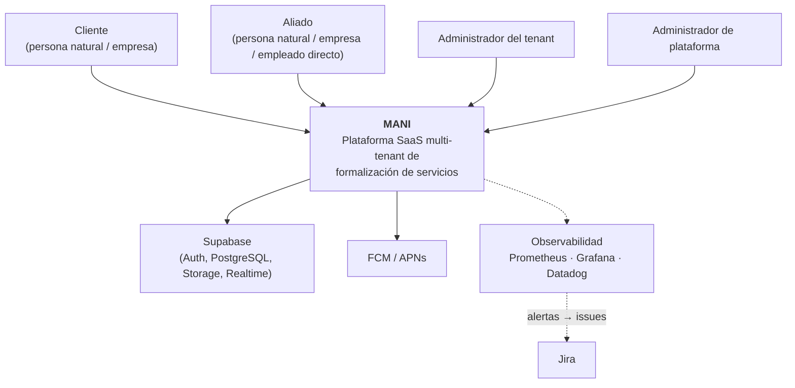
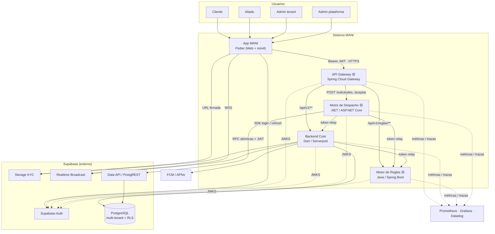
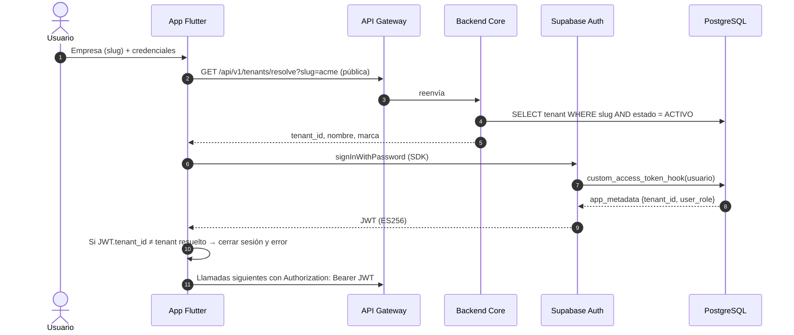
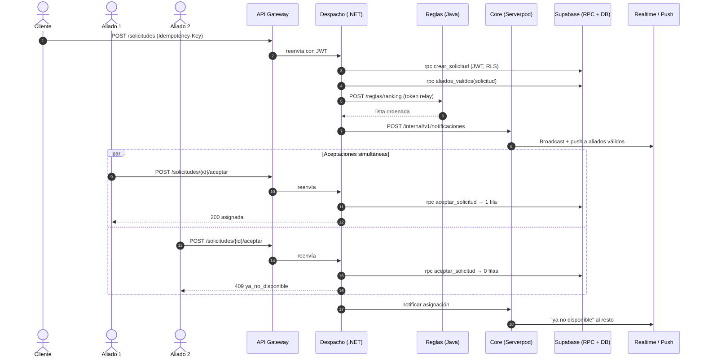
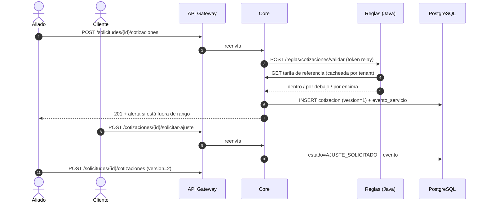

# MANI — Documento de Diseño de Software (SDD) V1

| Metadato | Valor |
| :--- | :--- |
| **Proyecto** | MANI — Plataforma SaaS multi-tenant de formalización de servicios |
| **Organización** | TRAMA · Ingeniería de Software |
| **Documento** | SDD — Arquitectura de software por vistas (4+1 realizado con C4) |
| **Versión** | 1.0 — Entrega 4 (Sprint 2 Review / Planning Sprint 3) |
| **Fecha** | 2026-09-23 |
| **Estado** | Borrador para ratificación de la Mesa de Arquitectura |
| **Fuentes** | `Product/SDD-MANI.md` v0.1, ADR-0001..0026, SRS V3, SAD V3, DD V2, `Product/Modelo_Datos_MANI.md`, DOC-08, DOC-14, PoC-001..004, `Inf_PoC-001`, `Inf_test-002`, `Diagramas/c4/workspace-as-built.dsl`, código de `MANI-Flutter` |
| **Modelo C4 fuente** | `Diagramas/c4/workspace-as-built.dsl` (Structurizr DSL) |
| **Nota IA** | Consolidado con asistencia de IA (ADR-0009). Lo marcado 🟡 requiere ADR antes de implementarse (PROY-05). |

---

## Control de versiones

| Versión | Fecha | Descripción | Estado |
| :---: | :---: | :--- | :---: |
| 0.1 | 2026-09-22 | Consolidación de ADR + estado real del código; propone API Gateway y alcance de Java/.NET. | Superada |
| **1.0** | 2026-09-23 | Se organiza por **vistas 4+1** realizadas con la notación de **ADR-0024** (C4 + UML + BPMN + MER). Se agrega el capítulo de **validación (PoC, benchmarking y ADR)**. Se corrige la numeración de los ADR propuestos (0025/0026 ya estaban asignados a DoD/DoR → pasan a 0027/0028). La vista física se delega al Documento de Infraestructura V1. | Borrador |

## Convenciones

| Marca | Significado |
| :--- | :--- |
| 🟢 **Decidido** | ADR Aceptado |
| 🔵 **Propuesto (ADR)** | ADR Propuesto |
| 🟡 **Propuesta (este SDD)** | Vacío que ningún ADR resuelve; requiere ADR nuevo |
| ✅ / ◐ / ⬜ | En código: implementado / parcial / no existe |

---

## Índice

1. [Propósito y alcance](#1-propósito-y-alcance)
2. [Drivers y restricciones](#2-drivers-y-restricciones)
3. [Framework de modelado: 4+1 y C4](#3-framework-de-modelado-41-y-c4)
4. [Vista de escenarios (+1)](#4-vista-de-escenarios-1)
5. [Vista lógica](#5-vista-lógica)
6. [Vista de procesos](#6-vista-de-procesos)
7. [Vista de desarrollo](#7-vista-de-desarrollo)
8. [Vista física](#8-vista-física)
9. [API Gateway 🟡](#9-api-gateway-)
10. [Módulos Java y .NET 🟡](#10-módulos-java-y-net-)
11. [Seguridad y aislamiento multi-tenant](#11-seguridad-y-aislamiento-multi-tenant)
12. [Datos y propiedad de datos](#12-datos-y-propiedad-de-datos)
13. [Comunicación entre servicios](#13-comunicación-entre-servicios)
14. [Validación: PoC, benchmarking y ADR](#14-validación-poc-benchmarking-y-adr)
15. [Estado actual vs objetivo y brechas](#15-estado-actual-vs-objetivo-y-brechas)
16. [Decisiones pendientes para la Mesa](#16-decisiones-pendientes-para-la-mesa)
17. [Riesgos](#17-riesgos)
18. [Anexo A — Borradores de ADR propuestos](#anexo-a--borradores-de-adr-propuestos)

---

## 1. Propósito y alcance

Este SDD define **cómo se construye MANI**: qué contenedores existen, qué responsabilidad
tiene cada uno, cómo se comunican, cómo se despliegan y qué garantiza el aislamiento entre
tenants. Consolida decisiones dispersas en 26 ADR, el SAD y el DD; las contrasta con lo que
el código implementa; y documenta la evidencia empírica (PoC) que respalda las decisiones
críticas.

Cierra dos vacíos que ningún ADR resuelve:

1. **Punto de entrada único** entre el cliente Flutter y los tres backends (ADR-0022 menciona
   un "Contenedor API Gateway" pero nadie lo decide).
2. **Alcance real de Java y .NET**: PROY-07 los exige, los ADR les dan etiquetas genéricas
   ("reglas de negocio", "transaccional de alta concurrencia") sin decir qué requisitos
   implementan.

**Alcance:** MVP (EP-01..EP-06, RF-01..RF-23). El 2º incremento queda fuera (PROY-02).

**Relación con otros documentos:**

```
SRS V3 (qué) → SAD V3 (drivers, killers, QS, trade-offs) → SDD V1 (vistas, contenedores, validación)
      → DD V2 (API, secuencias, errores, RLS concretas) → Infraestructura V1 (vista física)
      → ADR (por qué esta opción)
```

---

## 2. Drivers y restricciones

### 2.1 Atributos de calidad que dirigen la arquitectura

| ID | Driver | Consecuencia arquitectónica | Evidencia |
| :--- | :--- | :--- | :--- |
| RNF-01 / REST-04 | Aislamiento estricto entre tenants, incluidos archivos | Tenant en el JWT (ADR-0018) + RLS (ADR-0012) + ruta KYC por tenant (ADR-0013) | PoC-002, PoC-003 |
| RNF-05 / RF-14 | Exactamente una asignación ante aceptaciones concurrentes | `UPDATE` condicional atómico (ADR-0021) | PoC-001 |
| RNF-03 | Operaciones críticas resistentes a reintentos | Idempotencia en aceptar, cotizar y calificar (DD §7) | PoC-001 r5 |
| RNF-07 | Concurrencia en búsqueda y comunicación | Match por `zona_id` indexado (ADR-0011) + broadcast (ADR-0016) + Realtime (ADR-0017) | PoC-004 |
| RNF-02 / RNF-10 / REST-05 | Reglas por tenant sin despliegue | Motor de Reglas parametrizable (§10.1) + Feature Toggles (ADR-0014) | Sin evidencia (SP-TO-02) |
| RNF-04 | Trazabilidad del ciclo | `evento_servicio` append-only + logs con `trace_id` y `tenant_id` | Sin evidencia |

### 2.2 Restricciones

| ID | Restricción | Fuente |
| :--- | :--- | :--- |
| PROY-07 | Java y .NET en algún módulo del backend | SRS §2.5.1 |
| PROY-08 | Kubernetes como orquestador (curricular) | SRS §1.4 — ubicación propuesta en Infraestructura V1 §9 |
| Estilo | Distribuido orientado a servicios; monolito vetado | ADR-0019 |
| Costo | Sin costos fijos de nube | ADR-0019, ADR-0023 |
| REST-01 | Cobertura por zonas, sin geolocalización | ADR-0011 |
| PROY-05 | Decisiones costosas de revertir → Mesa + ADR | SRS |

---

## 3. Framework de modelado: 4+1 y C4

### 3.1 Decisión vigente

**ADR-0024 (Aprobado)** adopta un framework **híbrido**: C4 para la arquitectura de software,
UML para bajo nivel (secuencias, clases), BPMN para procesos de negocio y MER para el modelo
relacional. Descartó "4+1 / UML estricto" como **notación única**, por producir diagramas
monolíticos ilegibles para perfiles de negocio.

### 3.2 Cómo se combinan 4+1 y C4 en este SDD

4+1 y C4 no compiten: **4+1 dice qué preguntas debe responder la arquitectura** (vistas por
stakeholder); **C4 dice cómo dibujar** la estructura de software en niveles de zoom. Este SDD
usa 4+1 como **índice de vistas** y, dentro de cada vista, la notación que fija ADR-0024. Así
se cumple ADR-0024 (no se usa UML estricto como notación única) y se obtiene la cobertura
completa de preocupaciones que exige 4+1.

| Vista 4+1 | Pregunta | Stakeholder | Notación (ADR-0024) | Artefacto | Sección |
| :--- | :--- | :--- | :--- | :--- | :---: |
| **Escenarios (+1)** | ¿Qué casos de uso y atributos validan la arquitectura? | Todos | Escenarios de calidad (SEI) + BPMN | SAD §5 (QS-01..QS-22), BPMN ciclo del servicio | §4 |
| **Lógica** | ¿Qué hace el sistema y con qué abstracciones? | Analistas, PO | **C4 L1 (Contexto) + C4 L2 (Contenedores)**, modelo de dominio conceptual, MER | `workspace-as-built.dsl` vistas C1/C2, `Modelo_Datos_MANI.md` | §5 |
| **Procesos** | ¿Cómo interactúan en ejecución, con qué concurrencia? | Integradores, QA | **UML secuencia** | `Diagramas/Negocio/flujos/*.mmd`, §6 | §6 |
| **Desarrollo** | ¿Cómo se organiza el código y quién lo construye? | Desarrolladores | **C4 L3 (Componentes)** + estructura de repos | Vistas C3 del DSL | §7 |
| **Física** | ¿Dónde corre y cómo se protege? | DevOps, Seguridad | **C4 Deployment** + tablas de configuración | `Documento_Infraestructura_V1.md` | §8 |

### 3.3 Fuente única por tipo de diagrama

Para mitigar TO-12 (fragmentación de documentación, SP-TO-12):

| Tipo | Fuente editable (única) | Exportación | Herramienta |
| :--- | :--- | :--- | :--- |
| C4 (L1–L3, deployment) | `Diagramas/c4/workspace-as-built.dsl` | `Diagramas/c4/*.png` | Structurizr |
| Secuencias UML | `Diagramas/Negocio/flujos/*.mmd` y bloques Mermaid en este SDD | `.png` al lado del `.mmd` | Mermaid |
| BPMN | Miro (enlace registrado) | `Diagramas/Negocio/v1/*.jpg` | Miro |
| MER | `Product/DDL_MANI.sql` + `Modelo_Datos_MANI.md` | `Diagramas/ModelosDatos.pdf` | — |

Regla: un diagrama exportado sin fuente editable en el repositorio no se considera vigente.
🔴 `flujos_despacho-solicitud_v1` tiene `.png` pero no `.mmd` — regenerar.

---

## 4. Vista de escenarios (+1)

Escenarios que **validan** la arquitectura. Los 22 QS completos viven en el SAD V3 §5; aquí
se listan los que ejercitan las decisiones estructurales y su estado de validación.

| Escenario | Driver | Decisiones que ejercita | Validado por | Resultado |
| :--- | :--- | :--- | :--- | :--- |
| QS-02 — 0 registros de otro tenant visibles | RNF-01 | ADR-0012, 0018, 0022 | PoC-002, Inf_test-002 | ✅ 0 fugas; 135/135 |
| QS-04 / REST-02 — KYC aislado | RNF-01 | ADR-0013 | PoC-003 | ✅ con 3 hallazgos |
| QS-08 — listado < 1 s con 20 usuarios | RNF-07 | ADR-0011 | PoC-004 | ✅ p95 296 ms E2E; ⚠️ BD solo con 2 índices nuevos |
| QS-09 — exactamente 1 asignación | RNF-05 | ADR-0016, 0021 | PoC-001 | ✅ 1/50, control negativo 10/50 |
| QS-11 — idempotencia de aceptación | RNF-03 | DD §7 | PoC-001 r5 | ✅ |
| QS-17 — suite de aislamiento bloquea el merge | AC-10 | ADR-0015 | Inf_test-002 | ◐ suite existe; no corre automáticamente en cada PR |
| QS-07 — cambio de regla < 1 min sin despliegue | RNF-02 | ADR-0014, §10.1 | — | ⬜ SP-TO-02 |
| QS-14 — mensaje < 2 s | RF-20 | ADR-0017 | — | ⬜ SP-TO-06 |
| QS-16 — disponibilidad ≥ 99,5 % | AC-06 | ADR-0023 | — | ⬜ SP-TO-11 |

Procesos de negocio (BPMN, ADR-0024): alta y verificación de aliado
(`Diagramas/Negocio/v1/VERIFICACION ALIADO.jpg`) y ciclo completo del servicio
(`Diagramas/Negocio/v1/BPMN CICLO SERVICIO.jpg`), descritos en SAD V3 §7.5.

---

## 5. Vista lógica

### 5.1 C4 Nivel 1 — Contexto



Exportación oficial: `Diagramas/c4/C1-DHL.png`.

### 5.2 C4 Nivel 2 — Contenedores (objetivo)



Exportación oficial: `Diagramas/c4/C2-Contenedores.png`.

### 5.3 Catálogo de contenedores

| Contenedor | Responsabilidad | Tecnología | Decisión | Código |
| :--- | :--- | :--- | :--- | :---: |
| **App MANI** | UI de cliente, aliado y administradores; sin lógica decisoria (espera confirmación del backend, ADR-0016) | Flutter / Dart; Nginx para Web | 🟢 ADR-0019, 0022 | ◐ |
| **API Gateway** | Entrada única: enrutamiento, validación temprana de JWT, CORS, rate limiting, correlación | Spring Cloud Gateway | 🟡 ADR-0027 | ⬜ |
| **Backend Core** | Dueño del dominio y del esquema: tenants, directorio, KYC, catálogo, cotización, ejecución, calificación, mensajería, tarifario, notificaciones | Dart / Serverpod | 🟢 ADR-0012, 0023 | ⬜ |
| **Motor de Reglas** | Evalúa reglas por tenant: ranking, requisitos KYC, validación de cotización contra tarifario | Java / Spring Boot | 🟢 existencia (PROY-07) · 🟡 alcance ADR-0028 | ⬜ |
| **Motor de Despacho** | Crea solicitudes, calcula aliados válidos, difunde y resuelve la aceptación concurrente | .NET / ASP.NET Core | 🟢 existencia (PROY-07) · 🟡 alcance ADR-0028 | ⬜ |
| **Supabase Auth** | IdP; JWT con `app_metadata.tenant_id` y `user_role` | GoTrue | 🟢 ADR-0022, 0018 | ✅ |
| **PostgreSQL** | Persistencia multi-tenant con RLS y funciones atómicas | PostgreSQL (Supabase) | 🟢 ADR-0012 · 🔵 ADR-0021 | ✅ |
| **Storage KYC** | Bucket privado `kyc-documentos`, ruta `tenant_id/<uid>/archivo` | Supabase Storage | 🔵 ADR-0013 | ◐ |
| **Realtime** | Broadcast de despacho, estado y mensajes | Supabase Realtime | 🔵 ADR-0017 | ⬜ |
| **Data API** | REST de funciones SQL; objetivo: solo la usa Despacho | PostgREST | 🟡 §12 | ✅ |

> **Nota tecnológica.** El Tech Radar V2 (ADR-0010) tenía Spring Boot en "Mejor no" para
> reducir memoria en contenedores. El Gateway y el Motor de Reglas se proponen sobre Spring
> porque el equipo ya lo maneja y Spring Cloud Gateway valida JWKS sin licencia. Si la Mesa
> ratifica ADR-0027/0028, el Tech Radar V3 debe mover Spring Boot a "Sí o sí" con límite de
> memoria explícito (`-XX:MaxRAMPercentage`). Ver Documento de Herramientas V3 §2.

### 5.4 Modelo de dominio y datos

- **Conceptual:** SAD V3 §7.6 (Tenant, Usuario, Aliado, Cliente, Sitio, Categoría, Zona,
  Solicitud, Cotización, Evento, Calificación, Tarifa).
- **Lógico/físico (MER):** `Product/Modelo_Datos_MANI.md` + `Product/DDL_MANI.sql` (17 tablas
  base; QA tiene 21 tras las migraciones 002–006, que agregan `solicitud_rechazo`,
  `solicitud_foto` y otras de soporte).
- Regla: toda tabla tenant-scoped lleva `tenant_id` protegido por RLS; excepciones `tenant` y
  `zona`.

---

## 6. Vista de procesos

### 6.1 Login con resolución de tenant (ADR-0018, ADR-0022)



### 6.2 Despacho y aceptación concurrente (ADR-0016, ADR-0021)



Exclusión mutua: `UPDATE solicitud SET estado='ASIGNADA', aliado_id=:aliado WHERE id=:id AND
estado='PENDIENTE' AND aliado_id IS NULL` — compare-and-swap en una sola sentencia. Diagrama
exportado: `Diagramas/diagrama_secuencia_exclusion_mutua.png`.

### 6.3 Cotización con validación de tarifario (RF-15, RF-16, RF-17)



### 6.4 Concurrencia y consistencia

| Punto | Mecanismo | Garantía |
| :--- | :--- | :--- |
| Aceptación de solicitud | `UPDATE` condicional en una sentencia, `READ COMMITTED` | Exactamente 1 ganador (PoC-001) |
| Reintentos | `Idempotency-Key` (24 h) + restricciones `UNIQUE` | Sin efectos duplicados |
| Calificación | `UNIQUE(solicitud_id, autor_id)` | Máx. 1 por autor |
| Cotización | Nueva `version` por ajuste; nunca se muta la anterior | Historial completo (RNF-04) |
| Consistencia entre servicios | Síncrona; sin sagas en el MVP; Despacho no escribe fuera de RPC atómicas | Sin estados intermedios distribuidos |

---

## 7. Vista de desarrollo

### 7.1 Repositorios

| Repo | Contenido | Estado |
| :--- | :--- | :---: |
| `Trama-AS/MANI-Flutter` (Repo A) | App Flutter, `database/migrations`, `supabase/poc-*`, `qa/` (k6, Newman, storage), Docker, CI | ✅ |
| `Trama-AS/MANI-docs` | SRS, SAD, DD, SDD, ADR, diagramas, entregas | ✅ |
| Repo Core Serverpod | Backend Core | ⬜ |
| `mani-backend-java` (Repo B) | Motor de Reglas + API Gateway 🟡 | ⬜ |
| `mani-backend-dotnet` (Repo C) | Motor de Despacho | ⬜ |

### 7.2 C4 Nivel 3 — App Flutter (implementado)

Clean Architecture por feature (`lib/core`, `lib/features/*`), con capas
Presentation → Domain → Data:

| Grupo | Componentes | Estado |
| :--- | :--- | :---: |
| Core | Bootstrap, AppRouter (`go_router`), InjectionContainer (`get_it`), StructuredLogger, Design System | ✅ |
| Core (planeado) | Cliente HTTP con interceptor `Bearer` + `flutter_secure_storage`, Feature Toggles, Suscriptor Realtime, Receptor Push | ⬜ |
| Feature Auth | Páginas de login/registro, AuthCubit, casos de uso, AuthRepositoryImpl | ✅ |
| Feature Verificación | Bandeja de verificación (US-02.1.3) | ◐ |
| Feature Cobertura | Pantalla, controlador, casos de uso, datasource Supabase | ✅ |
| Feature Categorías | US-03.1.1, US-03.1.3 | ✅ (en `develop`) |
| Feature Solicitudes | Crear solicitud (US-04.1.1), aceptar/rechazar (US-04.1.4) | ◐ (datasource en memoria para aceptar) |

Métricas de la base de código (Inf_test-002): 313 pruebas, 18 de integración, cobertura de
líneas 85,4 %.

### 7.3 C4 Nivel 3 — Backends (objetivo)

| Servicio | Componentes |
| :--- | :--- |
| Gateway | Filtro JWT (`oauth2ResourceServer`) → Router → Rate limiter por `tenant_id` → Filtro de correlación |
| Core | Middleware JWT → Autorización por rol → Endpoints por módulo (DD §5) → Repositorios → Utilidad única de rutas KYC → Publicador Realtime/Push |
| Reglas | Filtro JWT (Spring Security) → API de evaluación → Evaluadores (ranking, tarifario, KYC) → Cliente del Core → Caché por `tenant_id` |
| Despacho | Middleware JwtBearer → Controlador de despacho → Servicio de asignación → Cliente RPC Supabase → Cliente de Reglas → Cliente del Core |

### 7.4 Reglas de construcción

- Gitflow: `feature/*` → `develop` → `release` → `main` (ADR-0004; `release` persistente).
- Cada repo: Dockerfile multi-stage, imagen no-root, workflow con format/lint/test/build.
- Contratos: OpenAPI por servicio (necesario para ZAP, Herramientas V2 §4.3.2).
- DoR y DoD: ADR-0026 y ADR-0025 (Propuestos).

---

## 8. Vista física

Se documenta completa en **`Documento_Infraestructura_V1.md`** (topología DEV/QA/PROD,
configuración por ambiente, seguridad por capas, secretos, Kubernetes, migraciones y brechas).
Resumen:

| Ambiente | Rama | App | Backends + Gateway | Supabase | Estado |
| :--- | :--- | :--- | :--- | :--- | :---: |
| DEV | `develop` | Docker Compose `:8080` | Compose local 🟡 | Postgres 16 local | ◐ |
| QA | `release` | `flutter-web-staging.zip` / `:staging` | Railway Staging 🟡 | Proyecto QA ✅ | ◐ |
| PROD | `main` | `:vX.Y.Z` + tiendas | Railway Production 🟡 | Proyecto PROD ⬜ | ⬜ |
| K8s (PROY-08) | — | Mismas imágenes | k3d/kind, namespaces por ambiente 🟡 | Supabase QA | ⬜ |

---

## 9. API Gateway 🟡

> **Vacío:** ADR-0022 menciona "Contenedor API Gateway", DD §5 define `/api/v1`, pero ningún
> ADR decide si existe un gateway. Sin él, Flutter conoce tres URLs, CORS se triplica y el
> contrato de API queda acoplado al reparto del backend.

### 9.1 Decisión propuesta (ADR-0027)

**Spring Cloud Gateway como punto de entrada único** para el tráfico de negocio de la app,
desplegado como contenedor independiente.

### 9.2 Benchmarking de alternativas

| Opción | A favor | En contra | Resultado |
| :--- | :--- | :--- | :--- |
| **Spring Cloud Gateway** | Libre; enrutamiento por ruta/método/cabecera; valida JWT contra JWKS; el equipo maneja Java | Memoria de la JVM; un servicio más | **Elegida** |
| YARP (.NET) | Libre, rápido, JwtBearer nativo | Misma carga operativa; menos experiencia | Alternativa válida |
| KrakenD CE | Declarativo, liviano | Rutas comodín solo en Enterprise | Descartada |
| Kong OSS | Maduro | Validación JWKS (`openid-connect`) solo en Enterprise | Descartada |
| Nginx | Ya se usa para la SPA | Sin validación JWT ni rate limit por claim sin módulos | Descartada |
| Sin gateway | Cero piezas | Acoplamiento de Flutter a 3 URLs | Descartada |

### 9.3 Responsabilidades

**Sí hace:** enrutamiento; validación temprana del JWT (`401` antes de consumir backend);
CORS por ambiente; rate limiting por `tenant_id` y usuario; correlación (`traceparent`,
`X-Request-Id`); reenvío intacto de `Authorization` e `Idempotency-Key`.

**No hace:** lógica de negocio; transformar payloads; inyectar o confiar en cabeceras de
tenant (cada backend revalida el JWT); mediar login ni Realtime.

### 9.4 Tabla de rutas

| # | Método | Ruta | Destino | Auth |
| :-: | :--- | :--- | :--- | :--- |
| 1 | `GET` | `/health` | Gateway | Pública |
| 2 | `GET` | `/api/v1/tenants/resolve?slug=` | Core | Pública (pre-auth) |
| 3 | `*` | `/api/v1/reglas/**` | Reglas | JWT |
| 4 | `POST` | `/api/v1/solicitudes` | Despacho | JWT, rol `cliente` |
| 5 | `POST` | `/api/v1/solicitudes/{id}/aceptar` · `/rechazar` | Despacho | JWT, rol `aliado` |
| 6 | `GET` | `/api/v1/solicitudes/{id}/aliados-validos` | Despacho | JWT |
| 7 | `*` | `/api/v1/**` | Core | JWT |

### 9.5 Configuración de referencia

```yaml
spring:
  cloud:
    gateway:
      server:
        webflux:
          routes:
            - id: reglas
              uri: ${RULES_URL}
              order: 1
              predicates:
                - Path=/api/v1/reglas/**
            - id: despacho-escritura
              uri: ${DISPATCH_URL}
              order: 2
              predicates:
                - Path=/api/v1/solicitudes,/api/v1/solicitudes/*/aceptar,/api/v1/solicitudes/*/rechazar
                - Method=POST
            - id: despacho-lectura
              uri: ${DISPATCH_URL}
              order: 3
              predicates:
                - Path=/api/v1/solicitudes/*/aliados-validos
                - Method=GET
            - id: core
              uri: ${CORE_URL}
              order: 100
              predicates:
                - Path=/api/v1/**
          globalcors:
            cors-configurations:
              '[/**]':
                allowed-origins: ${ALLOWED_ORIGINS}
                allowed-methods: [GET, POST, PATCH, DELETE, OPTIONS]
                allowed-headers: [Authorization, Content-Type, Idempotency-Key, X-Tenant-Slug, traceparent]
  security:
    oauth2:
      resourceserver:
        jwt:
          jwk-set-uri: ${SUPABASE_URL}/auth/v1/.well-known/jwks.json
```

(Corrige la nota del SDD 0.1: la ruta de despacho se parte por método para que
`GET /api/v1/solicitudes` siga yendo al Core.)

### 9.6 Consecuencias

- **Positivas:** un solo origen para Flutter; el reparto interno puede cambiar sin tocar la
  app; CORS, rate limiting y trazas centralizados.
- **Negativas:** un salto de red más (medir en SP-TO-09); punto único de falla → 2 réplicas en
  PROD, `/health`, timeouts cortos.

---

## 10. Módulos Java y .NET 🟡

Criterio: cada módulo debe tener responsabilidad real, trazable a requisitos, justificada por
un atributo de calidad y no solo por PROY-07.

### 10.1 Motor de Reglas por Tenant — Java (Repo B)

**Por qué aquí:** RNF-02, RNF-10 y REST-05 exigen reglas por tenant sin desplegar código.
Aislar su evaluación en un servicio *stateless* permite versionarlas, probarlas y escalarlas
sin tocar el dominio transaccional.

| Capacidad | Requisitos | Endpoint |
| :--- | :--- | :--- |
| Ranking de aliados según la regla del tenant | RF-13, RF-02 | `POST /api/v1/reglas/ranking` |
| Validación de cotización contra tarifario | RF-16, RF-22 | `POST /api/v1/reglas/cotizaciones/validar` |
| Requisitos KYC por tipo de aliado y tenant | RF-05, RF-02, RNF-10 | `GET /api/v1/reglas/requisitos-kyc?tipoAliado=` |
| Simulación de una regla antes de activarla | RNF-02 | `POST /api/v1/reglas/simular` |

Sin base propia: lee configuración del Core con *token relay* y la cachea por `tenant_id` con
TTL corto. Solo **evalúa**; la escritura de configuración la hace el Core.

### 10.2 Motor de Despacho y Asignación — .NET (Repo C)

**Por qué aquí:** el único flujo del MVP con concurrencia real y garantía de exclusión es el
despacho (RNF-05, RNF-07). Es exactamente "transaccional de alta concurrencia" y ya tiene
evidencia (PoC-001).

| Capacidad | Requisitos | Endpoint |
| :--- | :--- | :--- |
| Crear solicitud (valida que el sitio tenga zona) | RF-12, RF-09 | `POST /api/v1/solicitudes` |
| Calcular aliados válidos (zona × cobertura × categoría) ordenados por Reglas | RF-12, RF-13 | `GET /api/v1/solicitudes/{id}/aliados-validos` |
| Broadcast a aliados válidos | RF-14, ADR-0016 | interno |
| Aceptar/rechazar con exclusión; `409` al perdedor; idempotente | RF-14, RNF-03, RNF-05 | `POST /api/v1/solicitudes/{id}/aceptar` · `/rechazar` |

No es dueño de tablas: ejecuta solo funciones SQL atómicas (`crear_solicitud`,
`aliados_validos`, `aceptar_solicitud`, `rechazar_solicitud`) con el JWT del usuario, de modo
que RLS sigue aplicando.

### 10.3 Nuevo reparto del backend

| Servicio | Módulos SRS | Cambio respecto a DD V1 |
| :--- | :--- | :--- |
| Core (Serverpod) | M-01..M-04, M-06..M-09, M-11 | Pierde M-05 (despacho) |
| Reglas (Java) | Reglas de RF-02, RF-05, RF-13, RF-16 | De "reglas empresariales" genérico a capacidades concretas |
| Despacho (.NET) | M-05 (RF-12, RF-14) | De "transaccional" genérico a dueño del flujo |

### 10.4 Reparto de requisitos por servicio

| RF | Descripción | App | GW | Core | Reglas | Despacho | Supabase |
| :--- | :--- | :-: | :-: | :-: | :-: | :-: | :-: |
| RF-01 | Tenants | ● | ● | ● | | | DB |
| RF-02 | Reglas por tenant | ● | ● | ● config | ● evalúa | | DB |
| RF-03 | Autenticación | ● | ● | ● resolve | | | Auth + hook |
| RF-04 | Recuperar contraseña | ● | | | | | Auth |
| RF-05 | Aliados + KYC | ● | ● | ● | ● requisitos | | DB + Storage |
| RF-06 | Verificación | ● | ● | ● | | | DB + Storage |
| RF-07 | Cobertura | ● | ● | ● | | | DB |
| RF-08/09 | Clientes y sitios | ● | ● | ● | | | DB |
| RF-10/11 | Categorías | ● | ● | ● | | | DB |
| RF-12 | Solicitud + aliados válidos | ● | ● | | ● orden | ● | DB |
| RF-13 | Orden del listado | | | | ● | ● invoca | |
| RF-14 | Aceptación concurrente | ● | ● | ● notifica | | ● | DB + Realtime |
| RF-15..17 | Cotización | ● | ● | ● | ● RF-16 | | DB |
| RF-18 | Eventos | ● | ● | ● | | | DB |
| RF-19 | Calificación | ● | ● | ● | | | DB |
| RF-20/21 | Mensajería | ● | ● | ● | | | DB + Realtime + push |
| RF-22/23 | Tarifario | ● | ● | ● | ● lee | | DB |

---

## 11. Seguridad y aislamiento multi-tenant

| Capa | Control | Decisión | Evidencia |
| :--- | :--- | :--- | :--- |
| 1. Identidad | JWT con `tenant_id`/`user_role` vía hook, *fail-closed* | 🟢 ADR-0022, 0018 | PoC-002 |
| 2. Borde | Gateway valida JWT; rate limit por tenant | 🟡 ADR-0027 | — |
| 3. Servicio | Revalidación de JWT + autorización por rol | 🟢 ADR-0018, DD §8.3 | — |
| 4. Datos | RLS `tenant_isolation_*` | 🟢 ADR-0012 | PoC-002 (0 fugas) · ⚠️ sin rol (H-02) |
| 5. Archivos | Bucket privado + `kyc_isolation` + URL firmada | 🔵 ADR-0013 | PoC-003 (95/95) |
| 6. Entre servicios | *Token relay* | 🟢 ADR-0018 | — |

Reglas vinculantes: `service_role` solo en el Core; funciones `SECURITY DEFINER` toman el
tenant de `auth.jwt()`; `tenant_id` en logs sí, datos personales no; `/health` y `/metrics`
solo en red privada. Detalle de infraestructura en Infraestructura V1 §7.

---

## 12. Datos y propiedad de datos

| Regla | Detalle |
| :--- | :--- |
| Un solo esquema | Migraciones versionadas (hoy en `MANI-Flutter/database/migrations`, objetivo en el Core) |
| Un solo dueño | El Core gobierna esquema y migraciones |
| Acceso de Reglas | Solo vía Core (lectura de configuración) |
| Acceso de Despacho | Solo RPC atómicas por la Data API con JWT del usuario — **excepción acotada** a Modelo_Datos §2 (atomicidad, latencia, RLS intacto, sin migraciones propias) |
| Acceso de la app | Hoy: PostgREST directo. Objetivo: solo Auth, Realtime y URLs firmadas |
| Índices obligatorios | `(tenant_id, zona_id)` en `cobertura_aliado`, `(tenant_id, categoria_id)` en `aliado_categoria` (PoC-004, SCRUM-1054) |

---

## 13. Comunicación entre servicios

| Tema | Regla |
| :--- | :--- |
| Estilo | REST/JSON síncrono sobre HTTPS; red privada entre servicios |
| Rutas internas | `/internal/v1/*`, no expuestas en el gateway |
| Identidad | *Token relay* en cada salto |
| Idempotencia | `Idempotency-Key` obligatorio en aceptar, cotizar, calificar; respuesta guardada 24 h |
| Timeouts | Gateway → backend 5 s; backend → backend 2 s; sin reintentos automáticos en operaciones no idempotentes |
| Resiliencia | Si Reglas no responde, Despacho usa el orden por defecto (cobertura) y registra el evento degradado |
| Trazas | `traceparent` W3C de punta a punta |
| Asíncrono | Fuera del MVP (ADR-0021 descarta cola de reintento en este incremento; residual en SP-TO-03) |

---

## 14. Validación: PoC, benchmarking y ADR

### 14.1 Método

Una **PoC** verifica una decisión ya redactada; un **spike** responde una pregunta abierta
antes de decidir (Spikes/README). Toda PoC de MANI sigue el mismo protocolo:

1. Pregunta cerrada y ADR afectado.
2. **Métrica y umbral publicados en Jira antes de medir.**
3. **Control negativo** que debe fallar (si no puede fallar, no valida nada — PoC-001 H-01).
4. Evidencia cruda versionada (bitácora SQL, JSON de k6/Newman redactados).
5. Conclusión explícita para el ADR: confirmar, corregir o reabrir.

### 14.2 Resultados de las 4 PoC del Sprint 2

| PoC | Ticket | ADR | Pregunta | Umbral | Resultado | Veredicto |
| :--- | :--- | :--- | :--- | :--- | :--- | :---: |
| **PoC-001** Exclusión concurrente | CFG-09 / SCRUM-926 | ADR-0021, 0016 | ¿El `UPDATE` condicional da exactamente 1 asignación con N=50 simultáneos? | 1 asignación, 0 dobles, 1×200, 49×409, control > 1 | 1 / 0 / 1 / 49; control negativo **10 asignaciones en 136 ms** | ✅ Cumple |
| **PoC-002** Claims de tenant | CFG-12 / SCRUM-929 | ADR-0018, 0022, 0015 | ¿El JWT propaga `tenant_id`/`user_role` y son los claims los que deciden el acceso? | 100 % propagación, 0 fugas, 100 % suplantación rechazada | 100 %, 0 fugas, 4/4; 40/40 + 36/36; control: 13/40 fallan | ✅ Cumple (2 casos no ejecutables) |
| **PoC-003** Storage KYC | CFG-13 / SCRUM-930 | ADR-0013, 0015 | ¿La ruta por tenant + RLS aíslan los KYC? ¿En cuánto se cargan? | Carga 1 MB p95 < 2000 ms; URL firmada p95 < 500 ms; 100 % denegado | 1180 ms; 423 ms; 95/95; control 20 en rojo | ✅ Cumple (3 hallazgos) |
| **PoC-004** Cobertura geográfica | CFG-10 / SCRUM-927 | ADR-0011 | ¿El match por `zona_id` cumple latencia con volumen? | p95 BD < 50 ms a 1k/10k/100k | 1,10 / 15,58 / **123,91 ms** → con 2 índices 0,23 / 0,95 / **9,48 ms**; E2E 296 ms | ✅ Cumple solo con índices |

### 14.3 Benchmarking comparativo (PoC-004, escenario ADR-0011 §6)

Si algún día hay que resolver la zona desde coordenadas:

| Variante (100k aliados, con índices) | p95 BD | Precisión de zona | Recomendación |
| :--- | :---: | :---: | :--- |
| `zona_id` (vigente) | 9,48 ms | 100 % (por definición) | **Mantener** |
| PostGIS | 7,17 ms | 100 % | Usar si se activa §6 |
| Bounding box refinado | 9,52 ms | 100 % | Alternativa |
| Geohash | 8,35 ms | 93,78 % | **Descartar** (6,2 % de error en bordes) |

Extremo a extremo (k6, 20 VUs, 10k): p95 287–296 ms en las cuatro variantes.

### 14.4 Métricas de costo medidas

| Medición | Valor | Fuente |
| :--- | :--- | :--- |
| Verificación de firma ES256, p95 en caliente | 0,10 ms | PoC-002 |
| Verificación en frío (fetch JWKS) | 159,97 ms → cachear JWKS | PoC-002 |
| Delta autenticado vs. anónimo E2E | mediana 0,07 ms | PoC-002 |
| Carga KYC 100 KB / 1 MB / 5 MB, p95 | 752 / 1180 / 1427 ms | PoC-003 |
| Límite de login de Supabase Auth | `429` hacia la petición 30 en 5 min por IP | PoC-001 H-03 |
| Concurrencia efectiva | Acotada por el pool de PostgREST, no por `max_connections` | PoC-001 H-04 |

### 14.5 Impacto en los ADR

| ADR | Antes | Después de la PoC | Acción |
| :--- | :--- | :--- | :--- |
| ADR-0021 | Propuesto | Confirmado sin cambios | Pasar a Aceptado (DOC-14 D-02); asignar revisor y rotar autoría |
| ADR-0018 | Aceptado, no implementado | Confirmado; el hook lo implementa la PoC | Promover el hook a migraciones |
| ADR-0013 | Propuesto | Se sostiene con 3 correcciones (H-01 URL al portador, H-02 `aliado_id`→`auth.uid()`, H-04 `FOR ALL`) | Corregir texto y pasar a Aceptado |
| ADR-0011 | Aceptado | Confirmado, no se reabre | Agregar 2 índices (SCRUM-1054) |
| ADR-0015 | Propuesto | Suite ejecutada (casos 1–6) | Pasar a Aceptado |
| ADR-0012 / TO-06 | Aceptado | **Evidencia adversa:** RLS no restringe rol (H-02) | Condicionar TO-06; ticket H-02; SP-TO-06 |

### 14.6 Spikes abiertos (evidencia pendiente)

11 spikes, 57 h de timebox, ninguno ejecutado. Priorización propuesta en DOC-14 D-06:
SP-TO-06 (6 h) → SP-TO-03 (8 h) → SP-TO-01 (6 h) → SP-TO-05 (4 h) en Sprint 2–3; el resto
(33 h) en Sprint 3. SP-TO-09 mide el costo del gateway (§9.6) y SP-TO-11 alimenta la decisión
de Kubernetes (Infraestructura V1 §9).

---

## 15. Estado actual vs objetivo y brechas

### 15.1 Estado actual (as-is)

| Pieza | Estado | Evidencia |
| :--- | :---: | :--- |
| App Flutter Web con Clean Architecture | ✅ | `lib/core`, `lib/features/*` |
| Login y registro | ✅ | `features/auth` |
| Cobertura del aliado | ✅ | `features/profiles/coverage` |
| Categorías (US-03.1.1, US-03.1.3) | ✅ | PR #18, #19 |
| Crear solicitud (US-04.1.1) | ✅ | PR #22 |
| Aceptar/rechazar (US-04.1.4) | ◐ | PR #21; datasource en memoria en la app |
| Migraciones 001–007 en QA | ✅ | Inf_test-002 |
| Hook de claims, `aceptar_solicitud`, bucket KYC | ◐ | Solo scripts de PoC |
| Docker + GHCR + CI + Sonar en `main` | ✅ | `.github/workflows` |
| Suite QA (k6, Newman, storage) | ✅ | `qa/` en `release` |
| Core Serverpod, Java, .NET, Gateway | ⬜ | — |
| Realtime, push, observabilidad | ⬜ | — |

### 15.2 Brechas de código

| # | Brecha | Acción |
| :-: | :--- | :--- |
| B-01 | La app llama a Supabase directo | Migrar por feature detrás del gateway |
| B-02 | Aceptación de solicitud en memoria en la app | Despacho (.NET) + cliente HTTP |
| B-03 | Bandeja de verificación incompleta | Completar `lib/features/profiles/verification` |
| B-04 | RPC de cobertura sin SQL versionado | Versionar en migraciones |
| B-05 | Hook, `aceptar_solicitud` y bucket KYC solo en PoC | Promover a migraciones |
| B-06 | La app no sube documentos KYC | Subida vía Core con la utilidad única de rutas |
| B-07 | Políticas `tenant_isolation_*` sin versionar; sin restricción de rol | Migración 008 (SCRUM-1051, H-02) |
| B-08 | Sin `flutter_secure_storage` ni interceptor HTTP | Componente "Cliente HTTP" |
| B-09 | `main` es la plantilla demo | Promover `release → main` |
| B-10 | Faltan 2 índices de cobertura | SCRUM-1054 |

### 15.3 Brechas documentales

| # | Brecha | Acción | Estado en Entrega 4 |
| :-: | :--- | :--- | :---: |
| D-01 | ADR-0023 con título "ADR-002" | Corregir encabezado | Pendiente (DOC-14 D-01) |
| D-02 | ADR-0006 dice "Reemplazado por ADR-0021" | Apuntar a ADR-0023 | Pendiente |
| D-03 | DD §3 atribuye KI-02 a ADR-0021 | Apuntar a ADR-0023 | ✅ Corregido en DD V2 |
| D-04 | DD §9 dice "Flutter no se conteneriza" | Actualizar | ✅ Corregido en DD V2 |
| D-05 | DOC-08: DEV sin cloud vs `.env.example` | Alinear | Pendiente (Infra I-08) |
| D-06 | ADR-0012 dice "NestJS" en su trazabilidad C4 | Corregir a Serverpod | Pendiente |
| D-07 | SDD 0.1 numeró ADR-0025/0026 ya ocupados | Renumerar a 0027/0028 | ✅ Corregido en este SDD |
| D-08 | README marca ADR-0014/0015 como Aceptados | Alinear con archivos | Pendiente |

### 15.4 Plan de migración

| Fase | Entregable | Cierra |
| :-: | :--- | :--- |
| 1 | Hook, bucket KYC, `aceptar_solicitud`, RPC de cobertura, `tenant_isolation` con rol e índices → migraciones | B-04, B-05, B-07, B-10 |
| 2 | Gateway + Core mínimo (`/tenants/resolve`, `/health`); cliente HTTP en Flutter | B-08, ADR-0027 |
| 3 | Despacho (.NET) con `POST /solicitudes` y `/aceptar`; Flutter deja el repositorio en memoria | B-02 |
| 4 | Reglas (Java) con ranking y validación de cotización | RF-13, RF-16 |
| 5 | Registro, verificación y cobertura del SDK directo al Core | B-01, B-03, B-06 |
| 6 | Realtime + push; observabilidad en los cuatro servicios; manifiestos K8s | ADR-0017, 0006, 0029 |

---

## 16. Decisiones pendientes para la Mesa

| # | Decisión | Propuesta |
| :-: | :--- | :--- |
| P-01 | **ADR-0027 — API Gateway** | Spring Cloud Gateway, rutas de §9.4, sin lógica de negocio |
| P-02 | **ADR-0028 — Alcance Java/.NET** | Java = Motor de Reglas; .NET = Motor de Despacho; excepción de acceso de §12 |
| P-03 | **ADR-0029 — Kubernetes (PROY-08)** | Railway para QA/PROD del MVP + clúster k3d/kind con las mismas imágenes (Infraestructura V1 §9) |
| P-04 | GHCR vs Docker Hub | Unificar en GHCR |
| P-05 | Pasar a Aceptado ADR-0013, 0015, 0021 | Evidencia de PoC-001..003 |
| P-06 | Un usuario = un tenant en el MVP | Confirmar (limitación de poc-cfg12) |
| P-07 | Numeración ADR-0021/0023 (DOC-14 D-01) | Numeración por nombre de archivo |
| P-08 | Tech Radar: Spring Boot | Mover a "Sí o sí" acotado a Gateway y Reglas si se ratifican P-01/P-02 |

---

## 17. Riesgos

| Riesgo | Prob. | Impacto | Mitigación |
| :--- | :-: | :-: | :--- |
| Latencia acumulada app → gateway → servicio → servicio | Media | Media | SP-TO-09; timeouts §13; *fallback* de ranking |
| Gateway como punto único de falla | Media | Alta | 2 réplicas en PROD, `/health`, rollback por imagen |
| Tres stacks backend para 7 personas | Alta | Media | Alcance mínimo en Java/.NET; plantillas compartidas de CI y Docker |
| Techo de Railway | Media | Media | Contenedores portables; K8s de P-03 |
| Reconstruir un ambiente sin RLS | Media | Crítica | Migración 008 antes de PROD (B-07) |
| Deriva código ↔ documentos | Alta | Media | DSL C4 como fuente; revisión en cada Mesa (SP-TO-12) |
| `service_role` fuera del Core | Baja | Crítica | Secreto solo en el Core; revisión en PR; Sonar |

---

## Anexo A — Borradores de ADR propuestos

Formato de `ADR/ADR-NNN-titulo.md`. **No son decisiones vigentes** hasta que la Mesa los
ratifique (ADR-0003, PROY-05); la autoría debe rotar al redactarlos en la carpeta `ADR/`.

### A.1 ADR-0027: API Gateway como punto de entrada único

- Fecha: por definir en Mesa · Sprint: 3 · Origen: SDD V1 §9 · Revisor: por asignar

**Contexto.** Tres backends (Serverpod, Java, .NET) y un cliente Flutter; ADR-0022 menciona un
gateway que nadie decidió; el contrato `/api/v1` del DD no debe depender del reparto interno.

**Alternativas evaluadas.** YARP (válida, menos experiencia del equipo); KrakenD CE (rutas
comodín solo Enterprise); Kong OSS (JWKS solo Enterprise); Nginx (sin validación JWT); sin
gateway (acoplamiento de la app a 3 URLs).

**Decisión.** Usaremos Spring Cloud Gateway como punto de entrada único para el tráfico de
negocio de la app, con validación temprana de JWT contra el JWKS de Supabase, CORS por
ambiente, rate limiting por `tenant_id` y correlación W3C.

**Trade-off asumido.** Un salto de red más y un servicio JVM que operar, a cambio de
desacoplar la app del reparto del backend y centralizar controles de borde.

**Estado.** Propuesto.

### A.2 ADR-0028: Alcance de los módulos Java y .NET

- Fecha: por definir en Mesa · Sprint: 3 · Origen: SDD V1 §10 · Revisor: por asignar

**Contexto.** PROY-07 exige Java y .NET; ADR-0019/0023 les asignan etiquetas genéricas sin
requisitos; no hay código en ningún repo.

**Alternativas evaluadas.** Java = Despacho y .NET = Reglas (descartada: la experiencia de
concurrencia y la etiqueta "transaccional" apuntan a .NET); módulos mínimos "de cumplimiento"
sin requisitos reales (descartada: servicios sin responsabilidad no justifican su costo
operativo).

**Decisión.** Java (Repo B) implementa el Motor de Reglas por Tenant (RF-02, RF-05, RF-13,
RF-16); .NET (Repo C) implementa el Motor de Despacho y Asignación (RF-12, RF-14). Despacho
accede a datos solo mediante RPC atómicas con el JWT del usuario.

**Trade-off asumido.** El Core pierde M-05 y se agrega una excepción acotada a la regla "un
solo dueño de datos", a cambio de dar a cada stack una responsabilidad justificada por un
atributo de calidad.

**Estado.** Propuesto.

### A.3 ADR-0029: Ubicación y configuración del clúster Kubernetes

- Fecha: por definir en Mesa · Sprint: 3 · Origen: Infraestructura V1 §9, KI-03 · Revisor: por asignar

**Contexto.** PROY-08 obliga a Kubernetes; ADR-0023 eligió Railway sin costo fijo y dejó
abierta la ubicación del clúster; SP-TO-11 no se ha ejecutado.

**Alternativas evaluadas.** Clúster gestionado (costo fijo, viola ADR-0019); K3s en VM
gratuita (Oracle en "Mejor no"; operación a cargo del equipo); solo Railway (incumple
PROY-08).

**Decisión.** Mantendremos Railway para QA y PROD del MVP y un clúster k3d/kind de
referencia, con manifiestos Kustomize versionados (base + overlays dev/qa/prod) que despliegan
las mismas imágenes de GHCR, con `NetworkPolicy` *default deny* y contenedores no-root.

**Trade-off asumido.** El clúster no sirve tráfico productivo real; se acepta a cambio de
costo cero y de cumplir PROY-08 con artefactos reales y reproducibles. Se reabre si SP-TO-11
muestra degradación por debajo de la carga de QS-08.

**Estado.** Propuesto.
