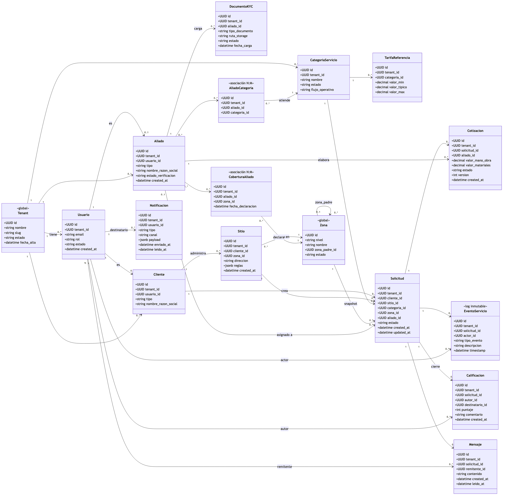

# MANI — Modelo de Datos (Diagrama de clases UML)

**Empresa:** TRAMA · Ingeniería de Software
**Producto:** MANI — plataforma multi-tenant de formalización de operaciones de servicio
**Documento:** Modelo de Datos V3 — muestra el diagrama de
`Diagramas/Modelo-Datos/dd-modelo-datos_uml-clases-mani_v1.mmd` y lo explica
**Estado:** Borrador para revisión
**Fecha de esta versión:** 2026-09-03

## Historial de versiones

| Versión     | Momento              | Cambios principales                                                                                                                                                                                                                                                                                                                               |
| ------------ | -------------------- | ------------------------------------------------------------------------------------------------------------------------------------------------------------------------------------------------------------------------------------------------------------------------------------------------------------------------------------------------- |
| **V1** | Sprint 2, 2026-09-03 | Publicado junto con`DD-MANI.md`: este documento explicaba el diagrama, el DD fijaba componentes y reglas.                                                                                                                                                                                                                                       |
| **V2** | Sprint 2, 2026-09-03 | Se separan de nuevo a pedido del equipo — hay confusión con`Product/ModeloDatos.md` (propuesta de otro integrante, alcance de backlog completo, notación ER). Este documento vuelve a ser **el único** que muestra el diagrama UML del MVP y lo explica; `DD-MANI.md` es el documento de diseño (componentes + reglas), separado.  |

> Este documento explica el diagrama de clases UML del modelo de datos técnico del MVP.
> Complementa a `Product/DD-MANI.md` (que fija las reglas de diseño) y no debe confundirse
> con el **modelo de dominio conceptual de negocio** de `Product/SAD-MANI.md` §7.6, que es
> de más alto nivel y no tiene tipos de dato ni claves. Fuente: `Product/SRS_MANI.md`,
> ADR-0011, ADR-0012, ADR-0013, ADR-0016, ADR-0017, ADR-0018. No introduce entidades ni
> reglas que no existan ya en esos documentos.
>
> 🔴 **Nota de consistencia documental:** `Product/ModeloDatos.md` (autor: Nicolás Álvarez)
> es un documento distinto, con alcance de las 8 épicas completas (incluido 2º incremento)
> y notación ER (`erDiagram`), marcado "Propuesta para presentar — pendiente de validación
> de la Mesa". No se fusiona aquí porque tiene autoría y alcance propios; queda pendiente
> que la Mesa decida cuál es la fuente única del modelo de datos del proyecto. Este
> documento cubre solo el MVP (RF-01..RF-23) con trazabilidad directa a ADR ya ratificados.

## 1. Cómo leer el diagrama

Fuente versionada como texto (Mermaid, ADR-0008):
`Diagramas/Modelo-Datos/dd-modelo-datos_uml-clases-mani_v1.mmd`

- Cada caja es una entidad (futura tabla). El símbolo `+` antes de un atributo es la
  notación UML de visibilidad pública; no indica un campo opcional.
- Las flechas indican navegación de la relación (de quién depende quién), con la
  cardinalidad en cada extremo (`1`, `0..1`, `0..*`, `0..2`).
- `<<global>>` marca las dos entidades que **no** llevan `tenant_id`: `Tenant` (es la raíz)
  y `Zona` (catálogo global de plataforma, ADR-0011 §6).
- `<<asociación N:M>>` marca las tablas puente (`CoberturaAliado`, `AliadoCategoria`) que
  existen porque la relación en sí tiene datos propios (p. ej. fecha de declaración), no
  una simple relación muchos-a-muchos sin atributos.
- `<<log inmutable>>` marca `EventoServicio`: se inserta, nunca se actualiza ni se borra
  (RNF-04).

## 2. Entidades por módulo funcional

### 2.1 Plataforma y acceso (M-01)

| Entidad     | Atributos clave                                                      | Notas                                                                                                                                                                                                                                                                                                  |
| ----------- | -------------------------------------------------------------------- | ------------------------------------------------------------------------------------------------------------------------------------------------------------------------------------------------------------------------------------------------------------------------------------------------------ |
| `Tenant`  | `id`, `nombre`, `slug`, `estado`, `fecha_alta`             | Raíz del modelo.`slug` es el identificador legible usado en la fase de pre-autenticación (`X-Tenant-Slug`, ADR-0018).                                                                                                                                                                            |
| `Usuario` | `id`, `tenant_id` *(nullable)*, `email`, `rol`, `estado` | 1:1 con`auth.users` de Supabase (ADR-0022). `tenant_id` es nulo solo para el rol `admin_plataforma`, que opera fuera de cualquier tenant (SAD §7.2). El `rol` (`admin_plataforma`, `admin_tenant`, `aliado`, `cliente`) viaja en `app_metadata.rol` del JWT junto al `tenant_id`. |

**Por qué `Usuario` es una entidad separada de `Aliado`/`Cliente`:** un mismo login
(`auth.users`) puede necesitar distintos perfiles operativos. `Usuario` concentra
identidad y rol; `Aliado` y `Cliente` concentran los datos propios de cada perfil de
negocio. La relación es `0..1` en ambos sentidos porque un usuario tiene **como máximo**
un perfil de aliado y **como máximo** un perfil de cliente (nunca ambos a la vez en el
MVP — no hay requerimiento que lo pida).

### 2.2 Directorio de aliados y clientes (M-02 / M-03)

| Entidad          | Atributos clave                                                                                   | Notas                                                                                                                                                                                                                                   |
| ---------------- | ------------------------------------------------------------------------------------------------- | --------------------------------------------------------------------------------------------------------------------------------------------------------------------------------------------------------------------------------------- |
| `Aliado`       | `id`, `tenant_id`, `usuario_id`, `tipo`, `nombre_razon_social`, `estado_verificacion` | `tipo` ∈ {`persona_natural`, `empresa`, `empleado_directo`} (RF-05). `estado_verificacion` ∈ {`pendiente`, `aprobado`, `rechazado`} — lo mueve la bandeja de verificación de RF-06.                                 |
| `DocumentoKYC` | `id`, `tenant_id`, `aliado_id`, `tipo_documento`, `ruta_storage`, `estado`            | `ruta_storage` sigue literalmente el patrón `tenant_id/aliado_id/documento.ext` de ADR-0013. `tipo_documento` es configurable por tenant (RNF-10) — no es un enum fijo en el modelo lógico.                                    |
| `Cliente`      | `id`, `tenant_id`, `usuario_id`, `tipo`, `nombre_razon_social`                          | `tipo` ∈ {`persona_natural`, `empresa`} (RF-08).                                                                                                                                                                                 |
| `Sitio`        | `id`, `tenant_id`, `cliente_id`, `zona_id`, `direccion`, `reglas`                     | Un cliente empresa administra`0..*` sitios (RF-08). `zona_id` es obligatorio — "sin zona no puede originar una solicitud" (ADR-0011 §2.3). `reglas` es JSON libre para condiciones del sitio (p. ej. horario de acceso, RF-09). |

### 2.3 Catálogo y cobertura (M-04)

| Entidad               | Atributos clave                                                                         | Notas                                                                                                                                                                                                                                                             |
| --------------------- | --------------------------------------------------------------------------------------- | ----------------------------------------------------------------------------------------------------------------------------------------------------------------------------------------------------------------------------------------------------------------- |
| `Zona`              | `id`, `nivel`, `nombre`, `zona_padre_id`, `estado`                            | Catálogo jerárquico ciudad → localidad/comuna → barrio (ADR-0011 §1).`zona_padre_id` autorreferencia la propia tabla. `estado` ∈ {`activa`, `desactivada`} — nunca se elimina una fila (ADR-0011 §5).                                             |
| `CoberturaAliado`   | `id`, `tenant_id`, `aliado_id`, `zona_id`, `fecha_declaracion`                | Tabla puente aliado ↔ zona (RF-07). Lleva`tenant_id` propio aunque `Aliado` ya lo tenga, porque la política RLS de esta tabla debe poder evaluarse sin un `JOIN` adicional contra `Aliado` en la ruta más caliente del producto (RF-12/RF-13, RNF-07). |
| `CategoriaServicio` | `id`, `tenant_id`, `nombre`, `estado`, `flujo_operativo`                      | Activable/desactivable por tenant (RF-10).                                                                                                                                                                                                                        |
| `AliadoCategoria`   | `id`, `tenant_id`, `aliado_id`, `categoria_id`                                  | Tabla puente aliado ↔ categoría atendida (RF-11). Mismo criterio de`tenant_id` denormalizado que `CoberturaAliado`.                                                                                                                                         |
| `TarifaReferencia`  | `id`, `tenant_id`, `categoria_id`, `valor_min`, `valor_tipico`, `valor_max` | Rango de referencia por categoría y tenant (RF-22); alimenta la alerta de RF-16 y el reporte de RF-23.                                                                                                                                                           |

### 2.4 Ciclo del servicio (M-05..M-08)

| Entidad            | Atributos clave                                                                                                              | Notas                                                                                                                                                                                                                                                                                                                                                                                                                 |
| ------------------ | ---------------------------------------------------------------------------------------------------------------------------- | --------------------------------------------------------------------------------------------------------------------------------------------------------------------------------------------------------------------------------------------------------------------------------------------------------------------------------------------------------------------------------------------------------------------- |
| `Solicitud`      | `id`, `tenant_id`, `cliente_id`, `sitio_id`, `categoria_id`, `zona_id`, `aliado_id` *(nullable)*, `estado` | Entidad núcleo.`zona_id` es un **snapshot** de `Sitio.zona_id` al momento de creación (ADR-0011 §5) — evita que una desactivación posterior de zona corrompa el histórico. `aliado_id` es nulo hasta la asignación; el `UPDATE` condicional de ADR-0016 lo llena de forma atómica. `estado` recorre `pending → assigned → in_progress → closed` (con `cancelled` como salida alterna). |
| `Cotizacion`     | `id`, `tenant_id`, `solicitud_id`, `aliado_id`, `valor_mano_obra`, `valor_materiales`, `estado`, `version`   | Mano de obra y materiales**siempre separados** (RF-15). `version` soporta el bucle de ajuste de RF-17 (cliente rechaza o pide ajuste → nueva versión) sin perder el historial de versiones anteriores.                                                                                                                                                                                                      |
| `EventoServicio` | `id`, `tenant_id`, `solicitud_id`, `actor_id`, `tipo_evento`, `descripcion`, `timestamp`                       | Log append-only (RF-18, RNF-04).`actor_id` referencia `Usuario`, no `Aliado`/`Cliente` directamente, porque cualquier rol autenticado puede generar un evento (incluido `admin_tenant`).                                                                                                                                                                                                                    |
| `Calificacion`   | `id`, `tenant_id`, `solicitud_id`, `autor_id`, `destinatario_id`, `puntaje`, `comentario`                      | Bidireccional (RF-19): hasta 2 filas por solicitud (una por parte). La unicidad`(solicitud_id, autor_id)` es una restricción de base de datos, no solo una regla de aplicación — ver `Product/DD-MANI.md` §5.6.                                                                                                                                                                                               |

### 2.5 Comunicación (M-09)

| Entidad          | Atributos clave                                                                                        | Notas                                                                                                                                                                                                    |
| ---------------- | ------------------------------------------------------------------------------------------------------ | -------------------------------------------------------------------------------------------------------------------------------------------------------------------------------------------------------- |
| `Mensaje`      | `id`, `tenant_id`, `solicitud_id`, `remitente_id`, `contenido`, `created_at`, `leido_at` | Asociado siempre a una solicitud (RF-20); nunca es una mensajería genérica fuera de un servicio.                                                                                                       |
| `Notificacion` | `id`, `tenant_id`, `usuario_id`, `tipo`, `canal`, `payload`, `enviado_at`, `leido_at`  | `canal` ∈ {`push`, `realtime`}. Es un registro de auditoría de entrega (ADR-0017), no el mecanismo de entrega en sí — el mecanismo es Supabase Realtime / FCM-APNs, fuera del modelo de datos. |

## 3. Cardinalidades que merecen justificación explícita

| Relación                                       | Cardinalidad         | Por qué                                                                                                                                               |
| ----------------------------------------------- | -------------------- | ------------------------------------------------------------------------------------------------------------------------------------------------------ |
| `Usuario` → `Aliado` / `Cliente`         | `1` → `0..1`    | Un usuario tiene como máximo un perfil de cada tipo; ninguno es obligatorio al momento del registro (un`admin_tenant` no tiene ni uno ni otro).     |
| `Solicitud` → `Cotizacion`                 | `1` → `0..*`    | El bucle de ajuste de RF-17 puede generar más de una versión de cotización para la misma solicitud; el modelo no fuerza una sola fila.              |
| `Solicitud` → `Calificacion`               | `1` → `0..2`    | Exactamente cero, una o dos calificaciones — nunca más, porque solo hay dos partes posibles (cliente y aliado) y la unicidad por autor lo garantiza. |
| `Aliado` ↔ `Zona` vía `CoberturaAliado` | `0..*` ↔ `0..*` | Un aliado declara varias zonas; una zona tiene varios aliados con cobertura declarada — de ahí la tabla puente en vez de una FK directa.             |
| `Zona` → `Zona` (`zona_padre_id`)        | `0..1` → `0..*` | Jerarquía de 3 niveles (ciudad/localidad/barrio); una zona raíz (ciudad) no tiene padre.                                                             |
| `Sitio` → `Zona`                           | `0..*` → `1`    | Todo sitio tiene exactamente una zona (obligatoria, ADR-0011 §2.3); una zona puede tener muchos sitios.                                               |

## 4. Qué queda fuera de este modelo (y por qué)

- **Coordenadas geográficas (lat/long):** deliberadamente ausentes. REST-01 y ADR-0011
  descartan el radio geográfico y la geometría propia; el modelo completo depende de la
  igualdad de `zona_id`, no de cálculo geoespacial.
- **Tabla de "ofertas" de despacho:** no existe una entidad intermedia entre `Solicitud` y
  los aliados notificados por el broadcast. ADR-0016 resuelve la asignación directamente
  sobre `Solicitud.aliado_id` con un `UPDATE` condicional; modelar una tabla de ofertas
  sería complejidad sin driver que la exija en el MVP.
- **Entidades de pago/liquidación/quejas (2º incremento):** ver `Product/DD-MANI.md` §7.
- **Reglas de diseño y vista de componentes:** ese contenido vive en `Product/DD-MANI.md`,
  no aquí — este documento es solo el diagrama y su explicación entidad por entidad.

## 5. Trazabilidad

`RF-01..RF-23 (SRS V3) → ADR-0011/0012/0013/0016/0017/0018 → 18 entidades de este modelo → Diagramas/Modelo-Datos/dd-modelo-datos_uml-clases-mani_v1.mmd → DDL (fase de implementación, fuera de alcance de este documento)`

| Artefacto                                                  | Relación con este documento                                                    |
| ---------------------------------------------------------- | ------------------------------------------------------------------------------- |
| `Product/SRS_MANI.md`                                    | Origen de cada RF citado en §2                                                 |
| `Product/SAD-MANI.md` §7.6                              | Modelo de dominio*conceptual* de negocio — nivel superior, sin tipos de dato |
| `Product/DD-MANI.md`                                     | Reglas de diseño que este modelo implementa, vista de componentes              |
| ADR-0011, ADR-0012, ADR-0013, ADR-0016, ADR-0017, ADR-0018 | Decisiones técnicas que originan cada regla de §2 y §3                       |
