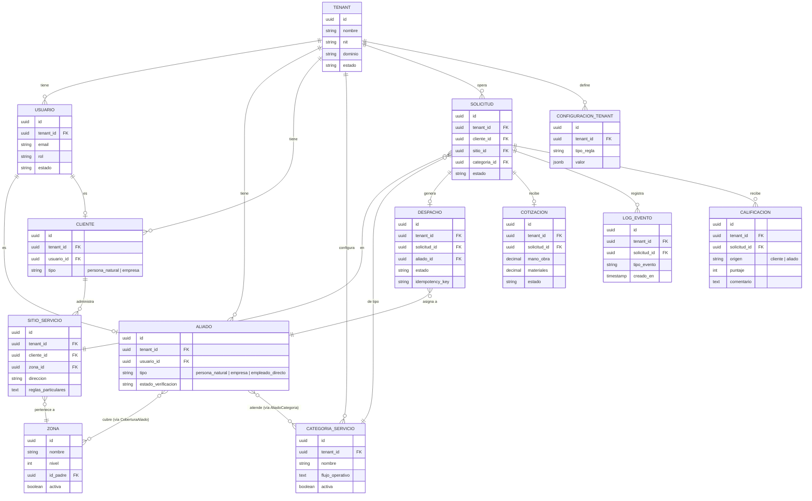

# SAD MANI — Drivers, Atributos de Calidad, Escenarios, ADR Consolidados y Vista de Datos
 
- **Proyecto:** MANI — plataforma multi-tenant de formalización de operaciones de servicio
- **Empresa:** TRAMA · Ingeniería de Software
- **Documento fuente:** Software Architecture Document (SAD) — secciones de diseño de solución
- **Insumos:** SRS_MANI.md, Analisis_de_Requerimientos.md, ADR-0001 a ADR-0011
- **Estado:** Borrador para Mesa de Arquitectura
---
 
## 1. Drivers y killers arquitectónicos
 
**Definiciones de trabajo**
 
- **Driver arquitectónico:** requerimiento cuya satisfacción obliga a decisiones
  estructurales, costosas de revertir, que afectan múltiples componentes del sistema.
- **Killer arquitectónico (riesgo crítico de diseño):** requerimiento que, si se subestima o
  se ignora en el diseño inicial, puede invalidar la arquitectura elegida o forzar un
  rediseño costoso más adelante.
### 1.1 Drivers confirmados
 
| RNF | Requisito | Por qué es driver | Implicación arquitectónica |
| --- | --- | --- | --- |
| **RNF-01** | Aislamiento estricto multi-tenant (Crítica) | Atraviesa modelo de datos, capa de acceso y autenticación en todo el sistema; un error compromete el producto entero | ADR-0011 → Supabase (PostgreSQL) + RLS nativo |
| **RNF-02** | Configurabilidad por tenant sin redeploy (Crítica) | Obliga a que las reglas vivan como datos, no como código, desde el primer sprint | Strategy Pattern + configuración externalizada / rules engine + Feature Toggles |
| **RNF-03** | Idempotencia en operaciones críticas (Alta) | Condiciona el diseño de cada endpoint transaccional del ciclo del servicio (RF-14, RF-17, RF-19) | Idempotency keys + diseño transaccional explícito en Serverpod/Postgres |
| **RNF-05** | Concurrencia determinista en el despacho (Alta) | Es el corazón de RF-14 (sin doble asignación); un error aquí es silencioso y difícil de reproducir | Transacción atómica / bloqueo a nivel de fila en Postgres al resolver la aceptación |
 
### 1.2 Killer candidato
 
| RNF | Requisito | Por qué es killer | Riesgo si se subestima |
| --- | --- | --- | --- |
| **RNF-07** | Concurrencia de usuarios buscando aliados y comunicándose (prioridad Media, riesgo crítico) | Ya señalado en el SRS como riesgo crítico de diseño; su prioridad "Media" esconde un impacto sistémico sobre búsqueda, listados y mensajería a la vez | Si el volumen real de solicitudes concurrentes supera lo asumido, obliga a rediseñar la capa de consulta (caché, índices, réplicas) después de construida |
 
**Amplificadores del riesgo**, tomados de los "vacíos identificados" del Análisis de
Requerimientos: el volumen esperado de tenants y el volumen esperado de solicitudes
concurrentes siguen sin cifra 🔴. Mientras no se conozcan, RNF-07 no puede descartarse como
killer con confianza.
 
**Estado:** pendiente de confirmación formal en la Mesa de Arquitectura, tal como lo pide la
nota 🔴 del Análisis de Requerimientos §5.7.
 
---
 
## 2. Atributos de calidad priorizados
 
| Atributo de calidad (ISO 25010) | RNF relacionados | Prioridad | Justificación |
| --- | --- | --- | --- |
| **Seguridad / Multi-tenancy** | RNF-01, RNF-06, RNF-11 | **Crítica** (RNF-01) | Aislamiento estricto entre tenants; condición no negociable del producto |
| **Modificabilidad / Flexibilidad (Adaptabilidad)** | RNF-02, RNF-10 | **Crítica** (RNF-02) | Cada tenant configura reglas, KYC, tiempos y comisiones sin desarrollo específico |
| **Fiabilidad (Resiliencia)** | RNF-03 | Alta | Operaciones críticas no deben duplicarse ante reintentos |
| **Fiabilidad (Concurrencia)** | RNF-05 | Alta | El despacho debe resolver de forma determinista |
| **Auditabilidad** | RNF-04 | Alta | Trazabilidad del ciclo del servicio; inmutabilidad financiera en 2º incremento |
| **Rendimiento / Flexibilidad (Escalabilidad)** | RNF-07 | Media (prioridad) / **Alta** (como riesgo de diseño) | Concurrencia de búsqueda y mensajería; killer candidato (ver §1.2) |
| **Usabilidad** | RNF-08, RNF-09 | Media / Alta | Interfaz móvil; cobertura por zonas, no por radio (ya resuelto en ADR-0008) |
| **Seguridad / Cumplimiento** | RNF-06, RNF-11 | Alta / Media | Responsabilidad PCI DSS recae en el operador de pagos, no en MANI (2º incremento) |
 
Los cuatro primeros atributos (Seguridad/Multi-tenancy, Modificabilidad, Fiabilidad×2) son
los que impulsan decisiones estructurales tempranas — coinciden con los drivers de §1.1. El
resto son atributos de calidad reales del sistema, pero no obligan a decisiones de
arquitectura tan costosas de revertir en esta etapa.
 
---
 
## 3. Escenarios de calidad (estímulo / respuesta / medida)
 
Formato de seis partes (fuente, estímulo, artefacto, entorno, respuesta, medida), con
énfasis en las tres columnas solicitadas. Los valores numéricos marcados 🔴 quedan como
placeholder hasta que se resuelvan los vacíos de volumen de tenants/solicitudes concurrentes
(Análisis de Requerimientos §7).
 
### 3.1 Seguridad / Aislamiento — RNF-01
 
| Elemento | Descripción |
| --- | --- |
| Fuente | Usuario autenticado de un tenant |
| Estímulo | Solicita datos vía API usando su token válido |
| Artefacto | Capa de acceso a datos (endpoints Serverpod + RLS) |
| Entorno | Operación normal, producción |
| **Respuesta** | El sistema retorna únicamente registros cuyo `tenant_id` coincide con el tenant del token; cualquier intento de acceso cruzado es rechazado a nivel de motor, no solo de aplicación |
| **Medida** | 0 filas de otro tenant expuestas en el 100% de las pruebas de aislamiento automatizadas de QA |
 
### 3.2 Modificabilidad / Configurabilidad — RNF-02
 
| Elemento | Descripción |
| --- | --- |
| Fuente | Administrador del tenant |
| Estímulo | Cambia una regla de negocio (orden del listado, categorías, tarifas, documentos KYC) desde la configuración del tenant |
| Artefacto | Motor de reglas / configuración externalizada |
| Entorno | Producción, en caliente |
| **Respuesta** | El cambio se refleja en el comportamiento del sistema para ese tenant sin nuevo despliegue de código |
| **Medida** | 0 líneas de código modificadas o desplegadas; el cambio es efectivo en 🔴 <definir SLA, propuesta: menos de 5 minutos> |
 
### 3.3 Fiabilidad / Idempotencia — RNF-03
 
| Elemento | Descripción |
| --- | --- |
| Fuente | Cliente o aliado con conexión inestable |
| Estímulo | Reenvía la misma petición de aceptar solicitud, aceptar cotización o calificar (por timeout o reintento automático) |
| Artefacto | Endpoint transaccional del ciclo del servicio |
| Entorno | Producción, red inestable |
| **Respuesta** | El sistema detecta la repetición mediante clave de idempotencia y devuelve el mismo resultado sin duplicar la operación |
| **Medida** | 0 duplicados generados en pruebas de reintento (N reintentos simulados por caso de prueba) |
 
### 3.4 Fiabilidad / Concurrencia en el despacho — RNF-05
 
| Elemento | Descripción |
| --- | --- |
| Fuente | Dos o más aliados |
| Estímulo | Aceptan simultáneamente la misma solicitud de servicio |
| Artefacto | Transacción de asignación en PostgreSQL |
| Entorno | Producción, alta concurrencia |
| **Respuesta** | Exactamente un aliado queda asignado; los demás reciben rechazo determinista, sin condición de carrera |
| **Medida** | 100% de los casos de prueba de concurrencia (N hilos/solicitudes simultáneas) resuelven en una única asignación válida |
 
### 3.5 Rendimiento / Escalabilidad — RNF-07 (killer candidato)
 
| Elemento | Descripción |
| --- | --- |
| Fuente | Carga de usuarios concurrentes |
| Estímulo | Aumento simultáneo de búsquedas de aliados y mensajes en hora pico |
| Artefacto | Capa de consulta / mensajería |
| Entorno | Producción, pico de tráfico |
| **Respuesta** | El sistema mantiene tiempos de respuesta aceptables sin degradar otras operaciones |
| **Medida** | 🔴 Percentil 95 de latencia de búsqueda por debajo de un umbral a definir, con N usuarios concurrentes — pendiente del volumen real de solicitudes (vacío identificado en el SRS) |
 
---
 
## 4. Trade-offs y ADR consolidados
 
> ⚠️ **Contradicción sin resolver, detectada al consolidar este SAD:** ADR-0004, ADR-0005 y
> ADR-0006 describen una arquitectura de **tres repositorios** (cliente Flutter, backend Java
> con Maven/Spring, backend .NET), desplegada en **Azure** con Docker/Kubernetes, instrumentada
> con **SonarQube + OWASP ZAP** y **Prometheus + Grafana + Datadog**. Ninguno de los tres
> menciona Serverpod, un backend en Dart, ni Supabase. Esto es incompatible con **ADR-0011**
> (Aceptado), que fija el backend en Serverpod (Dart) sobre PostgreSQL/Supabase con RLS.
> **No se resuelve en este documento** — corresponde a la Mesa de Arquitectura decidir si
> ADR-0004/0005/0006 quedan obsoletos y se reemplazan (`Reemplazado por ADR-NNNN`, según la
> regla del Gobierno del Equipo §2.6), o si en realidad describen un alcance distinto que no
> se ha explicitado. Mientras tanto, este SAD **no** da por sentado que SonarQube/ZAP y
> Prometheus/Grafana/Datadog aplican tal cual sobre el nuevo backend Dart.
 
| ADR | Título | Decisión | Trade-off asumido | Estado |
| --- | --- | --- | --- | --- |
| **ADR-0001** | Gestión documental: GitHub y OneDrive | ADR/código en GitHub; documentos formales en OneDrive | Documentación formal sin control de versiones tipo Git | Aceptado |
| **ADR-0002** | Herramientas de gestión: Jira | Jira para PO/SM; GitHub retenido para técnico/ADR | Convivencia temporal de dos entornos de gestión | Aceptado |
| **ADR-0003** | Mesa de Arquitectura: terminología, Arquitecto transversal, rotación de ADR | Un solo nombre ("Mesa de Arquitectura"); autoría de ADR rotativa | Curva de aprendizaje de redacción homogénea para todo el equipo | Aceptado |
| **ADR-0004** | Pipeline CI/CD multi-repositorio y promoción de ambientes | GitHub Actions + Jira vía webhooks; promoción develop → release → main en Azure | Tres workflows independientes; dependencia de GitHub Actions y Azure | Aceptado — ⚠️ ver nota de contradicción arriba |
| **ADR-0005** | DevSecOps: SAST (SonarQube) + DAST (OWASP ZAP) | Quality gates automatizados en CI sobre Flutter/Java/.NET | Tiempo de cómputo adicional en pipelines; calibración de falsos positivos | Aceptado — ⚠️ ver nota de contradicción arriba |
| **ADR-0006** | Observabilidad: Prometheus, Grafana, Datadog | Monitoreo híbrido con retroalimentación automática a Jira | Instrumentar Java/.NET; coexistencia de dos herramientas de visualización | Aceptado — ⚠️ ver nota de contradicción arriba |
| **ADR-0007** | Documentación en el repositorio | Carpeta `/docs` versionada en Markdown | Disciplina adicional de edición en Markdown para todo el equipo | Aceptado |
| **ADR-0008** | Carpeta de diagramas | `/docs/diagramas` con subcarpetas c4/flujos; Mermaid versionado como texto | Exportación y subida manual de diagramas de Figma | Aceptado |
| **ADR-0009** | Política de uso de IA | Uso permitido de IA bajo lineamientos; ninguna decisión de arquitectura es oficial sin pasar por la Mesa | Responsabilidad individual de revisar todo contenido generado por IA | Aceptado |
| **ADR-0010** | Tech Radar del proyecto | Radar consolidado (Sí o sí / Tal vez / Mejor no) | Mantenimiento manual tras cada nuevo ADR de tecnología | Aceptado |
| **ADR-0011** | Backend en Dart, motor de persistencia y aislamiento multi-tenant | Serverpod (Dart) + Supabase (PostgreSQL) + RLS nativo | Menor madurez/comunidad de Serverpod; dependencia de Supabase como proveedor gestionado | Aceptado |
| **ADR-0012+** | 🔴 *(espacio reservado)* | *A definir en Sprint 1 y siguientes* | — | Pendiente |
 
*Este documento deja el renglón ADR-0012 en adelante abierto a propósito: según el Gobierno
del Equipo §2.6, ningún ADR se anticipa antes de que la Mesa tome la decisión
correspondiente. Los ADR que resulten de Sprint 1 (por ejemplo, la resolución de la
contradicción señalada arriba) se agregan a esta tabla cuando existan.*
 
---
 
## 5. Vista de datos: modelo conceptual multi-tenant
 
Modelo conceptual (no físico) alineado con RF-01 a RF-19 y con la decisión de ADR-0011
(PostgreSQL/Supabase + RLS). Toda tabla marcada con `tenant_id` queda sujeta a política RLS;
`zona` es catálogo compartido sin `tenant_id`, siguiendo el mismo patrón ya resuelto en
ADR-0008/SP-02.1.1 para el modelo de cobertura.
 

 
### 5.1 Notas de diseño
 
- **Aislamiento (RNF-01):** todas las tablas con `tenant_id` llevan política RLS que filtra
  por el tenant del token autenticado (ADR-0011). `zona` es la única entidad sin `tenant_id`
  porque es un catálogo geográfico compartido; la relación tenant-específica vive en la tabla
  intermedia de cobertura (`AliadoCategoria`/`CoberturaAliado`), no en `zona` misma.
- **Configurabilidad (RNF-02):** `CONFIGURACION_TENANT` almacena reglas como datos (`jsonb`),
  no como código — soporta el patrón de configuración externalizada identificado para
  Flexibilidad/Adaptabilidad (ISO 25010).
- **Idempotencia (RNF-03):** `DESPACHO` incluye `idempotency_key` explícita para soportar
  reintentos sin duplicar asignaciones; el mismo patrón debe replicarse en `COTIZACION` y
  `CALIFICACION` al definir el modelo físico.
- **Concurrencia en el despacho (RNF-05):** la resolución de `DESPACHO` (exactamente un
  aliado asignado) se implementa como transacción atómica sobre esta tabla, no como lógica de
  aplicación distribuida.
- Este modelo es conceptual: nombres de columnas, tipos exactos e índices se definen en el
  modelo físico, fuera del alcance de este documento.
### 5.2 Pendiente
 
- 🔴 Confirmar si `USUARIO` es la tabla base de autenticación (vía Supabase Auth) con
  `ALIADO`/`CLIENTE` como perfiles extendidos, o si Supabase Auth se consume directamente sin
  tabla `USUARIO` propia — depende del diseño de integración de Auth que aún no se ha
  formalizado como ADR.
