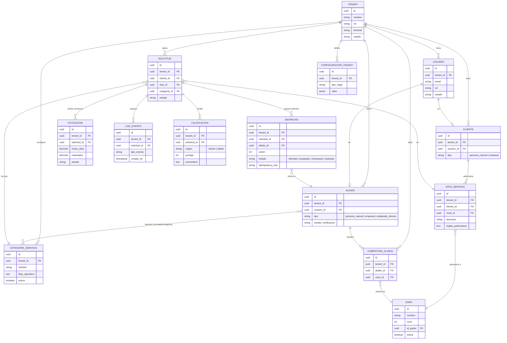

# SAD MANI — V1

- **Proyecto:** MANI — plataforma multi-tenant de formalización de operaciones de servicio
- **Empresa:** TRAMA · Ingeniería de Software
- **Insumos revisados:** SRS_MANI.md, Analisis_de_Requerimientos.md, Product_Backlog_MANI.md,
  Gobierno_del_Equipo.md, Matriz_de_Herramientas.md, ADR-0001 a ADR-0012 (según renumeración
  de esta revisión), presentación TRAMA
- **Estado:** Borrador V1 para Mesa de Arquitectura — **contiene un bloqueante sin resolver**
  (§4, nota A2)

---

## 0. Nota de revisión

Esta versión corrige tres clases de error de la anterior, además de completar el contenido
exigido para SAD V1 que faltaba por completo.

1. **Renumeración de ADR (bloqueante A1).** La versión previa citó "ADR-0011" para
   Serverpod/Supabase/RLS sin haber confirmado que ese número ya estaba tomado por la
   decisión de cobertura por zonas. Corrección aplicada en todo el documento:
   - **ADR-0011 = Modelo de cobertura** (Zona, CoberturaAliado, Sitio) — Aceptado.
   - **ADR-0012 = Backend Dart, persistencia y aislamiento multi-tenant** (Serverpod +
     Supabase + RLS) — el archivo correspondiente conserva un encabezado interno que dice
     "ADR-0011"; queda señalado como pendiente de corrección de nombre de archivo/encabezado,
     no de contenido.
   - Las citas a "ADR-0008" como origen de la decisión de cobertura en la versión anterior
     eran incorrectas: ADR-0008 es la carpeta de diagramas. Corregidas a ADR-0011.
2. **Contradicciones internas corregidas (B1, B2, B5).** Detalladas en cada sección.
3. **Contenido faltante agregado (A3):** Arquitectura de Alto Nivel (§6), Arquitectura de
   Negocio (§7) y Arquitectura de Infraestructura (§8). Esta última **se declara
   explícitamente bloqueada**, no se rellena con supuestos — ver §8.
4. Los hallazgos sobre el SRS (RF de cierre faltante, RF de catálogo de zonas faltante,
   restricciones sin identificador, RNF mal tipificados) **no se corrigen en este
   documento**: pertenecen al SRS y al Product Backlog, con dueños distintos al SAD. Quedan
   listados en §9 para que se les dé seguimiento donde corresponde.

---

## 1. Drivers y killers arquitectónicos

**Nota de terminología:** el SRS §5.7 usa "riesgo crítico de diseño"; este documento usaba
"killer candidato" para lo mismo. Se unifica aquí al término del SRS, que es el documento de
origen, con la equivalencia declarada una sola vez.

**Definiciones de trabajo**

- **Driver arquitectónico:** requerimiento cuya satisfacción obliga a decisiones
  estructurales, costosas de revertir, que afectan múltiples componentes del sistema.
- **Riesgo crítico de diseño** (equivalente a "killer" en literatura ADD): requerimiento que,
  si se subestima o se ignora en el diseño inicial, puede invalidar la arquitectura elegida.

### 1.1 Drivers confirmados

| RNF | Requisito | Por qué es driver | Estado del respaldo arquitectónico |
| --- | --- | --- | --- |
| **RNF-01** | Aislamiento estricto multi-tenant (Crítica) | Atraviesa modelo de datos, capa de acceso y autenticación en todo el sistema | ADR-0012 → Supabase (PostgreSQL) + RLS nativo (Aceptado) |
| **RNF-02** | Configurabilidad por tenant sin redeploy (Crítica) | Obliga a que las reglas vivan como datos, no como código, desde el primer sprint | ⚠️ **Sin ADR.** Strategy Pattern, configuración externalizada y Feature Toggles son propuesta de este SAD, no decisión de la Mesa (ver B2 en §4) |
| **RNF-03** | Idempotencia en operaciones críticas (Alta) | Condiciona el diseño de cada endpoint transaccional del ciclo del servicio | ⚠️ **Sin ADR.** Idempotency keys es propuesta, no decisión |
| **RNF-05** | Concurrencia determinista en el despacho (Alta) | Es el corazón de RF-14 (sin doble asignación) | Depende de SP-04.1.1/SP-04.1.2, condicional y no iniciado (ver historial de este proyecto) |

### 1.2 Riesgo crítico de diseño

| RNF | Requisito | Por qué es riesgo crítico | Amplificador |
| --- | --- | --- | --- |
| **RNF-07** | Concurrencia de usuarios buscando aliados y comunicándose (prioridad Media) | El SRS §5.7 lo señala explícitamente; su prioridad "Media" esconde impacto sistémico sobre búsqueda, listados y mensajería | Volumen de tenants y de solicitudes concurrentes sin cifra (Análisis de Requerimientos §7) |

**Estado:** pendiente de confirmación formal en la Mesa, tal como pide el SRS §5.7.

---

## 2. Atributos de calidad priorizados

**Corrección aplicada (C7):** el SRS §5.6 agrupa RNF-01, RNF-06 y RNF-11 bajo una sola fila
"Seguridad / Multi-tenancy", pero el propio SRS §5.1 los define en categorías distintas
("Seguridad / Multi-tenancy" para RNF-01; "Seguridad / Cumplimiento" para RNF-06 y RNF-11).
Este SAD sigue la clasificación detallada del §5.1, no el resumen del §5.6, porque RNF-06 y
RNF-11 son requisitos de pagos del 2º incremento sin relación con multi-tenancy.

| Atributo de calidad (ISO 25010) | RNF relacionados | Prioridad | Justificación |
| --- | --- | --- | --- |
| **Seguridad / Multi-tenancy** | RNF-01 | **Crítica** | Aislamiento estricto entre tenants |
| **Modificabilidad / Flexibilidad (Adaptabilidad)** | RNF-02, RNF-10 | **Crítica** (RNF-02) | Reglas y KYC configurables por tenant sin desarrollo específico. Patrones candidatos (⚠️ sin ADR, ver §4 B2): Strategy Pattern, configuración externalizada, Feature Toggles (RNF-10/RF-10) |
| **Fiabilidad (Resiliencia)** | RNF-03 | Alta | Operaciones críticas no deben duplicarse ante reintentos |
| **Fiabilidad (Concurrencia)** | RNF-05 | Alta | El despacho debe resolver de forma determinista |
| **Auditabilidad** | RNF-04 | Alta | Trazabilidad del ciclo del servicio; inmutabilidad financiera en 2º incremento |
| **Rendimiento / Escalabilidad** | RNF-07 | Media (prioridad) / **Alta** (como riesgo de diseño) | Ver §1.2 |
| **Usabilidad** | RNF-08 | Media | Interfaz móvil |
| **Restricción del producto (no es atributo de calidad ISO 25010)** | RNF-09 | Alta | ⚠️ Cobertura por zonas, no radio, ya está registrada como restricción de producto en el SRS §7 y **también** clasificada como RNF "Usabilidad/Modelo de datos" en §5.5 — "Modelo de datos" no es categoría ISO 25010. Este SAD la trata como restricción (ya resuelta por ADR-0011), no como atributo de calidad, y deja la duplicación en el SRS señalada en §9 para que el equipo de requerimientos la corrija ahí |
| **Seguridad / Cumplimiento (2º incremento)** | RNF-06, RNF-11 | Alta / Media | Responsabilidad PCI DSS del operador de pagos; fuera del MVP. Ninguno de los dos es un atributo verificable del sistema en construcción — son asignación de responsabilidad contractual (RNF-06) y decisión de diseño (RNF-11), no requisitos de calidad medibles. Señalado también en §9 para el SRS |

---

## 3. Escenarios de calidad (estímulo / respuesta / medida)

Sin cambios de fondo respecto a la versión anterior salvo referencias corregidas. Formato de
seis partes; valores 🔴 son placeholder hasta resolver los vacíos de volumen de tenants y de
solicitudes concurrentes (Análisis de Requerimientos §7).

### 3.1 Seguridad / Aislamiento — RNF-01

| Elemento | Descripción |
| --- | --- |
| Fuente | Usuario autenticado de un tenant |
| Estímulo | Solicita datos vía API usando su token válido |
| Artefacto | Capa de acceso a datos (endpoints Serverpod + RLS, ADR-0012) |
| Entorno | Operación normal, producción |
| **Respuesta** | El sistema retorna únicamente registros cuyo `tenant_id` coincide con el tenant del token; el rechazo ocurre a nivel de motor, no solo de aplicación |
| **Medida** | 0 filas de otro tenant expuestas en el 100% de las pruebas de aislamiento automatizadas de QA (pgTAP, ver Modelo de Datos §2.6) |
| Caso de verificación | Bug previsible B-01.2.1 |

### 3.2 Modificabilidad / Configurabilidad — RNF-02

| Elemento | Descripción |
| --- | --- |
| Fuente | Administrador del tenant |
| Estímulo | Cambia una regla de negocio o activa/desactiva una categoría de servicio |
| Artefacto | Motor de reglas / configuración externalizada + Feature Toggles (⚠️ propuesta, sin ADR) |
| Entorno | Producción, en caliente |
| **Respuesta** | El cambio se refleja sin nuevo despliegue de código |
| **Medida** | 0 líneas de código desplegadas; SLA de propagación 🔴 sin dueño asignado (propuesta: <5 min) |
| Historias relacionadas | US-01.1.2, US-01.1.3, US-03.1.1 |

### 3.3 Fiabilidad / Idempotencia — RNF-03

| Elemento | Descripción |
| --- | --- |
| Fuente | Cliente o aliado con conexión inestable |
| Estímulo | Reenvía la misma petición de aceptar solicitud, aceptar cotización o calificar |
| Artefacto | Endpoint transaccional del ciclo del servicio |
| Entorno | Producción, red inestable |
| **Respuesta** | Clave de idempotencia evita duplicar la operación |
| **Medida** | 0 duplicados en N reintentos simulados |

### 3.4 Fiabilidad / Concurrencia en el despacho — RNF-05

| Elemento | Descripción |
| --- | --- |
| Fuente | Dos o más aliados |
| Estímulo | Aceptan simultáneamente la misma solicitud |
| Artefacto | Transacción de asignación en PostgreSQL |
| Entorno | Producción, alta concurrencia |
| **Respuesta** | Exactamente un aliado queda asignado por solicitud, sin condición de carrera |
| **Medida** | 100% de los casos de prueba de concurrencia resuelven en una única asignación aceptada |
| Caso de verificación | Bug previsible B-04.1.2 |
| Estado del diseño | Ver Modelo de Datos §3.10 (rediseñado en esta revisión, ver §5.4 más abajo) |

### 3.5 Rendimiento / Escalabilidad — RNF-07 (riesgo crítico de diseño)

| Elemento | Descripción |
| --- | --- |
| Fuente | Carga de usuarios concurrentes |
| Estímulo | Aumento simultáneo de búsquedas de aliados y mensajes en hora pico |
| Artefacto | Capa de consulta / mensajería |
| Entorno | Producción, pico de tráfico |
| **Respuesta** | Tiempos de respuesta aceptables sin degradar otras operaciones |
| **Medida** | 🔴 Percentil 95 de latencia — no es un escenario de calidad cerrado todavía, es una intención: sin cifra de volumen (vacío del SRS §7), no hay medida verificable. Esta pregunta corresponde al cliente, no a la Mesa |

---

## 4. Trade-offs y ADR consolidados

> ⚠️ **A2 — Bloqueante que este SAD no puede resolver, reportado por el equipo, no
> verificado por mí en un documento de curso al que no tengo acceso.** Se me informó que el
> syllabus del curso exige, para esta entrega, evidencia de tecnologías **JEE** y **.NET** y
> de **integración entre ambas**. Si eso es correcto, **ningún ADR de este proyecto lo
> satisface**: ni ADR-0004/0005/0006 (que sí mencionan Java y .NET, pero sin evidencia de
> integración entre ellos, y contradicen ADR-0012), ni ADR-0012 (Dart/Serverpod/Supabase, que
> no usa ninguna de las dos plataformas). **Esto no se resuelve escribiendo el SAD distinto
> — requiere que la Mesa reabra ADR-0011/0012 (numeración de esta revisión) con la
> restricción del syllabus explícitamente sobre la mesa**, y que el SRS §6 incorpore esa
> restricción de plataforma, que hoy no está documentada allí (solo hay restricciones de
> proceso: Scrum, 7 integrantes, esquema documental). Sin ese registro, nada obligó a
> ADR-0011/0012 a considerar JEE/.NET como alternativa, y por eso se aprobaron sin fricción.

> ⚠️ **B1 corregido.** La versión anterior de este SAD declaraba en su §4 que "no daba por
> sentado" el stack de SonarQube/ZAP/Prometheus/Grafana/Datadog, y en el resto del documento
> (drivers, escenarios, vista de datos) escribía como si Serverpod/Supabase/PostgreSQL ya
> estuvieran decididos sin reservas. Este documento sostiene una sola postura: **ADR-0012
> está Aceptado y se usa como base de diseño en todo el SAD**, pero **queda literalmente
> bloqueado por A2** hasta que la Mesa lo reabra. No se sostienen las dos posturas a la vez.

| ADR | Título | Decisión | Trade-off asumido | Estado |
| --- | --- | --- | --- | --- |
| **ADR-0001** | Gestión documental: GitHub y OneDrive | ADR/código en GitHub; documentos formales en OneDrive | Documentación formal sin control de versiones tipo Git | Aceptado |
| **ADR-0002** | Herramientas de gestión: Jira | Jira para PO/SM; GitHub retenido para técnico/ADR | Convivencia temporal de dos entornos | Aceptado |
| **ADR-0003** | Mesa de Arquitectura: terminología, rotación de ADR | Un solo nombre; autoría rotativa | Curva de aprendizaje homogénea | Aceptado |
| **ADR-0004** | Pipeline CI/CD multi-repositorio | GitHub Actions + Jira; 3 repos (Flutter, Java, .NET), Azure | Tres workflows independientes | Aceptado — ⚠️ dos líneas "Estado" con fechas distintas (08-19 y 08-24) en el archivo fuente: viola la regla de estado único de la plantilla y del Gobierno §2.6. Corregir a una sola línea. ⚠️ Contradice ADR-0012 (ver A2) |
| **ADR-0005** | DevSecOps: SonarQube + OWASP ZAP | Quality gates sobre Flutter/Java/.NET | Tiempo de cómputo adicional | Aceptado — ⚠️ contradice ADR-0012 (ver A2) |
| **ADR-0006** | Observabilidad: Prometheus, Grafana, Datadog | Monitoreo sobre Java Spring/.NET | Instrumentar dos plataformas | Aceptado — ⚠️ contradice ADR-0012 (ver A2) |
| **ADR-0007** | Documentación en el repositorio | Carpeta `/docs` versionada en Markdown | Disciplina de edición Markdown | Aceptado |
| **ADR-0008** | Carpeta de diagramas | `/docs/diagramas`, Mermaid versionado como texto | Exportación manual desde Figma | Aceptado |
| **ADR-0009** | Política de uso de IA | Uso permitido bajo lineamientos; nada oficial sin pasar por la Mesa | Responsabilidad individual de revisión | Aceptado |
| **ADR-0010** | Tech Radar del proyecto | Radar consolidado | — | ⚠️ **Estado incierto tras esta revisión.** La Matriz de Herramientas vigente afirma explícitamente que *"el Tech Radar... todavía no es una decisión tomada y no tiene ADR"* (sección "Tech Radar" del documento). Si existe un ADR-0010 Aceptado en el repositorio real que contradice esa afirmación de la Matriz, uno de los dos documentos está desactualizado. No lo resuelvo aquí — lo marco para que se confirme cuál de los dos es la fuente vigente |
| **ADR-0011** | Modelo de cobertura | Catálogo de zonas (`Zona`, `CoberturaAliado`, `Sitio`), cobertura declarada con `tenant_id` obligatorio | (según archivo fuente) | Aceptado |
| **ADR-0012** | Backend Dart, motor de persistencia y aislamiento multi-tenant | Serverpod (Dart) + Supabase (PostgreSQL) + RLS nativo | Menor madurez de Serverpod; dependencia de Supabase | Aceptado — ⚠️ el archivo conserva encabezado interno "ADR-0011" (colisión de nombre, ver §0.1); ⚠️ bloqueado por A2 hasta reapertura en la Mesa |
| **ADR-0013+** | 🔴 *(espacio reservado)* | *A definir en Sprint 1 y siguientes* | — | Pendiente |

**Matriz de Herramientas sin actualizar:** sigue asignando a Backend "NestJS + MongoDB —
Evaluar" en vez de reflejar ADR-0012. No se actualiza mientras A2 esté abierto: no tiene
sentido fijar la Matriz sobre una decisión que puede revertirse en la Mesa.

*El renglón ADR-0013 en adelante queda abierto a propósito, según Gobierno del Equipo §2.6.*

---

## 5. Vista de datos: modelo conceptual multi-tenant

### 5.1 Correcciones aplicadas en esta revisión (B3, B4, B5)

- **B3 — Confusión de tablas corregida.** La versión anterior escribió "la tabla intermedia
  de cobertura (`AliadoCategoria`/`CoberturaAliado`)" como si fueran intercambiables. No lo
  son: `AliadoCategoria` resuelve RF-11 (qué categorías atiende un aliado);
  `CoberturaAliado` resuelve RF-07 (qué zonas cubre un aliado). Ambas existen en el modelo,
  cada una con su propósito.
- **B4 — `CoberturaAliado` ahora es entidad explícita**, no solo una relación con nota al
  margen, tal como exige ADR-0011 (cobertura) §5: tres entidades en el modelo — `Zona`,
  `CoberturaAliado`, `Sitio`. Incluye `tenant_id` propio (ADR-0011 §2.6 lo exige
  explícitamente para la cobertura declarada).
- **B5 — Cardinalidades corregidas, con rediseño real, no solo de notación:**
  - `SOLICITUD` a `COTIZACION`: pasa de `||--o|` a `||--o{`. RF-17 permite solicitar ajustes,
    lo que implica varias versiones de cotización por solicitud. El Modelo de Datos (§3.11 de
    ese documento) ya lo tenía bien — la inconsistencia estaba solo en el diagrama de este
    SAD, ahora corregida.
  - `SOLICITUD` a `DESPACHO`: pasa de `||--o|` a `||--o{`, y **la tabla `despacho` se
    rediseña** (no solo el diagrama). RF-13 define un listado ordenado de candidatos y RF-14
    permite que un aliado rechace, lo que implica varios intentos de despacho por solicitud,
    no uno. El diseño anterior (una sola fila por solicitud, `aliado_id` nulo hasta
    asignarse) no podía representar "se le ofreció al aliado 1, rechazó, se le ofrece al
    aliado 2" — con esa cardinalidad, RNF-05 no era modelable, como señala correctamente la
    revisión. El rediseño queda en §5.4.

### 5.2 Alcance real de Sprint 1

Sin cambios: 5 historias candidatas (US-01.1.1, US-01.1.2, US-01.2.1, US-01.2.2, US-01.2.3),
contingentes a SP-01.1.1 (resuelto vía ADR-0012, hoy bloqueado por A2) y SP-01.2.1 (proveedor
de identidad, sigue abierto).

### 5.3 Actores y sistemas externos (contexto)

Cliente, Aliado, Administrador de tenant, Administrador de plataforma. Sistemas externos sin
ADR: operador de pagos (2º incremento), proveedor de identidad (SP-01.2.1, abierto), servicio
de notificaciones.

### 5.4 Modelo conceptual (corregido)

**Nota sobre `DESPACHO` rediseñado:** ahora cada intento de oferta a un candidato es una fila
(`orden` = posición en el listado de RF-13); se garantiza *exactamente una* fila `aceptado`
por `solicitud_id` mediante un índice único parcial, no mediante una FK 1:1. El detalle
transaccional completo (incluida la corrección equivalente en el Modelo de Datos físico) está
en el documento `Modelo-de-Datos-MANI.md`, actualizado en esta misma revisión.

### 5.5 Pendientes confirmados

- 🔴 SP-01.2.1 (proveedor de identidad) sigue abierto.
- 🔴 Volumen de tenants y de solicitudes concurrentes sin cifra.
- 🔴 Los tres sistemas externos de §5.3 siguen sin spike/ADR, salvo identidad (en curso).
- ⚠️ Todo este modelo depende de que A2 se resuelva a favor de mantener Dart/Serverpod/
  Supabase. Si la Mesa revierte ADR-0012, este modelo conceptual deja de aplicar.

---

## 6. Arquitectura de alto nivel (HLD)

Nivel de Contenedores (C4 nivel 2), condicionado por A2: describe la arquitectura **si**
ADR-0012 se mantiene tras la reapertura en la Mesa.

| Contenedor | Responsabilidad | Tecnología (ADR-0012, bloqueado por A2) |
| --- | --- | --- |
| App cliente | UI para Cliente, Aliado, Admin. tenant, Admin. plataforma | Flutter (Dart) |
| Backend de aplicación | Lógica de negocio, orquestación del ciclo del servicio, control de concurrencia del despacho | Serverpod (Dart) |
| Base de datos | Persistencia, aislamiento multi-tenant vía RLS | PostgreSQL gestionado por Supabase |
| Autenticación | Emisión de tokens, claims de tenant/rol | Supabase Auth (🔴 condicionado a SP-01.2.1) |
| Almacenamiento de archivos | Documentos KYC de aliados | Supabase Storage (🔴 sin ADR — relacionado con SP-02.1.2) |

**Relaciones:** el cliente Flutter llama al backend Serverpod vía API; el backend accede a
PostgreSQL con las políticas RLS de la §2 del Modelo de Datos; la autenticación se resuelve
contra Supabase Auth y su resultado (incluido `tenant_id` en `app_metadata`) viaja en el
token que el backend valida en cada request.

**Advertencia explícita:** este HLD es válido únicamente bajo el supuesto de que Dart/
Serverpod/Supabase se sostiene después de resolver A2. No se construye un HLD alternativo
para JEE/.NET porque este equipo no ha diseñado esa opción — hacerlo sin que la Mesa la haya
evaluado repetiría exactamente el error que causó A2 (una decisión de arquitectura sin pasar
por la Mesa).

---

## 7. Arquitectura de negocio

Deriva directamente del SRS §3 (funciones principales) y §3.1 (matriz de actores), sin
información nueva — se consolida aquí porque SAD V1 lo exige como sección propia.

**Procesos de negocio principales (alineados a RF-12–RF-19, ciclo del servicio):**

1. Registro y configuración de tenant (RF-01, RF-02).
2. Alta y verificación de aliados y clientes (RF-05–RF-09).
3. Configuración de catálogo de servicios y cobertura (RF-10, RF-11, y ADR-0011).
4. Ciclo del servicio: solicitud → despacho → cotización → ejecución → calificación → *(cierre,
   ver nota abajo)* (RF-12–RF-19).
5. Mensajería asociada al servicio (RF-20, RF-21).
6. Tarifario de referencia (RF-22, RF-23).

**Nota heredada del SRS, no resuelta aquí:** el ciclo se describe en el SRS §2/§3 como
*solicitud → cotización → ejecución → calificación → cierre*, pero no existe un RF de cierre
explícito en §4.4 (cuatro etapas, no cinco). Esto es un hueco del SRS, no del SAD — se deja
registrado en §9 para que el equipo de requerimientos lo cierre, porque la arquitectura de
negocio no puede completarse con un paso del proceso sin requisito que lo respalde.

**Roles de negocio (Gobierno del Equipo §1.1, matriz de actores del SRS §3.1):** Cliente,
Aliado, Administrador de tenant, Administrador de plataforma — sin ambigüedad de quién decide
qué (ver matriz de actores por función del SRS).

---

## 8. Arquitectura de infraestructura

**Declarada explícitamente incompleta para V1, con motivo — no se rellena con supuestos.**

No es posible diseñar de forma responsable la infraestructura de despliegue mientras A2 esté
abierto: ADR-0004 (pipeline multi-repositorio), ADR-0005 (SAST/DAST) y ADR-0006
(observabilidad) describen infraestructura para tres repositorios sobre Java/.NET/Azure, que
contradice el stack de ADR-0012. Diseñar una infraestructura para Dart/Serverpod/Supabase
ahora, sin que la Mesa haya resuelto cuál stack es el vigente, sería exactamente el mismo
error que produjo la contradicción original: una decisión de arquitectura sin pasar por la
Mesa.

**Lo único que se puede fijar hoy sin depender de A2** (procesos, no tecnología de producto):

- Ambientes: DEV, QA, PROD (Gobierno del Equipo §2.2).
- Flujo de ramas y PR (Gobierno del Equipo §2.3).
- Contenerización de ambientes DEV/QA con Docker/Docker Compose (adoptada, "Probar" en el
  Tech Radar informal — ver nota de estado incierto de ADR-0010 en §4).
- Orquestación (Kubernetes): sin driver de calidad que lo justifique todavía (Matriz de
  Herramientas, punto 4 de "Incompatibilidades"); no se incluye aquí hasta que la Mesa lo
  resuelva.

**Queda para V2 de este SAD, condicionado a la resolución de A2:** diagrama de despliegue
completo, estrategia de escalado, y el mapeo de ADR-0004/0005/0006 (si sobreviven la
reapertura) o su reemplazo formal.

---

## 9. Hallazgos fuera del alcance del SAD, con dueño distinto

No se corrigen en este documento porque pertenecen a otros artefactos. Se listan para
seguimiento:

**SRS (dueño: equipo de requerimientos / PO):**
- Falta RF de cierre del servicio (ver §7).
- RF-19 no define qué pasa si una parte nunca califica (bloqueo indefinido sin regla de
  vencimiento ni cierre administrativo).
- Falta RF que asigne la administración del catálogo de zonas al administrador de plataforma
  (ADR-0011 reconoce que este trabajo no estaba contemplado).
- RF-08/RF-09 no exigen `zona` en el sitio de servicio, aunque ADR-0011 §2.3 la declara
  obligatoria y el modelo de datos ya la modela como tal — el SRS quedó atrás del ADR.
- Restricciones del producto (§7 del SRS) no tienen identificador (`REST-01`, etc.), a
  diferencia de las restricciones del proyecto (Análisis de Requerimientos §6, que sí usa
  `PROY-01`...`PROY-06`). ADR-0011 ya cita "REST-01, origen C-08" como si existiera en el
  SRS; hoy no existe.
- RNF-09, RNF-06 y RNF-11 mal tipificados como atributos de calidad ISO 25010 cuando son
  restricción de producto (RNF-09, ya duplicada en §7) o asignación de responsabilidad
  contractual (RNF-06, RNF-11) — ver también §2 de este SAD.
- RNF-06 y RNF-11 sin marca de "2º incremento" en su fila, a diferencia de los RF
  equivalentes (RF-24/RF-25) que sí la llevan.
- El SRS contiene estimaciones en puntos de historia que también viven en el Product
  Backlog — riesgo de desincronización en el primer refinamiento; definir cuál es la fuente
  de verdad es responsabilidad del Scrum Master.

**Gestión de ADR (dueño: rotación de autoría, ADR-0003):**
- Renumeración de archivo/encabezado de ADR-0012 (§0.1).
- Corrección de la doble línea "Estado" en ADR-0004.
- Confirmar el estado real de ADR-0010 (Tech Radar) — contradicción entre la Matriz de
  Herramientas y el contenido de ADR-0010 detectada en §4, no resuelta aquí.

**Mesa de Arquitectura (dueño: todo el equipo técnico):**
- A2 — el único punto que puede invalidar este SAD completo. Ficha previa y reapertura de
  ADR-0011/0012 con la restricción de plataforma explícita, como pide el proceso de
  ADR-0003.
