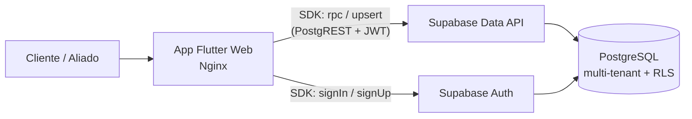
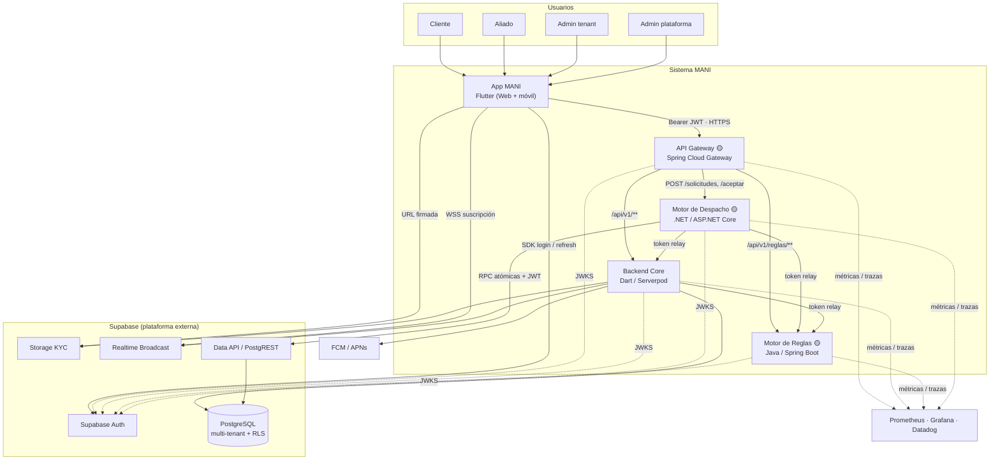
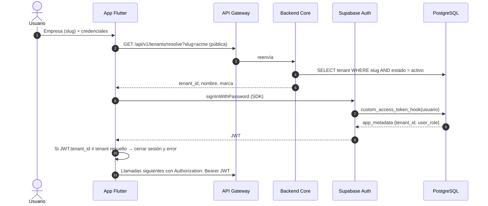
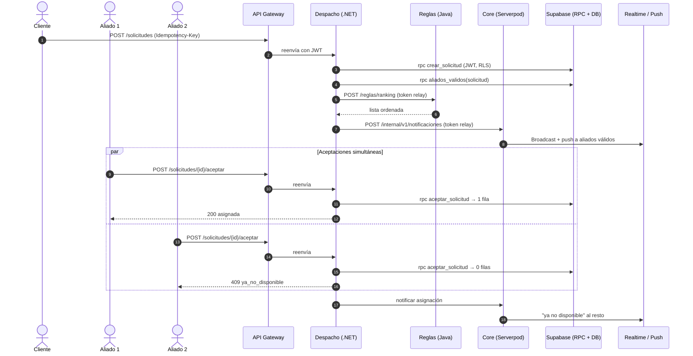
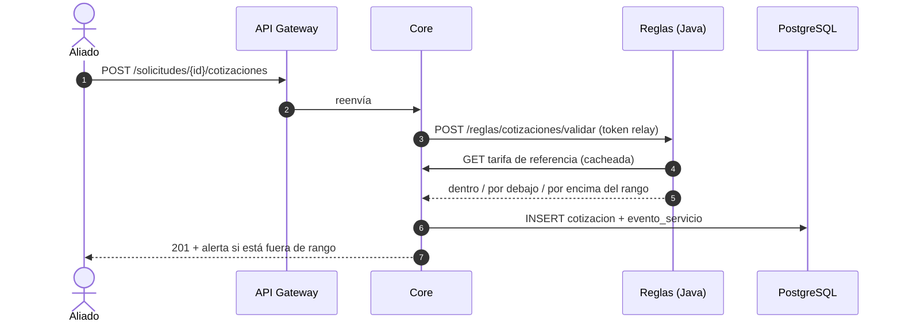

# MANI SDD — Documento de Diseño de Software (Arquitectura)

| Metadato | Valor |
| :--- | :--- |
| **Proyecto** | MANI — Plataforma SaaS multi-tenant de formalización de servicios |
| **Organización** | TRAMA · Ingeniería de Software |
| **Documento** | SDD — Arquitectura objetivo, estado actual y brechas |
| **Versión** | 0.1 (borrador para Mesa de Arquitectura) |
| **Fecha** | 2026-09-22 |
| **Fuentes** | ADR-0001..0024, SRS V3, SAD-MANI.md, DD-MANI.md, Modelo_Datos_MANI.md, DOC-08, código de `MANI-Flutter` (ramas `develop` y `release`) |
| **Modelo C4** | `Diagramas/c4/workspace-as-built.dsl` (ADR-0024) |
| **Nota** | Borrador preparado con asistencia de IA (ADR-0009). Las secciones marcadas **🟡 Propuesta** llenan vacíos de los ADR y requieren ratificación de la Mesa antes de implementarse (PROY-05). |

---

## Control de versiones

| Versión | Fecha | Descripción | Estado |
| :---: | :---: | :--- | :---: |
| 0.1 | 2026-09-22 | Consolidación de ADR + estado real del código. Propone API Gateway (ADR-0025) y alcance de los módulos Java y .NET (ADR-0026). | Borrador |

---

## Convenciones de este documento

| Marca | Significado |
| :--- | :--- |
| 🟢 **Decidido** | Respaldado por un ADR en estado *Aceptado*. |
| 🔵 **Propuesto (ADR)** | Respaldado por un ADR en estado *Propuesto*. |
| 🟡 **Propuesta (este SDD)** | Vacío que los ADR no resuelven; este documento propone una solución. Requiere ADR nuevo. |
| ✅ / ◐ / ⬜ | Estado en código: implementado / parcial / no existe. |

---

## Índice

1. [Propósito y alcance](#1-propósito-y-alcance)
2. [Drivers y restricciones](#2-drivers-y-restricciones)
3. [Estado actual (as-is) según el código](#3-estado-actual-as-is-según-el-código)
4. [Arquitectura objetivo (to-be)](#4-arquitectura-objetivo-to-be)
5. [API Gateway 🟡](#5-api-gateway-)
6. [Definición de los módulos Java y .NET 🟡](#6-definición-de-los-módulos-java-y-net-)
7. [Reparto de requisitos por servicio](#7-reparto-de-requisitos-por-servicio)
8. [Flujos clave](#8-flujos-clave)
9. [Seguridad y aislamiento multi-tenant](#9-seguridad-y-aislamiento-multi-tenant)
10. [Datos y propiedad de datos](#10-datos-y-propiedad-de-datos)
11. [Comunicación entre servicios](#11-comunicación-entre-servicios)
12. [Despliegue y ambientes](#12-despliegue-y-ambientes)
13. [Observabilidad](#13-observabilidad)
14. [Brechas y plan de cierre](#14-brechas-y-plan-de-cierre)
15. [Decisiones pendientes para la Mesa](#15-decisiones-pendientes-para-la-mesa)
16. [Riesgos](#16-riesgos)

---

## 1. Propósito y alcance

Este SDD define **cómo se construye MANI**: qué contenedores existen, qué responsabilidad tiene cada uno, cómo se comunican y qué garantiza el aislamiento entre tenants. Consolida decisiones que hoy están dispersas en 24 ADR, el SAD y el DD, las contrasta con lo que el código realmente implementa y **cierra dos vacíos**:

1. No existe un punto de entrada único entre el cliente Flutter y los tres backends (Serverpod, Java, .NET). ADR-0022 menciona un "Contenedor API Gateway" en su trazabilidad, pero ningún ADR lo decide.
2. PROY-07 exige Java y .NET, y los ADR les asignan etiquetas genéricas ("reglas de negocio", "transaccional de alta concurrencia") sin definir **qué** hace cada uno.

Alcance: MVP (EP-01..EP-06, RF-01..RF-23). El 2º incremento (pagos, quejas, consola comercial) queda fuera (PROY-02).

---

## 2. Drivers y restricciones

### 2.1 Atributos de calidad que dirigen la arquitectura

| ID | Driver | Consecuencia arquitectónica |
| :--- | :--- | :--- |
| RNF-01 / REST-04 | Aislamiento estricto entre tenants, incluidos archivos | Tenant en el JWT (ADR-0018) + RLS en Postgres (ADR-0012) + ruta KYC por tenant (ADR-0013) |
| RNF-05 / RF-14 | Exactamente una asignación por solicitud ante aceptaciones concurrentes | `UPDATE` condicional atómico (ADR-0021, validado en PoC-001) |
| RNF-03 | Operaciones críticas resistentes a reintentos | Idempotencia en aceptar, cotizar y calificar (DD §7) |
| RNF-07 | Concurrencia en búsqueda de aliados y comunicación | Despacho broadcast (ADR-0016) + Realtime (ADR-0017) |
| RNF-02 / RNF-10 / REST-05 | Cada tenant configura sus reglas sin despliegue | Motor de reglas parametrizable por tenant (§6.1) |
| RNF-04 | Trazabilidad del ciclo del servicio | `evento_servicio` append-only + logs estructurados con `trace_id` y `tenant_id` |

### 2.2 Restricciones

| ID | Restricción | Fuente |
| :--- | :--- | :--- |
| PROY-07 | Java y .NET deben existir en algún módulo del backend | SRS |
| PROY-08 | Kubernetes como orquestador (requisito curricular) | SRS — **en tensión con ADR-0023 (Railway)**, ver §15 |
| Costo | Sin costos fijos de nube; capas gratuitas | ADR-0019, DOC-08 |
| REST-01 | Cobertura por zonas del catálogo, sin geolocalización | ADR-0011 |
| PROY-05 | Decisiones costosas de revertir pasan por Mesa y ADR | SRS |

---

## 3. Estado actual (as-is) según el código

Revisión de `MANI-Flutter` al 2026-09-22. `main` contiene solo la plantilla "Flutter Demo"; el código real vive en `develop` y las PoC en `release`.

### 3.1 Qué existe

| Pieza | Estado | Evidencia |
| :--- | :---: | :--- |
| App Flutter (Web) con Clean Architecture por feature, `get_it`, `go_router`, `flutter_bloc` | ✅ | `lib/core`, `lib/features/*` |
| Login y registro (cliente, aliado técnico, aliado empresa) | ✅ | `features/auth` |
| Declaración de cobertura del aliado | ✅ | `features/profiles/coverage` |
| Aceptación de solicitud | ◐ | `features/asignacion`: repositorio **en memoria** |
| Bandeja de verificación de aliados | ◐ | Test de integración existe; el código de `lib/features/profiles/verification` **no está en ningún branch** |
| Esquema de 17 tablas + RLS + funciones de registro y verificación | ✅ | `database/init`, `database/migrations` |
| Hook de claims `custom_access_token_hook` | ◐ | Solo PoC en `release` (`supabase/poc-cfg12`) |
| RPC `aceptar_solicitud` (UPDATE condicional) | ◐ | Solo PoC en `release` (`supabase/poc-cfg09`) |
| Bucket KYC `kyc-documentos` + `kyc_isolation` | ◐ | Solo PoC en `release` (`supabase/poc-cfg13`); la app **no sube** archivos |
| RPC de cobertura (`listar_zonas`, `declarar_cobertura`…) | ◐ | La app las llama; su SQL **no está versionado** |
| Nginx + Docker + GHCR + CI (format, analyze, test, Sonar en `main`) | ✅ | `Dockerfile`, `nginx.conf`, `.github/workflows` |
| Suite QA (k6, Newman, cargas KYC) | ✅ | `qa/` en `release` |
| Backend Serverpod | ⬜ | — |
| Servicio Java / servicio .NET | ⬜ | — |
| API Gateway | ⬜ | — |
| Realtime, push, observabilidad | ⬜ | — |

### 3.2 Cómo funciona hoy



La app habla **directo** con Supabase. Esto es el estilo *Serverless/BaaS puro* que **ADR-0019 descartó** (vendor lock-in, lógica de negocio en el cliente). Es aceptable como andamiaje del Sprint 1–2, pero debe migrarse (§14).

---

## 4. Arquitectura objetivo (to-be)

### 4.1 Estilo

🟢 **Distribuido orientado a servicios multi-tenant** (ADR-0019): cliente Flutter, backends desacoplados desplegados de forma independiente y persistencia multi-tenant en Supabase/PostgreSQL con RLS.

### 4.2 Vista de contenedores



### 4.3 Catálogo de contenedores

| Contenedor | Responsabilidad | Tecnología | Decisión | Código |
| :--- | :--- | :--- | :--- | :---: |
| **App MANI** | UI de cliente, aliado y administradores. Sin lógica de negocio decisoria: espera confirmación del backend (ADR-0016). | Flutter / Dart, Nginx para Web | 🟢 ADR-0019, ADR-0022 | ◐ |
| **API Gateway** | Punto de entrada único: enrutamiento, validación temprana de JWT, CORS, rate limiting, correlación. | Spring Cloud Gateway | 🟡 ADR-0025 | ⬜ |
| **Backend Core** | Dueño del dominio y del esquema: tenants, directorio, KYC, catálogo, cotización, ejecución, calificación, mensajería, tarifario, notificaciones. | Dart / Serverpod | 🟢 ADR-0012, ADR-0023 | ⬜ |
| **Motor de Reglas** | Evalúa reglas configurables por tenant: ranking de aliados, requisitos KYC, validación de cotización contra tarifario. | Java / Spring Boot | 🟢 existencia (PROY-07, ADR-0023) · 🟡 alcance ADR-0026 | ⬜ |
| **Motor de Despacho** | Crea solicitudes, calcula aliados válidos, difunde y resuelve la aceptación concurrente. | .NET / ASP.NET Core | 🟢 existencia (PROY-07, ADR-0023) · 🟡 alcance ADR-0026 | ⬜ |
| **Supabase Auth** | IdP; emite JWT con `app_metadata.tenant_id` y `user_role`. | GoTrue | 🟢 ADR-0022, ADR-0018 | ✅ |
| **PostgreSQL** | Persistencia multi-tenant con RLS; funciones atómicas. | Postgres (Supabase) | 🟢 ADR-0012, 🔵 ADR-0021 | ✅ |
| **Storage KYC** | Bucket privado `kyc-documentos`, ruta `tenant_id/aliado_id/archivo`. | Supabase Storage | 🔵 ADR-0013 | ◐ |
| **Realtime** | Broadcast de despacho, estado y mensajes con la app en primer plano. | Supabase Realtime | 🔵 ADR-0017 | ⬜ |
| **Data API** | Exposición REST de funciones SQL. Objetivo: solo la usa el Motor de Despacho para RPC atómicas; la app deja de usarla. | PostgREST | 🟡 §6.3 | ✅ |

---

## 5. API Gateway 🟡

> **Vacío:** ADR-0022 menciona "Contenedor API Gateway", DD §5 define el prefijo `/api/v1`, pero ningún ADR decide si existe un gateway, qué tecnología usa ni qué responsabilidades tiene. Sin gateway, Flutter tendría que conocer tres URLs, validar CORS en tres servicios y el contrato de API del DD quedaría acoplado a cómo se reparte el backend.

### 5.1 Decisión propuesta (ADR-0025)

**Usaremos Spring Cloud Gateway como punto de entrada único para todo el tráfico de negocio de la app hacia los backends**, desplegado como contenedor independiente en Railway.

### 5.2 Alternativas evaluadas

| Opción | A favor | En contra | Resultado |
| :--- | :--- | :--- | :--- |
| **Spring Cloud Gateway** | Gratis y abierto; enrutamiento por prefijo, método y cabecera; valida JWT contra JWKS (`oauth2ResourceServer`); el equipo ya maneja Java (Repo B); imagen Docker sencilla. | Consumo de memoria de la JVM; un servicio más que operar. | **Elegida** |
| YARP (.NET) | Gratis, rápido, JwtBearer nativo. | Misma carga operativa; menos documentación en el equipo. | Alternativa válida |
| KrakenD CE | Declarativo, muy liviano, valida JWKS. | Rutas comodín (`/*`) solo en edición Enterprise: cada endpoint del DD se declara a mano. | Descartada |
| Kong OSS (DB-less) | Maduro, plugins. | Validación por JWKS (`openid-connect`) solo en Enterprise; en OSS la clave pública se carga estática. | Descartada |
| Nginx como proxy | Ya se usa para la SPA. | No valida JWT sin módulos extra ni hace rate limiting por claim. | Descartada |
| Sin gateway | Cero piezas nuevas. | Flutter acoplado a tres URLs; CORS y rate limiting triplicados; el contrato `/api/v1` se rompe al repartir módulos. | Descartada |

### 5.3 Responsabilidades

El gateway **sí** hace:

1. **Enrutamiento** por ruta y método hacia Core, Reglas o Despacho. El contrato `/api/v1` del DD §5 no cambia para Flutter.
2. **Validación temprana del JWT** (firma, expiración, emisor) contra el JWKS de Supabase: rechaza con `401` antes de consumir recursos del backend.
3. **CORS** para Flutter Web (orígenes por ambiente: DOC-08 §3 fila 9).
4. **Rate limiting** por `tenant_id` y por usuario (clave tomada del JWT ya validado).
5. **Correlación**: genera o propaga `traceparent` (W3C) y `X-Request-Id`.
6. **Reenvío intacto** de `Authorization: Bearer <JWT>` e `Idempotency-Key`.

El gateway **no** hace:

- Lógica de negocio ni transformación de payloads.
- Inyectar o confiar en cabeceras de tenant: **cada backend vuelve a validar el JWT** (defensa en profundidad, regla vinculante de ADR-0018).
- Mediar el login ni Realtime: la app usa el SDK de Supabase para sesión (ADR-0022) y WebSocket directo para Realtime (ADR-0017).

### 5.4 Tabla de rutas

Orden de evaluación: de la más específica a la más general.

| # | Método | Ruta | Destino | Auth |
| :-: | :--- | :--- | :--- | :--- |
| 1 | `GET` | `/health` | Gateway | Pública |
| 2 | `GET` | `/api/v1/tenants/resolve?slug=` | Core | Pública (pre-auth, ADR-0018 fase 1) |
| 3 | `*` | `/api/v1/reglas/**` | Motor de Reglas | JWT |
| 4 | `POST` | `/api/v1/solicitudes` | Motor de Despacho | JWT, rol `cliente` |
| 5 | `POST` | `/api/v1/solicitudes/{id}/aceptar` · `/rechazar` | Motor de Despacho | JWT, rol `aliado` |
| 6 | `GET` | `/api/v1/solicitudes/{id}/aliados-validos` | Motor de Despacho | JWT |
| 7 | `*` | `/api/v1/**` | Backend Core | JWT |

### 5.5 Configuración de referencia

```yaml
# application.yml — MANI API Gateway (Spring Cloud Gateway, stack WebFlux)
# Nota: desde Spring Cloud 2025.0 las propiedades viven bajo spring.cloud.gateway.server.webflux.*;
# en versiones anteriores, bajo spring.cloud.gateway.*
spring:
  cloud:
    gateway:
      server:
        webflux:
          routes:
            - id: reglas
              uri: ${RULES_URL}
              order: 1
              predicates:
                - Path=/api/v1/reglas/**
            - id: despacho
              uri: ${DISPATCH_URL}
              order: 2
              predicates:
                - Path=/api/v1/solicitudes,/api/v1/solicitudes/*/aceptar,/api/v1/solicitudes/*/rechazar,/api/v1/solicitudes/*/aliados-validos
            - id: core
              uri: ${CORE_URL}
              order: 100
              predicates:
                - Path=/api/v1/**
          globalcors:
            cors-configurations:
              '[/**]':
                allowed-origins: ${ALLOWED_ORIGINS}
                allowed-methods: [GET, POST, PATCH, DELETE, OPTIONS]
                allowed-headers: [Authorization, Content-Type, Idempotency-Key, X-Tenant-Slug, traceparent]
  security:
    oauth2:
      resourceserver:
        jwt:
          # Supabase publica sus claves de firma asimétricas aquí.
          # Si el proyecto aún firma con secreto compartido (HS256), migrar a claves asimétricas primero.
          jwk-set-uri: ${SUPABASE_URL}/auth/v1/.well-known/jwks.json
```

Nota: en la ruta de despacho, el predicado `Path` también atrapa `GET /api/v1/solicitudes`; debe agregarse un predicado `Method=POST` salvo para `aliados-validos`, o partirse en dos rutas.

### 5.6 Consecuencias

- **Positivas:** un solo origen para Flutter; el reparto interno de módulos puede cambiar sin tocar la app; CORS, rate limiting y trazas en un solo lugar.
- **Negativas:** un salto de red más (medir contra el presupuesto de latencia de SP-TO-09); nuevo punto único de falla: requiere `/health`, dos réplicas en PROD y timeouts cortos.

---

## 6. Definición de los módulos Java y .NET 🟡

> **Vacío:** PROY-07 obliga a usar Java y .NET. ADR-0012, ADR-0023, el DD §3 y el SRS les asignan "reglas de negocio empresariales" (Java) y "transaccional de alta concurrencia" (.NET), pero ningún documento dice **qué requisitos** implementan. Tampoco hay código en ningún repositorio.

**Criterio de reparto:** cada módulo debe tener responsabilidad real, trazable a requisitos, y justificar su existencia por un atributo de calidad, no solo por la restricción curricular.

### 6.1 Motor de Reglas por Tenant — Java (Repo B)

**Por qué aquí:** RNF-02, RNF-10 y REST-05 exigen que cada tenant configure reglas **sin desplegar código**. Aislar la evaluación de reglas en un servicio *stateless* permite versionar, probar y escalar las reglas sin tocar el dominio transaccional.

| Capacidad | Requisitos | Endpoint (vía gateway o interno) |
| :--- | :--- | :--- |
| Ranking de aliados válidos según la regla del tenant (cobertura, calificación, comisión) | RF-13, RF-02 | `POST /api/v1/reglas/ranking` |
| Validación de cotización contra tarifario de referencia (alerta fuera de rango) | RF-16, RF-22 | `POST /api/v1/reglas/cotizaciones/validar` |
| Requisitos KYC según tipo de aliado y tenant | RF-05, RF-02, RNF-10 | `GET /api/v1/reglas/requisitos-kyc?tipoAliado=` |
| Simulación de una regla antes de activarla (admin tenant) | RNF-02 | `POST /api/v1/reglas/simular` |

- **Datos:** no tiene base propia (Modelo_Datos §2). Lee la configuración del tenant (reglas de orden, tarifas, documentos requeridos) desde el Core con *token relay* y la cachea por `tenant_id` con TTL corto.
- **Escritura de configuración:** la hace el Core (`/categorias/:id/tarifas`, configuración del tenant). El Motor de Reglas solo **evalúa**.
- **Componentes:** filtro JWT (Spring Security, ADR-0018) → API de evaluación → evaluadores (ranking, tarifario, KYC) → cliente del Core → caché.

### 6.2 Motor de Despacho y Asignación — .NET (Repo C)

**Por qué aquí:** el único flujo del MVP con concurrencia real y garantía de exclusión es el despacho (RNF-05, RNF-07, ADR-0016, ADR-0021). Es exactamente la etiqueta "transaccional de alta concurrencia" que los ADR asignan a .NET, y ya tiene evidencia empírica (PoC-001).

| Capacidad | Requisitos | Endpoint |
| :--- | :--- | :--- |
| Crear solicitud (valida que el sitio tenga zona) | RF-12, RF-09 | `POST /api/v1/solicitudes` |
| Calcular aliados válidos: match exacto zona del sitio × cobertura × categoría, ordenados por el Motor de Reglas | RF-12, RF-13 | `GET /api/v1/solicitudes/{id}/aliados-validos` |
| Broadcast a aliados válidos (Realtime + push vía Core) | RF-14, ADR-0016 | interno |
| Aceptar o rechazar con exclusión concurrente; `409 ya_no_disponible` al perdedor; idempotente | RF-14, RNF-03, RNF-05 | `POST /api/v1/solicitudes/{id}/aceptar` · `/rechazar` |

- **Datos:** no es dueño de tablas. Ejecuta **solo funciones SQL atómicas** (`crear_solicitud`, `aliados_validos`, `aceptar_solicitud`, `rechazar_solicitud`) con el **JWT del usuario**, de modo que RLS sigue aplicando.
- **Componentes:** middleware JwtBearer (ADR-0018) → controlador de despacho → servicio de asignación → cliente RPC Supabase → cliente del Motor de Reglas → cliente del Core (notificaciones).

### 6.3 Excepción a la regla de propiedad de datos

Modelo_Datos §2 dice que Java y .NET "consumen datos del backend Serverpod vía API". Para el Motor de Despacho se propone una **excepción acotada**: llamar directo a las funciones SQL por la Data API de Supabase, sin pasar por el Core.

| Motivo | Detalle |
| :--- | :--- |
| Atomicidad | El `UPDATE` condicional debe ejecutarse en una sola sentencia; pasarlo por el Core agrega un salto sin agregar garantía. |
| Latencia | Evita un salto extra en el camino crítico de RF-14 (ver SP-TO-09). |
| Aislamiento intacto | Usa el JWT del usuario, no la `service_role` key: RLS se evalúa igual. |
| Esquema único | Las funciones viven en las migraciones del Core; Despacho no crea tablas ni migraciones. |

### 6.4 Nuevo reparto del backend

| Servicio | Módulos del SRS | Cambio respecto al DD §3 |
| :--- | :--- | :--- |
| Backend Core (Serverpod) | M-01, M-02, M-03, M-04, M-06..M-08, M-09, M-11 | Pierde M-05 (despacho) |
| Motor de Reglas (Java) | Reglas de RF-02, RF-13, RF-16, RF-05 | Pasa de "reglas empresariales" genérico a capacidades concretas |
| Motor de Despacho (.NET) | M-05 (RF-12, RF-14) | Pasa de "transaccional" genérico a dueño del flujo de despacho |

---

## 7. Reparto de requisitos por servicio

| RF | Descripción corta | App | Gateway | Core | Reglas (Java) | Despacho (.NET) | Supabase |
| :--- | :--- | :-: | :-: | :-: | :-: | :-: | :-: |
| RF-01 | Tenants | ● | ● | ● | | | DB |
| RF-02 | Reglas por tenant | ● | ● | ● (config) | ● (evalúa) | | DB |
| RF-03 | Autenticación por tenant | ● | ● | ● (resolve) | | | Auth + hook |
| RF-04 | Recuperar contraseña | ● | | | | | Auth |
| RF-05 | Registro de aliados + KYC | ● | ● | ● | ● (requisitos) | | DB + Storage |
| RF-06 | Verificación de aliados | ● | ● | ● | | | DB + Storage |
| RF-07 | Cobertura | ● | ● | ● | | | DB |
| RF-08/09 | Clientes y sitios | ● | ● | ● | | | DB |
| RF-10/11 | Categorías | ● | ● | ● | | | DB |
| RF-12 | Solicitud + aliados válidos | ● | ● | | ● (orden) | ● | DB |
| RF-13 | Orden del listado | | | | ● | ● (invoca) | |
| RF-14 | Aceptación concurrente | ● | ● | ● (notifica) | | ● | DB + Realtime |
| RF-15..17 | Cotización y ajuste | ● | ● | ● | ● (RF-16) | | DB |
| RF-18 | Eventos del servicio | ● | ● | ● | | | DB |
| RF-19 | Calificación | ● | ● | ● | | | DB |
| RF-20/21 | Mensajería | ● | ● | ● | | | DB + Realtime + push |
| RF-22/23 | Tarifario y reportes | ● | ● | ● | ● (RF-22 lee) | | DB |

---

## 8. Flujos clave

### 8.1 Login con resolución de tenant (ADR-0018, ADR-0022)



### 8.2 Despacho y aceptación concurrente (ADR-0016, ADR-0021)



### 8.3 Cotización con validación de tarifario (RF-15, RF-16)



---

## 9. Seguridad y aislamiento multi-tenant

Defensa en capas. Ninguna capa confía en la anterior.

| Capa | Control | Decisión |
| :--- | :--- | :--- |
| 1. Identidad | Supabase Auth emite el JWT; el hook inyecta `tenant_id` y `user_role` desde `usuario`, *fail-closed*. | 🟢 ADR-0022, ADR-0018 |
| 2. Borde | Gateway valida firma, expiración y emisor; rate limiting por tenant. | 🟡 ADR-0025 |
| 3. Servicio | Cada backend revalida el JWT y autoriza por rol (DD §8.3). Nunca lee `tenant_id` del body ni de cabeceras editables. | 🟢 ADR-0018 |
| 4. Datos | RLS `tenant_isolation_*` con `auth.jwt() -> 'app_metadata' ->> 'tenant_id'` en toda tabla salvo `tenant` y `zona`. | 🟢 ADR-0012 |
| 5. Archivos | Bucket privado, ruta `tenant_id/aliado_id/…`, política `kyc_isolation`, URLs firmadas de vida corta. | 🔵 ADR-0013 |
| 6. Entre servicios | *Token relay*: se reenvía el JWT del usuario; no hay tokens genéricos de servicio. | 🟢 ADR-0018 |

**Reglas vinculantes para el código:**

- La `service_role` key de Supabase **solo** existe en el Core y únicamente para tareas administrativas explícitas; nunca en la app, el gateway, Reglas ni Despacho.
- `tenant_id` en logs sí; datos personales en logs no (ya aplicado en `StructuredLogger`).
- `/health` y `/metrics` sin JWT, pero expuestos solo en la red privada de Railway (DD §9).

---

## 10. Datos y propiedad de datos

| Regla | Detalle |
| :--- | :--- |
| Un solo esquema | 17 tablas de `DDL_MANI.sql`, versionadas en las migraciones del Core. |
| Un solo dueño | El Core gobierna el esquema y las migraciones. |
| Acceso de Reglas | Solo a través del Core (lectura de configuración). |
| Acceso de Despacho | Solo funciones SQL atómicas con JWT de usuario (§6.3). |
| Acceso de la app | Hoy: PostgREST directo. Objetivo: ninguno, salvo Auth, Realtime y URLs firmadas de Storage. |
| Funciones en BD | Toda función `SECURITY DEFINER` obtiene el tenant desde `auth.jwt()`, nunca desde parámetros. |

---

## 11. Comunicación entre servicios

| Tema | Regla |
| :--- | :--- |
| Estilo | REST/JSON síncrono sobre HTTPS; red privada de Railway entre servicios. |
| Rutas internas | `/internal/v1/*` no se exponen en el gateway. |
| Identidad | *Token relay*: `Authorization` del usuario en cada salto. |
| Idempotencia | `Idempotency-Key` obligatorio en aceptar, cotizar y calificar (RNF-03); el receptor guarda la respuesta por clave durante 24 h. |
| Timeouts | Gateway → backend 5 s; backend → backend 2 s; sin reintentos automáticos en operaciones no idempotentes. |
| Resiliencia | Si Reglas no responde, Despacho usa el orden por defecto (cobertura) y registra el evento degradado. |
| Trazas | `traceparent` W3C propagado de punta a punta. |
| Asíncrono | Fuera del MVP. ADR-0021 descarta cola de reintento en este incremento. |

---

## 12. Despliegue y ambientes

| Ambiente | Rama | App | Backends + Gateway | Supabase | Estado |
| :--- | :--- | :--- | :--- | :--- | :--- |
| DEV | `develop` | `flutter run` / Docker `:8080` | Docker Compose local | Postgres 16 local **y** proyecto cloud del `.env` | ◐ (hoy la app usa el cloud; DOC-08 dice lo contrario) |
| QA | `release` | `flutter-web-staging.zip` / imagen `:staging` | Railway Staging | Proyecto QA | ◐ |
| PROD | `main` | Imagen `:latest` / `vX.Y.Z` + tiendas | Railway Production | Proyecto PROD | ⬜ |

- **Registro de imágenes:** el código publica en GHCR y ADR-0023 dice Docker Hub. Hay que unificar (§15).
- **Orquestación:** ADR-0023 elige Railway; PROY-08 exige Kubernetes. Ver §15.

---

## 13. Observabilidad

🟢 ADR-0006 (sin la parte de Azure): Prometheus para métricas, Grafana para tableros y Datadog para APM, logs y alertas hacia Jira.

| Servicio | Expone | Mínimo obligatorio |
| :--- | :--- | :--- |
| Gateway | `/actuator/prometheus` | Latencia y códigos por ruta y por tenant |
| Core, Reglas, Despacho | `/metrics`, `/health` | Latencia p95, errores, `409` de despacho |
| App | Logs JSON (`StructuredLogger`) | `trace_id`, `tenant_id`, sin datos personales |

---

## 14. Brechas y plan de cierre

### 14.1 Brechas de código

| # | Brecha | Impacto | Acción |
| :-: | :--- | :--- | :--- |
| B-01 | La app llama a Supabase directo (estilo que ADR-0019 descartó) | Lógica en el cliente, lock-in | Migrar por feature detrás del gateway (§14.3) |
| B-02 | `AsignacionRepositoryImpl` en memoria | RF-14 no funciona de verdad | Implementar Despacho (.NET) + cliente HTTP en Flutter |
| B-03 | Código de verificación de aliados ausente; su test falla | CI de `develop` en rojo | Subir `lib/features/profiles/verification` o retirar el test |
| B-04 | RPC de cobertura sin SQL versionado | No reproducible en QA/PROD | Versionar en `database/migrations` |
| B-05 | Hook de claims, `aceptar_solicitud` y bucket KYC solo en PoC de `release` | No llegan a `develop` | Promover a migraciones |
| B-06 | La app no sube documentos KYC | RF-05 incompleto | Subida vía Core con la utilidad única de rutas (DD §8.2) |
| B-07 | RLS de `develop` usa `auth.uid()`, no `tenant_isolation` | RNF-01 parcial | Aplicar el patrón de DD §8.1 a todas las tablas |
| B-08 | Sin `flutter_secure_storage` ni interceptor HTTP | ADR-0018 incumplido | Componente "Cliente HTTP" en `lib/core` |
| B-09 | `main` es la plantilla demo | PROD no representa nada | Promover `release` → `main` cuando cierre el sprint |

### 14.2 Brechas documentales

| # | Brecha | Acción |
| :-: | :--- | :--- |
| D-01 | ADR-0023 tiene título "ADR-002" | Corregir el encabezado |
| D-02 | ADR-0006 dice "Reemplazado por ADR-0021", pero la aclaración está en ADR-0023 | Corregir la referencia |
| D-03 | DD §3 atribuye la nota de alcance KI-02 a ADR-0021 | Apuntar a ADR-0023 |
| D-04 | DD §9 dice "Flutter no se conteneriza"; el código sí conteneriza la versión Web | Actualizar DD §9 |
| D-05 | DOC-08: "DEV no se conecta a Supabase Cloud"; el `.env.example` apunta a un proyecto cloud | Alinear documento o configuración |
| D-06 | ADR-0012 dice "backend NestJS" en su trazabilidad C4 | Corregir a Serverpod |

### 14.3 Plan de migración sugerido

| Fase | Entregable | Cierra |
| :-: | :--- | :--- |
| 1 | Promover hook, bucket KYC y `aceptar_solicitud` a migraciones; versionar RPC de cobertura; aplicar `tenant_isolation` | B-04, B-05, B-07 |
| 2 | API Gateway desplegado con ruta `/api/v1/**` hacia un Core mínimo (`/tenants/resolve`, `/health`); cliente HTTP en Flutter | B-08, ADR-0025 |
| 3 | Motor de Despacho (.NET) con `POST /solicitudes` y `/aceptar`; Flutter reemplaza el repositorio en memoria | B-02 |
| 4 | Motor de Reglas (Java) con ranking y validación de cotización | RF-13, RF-16 |
| 5 | Mover registro, verificación y cobertura del SDK directo al Core | B-01, B-03, B-06 |
| 6 | Realtime + push; observabilidad en los cuatro servicios | ADR-0017, ADR-0006 |

---

## 15. Decisiones pendientes para la Mesa

| # | Decisión | Propuesta de este SDD |
| :-: | :--- | :--- |
| P-01 | **ADR-0025 — API Gateway** | Spring Cloud Gateway, rutas de §5.4, sin lógica de negocio. |
| P-02 | **ADR-0026 — Alcance de los módulos Java y .NET** | Java = Motor de Reglas por Tenant; .NET = Motor de Despacho y Asignación; excepción de acceso a datos de §6.3. Enmienda DD §3 y Modelo_Datos §2. |
| P-03 | Railway (ADR-0023) vs Kubernetes (PROY-08) | Railway para QA/PROD del MVP; Kubernetes local (kind/k3d) con los mismos contenedores para cumplir el requisito curricular sin costo. |
| P-04 | GHCR vs Docker Hub | Unificar en GHCR: ya está operativo en el CI de Flutter y usa los mismos permisos de la organización en GitHub. |
| P-05 | Pasar a *Aceptado* ADR-0013, 0016, 0017 y 0021 | ADR-0021 ya tiene evidencia (PoC-001); los demás tienen PoC en `release`. |
| P-06 | Membresía multi-tenant de un usuario | Hoy `usuario` tiene un solo `tenant_id` (limitación anotada en poc-cfg12). Confirmar que un email = un tenant en el MVP. |

---

## 16. Riesgos

| Riesgo | Probabilidad | Impacto | Mitigación |
| :--- | :-: | :-: | :--- |
| Latencia acumulada app → gateway → servicio → servicio | Media | Media | Medir en SP-TO-09; timeouts de §11; *fallback* de ranking |
| Gateway como punto único de falla | Media | Alta | 2 réplicas en PROD, `/health`, *rollback* por imagen |
| Tres stacks backend para un equipo de 7 | Alta | Media | Alcance mínimo en Java/.NET (§6); plantillas compartidas de CI y Docker |
| Techo de escala de Railway (SP-TO-11) | Media | Media | Contenedores portables; plan K8s de P-03 |
| Deriva entre código y documentos | Alta | Media | Workspace C4 como fuente de verdad; revisión en cada Mesa (SP-TO-12) |
| Uso de `service_role` fuera del Core | Baja | Crítica | Secreto solo en el entorno del Core; revisión en PR; Sonar |
