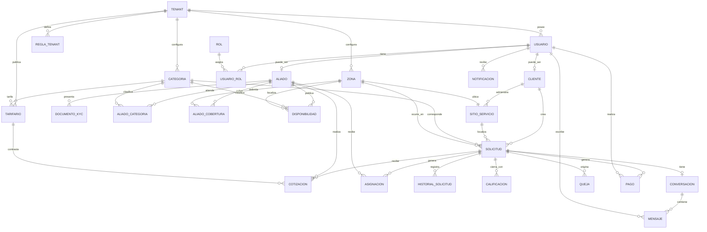
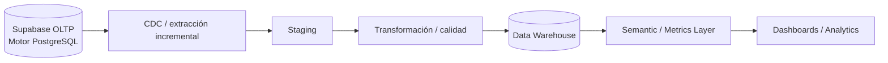
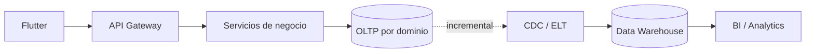

# MANI — Modelo de Datos
## Modelo conceptual, lógico, físico, DDL, diccionario de datos y plataforma analítica

**Plataforma operacional:** Supabase  
**Motor de base de datos:** PostgreSQL  
**Arquitectura de datos:** multi-tenant con propiedad por dominio  

---

## Estructura del documento

1. Propósito y separación de responsabilidades
2. Glosario de datos
3. Modelo conceptual
4. Modelo lógico
5. DER lógico
6. Modelo físico
7. DDL operacional
8. Diccionario de datos
9. Data Warehouse
10. Modelo dimensional
11. DDL del Data Warehouse
12. Calidad de datos y controles
13. Relación datos ↔ servicios
14. Cobertura de requisitos funcionales

---

# 1. Propósito y separación de responsabilidades

Este documento es la fuente de verdad del **modelo de datos** de MANI. No redefine la arquitectura de software: la arquitectura SOA, las vistas C4, atributos de calidad, patrones y despliegue se especifican en [SDD.md](./SDD.md).

La separación es intencional:

- **SDD:** cómo está organizado y desplegado el software.
- **Modelo de Datos:** qué información existe, cómo se relaciona, cómo se persiste y cómo se transforma para analítica.

---

## 1.1 Decisiones de persistencia

- **Supabase** es la plataforma administrada de datos de MANI.
- **PostgreSQL** es el motor relacional utilizado por Supabase.
- El diseño no contempla “PostgreSQL o Supabase” como alternativas separadas.
- RLS, Auth, Storage y Realtime se utilizan como capacidades de Supabase cuando correspondan.
- La propiedad de datos sigue organizada por dominio y servicio.

---

# 2. Glosario de datos

Este glosario define los términos que se utilizan de forma recurrente en el modelo de datos.
El glosario general de negocio y metodología del proyecto continúa siendo la fuente autoritativa
para conceptos que no sean específicamente de datos.

| Término | Definición |
|---|---|
| **Tenant** | Empresa independiente que utiliza MANI y cuyos datos, usuarios y configuración deben permanecer aislados de los demás tenants. |
| **Usuario** | Identidad registrada en MANI que puede asumir uno o varios roles dentro del contexto autorizado. |
| **Cliente** | Actor que solicita un servicio. Puede ser persona natural o empresa. |
| **Aliado** | Prestador habilitado para atender servicios dentro de las categorías y zonas declaradas. |
| **KYC** | Información y documentación utilizada para verificar un aliado. |
| **Categoría** | Tipo de servicio ofrecido dentro de MANI. |
| **Zona** | Unidad administrativa del catálogo geográfico utilizada para definir cobertura. |
| **Cobertura** | Conjunto de zonas en las que un aliado declara prestar servicios. Es una declaración estable del aliado y no depende del calendario. |
| **Disponibilidad** | Franja de agenda concreta (fecha y horas) en la que un aliado puede atender servicios. **No es lo mismo que cobertura:** la cobertura dice *dónde*, la disponibilidad dice *cuándo*. |
| **Sitio de servicio** | Ubicación registrada por un cliente empresa donde se presta el servicio. Tiene siempre una zona asignada y puede declarar reglas y condiciones propias visibles al aliado. |
| **Tarifario** | Tabla de referencia por tenant y categoría con valores mínimo, típico y máximo, usada para alertar cotizaciones fuera de rango. No fija el precio: lo contrasta. |
| **Calificación** | Valoración que una parte emite sobre la otra al finalizar el servicio. Es bidireccional y condición de cierre. |
| **Conversación** | Hilo de mensajería asociado a una solicitud, consultable después de cerrada. |
| **Mensaje** | Entrada individual de una conversación. |
| **Queja** | Reclamación registrada sobre un servicio. Pertenece al segundo incremento. |
| **Solicitud** | Petición de servicio creada por un cliente para un sitio y una categoría determinados. |
| **Cotización** | Propuesta económica asociada a una solicitud, diferenciando los componentes definidos por el negocio. |
| **Asignación** | Vinculación efectiva entre una solicitud y el aliado que obtuvo la aceptación válida. |
| **Regla de tenant** | Configuración de negocio que modifica el comportamiento operacional de MANI para un tenant sin requerir despliegue de código específico. |
| **RLS** | *Row-Level Security* de PostgreSQL utilizada como barrera adicional de aislamiento de filas entre tenants. |
| **OLTP** | Modelo de datos operacional orientado al procesamiento transaccional de MANI. |
| **Data Warehouse (DW)** | Repositorio analítico separado del OLTP, orientado a consultas históricas y métricas. |
| **Dimensión** | Entidad descriptiva del modelo dimensional utilizada para contextualizar hechos analíticos. |
| **Hecho** | Evento o medición registrada en una tabla de hechos del Data Warehouse. |
| **Grano** | Nivel exacto de detalle que representa una fila de una tabla de hechos. |
| **SCD** | *Slowly Changing Dimension*; estrategia para conservar cambios históricos en dimensiones. |
| **CDC** | *Change Data Capture*; mecanismo para capturar de forma incremental cambios del sistema operacional. |
| **DDL** | *Data Definition Language*; sentencias SQL utilizadas para crear y modificar estructuras de base de datos. |
| **Diccionario de datos (DD)** | Catálogo estructurado de tablas, atributos, tipos, restricciones y significado funcional de los datos. |

---

# 3. Modelo conceptual

El modelo conceptual describe las entidades del negocio sin depender de PostgreSQL, UUID, índices o detalles de implementación.

Dominios:

- **Identidad:** Tenant, Usuario, Rol, Aliado, Documento KYC, categorías atendidas y cobertura declarada.
- **Clientes:** Cliente y Sitio de servicio.
- **Catálogo:** Categoría y Zona.
- **Disponibilidad:** agenda operacional de los aliados.
- **Despacho:** Solicitud y Asignación.
- **Ciclo del servicio:** Cotización, Historial de ejecución y Calificación.
- **Reglas:** reglas configurables por tenant y tarifario de referencia.
- **Comunicaciones:** conversaciones, mensajes, notificaciones y quejas.
- **Pagos:** transacciones y referencias de proveedor.



El cierre de una solicitud exige **dos** filas de `CALIFICACION`, una por cada parte (RF-19). La relación
`ZONA ||--|| SITIO_SERVICIO` es obligatoria en ambos sentidos de lectura: todo sitio tiene zona (RF-09).

---

# 4. Modelo lógico

El modelo lógico incorpora atributos, claves y cardinalidades, pero sigue expresando la estructura del negocio sin depender de decisiones físicas específicas.

## 4.1 Identidad

### Tenant

```text
Tenant
PK id_tenant
nombre
estado
configuracion
fecha_creacion
```

### Usuario

```text
Usuario
PK id_usuario
FK id_tenant
nombre
correo
telefono
estado
fecha_creacion
```

### Rol

```text
Rol
PK id_rol
nombre
descripcion
```

### UsuarioRol

```text
UsuarioRol
PK/FK id_usuario
PK/FK id_rol
```

### Aliado

```text
Aliado
PK id_aliado
FK id_usuario
tipo_aliado          PERSONA_NATURAL | EMPRESA | EMPLEADO_DIRECTO
estado
nivel_verificacion
calificacion         promedio derivado de Calificacion
fecha_registro
```

### DocumentoKYC

```text
DocumentoKYC
PK id_documento
FK id_aliado
tipo_documento
url_documento
estado_validacion
fecha_carga
fecha_validacion
```

### AliadoCategoria

Categorías que el aliado declara atender (RF-11).

```text
AliadoCategoria
PK/FK id_aliado
PK/FK id_categoria
estado
```

### AliadoCobertura

Zonas en las que el aliado declara prestar servicio (RF-07). Es la declaración de
cobertura, independiente de la agenda.

```text
AliadoCobertura
PK/FK id_aliado
PK/FK id_zona
estado
```

## 4.2 Clientes y sitios de servicio

### Cliente

```text
Cliente
PK id_cliente
FK id_usuario
tipo_cliente         PERSONA_NATURAL | EMPRESA
razon_social         obligatorio cuando tipo_cliente = EMPRESA
documento_fiscal
estado
fecha_registro
```

### SitioServicio

Un cliente empresa administra varios sitios (RF-08). Todo sitio tiene zona (RF-09) y puede
declarar reglas y condiciones que el aliado debe ver antes de la programación.

```text
SitioServicio
PK id_sitio
FK id_cliente
FK id_zona           obligatorio
nombre
direccion
reglas_acceso
condiciones
estado
```

## 4.3 Catálogo

```text
Categoria
PK id_categoria
FK id_tenant
nombre
descripcion
estado
```

```text
Zona
PK id_zona
FK id_tenant
nombre
descripcion
estado
```

## 4.4 Disponibilidad

```text
Disponibilidad
PK id_disponibilidad
FK id_aliado
FK id_categoria
FK id_zona
fecha
hora_inicio
hora_fin
estado
```

## 4.5 Despacho

```text
Solicitud
PK id_solicitud
FK id_tenant
FK id_cliente
FK id_sitio          opcional: presente cuando el cliente es empresa con sitios
FK id_categoria
FK id_zona
descripcion
direccion            usada cuando la solicitud no proviene de un sitio registrado
fecha_servicio
estado
fecha_creacion
```

```text
Asignacion
PK id_asignacion
FK id_solicitud
FK id_aliado
estado
fecha_asignacion
fecha_respuesta
```

## 4.6 Ciclo del servicio

```text
Cotizacion
PK id_cotizacion
FK id_solicitud
FK id_aliado
FK id_tarifa         tarifa de referencia contra la que se contrastó
valor_mano_obra
valor_materiales
valor                total = mano de obra + materiales
moneda
fuera_de_rango       resultado de la validación contra el tarifario
estado
fecha_creacion
fecha_expiracion
```

```text
HistorialSolicitud
PK id_historial
FK id_solicitud
FK id_usuario
estado_anterior
estado_nuevo
observacion
fecha
```

```text
Calificacion
PK id_calificacion
FK id_solicitud
FK id_autor          usuario que califica
rol_autor            CLIENTE | ALIADO
puntaje              1..5
comentario
fecha
```

Una solicitud admite **una sola** calificación por `rol_autor`. El cierre requiere las dos.

## 4.7 Reglas y tarifario

```text
ReglaTenant
PK id_regla
FK id_tenant
tipo_regla
nombre
configuracion
prioridad
estado
fecha_creacion
```

```text
Tarifario
PK id_tarifa
FK id_tenant
FK id_categoria
valor_minimo
valor_tipico
valor_maximo
moneda
vigencia_desde
vigencia_hasta
estado
```

## 4.8 Comunicaciones

```text
Conversacion
PK id_conversacion
FK id_tenant
FK id_solicitud      una conversación por solicitud
estado
fecha_creacion
```

```text
Mensaje
PK id_mensaje
FK id_conversacion
FK id_autor
contenido
fecha_envio
fecha_lectura
```

```text
Notificacion
PK id_notificacion
FK id_usuario
tipo
titulo
mensaje
canal
estado
fecha_creacion
fecha_envio
```

```text
Queja
PK id_queja
FK id_solicitud
FK id_usuario
motivo
descripcion
estado
fecha_creacion
fecha_cierre
```

`Queja` pertenece al segundo incremento (RF-26) y se modela aquí para no reabrir el esquema
cuando entre al alcance.

## 4.9 Pagos

```text
Pago
PK id_pago
FK id_solicitud
FK id_usuario
valor
moneda
proveedor
referencia_externa
estado
fecha_creacion
```

---

# 5. DER lógico

```mermaid
erDiagram
    TENANT {
        uuid id_tenant PK
        varchar nombre
        varchar estado
        json configuracion
        timestamptz fecha_creacion
    }

    USUARIO {
        uuid id_usuario PK
        uuid id_tenant FK
        varchar nombre
        varchar correo
        varchar telefono
        varchar estado
        timestamptz fecha_creacion
    }

    ROL {
        uuid id_rol PK
        varchar nombre
        varchar descripcion
    }

    USUARIO_ROL {
        uuid id_usuario PK,FK
        uuid id_rol PK,FK
    }

    ALIADO {
        uuid id_aliado PK
        uuid id_usuario FK
        varchar tipo_aliado
        varchar estado
        varchar nivel_verificacion
        numeric calificacion
        timestamptz fecha_registro
    }

    ALIADO_CATEGORIA {
        uuid id_aliado PK,FK
        uuid id_categoria PK,FK
        varchar estado
    }

    ALIADO_COBERTURA {
        uuid id_aliado PK,FK
        uuid id_zona PK,FK
        varchar estado
    }

    CLIENTE {
        uuid id_cliente PK
        uuid id_usuario FK
        varchar tipo_cliente
        varchar razon_social
        varchar documento_fiscal
        varchar estado
        timestamptz fecha_registro
    }

    SITIO_SERVICIO {
        uuid id_sitio PK
        uuid id_cliente FK
        uuid id_zona FK
        varchar nombre
        text direccion
        text reglas_acceso
        text condiciones
        varchar estado
    }

    DOCUMENTO_KYC {
        uuid id_documento PK
        uuid id_aliado FK
        varchar tipo_documento
        text url_documento
        varchar estado_validacion
        timestamptz fecha_carga
        timestamptz fecha_validacion
    }

    CATEGORIA {
        uuid id_categoria PK
        uuid id_tenant FK
        varchar nombre
        varchar descripcion
        varchar estado
    }

    ZONA {
        uuid id_zona PK
        uuid id_tenant FK
        varchar nombre
        varchar descripcion
        varchar estado
    }

    DISPONIBILIDAD {
        uuid id_disponibilidad PK
        uuid id_aliado FK
        uuid id_categoria FK
        uuid id_zona FK
        date fecha
        time hora_inicio
        time hora_fin
        varchar estado
    }

    SOLICITUD {
        uuid id_solicitud PK
        uuid id_tenant FK
        uuid id_cliente FK
        uuid id_sitio FK
        uuid id_categoria FK
        uuid id_zona FK
        text descripcion
        text direccion
        timestamptz fecha_servicio
        varchar estado
        timestamptz fecha_creacion
    }

    COTIZACION {
        uuid id_cotizacion PK
        uuid id_solicitud FK
        uuid id_aliado FK
        uuid id_tarifa FK
        numeric valor_mano_obra
        numeric valor_materiales
        numeric valor
        char moneda
        boolean fuera_de_rango
        varchar estado
        timestamptz fecha_creacion
        timestamptz fecha_expiracion
    }

    CALIFICACION {
        uuid id_calificacion PK
        uuid id_solicitud FK
        uuid id_autor FK
        varchar rol_autor
        smallint puntaje
        text comentario
        timestamptz fecha
    }

    ASIGNACION {
        uuid id_asignacion PK
        uuid id_solicitud FK
        uuid id_aliado FK
        varchar estado
        timestamptz fecha_asignacion
        timestamptz fecha_respuesta
    }

    HISTORIAL_SOLICITUD {
        uuid id_historial PK
        uuid id_solicitud FK
        uuid id_usuario FK
        varchar estado_anterior
        varchar estado_nuevo
        text observacion
        timestamptz fecha
    }

    REGLA_TENANT {
        uuid id_regla PK
        uuid id_tenant FK
        varchar tipo_regla
        varchar nombre
        json configuracion
        int prioridad
        varchar estado
        timestamptz fecha_creacion
    }

    TARIFARIO {
        uuid id_tarifa PK
        uuid id_tenant FK
        uuid id_categoria FK
        numeric valor_minimo
        numeric valor_tipico
        numeric valor_maximo
        char moneda
        date vigencia_desde
        date vigencia_hasta
        varchar estado
    }

    CONVERSACION {
        uuid id_conversacion PK
        uuid id_tenant FK
        uuid id_solicitud FK
        varchar estado
        timestamptz fecha_creacion
    }

    MENSAJE {
        uuid id_mensaje PK
        uuid id_conversacion FK
        uuid id_autor FK
        text contenido
        timestamptz fecha_envio
        timestamptz fecha_lectura
    }

    NOTIFICACION {
        uuid id_notificacion PK
        uuid id_usuario FK
        varchar tipo
        varchar titulo
        text mensaje
        varchar canal
        varchar estado
        timestamptz fecha_creacion
        timestamptz fecha_envio
    }

    QUEJA {
        uuid id_queja PK
        uuid id_solicitud FK
        uuid id_usuario FK
        varchar motivo
        text descripcion
        varchar estado
        timestamptz fecha_creacion
        timestamptz fecha_cierre
    }

    PAGO {
        uuid id_pago PK
        uuid id_solicitud FK
        uuid id_usuario FK
        numeric valor
        char moneda
        varchar proveedor
        varchar referencia_externa
        varchar estado
        timestamptz fecha_creacion
    }

    TENANT ||--o{ USUARIO : posee
    TENANT ||--o{ CATEGORIA : configura
    TENANT ||--o{ ZONA : configura
    TENANT ||--o{ REGLA_TENANT : define
    TENANT ||--o{ TARIFARIO : publica
    TENANT ||--o{ CONVERSACION : aisla

    USUARIO ||--o{ USUARIO_ROL : tiene
    ROL ||--o{ USUARIO_ROL : asigna
    USUARIO ||--o| ALIADO : especializa
    USUARIO ||--o| CLIENTE : especializa

    ALIADO ||--o{ DOCUMENTO_KYC : presenta
    ALIADO ||--o{ ALIADO_CATEGORIA : atiende
    ALIADO ||--o{ ALIADO_COBERTURA : cubre
    ALIADO ||--o{ DISPONIBILIDAD : publica

    CATEGORIA ||--o{ ALIADO_CATEGORIA : clasifica
    ZONA ||--o{ ALIADO_COBERTURA : delimita
    CATEGORIA ||--o{ TARIFARIO : tarifa

    CLIENTE ||--o{ SITIO_SERVICIO : administra
    ZONA ||--o{ SITIO_SERVICIO : ubica

    CATEGORIA ||--o{ DISPONIBILIDAD : clasifica
    ZONA ||--o{ DISPONIBILIDAD : ubica

    CLIENTE ||--o{ SOLICITUD : crea
    SITIO_SERVICIO ||--o{ SOLICITUD : localiza
    CATEGORIA ||--o{ SOLICITUD : tipifica
    ZONA ||--o{ SOLICITUD : ubica

    SOLICITUD ||--o{ COTIZACION : recibe
    ALIADO ||--o{ COTIZACION : realiza
    TARIFARIO ||--o{ COTIZACION : contrasta

    SOLICITUD ||--o{ ASIGNACION : registra
    ALIADO ||--o{ ASIGNACION : atiende

    SOLICITUD ||--o{ HISTORIAL_SOLICITUD : cambia
    SOLICITUD ||--o{ CALIFICACION : cierra_con
    USUARIO ||--o{ CALIFICACION : emite

    SOLICITUD ||--o| CONVERSACION : tiene
    CONVERSACION ||--o{ MENSAJE : contiene
    USUARIO ||--o{ MENSAJE : escribe
    USUARIO ||--o{ NOTIFICACION : recibe

    SOLICITUD ||--o{ QUEJA : origina
    USUARIO ||--o{ QUEJA : registra
    SOLICITUD ||--o{ PAGO : genera
    USUARIO ||--o{ PAGO : realiza
```



---

# 6. Modelo físico

## 6.1 Separación por esquemas

```text
core
├── tenant
├── usuario
├── rol
├── usuario_rol
├── aliado
├── aliado_categoria
├── aliado_cobertura
├── documento_kyc
├── cliente
├── sitio_servicio
├── categoria
└── zona

reglas
├── regla_tenant
└── tarifario

disponibilidad
└── disponibilidad

despacho
├── solicitud
└── asignacion

servicio
├── cotizacion
├── historial_solicitud
└── calificacion

comunicaciones
├── conversacion
├── mensaje
├── notificacion
└── queja

pagos
└── pago
```

La separación por esquema organiza el modelo por dominio. En una evolución hacia bases totalmente independientes, los IDs remotos pueden mantenerse como referencias lógicas sin FK física entre bases.

El esquema `servicio` existe para que el dueño de los datos coincida con el dueño de la
capacidad: el despacho (solicitud y asignación) pertenece a Dispatch, mientras cotización,
ejecución y calificación pertenecen al Core Service, que es quien implementa esos casos de uso
(SAD §7). Sin esta separación, `cotizacion` quedaba en un esquema de Dispatch mientras el SAD
asignaba el caso de uso a Core.

## 6.2 Aislamiento por tenant en el modelo físico

`id_tenant` se denormaliza en toda tabla que sea frontera de consulta directa —`tenant`, `usuario`,
`categoria`, `zona`, `cliente`, `solicitud`, `regla_tenant`, `tarifario`, `conversacion`— para que la
política RLS filtre sin recorrer joins. Las tablas que solo se alcanzan a través de una de ellas
(`documento_kyc`, `mensaje`, `calificacion`, `cotizacion`, `asignacion`, `historial_solicitud`)
heredan el aislamiento por su clave foránea y lo verifican en la política correspondiente.

La regla operativa: ninguna política RLS depende de `auth.uid()` cuando el llamador es un servicio.
El tenant se toma del claim del JWT que el servicio propaga, y RLS actúa como defensa adicional,
no como única barrera (ADR-0012, ADR-0018).

---

# 7. DDL operacional — PostgreSQL sobre Supabase

```sql
CREATE EXTENSION IF NOT EXISTS pgcrypto;

CREATE SCHEMA IF NOT EXISTS core;
CREATE SCHEMA IF NOT EXISTS reglas;
CREATE SCHEMA IF NOT EXISTS disponibilidad;
CREATE SCHEMA IF NOT EXISTS despacho;
CREATE SCHEMA IF NOT EXISTS servicio;
CREATE SCHEMA IF NOT EXISTS comunicaciones;
CREATE SCHEMA IF NOT EXISTS pagos;

CREATE TABLE core.tenant (
    id_tenant UUID PRIMARY KEY DEFAULT gen_random_uuid(),
    nombre VARCHAR(150) NOT NULL,
    estado VARCHAR(20) NOT NULL DEFAULT 'ACTIVO'
        CHECK (estado IN ('ACTIVO', 'INACTIVO')),
    configuracion JSONB,
    fecha_creacion TIMESTAMPTZ NOT NULL DEFAULT NOW()
);

CREATE TABLE core.usuario (
    id_usuario UUID PRIMARY KEY DEFAULT gen_random_uuid(),
    id_tenant UUID NOT NULL,
    nombre VARCHAR(150) NOT NULL,
    correo VARCHAR(180) NOT NULL,
    telefono VARCHAR(30),
    estado VARCHAR(20) NOT NULL DEFAULT 'ACTIVO'
        CHECK (estado IN ('ACTIVO', 'INACTIVO', 'BLOQUEADO')),
    fecha_creacion TIMESTAMPTZ NOT NULL DEFAULT NOW(),
    CONSTRAINT fk_usuario_tenant
        FOREIGN KEY (id_tenant) REFERENCES core.tenant(id_tenant),
    CONSTRAINT uq_usuario_correo_tenant
        UNIQUE (id_tenant, correo)
);

CREATE TABLE core.rol (
    id_rol UUID PRIMARY KEY DEFAULT gen_random_uuid(),
    nombre VARCHAR(50) NOT NULL UNIQUE,
    descripcion VARCHAR(255)
);

CREATE TABLE core.usuario_rol (
    id_usuario UUID NOT NULL,
    id_rol UUID NOT NULL,
    PRIMARY KEY (id_usuario, id_rol),
    FOREIGN KEY (id_usuario) REFERENCES core.usuario(id_usuario),
    FOREIGN KEY (id_rol) REFERENCES core.rol(id_rol)
);

CREATE TABLE core.aliado (
    id_aliado UUID PRIMARY KEY DEFAULT gen_random_uuid(),
    id_usuario UUID NOT NULL UNIQUE,
    tipo_aliado VARCHAR(20) NOT NULL
        CHECK (tipo_aliado IN ('PERSONA_NATURAL','EMPRESA','EMPLEADO_DIRECTO')),
    estado VARCHAR(30) NOT NULL DEFAULT 'PENDIENTE'
        CHECK (estado IN ('PENDIENTE','ACTIVO','SUSPENDIDO','INACTIVO')),
    nivel_verificacion VARCHAR(30),
    calificacion NUMERIC(3,2) CHECK (calificacion BETWEEN 0 AND 5),
    fecha_registro TIMESTAMPTZ NOT NULL DEFAULT NOW(),
    FOREIGN KEY (id_usuario) REFERENCES core.usuario(id_usuario)
);

CREATE TABLE core.documento_kyc (
    id_documento UUID PRIMARY KEY DEFAULT gen_random_uuid(),
    id_aliado UUID NOT NULL,
    tipo_documento VARCHAR(50) NOT NULL,
    url_documento TEXT NOT NULL,
    estado_validacion VARCHAR(30) NOT NULL DEFAULT 'PENDIENTE'
        CHECK (estado_validacion IN ('PENDIENTE','APROBADO','RECHAZADO')),
    fecha_carga TIMESTAMPTZ NOT NULL DEFAULT NOW(),
    fecha_validacion TIMESTAMPTZ,
    FOREIGN KEY (id_aliado) REFERENCES core.aliado(id_aliado)
);

CREATE TABLE core.categoria (
    id_categoria UUID PRIMARY KEY DEFAULT gen_random_uuid(),
    id_tenant UUID NOT NULL,
    nombre VARCHAR(100) NOT NULL,
    descripcion VARCHAR(255),
    estado VARCHAR(20) NOT NULL DEFAULT 'ACTIVO'
        CHECK (estado IN ('ACTIVO','INACTIVO')),
    FOREIGN KEY (id_tenant) REFERENCES core.tenant(id_tenant),
    UNIQUE (id_tenant, nombre)
);

CREATE TABLE core.zona (
    id_zona UUID PRIMARY KEY DEFAULT gen_random_uuid(),
    id_tenant UUID NOT NULL,
    nombre VARCHAR(120) NOT NULL,
    descripcion VARCHAR(255),
    estado VARCHAR(20) NOT NULL DEFAULT 'ACTIVO'
        CHECK (estado IN ('ACTIVO','INACTIVO')),
    FOREIGN KEY (id_tenant) REFERENCES core.tenant(id_tenant),
    UNIQUE (id_tenant, nombre)
);

-- Categorias que el aliado declara atender (RF-11).
CREATE TABLE core.aliado_categoria (
    id_aliado UUID NOT NULL,
    id_categoria UUID NOT NULL,
    estado VARCHAR(20) NOT NULL DEFAULT 'ACTIVO'
        CHECK (estado IN ('ACTIVO','INACTIVO')),
    PRIMARY KEY (id_aliado, id_categoria),
    FOREIGN KEY (id_aliado) REFERENCES core.aliado(id_aliado),
    FOREIGN KEY (id_categoria) REFERENCES core.categoria(id_categoria)
);

-- Cobertura declarada del aliado (RF-07). Match exacto por zona, sin radio ni
-- geolocalizacion (REST-01, RNF-09, ADR-0011).
CREATE TABLE core.aliado_cobertura (
    id_aliado UUID NOT NULL,
    id_zona UUID NOT NULL,
    estado VARCHAR(20) NOT NULL DEFAULT 'ACTIVO'
        CHECK (estado IN ('ACTIVO','INACTIVO')),
    PRIMARY KEY (id_aliado, id_zona),
    FOREIGN KEY (id_aliado) REFERENCES core.aliado(id_aliado),
    FOREIGN KEY (id_zona) REFERENCES core.zona(id_zona)
);

-- RF-08: cliente persona natural o empresa.
CREATE TABLE core.cliente (
    id_cliente UUID PRIMARY KEY DEFAULT gen_random_uuid(),
    id_tenant UUID NOT NULL,
    id_usuario UUID NOT NULL UNIQUE,
    tipo_cliente VARCHAR(20) NOT NULL
        CHECK (tipo_cliente IN ('PERSONA_NATURAL','EMPRESA')),
    razon_social VARCHAR(180),
    documento_fiscal VARCHAR(50),
    estado VARCHAR(20) NOT NULL DEFAULT 'ACTIVO'
        CHECK (estado IN ('ACTIVO','INACTIVO')),
    fecha_registro TIMESTAMPTZ NOT NULL DEFAULT NOW(),
    FOREIGN KEY (id_tenant) REFERENCES core.tenant(id_tenant),
    FOREIGN KEY (id_usuario) REFERENCES core.usuario(id_usuario),
    CONSTRAINT ck_cliente_empresa_razon_social
        CHECK (tipo_cliente <> 'EMPRESA' OR razon_social IS NOT NULL)
);

-- RF-09: sitios de servicio del cliente empresa. Todo sitio tiene zona.
CREATE TABLE core.sitio_servicio (
    id_sitio UUID PRIMARY KEY DEFAULT gen_random_uuid(),
    id_cliente UUID NOT NULL,
    id_zona UUID NOT NULL,
    nombre VARCHAR(150) NOT NULL,
    direccion TEXT NOT NULL,
    reglas_acceso TEXT,
    condiciones TEXT,
    estado VARCHAR(20) NOT NULL DEFAULT 'ACTIVO'
        CHECK (estado IN ('ACTIVO','INACTIVO')),
    FOREIGN KEY (id_cliente) REFERENCES core.cliente(id_cliente),
    FOREIGN KEY (id_zona) REFERENCES core.zona(id_zona),
    UNIQUE (id_cliente, nombre)
);

-- RF-22: tarifario de referencia por tenant y categoria.
CREATE TABLE reglas.tarifario (
    id_tarifa UUID PRIMARY KEY DEFAULT gen_random_uuid(),
    id_tenant UUID NOT NULL,
    id_categoria UUID NOT NULL,
    valor_minimo NUMERIC(14,2) NOT NULL CHECK (valor_minimo >= 0),
    valor_tipico NUMERIC(14,2) NOT NULL,
    valor_maximo NUMERIC(14,2) NOT NULL,
    moneda CHAR(3) NOT NULL DEFAULT 'COP',
    vigencia_desde DATE NOT NULL,
    vigencia_hasta DATE,
    estado VARCHAR(20) NOT NULL DEFAULT 'ACTIVO'
        CHECK (estado IN ('ACTIVO','INACTIVO')),
    FOREIGN KEY (id_tenant) REFERENCES core.tenant(id_tenant),
    FOREIGN KEY (id_categoria) REFERENCES core.categoria(id_categoria),
    CONSTRAINT ck_tarifario_rango
        CHECK (valor_minimo <= valor_tipico AND valor_tipico <= valor_maximo),
    CONSTRAINT ck_tarifario_vigencia
        CHECK (vigencia_hasta IS NULL OR vigencia_hasta > vigencia_desde),
    CONSTRAINT uq_tarifario_vigente
        UNIQUE (id_tenant, id_categoria, vigencia_desde)
);

-- Agenda del aliado: dice CUANDO puede atender. La cobertura (DONDE) vive en
-- core.aliado_cobertura. Una franja solo es valida si su zona y categoria estan
-- declaradas por el aliado; esa validacion la aplica el servicio, no una FK.
CREATE TABLE disponibilidad.disponibilidad (
    id_disponibilidad UUID PRIMARY KEY DEFAULT gen_random_uuid(),
    id_aliado UUID NOT NULL,
    id_categoria UUID NOT NULL,
    id_zona UUID NOT NULL,
    fecha DATE NOT NULL,
    hora_inicio TIME NOT NULL,
    hora_fin TIME NOT NULL,
    estado VARCHAR(20) NOT NULL DEFAULT 'DISPONIBLE'
        CHECK (estado IN ('DISPONIBLE','RESERVADO','NO_DISPONIBLE')),
    FOREIGN KEY (id_aliado) REFERENCES core.aliado(id_aliado),
    FOREIGN KEY (id_categoria) REFERENCES core.categoria(id_categoria),
    FOREIGN KEY (id_zona) REFERENCES core.zona(id_zona),
    CHECK (hora_fin > hora_inicio)
);

CREATE TABLE despacho.solicitud (
    id_solicitud UUID PRIMARY KEY DEFAULT gen_random_uuid(),
    id_tenant UUID NOT NULL,
    id_cliente UUID NOT NULL,
    id_sitio UUID,
    id_categoria UUID NOT NULL,
    id_zona UUID NOT NULL,
    descripcion TEXT NOT NULL,
    direccion TEXT,
    fecha_servicio TIMESTAMPTZ,
    estado VARCHAR(30) NOT NULL DEFAULT 'CREADA'
        CHECK (estado IN (
            'CREADA','COTIZANDO','ASIGNADA','ACEPTADA',
            'RECHAZADA','EN_EJECUCION','FINALIZADA','CANCELADA'
        )),
    fecha_creacion TIMESTAMPTZ NOT NULL DEFAULT NOW(),
    FOREIGN KEY (id_tenant) REFERENCES core.tenant(id_tenant),
    FOREIGN KEY (id_cliente) REFERENCES core.cliente(id_cliente),
    FOREIGN KEY (id_sitio) REFERENCES core.sitio_servicio(id_sitio),
    FOREIGN KEY (id_categoria) REFERENCES core.categoria(id_categoria),
    FOREIGN KEY (id_zona) REFERENCES core.zona(id_zona),
    -- Sin sitio registrado la direccion es obligatoria; con sitio, la zona la fija el sitio.
    CONSTRAINT ck_solicitud_ubicacion
        CHECK (id_sitio IS NOT NULL OR direccion IS NOT NULL)
);

-- RF-15: mano de obra y materiales separados. RF-16: resultado del contraste con el tarifario.
-- RF-17: 'AJUSTE_SOLICITADO' permite que el cliente pida cambios sin rechazar.
CREATE TABLE servicio.cotizacion (
    id_cotizacion UUID PRIMARY KEY DEFAULT gen_random_uuid(),
    id_solicitud UUID NOT NULL,
    id_aliado UUID NOT NULL,
    id_tarifa UUID,
    valor_mano_obra NUMERIC(14,2) NOT NULL CHECK (valor_mano_obra >= 0),
    valor_materiales NUMERIC(14,2) NOT NULL DEFAULT 0 CHECK (valor_materiales >= 0),
    valor NUMERIC(14,2) NOT NULL CHECK (valor >= 0),
    moneda CHAR(3) NOT NULL DEFAULT 'COP',
    fuera_de_rango BOOLEAN NOT NULL DEFAULT FALSE,
    estado VARCHAR(20) NOT NULL DEFAULT 'PENDIENTE'
        CHECK (estado IN ('PENDIENTE','ACEPTADA','RECHAZADA','AJUSTE_SOLICITADO','EXPIRADA')),
    fecha_creacion TIMESTAMPTZ NOT NULL DEFAULT NOW(),
    fecha_expiracion TIMESTAMPTZ,
    FOREIGN KEY (id_solicitud) REFERENCES despacho.solicitud(id_solicitud),
    FOREIGN KEY (id_aliado) REFERENCES core.aliado(id_aliado),
    FOREIGN KEY (id_tarifa) REFERENCES reglas.tarifario(id_tarifa),
    CONSTRAINT ck_cotizacion_total
        CHECK (valor = valor_mano_obra + valor_materiales)
);

CREATE TABLE despacho.asignacion (
    id_asignacion UUID PRIMARY KEY DEFAULT gen_random_uuid(),
    id_solicitud UUID NOT NULL,
    id_aliado UUID NOT NULL,
    estado VARCHAR(20) NOT NULL DEFAULT 'PENDIENTE'
        CHECK (estado IN ('PENDIENTE','ACEPTADA','RECHAZADA','CANCELADA')),
    fecha_asignacion TIMESTAMPTZ NOT NULL DEFAULT NOW(),
    fecha_respuesta TIMESTAMPTZ,
    FOREIGN KEY (id_solicitud) REFERENCES despacho.solicitud(id_solicitud),
    FOREIGN KEY (id_aliado) REFERENCES core.aliado(id_aliado)
);

-- RF-18: bitacora cronologica de la ejecucion.
CREATE TABLE servicio.historial_solicitud (
    id_historial UUID PRIMARY KEY DEFAULT gen_random_uuid(),
    id_solicitud UUID NOT NULL,
    id_usuario UUID,
    estado_anterior VARCHAR(30),
    estado_nuevo VARCHAR(30) NOT NULL,
    observacion TEXT,
    fecha TIMESTAMPTZ NOT NULL DEFAULT NOW(),
    FOREIGN KEY (id_solicitud) REFERENCES despacho.solicitud(id_solicitud),
    FOREIGN KEY (id_usuario) REFERENCES core.usuario(id_usuario)
);

-- RF-19: calificacion bidireccional. El UNIQUE sobre (solicitud, rol_autor) garantiza
-- exactamente una calificacion por parte; el cierre exige que existan las dos.
CREATE TABLE servicio.calificacion (
    id_calificacion UUID PRIMARY KEY DEFAULT gen_random_uuid(),
    id_solicitud UUID NOT NULL,
    id_autor UUID NOT NULL,
    rol_autor VARCHAR(10) NOT NULL
        CHECK (rol_autor IN ('CLIENTE','ALIADO')),
    puntaje SMALLINT NOT NULL CHECK (puntaje BETWEEN 1 AND 5),
    comentario TEXT,
    fecha TIMESTAMPTZ NOT NULL DEFAULT NOW(),
    FOREIGN KEY (id_solicitud) REFERENCES despacho.solicitud(id_solicitud),
    FOREIGN KEY (id_autor) REFERENCES core.usuario(id_usuario),
    CONSTRAINT uq_calificacion_parte
        UNIQUE (id_solicitud, rol_autor)
);

CREATE TABLE reglas.regla_tenant (
    id_regla UUID PRIMARY KEY DEFAULT gen_random_uuid(),
    id_tenant UUID NOT NULL,
    tipo_regla VARCHAR(50) NOT NULL,
    nombre VARCHAR(150) NOT NULL,
    configuracion JSONB NOT NULL,
    prioridad INTEGER NOT NULL DEFAULT 0,
    estado VARCHAR(20) NOT NULL DEFAULT 'ACTIVO'
        CHECK (estado IN ('ACTIVO','INACTIVO')),
    fecha_creacion TIMESTAMPTZ NOT NULL DEFAULT NOW(),
    FOREIGN KEY (id_tenant) REFERENCES core.tenant(id_tenant)
);

-- RF-20 y RF-21: un hilo por solicitud, consultable despues del cierre.
CREATE TABLE comunicaciones.conversacion (
    id_conversacion UUID PRIMARY KEY DEFAULT gen_random_uuid(),
    id_tenant UUID NOT NULL,
    id_solicitud UUID NOT NULL UNIQUE,
    estado VARCHAR(20) NOT NULL DEFAULT 'ABIERTA'
        CHECK (estado IN ('ABIERTA','CERRADA')),
    fecha_creacion TIMESTAMPTZ NOT NULL DEFAULT NOW(),
    FOREIGN KEY (id_tenant) REFERENCES core.tenant(id_tenant),
    FOREIGN KEY (id_solicitud) REFERENCES despacho.solicitud(id_solicitud)
);

CREATE TABLE comunicaciones.mensaje (
    id_mensaje UUID PRIMARY KEY DEFAULT gen_random_uuid(),
    id_conversacion UUID NOT NULL,
    id_autor UUID NOT NULL,
    contenido TEXT NOT NULL,
    fecha_envio TIMESTAMPTZ NOT NULL DEFAULT NOW(),
    fecha_lectura TIMESTAMPTZ,
    FOREIGN KEY (id_conversacion) REFERENCES comunicaciones.conversacion(id_conversacion),
    FOREIGN KEY (id_autor) REFERENCES core.usuario(id_usuario)
);

CREATE TABLE comunicaciones.notificacion (
    id_notificacion UUID PRIMARY KEY DEFAULT gen_random_uuid(),
    id_usuario UUID NOT NULL,
    tipo VARCHAR(50),
    titulo VARCHAR(150) NOT NULL,
    mensaje TEXT NOT NULL,
    canal VARCHAR(20) NOT NULL
        CHECK (canal IN ('PUSH','EMAIL','SMS','IN_APP')),
    estado VARCHAR(20) NOT NULL DEFAULT 'PENDIENTE'
        CHECK (estado IN ('PENDIENTE','ENVIADA','FALLIDA','LEIDA')),
    fecha_creacion TIMESTAMPTZ NOT NULL DEFAULT NOW(),
    fecha_envio TIMESTAMPTZ,
    FOREIGN KEY (id_usuario) REFERENCES core.usuario(id_usuario)
);

-- RF-26, segundo incremento.
CREATE TABLE comunicaciones.queja (
    id_queja UUID PRIMARY KEY DEFAULT gen_random_uuid(),
    id_solicitud UUID NOT NULL,
    id_usuario UUID NOT NULL,
    motivo VARCHAR(100) NOT NULL,
    descripcion TEXT NOT NULL,
    estado VARCHAR(20) NOT NULL DEFAULT 'ABIERTA'
        CHECK (estado IN ('ABIERTA','EN_GESTION','CERRADA')),
    fecha_creacion TIMESTAMPTZ NOT NULL DEFAULT NOW(),
    fecha_cierre TIMESTAMPTZ,
    FOREIGN KEY (id_solicitud) REFERENCES despacho.solicitud(id_solicitud),
    FOREIGN KEY (id_usuario) REFERENCES core.usuario(id_usuario)
);

CREATE TABLE pagos.pago (
    id_pago UUID PRIMARY KEY DEFAULT gen_random_uuid(),
    id_solicitud UUID NOT NULL,
    id_usuario UUID NOT NULL,
    valor NUMERIC(14,2) NOT NULL CHECK (valor > 0),
    moneda CHAR(3) NOT NULL DEFAULT 'COP',
    proveedor VARCHAR(50),
    referencia_externa VARCHAR(150),
    estado VARCHAR(20) NOT NULL DEFAULT 'PENDIENTE'
        CHECK (estado IN ('PENDIENTE','APROBADO','RECHAZADO','REVERSADO')),
    fecha_creacion TIMESTAMPTZ NOT NULL DEFAULT NOW(),
    FOREIGN KEY (id_solicitud) REFERENCES despacho.solicitud(id_solicitud),
    FOREIGN KEY (id_usuario) REFERENCES core.usuario(id_usuario)
);

CREATE INDEX idx_usuario_tenant
ON core.usuario(id_tenant);

CREATE INDEX idx_usuario_correo
ON core.usuario(correo);

CREATE INDEX idx_aliado_cobertura_zona
ON core.aliado_cobertura(id_zona,estado);

CREATE INDEX idx_aliado_categoria_categoria
ON core.aliado_categoria(id_categoria,estado);

CREATE INDEX idx_cliente_tenant
ON core.cliente(id_tenant);

CREATE INDEX idx_sitio_cliente
ON core.sitio_servicio(id_cliente,estado);

CREATE INDEX idx_disponibilidad_busqueda
ON disponibilidad.disponibilidad(id_categoria,id_zona,fecha,estado);

CREATE INDEX idx_solicitud_cliente
ON despacho.solicitud(id_cliente);

CREATE INDEX idx_solicitud_estado
ON despacho.solicitud(estado);

CREATE INDEX idx_cotizacion_solicitud
ON servicio.cotizacion(id_solicitud);

CREATE INDEX idx_cotizacion_fuera_rango
ON servicio.cotizacion(fecha_creacion,fuera_de_rango)
WHERE fuera_de_rango;

CREATE INDEX idx_asignacion_solicitud
ON despacho.asignacion(id_solicitud);

CREATE INDEX idx_historial_solicitud
ON servicio.historial_solicitud(id_solicitud,fecha);

CREATE INDEX idx_calificacion_solicitud
ON servicio.calificacion(id_solicitud);

CREATE INDEX idx_reglas_tenant
ON reglas.regla_tenant(id_tenant,tipo_regla,estado);

CREATE INDEX idx_tarifario_vigente
ON reglas.tarifario(id_tenant,id_categoria,estado,vigencia_desde);

CREATE INDEX idx_mensaje_conversacion
ON comunicaciones.mensaje(id_conversacion,fecha_envio);

CREATE INDEX idx_notificacion_usuario
ON comunicaciones.notificacion(id_usuario,estado);

CREATE INDEX idx_queja_solicitud
ON comunicaciones.queja(id_solicitud,estado);

CREATE INDEX idx_pago_solicitud
ON pagos.pago(id_solicitud);
```

El indice parcial `idx_cotizacion_fuera_rango` existe para que el reporte de cotizaciones fuera
de rango por periodo (RF-23) no recorra la tabla completa.

---

# 8. Diccionario de datos

## `core.tenant`

| Campo | Tipo | Restricción | Descripción |
|---|---|---|---|
| id_tenant | UUID | PK | Identificador del tenant |
| nombre | VARCHAR(150) | NOT NULL | Nombre de la organización |
| estado | VARCHAR(20) | CHECK | Estado del tenant |
| configuracion | JSONB | NULL | Configuración extensible |
| fecha_creacion | TIMESTAMPTZ | NOT NULL | Alta del registro |

## `core.usuario`

| Campo | Tipo | Restricción | Descripción |
|---|---|---|---|
| id_usuario | UUID | PK | Identificador del usuario |
| id_tenant | UUID | FK | Tenant propietario |
| nombre | VARCHAR(150) | NOT NULL | Nombre |
| correo | VARCHAR(180) | UNIQUE por tenant | Correo |
| telefono | VARCHAR(30) | NULL | Teléfono |
| estado | VARCHAR(20) | CHECK | Estado de cuenta |
| fecha_creacion | TIMESTAMPTZ | NOT NULL | Alta |

## `core.aliado`

| Campo | Tipo | Restricción | Descripción |
|---|---|---|---|
| id_aliado | UUID | PK | Identificador de aliado |
| id_usuario | UUID | FK, UNIQUE | Usuario asociado |
| tipo_aliado | VARCHAR(20) | CHECK | PERSONA_NATURAL / EMPRESA / EMPLEADO_DIRECTO (RF-05) |
| estado | VARCHAR(30) | CHECK | Estado operacional |
| nivel_verificacion | VARCHAR(30) | NULL | Nivel KYC |
| calificacion | NUMERIC(3,2) | 0..5 | Promedio derivado de `servicio.calificacion` |
| fecha_registro | TIMESTAMPTZ | NOT NULL | Alta |

## `core.documento_kyc`

| Campo | Tipo | Restricción | Descripción |
|---|---|---|---|
| id_documento | UUID | PK | Identificador |
| id_aliado | UUID | FK | Propietario |
| tipo_documento | VARCHAR(50) | NOT NULL | Tipo KYC |
| url_documento | TEXT | NOT NULL | Referencia al archivo |
| estado_validacion | VARCHAR(30) | CHECK | Resultado |
| fecha_carga | TIMESTAMPTZ | NOT NULL | Carga |
| fecha_validacion | TIMESTAMPTZ | NULL | Validación |

## `core.categoria`

| Campo | Tipo | Restricción | Descripción |
|---|---|---|---|
| id_categoria | UUID | PK | Identificador |
| id_tenant | UUID | FK | Tenant |
| nombre | VARCHAR(100) | UNIQUE por tenant | Categoría |
| descripcion | VARCHAR(255) | NULL | Descripción |
| estado | VARCHAR(20) | CHECK | Estado |

## `core.zona`

| Campo | Tipo | Restricción | Descripción |
|---|---|---|---|
| id_zona | UUID | PK | Identificador |
| id_tenant | UUID | FK | Tenant |
| nombre | VARCHAR(120) | UNIQUE por tenant | Zona |
| descripcion | VARCHAR(255) | NULL | Descripción |
| estado | VARCHAR(20) | CHECK | Estado |

## `core.aliado_categoria`

| Campo | Tipo | Restricción | Descripción |
|---|---|---|---|
| id_aliado | UUID | PK, FK | Aliado |
| id_categoria | UUID | PK, FK | Categoría que declara atender (RF-11) |
| estado | VARCHAR(20) | CHECK | Estado de la declaración |

## `core.aliado_cobertura`

| Campo | Tipo | Restricción | Descripción |
|---|---|---|---|
| id_aliado | UUID | PK, FK | Aliado |
| id_zona | UUID | PK, FK | Zona en la que declara prestar servicio (RF-07) |
| estado | VARCHAR(20) | CHECK | Estado de la declaración |

## `core.cliente`

| Campo | Tipo | Restricción | Descripción |
|---|---|---|---|
| id_cliente | UUID | PK | Identificador de cliente |
| id_tenant | UUID | FK | Tenant propietario |
| id_usuario | UUID | FK, UNIQUE | Usuario asociado |
| tipo_cliente | VARCHAR(20) | CHECK | PERSONA_NATURAL / EMPRESA (RF-08) |
| razon_social | VARCHAR(180) | obligatorio si EMPRESA | Razón social |
| documento_fiscal | VARCHAR(50) | NULL | Identificación fiscal |
| estado | VARCHAR(20) | CHECK | Estado |
| fecha_registro | TIMESTAMPTZ | NOT NULL | Alta |

## `core.sitio_servicio`

| Campo | Tipo | Restricción | Descripción |
|---|---|---|---|
| id_sitio | UUID | PK | Identificador del sitio |
| id_cliente | UUID | FK | Cliente que lo administra |
| id_zona | UUID | FK, NOT NULL | Zona del sitio; obligatoria (RF-09) |
| nombre | VARCHAR(150) | UNIQUE por cliente | Nombre del sitio |
| direccion | TEXT | NOT NULL | Dirección |
| reglas_acceso | TEXT | NULL | Reglas visibles al aliado antes de programar (RF-09) |
| condiciones | TEXT | NULL | Condiciones particulares del sitio |
| estado | VARCHAR(20) | CHECK | Estado |

## `disponibilidad.disponibilidad`

| Campo | Tipo | Restricción | Descripción |
|---|---|---|---|
| id_disponibilidad | UUID | PK | Identificador |
| id_aliado | UUID | FK | Aliado |
| id_categoria | UUID | FK | Categoría |
| id_zona | UUID | FK | Zona |
| fecha | DATE | NOT NULL | Día |
| hora_inicio | TIME | NOT NULL | Inicio |
| hora_fin | TIME | NOT NULL | Fin |
| estado | VARCHAR(20) | CHECK | Estado de disponibilidad |

## `despacho.solicitud`

| Campo | Tipo | Restricción | Descripción |
|---|---|---|---|
| id_solicitud | UUID | PK | Identificador |
| id_tenant | UUID | FK | Tenant |
| id_cliente | UUID | FK | Cliente solicitante (`core.cliente`) |
| id_sitio | UUID | FK/NULL | Sitio de servicio cuando la solicitud proviene de uno |
| id_categoria | UUID | FK | Categoría |
| id_zona | UUID | FK | Zona |
| descripcion | TEXT | NOT NULL | Necesidad |
| direccion | TEXT | NULL si hay sitio | Lugar cuando no hay sitio registrado |
| fecha_servicio | TIMESTAMPTZ | NULL | Fecha objetivo |
| estado | VARCHAR(30) | CHECK | Estado operacional |
| fecha_creacion | TIMESTAMPTZ | NOT NULL | Alta |

## `servicio.cotizacion`

| Campo | Tipo | Restricción | Descripción |
|---|---|---|---|
| id_cotizacion | UUID | PK | Identificador |
| id_solicitud | UUID | FK | Solicitud |
| id_aliado | UUID | FK | Aliado |
| id_tarifa | UUID | FK/NULL | Tarifa de referencia contra la que se contrastó (RF-16) |
| valor_mano_obra | NUMERIC(14,2) | >= 0 | Componente de mano de obra (RF-15) |
| valor_materiales | NUMERIC(14,2) | >= 0 | Componente de materiales (RF-15) |
| valor | NUMERIC(14,2) | = mano de obra + materiales | Total |
| moneda | CHAR(3) | NOT NULL | Moneda ISO |
| fuera_de_rango | BOOLEAN | NOT NULL | Resultado de la validación tarifaria (RF-16, RF-23) |
| estado | VARCHAR(20) | CHECK | PENDIENTE / ACEPTADA / RECHAZADA / AJUSTE_SOLICITADO / EXPIRADA (RF-17) |
| fecha_creacion | TIMESTAMPTZ | NOT NULL | Alta |
| fecha_expiracion | TIMESTAMPTZ | NULL | Vencimiento |

## `despacho.asignacion`

| Campo | Tipo | Restricción | Descripción |
|---|---|---|---|
| id_asignacion | UUID | PK | Identificador |
| id_solicitud | UUID | FK | Solicitud |
| id_aliado | UUID | FK | Aliado seleccionado |
| estado | VARCHAR(20) | CHECK | Estado |
| fecha_asignacion | TIMESTAMPTZ | NOT NULL | Asignación |
| fecha_respuesta | TIMESTAMPTZ | NULL | Respuesta |

## `servicio.historial_solicitud`

| Campo | Tipo | Restricción | Descripción |
|---|---|---|---|
| id_historial | UUID | PK | Identificador |
| id_solicitud | UUID | FK | Solicitud |
| id_usuario | UUID | FK/NULL | Actor |
| estado_anterior | VARCHAR(30) | NULL | Estado anterior |
| estado_nuevo | VARCHAR(30) | NOT NULL | Nuevo estado |
| observacion | TEXT | NULL | Detalle o evento de ejecución (RF-18) |
| fecha | TIMESTAMPTZ | NOT NULL | Momento del cambio |

## `servicio.calificacion`

| Campo | Tipo | Restricción | Descripción |
|---|---|---|---|
| id_calificacion | UUID | PK | Identificador |
| id_solicitud | UUID | FK | Servicio calificado |
| id_autor | UUID | FK | Usuario que califica |
| rol_autor | VARCHAR(10) | CHECK | CLIENTE o ALIADO |
| puntaje | SMALLINT | 1..5 | Valoración |
| comentario | TEXT | NULL | Observación |
| fecha | TIMESTAMPTZ | NOT NULL | Momento |

`UNIQUE (id_solicitud, rol_autor)` impide que una parte califique dos veces. El cierre del
servicio exige las dos filas (RF-19).

## `reglas.regla_tenant`

| Campo | Tipo | Restricción | Descripción |
|---|---|---|---|
| id_regla | UUID | PK | Identificador |
| id_tenant | UUID | FK | Tenant |
| tipo_regla | VARCHAR(50) | NOT NULL | Tipo |
| nombre | VARCHAR(150) | NOT NULL | Nombre |
| configuracion | JSONB | NOT NULL | Parámetros |
| prioridad | INTEGER | NOT NULL | Orden |
| estado | VARCHAR(20) | CHECK | Estado |
| fecha_creacion | TIMESTAMPTZ | NOT NULL | Alta |

## `reglas.tarifario`

| Campo | Tipo | Restricción | Descripción |
|---|---|---|---|
| id_tarifa | UUID | PK | Identificador |
| id_tenant | UUID | FK | Tenant |
| id_categoria | UUID | FK | Categoría tarifada |
| valor_minimo | NUMERIC(14,2) | >= 0 | Mínimo de referencia (RF-22) |
| valor_tipico | NUMERIC(14,2) | entre mín. y máx. | Valor típico |
| valor_maximo | NUMERIC(14,2) | >= típico | Máximo de referencia |
| moneda | CHAR(3) | NOT NULL | Moneda ISO |
| vigencia_desde | DATE | NOT NULL | Inicio de vigencia |
| vigencia_hasta | DATE | NULL | Fin de vigencia |
| estado | VARCHAR(20) | CHECK | Estado |

## `comunicaciones.conversacion`

| Campo | Tipo | Restricción | Descripción |
|---|---|---|---|
| id_conversacion | UUID | PK | Identificador |
| id_tenant | UUID | FK | Tenant |
| id_solicitud | UUID | FK, UNIQUE | Servicio al que pertenece el hilo (RF-20) |
| estado | VARCHAR(20) | CHECK | ABIERTA / CERRADA |
| fecha_creacion | TIMESTAMPTZ | NOT NULL | Alta |

## `comunicaciones.mensaje`

| Campo | Tipo | Restricción | Descripción |
|---|---|---|---|
| id_mensaje | UUID | PK | Identificador |
| id_conversacion | UUID | FK | Conversación |
| id_autor | UUID | FK | Emisor |
| contenido | TEXT | NOT NULL | Texto del mensaje |
| fecha_envio | TIMESTAMPTZ | NOT NULL | Envío |
| fecha_lectura | TIMESTAMPTZ | NULL | Lectura del destinatario |

La persistencia del mensaje es la que permite consultar la conversación después del cierre
(RF-21). Supabase Realtime transporta el evento; no es el almacén.

## `comunicaciones.notificacion`

| Campo | Tipo | Restricción | Descripción |
|---|---|---|---|
| id_notificacion | UUID | PK | Identificador |
| id_usuario | UUID | FK | Destinatario |
| tipo | VARCHAR(50) | NULL | Evento |
| titulo | VARCHAR(150) | NOT NULL | Título |
| mensaje | TEXT | NOT NULL | Contenido |
| canal | VARCHAR(20) | CHECK | PUSH/EMAIL/SMS/IN_APP |
| estado | VARCHAR(20) | CHECK | Estado |
| fecha_creacion | TIMESTAMPTZ | NOT NULL | Alta |
| fecha_envio | TIMESTAMPTZ | NULL | Envío |

## `comunicaciones.queja`

| Campo | Tipo | Restricción | Descripción |
|---|---|---|---|
| id_queja | UUID | PK | Identificador |
| id_solicitud | UUID | FK | Servicio reclamado |
| id_usuario | UUID | FK | Quien registra la queja |
| motivo | VARCHAR(100) | NOT NULL | Motivo |
| descripcion | TEXT | NOT NULL | Detalle |
| estado | VARCHAR(20) | CHECK | ABIERTA / EN_GESTION / CERRADA |
| fecha_creacion | TIMESTAMPTZ | NOT NULL | Alta |
| fecha_cierre | TIMESTAMPTZ | NULL | Cierre |

Segundo incremento (RF-26).

## `pagos.pago`

| Campo | Tipo | Restricción | Descripción |
|---|---|---|---|
| id_pago | UUID | PK | Identificador |
| id_solicitud | UUID | FK | Solicitud |
| id_usuario | UUID | FK | Pagador |
| valor | NUMERIC(14,2) | > 0 | Importe |
| moneda | CHAR(3) | NOT NULL | Moneda |
| proveedor | VARCHAR(50) | NULL | Pasarela |
| referencia_externa | VARCHAR(150) | NULL | ID externo |
| estado | VARCHAR(20) | CHECK | Estado |
| fecha_creacion | TIMESTAMPTZ | NOT NULL | Alta |

---

# 9. Data Warehouse

## 9.1 Objetivo

El Data Warehouse se utiliza para análisis histórico y BI sin degradar el OLTP.

Preguntas que debe responder:

- solicitudes por tenant, categoría, zona y periodo;
- tiempo medio de asignación;
- tasa de aceptación/rechazo;
- aliados con mayor volumen y tasa de cumplimiento;
- valores cotizados y pagados;
- conversión solicitud → asignación → finalización;
- comportamiento de disponibilidad;
- desempeño por tenant y zona;
- cotizaciones fuera del rango de referencia por período (RF-23);
- satisfacción por aliado, categoría y zona a partir de las calificaciones.

## 9.2 Flujo



Principios:

- el DW no escribe en OLTP;
- consistencia eventual;
- claves sustitutas en dimensiones;
- historial cuando sea relevante;
- PII minimizada;
- controles de calidad antes de publicar hechos.

## 9.3 Modelo dimensional

```mermaid
erDiagram
    DIM_FECHA ||--o{ FACT_SOLICITUD : fecha
    DIM_TENANT ||--o{ FACT_SOLICITUD : tenant
    DIM_USUARIO ||--o{ FACT_SOLICITUD : cliente
    DIM_CATEGORIA ||--o{ FACT_SOLICITUD : categoria
    DIM_ZONA ||--o{ FACT_SOLICITUD : zona

    DIM_FECHA ||--o{ FACT_COTIZACION : fecha
    DIM_TENANT ||--o{ FACT_COTIZACION : tenant
    DIM_ALIADO ||--o{ FACT_COTIZACION : aliado
    DIM_CATEGORIA ||--o{ FACT_COTIZACION : categoria

    DIM_FECHA ||--o{ FACT_ASIGNACION : fecha
    DIM_TENANT ||--o{ FACT_ASIGNACION : tenant
    DIM_ALIADO ||--o{ FACT_ASIGNACION : aliado
    DIM_CATEGORIA ||--o{ FACT_ASIGNACION : categoria
    DIM_ZONA ||--o{ FACT_ASIGNACION : zona

    DIM_FECHA ||--o{ FACT_PAGO : fecha
    DIM_TENANT ||--o{ FACT_PAGO : tenant

    DIM_FECHA ||--o{ FACT_CALIFICACION : fecha
    DIM_TENANT ||--o{ FACT_CALIFICACION : tenant
    DIM_ALIADO ||--o{ FACT_CALIFICACION : aliado
    DIM_CATEGORIA ||--o{ FACT_CALIFICACION : categoria

    DIM_FECHA {
      int fecha_key PK
      date fecha
      int anio
      int mes
      int dia
      int trimestre
      int dia_semana
    }

    DIM_TENANT {
      bigint tenant_key PK
      uuid tenant_id_natural
      string nombre
      string estado
    }

    DIM_USUARIO {
      bigint usuario_key PK
      uuid usuario_id_natural
      string tipo_usuario
      string estado
    }

    DIM_ALIADO {
      bigint aliado_key PK
      uuid aliado_id_natural
      string nivel_verificacion
      decimal calificacion
      string estado
    }

    DIM_CATEGORIA {
      bigint categoria_key PK
      uuid categoria_id_natural
      string nombre
    }

    DIM_ZONA {
      bigint zona_key PK
      uuid zona_id_natural
      string nombre
    }

    FACT_SOLICITUD {
      bigint fact_solicitud_key PK
      uuid solicitud_id DD
      int fecha_key FK
      bigint tenant_key FK
      bigint usuario_key FK
      bigint categoria_key FK
      bigint zona_key FK
      string estado
      decimal horas_hasta_asignacion
      int cantidad
    }

    FACT_COTIZACION {
      bigint fact_cotizacion_key PK
      uuid cotizacion_id DD
      int fecha_key FK
      bigint tenant_key FK
      bigint aliado_key FK
      bigint categoria_key FK
      decimal valor
      decimal valor_mano_obra
      decimal valor_materiales
      boolean fuera_de_rango
      string estado
      int cantidad
    }

    FACT_CALIFICACION {
      bigint fact_calificacion_key PK
      uuid calificacion_id DD
      int fecha_key FK
      bigint tenant_key FK
      bigint aliado_key FK
      bigint categoria_key FK
      string rol_autor
      smallint puntaje
      int cantidad
    }

    FACT_ASIGNACION {
      bigint fact_asignacion_key PK
      uuid asignacion_id DD
      int fecha_key FK
      bigint tenant_key FK
      bigint aliado_key FK
      bigint categoria_key FK
      bigint zona_key FK
      string estado
      decimal segundos_respuesta
      int cantidad
    }

    FACT_PAGO {
      bigint fact_pago_key PK
      uuid pago_id DD
      int fecha_key FK
      bigint tenant_key FK
      decimal valor
      string estado
      int cantidad
    }
```

`DD` indica dimensión degenerada: se conserva el identificador operacional en la tabla de hechos sin crear una dimensión adicional.

---

## 9.4 Flujo total de datos



La arquitectura operacional y la plataforma analítica están conectadas, pero desacopladas: el usuario no espera una carga de DW para completar una solicitud, una cotización o una asignación.

---

# 10. Modelo dimensional

El modelo dimensional organiza la información analítica en tablas de hechos y dimensiones.
Se mantiene separado del OLTP para evitar que las consultas históricas y agregaciones degraden
el flujo transaccional de la aplicación.

## 10.1 Grano de las tablas de hechos

| Hecho | Grano |
|---|---|
| `fact_solicitud` | una fila por solicitud |
| `fact_cotizacion` | una fila por cotización emitida |
| `fact_asignacion` | una fila por intento/registro de asignación |
| `fact_calificacion` | una fila por calificación emitida, es decir dos por servicio cerrado |
| `fact_pago` | una fila por transacción de pago |

Definir el grano antes de las métricas evita duplicidades y sumas incorrectas.

---

## 10.2 Dimensiones lentamente cambiantes

Recomendación:

- `dim_tenant`: SCD Tipo 2 si se requiere histórico de estado/configuración relevante.
- `dim_aliado`: SCD Tipo 2 para nivel de verificación, estado y segmentos analíticos.
- `dim_categoria`: Tipo 1 para correcciones simples; Tipo 2 si cambios semánticos deben conservar historia.
- `dim_zona`: Tipo 2 si las delimitaciones cambian y deben analizarse históricamente.

Campos típicos SCD2:

```text
valid_from
valid_to
is_current
```

---

## 10.3 Métricas analíticas

| KPI | Definición |
|---|---|
| Solicitudes creadas | `COUNT(fact_solicitud)` |
| Tasa de finalización | finalizadas / creadas |
| Tiempo medio de asignación | `AVG(horas_hasta_asignacion)` |
| Cotización promedio | `AVG(fact_cotizacion.valor)` |
| Tasa de aceptación | cotizaciones/asignaciones aceptadas sobre total correspondiente |
| Tiempo de respuesta de aliado | `AVG(segundos_respuesta)` |
| GMV / valor procesado | suma de pagos aprobados |
| Tasa de pago aprobado | pagos aprobados / intentos |
| Solicitudes por zona | solicitudes agrupadas por `dim_zona` |
| Solicitudes por categoría | solicitudes agrupadas por `dim_categoria` |
| Cotizaciones fuera de rango | `COUNT(fact_cotizacion WHERE fuera_de_rango)` sobre total, por período (RF-23) |
| Calificación media del aliado | `AVG(fact_calificacion.puntaje WHERE rol_autor = 'CLIENTE')` |
| Calificación media del cliente | `AVG(fact_calificacion.puntaje WHERE rol_autor = 'ALIADO')` |

---

# 11. DDL del Data Warehouse

```sql
CREATE SCHEMA IF NOT EXISTS dw;

CREATE TABLE dw.dim_fecha (
    fecha_key INTEGER PRIMARY KEY,
    fecha DATE NOT NULL UNIQUE,
    anio SMALLINT NOT NULL,
    trimestre SMALLINT NOT NULL,
    mes SMALLINT NOT NULL,
    dia SMALLINT NOT NULL,
    dia_semana SMALLINT NOT NULL
);

CREATE TABLE dw.dim_tenant (
    tenant_key BIGSERIAL PRIMARY KEY,
    tenant_id_natural UUID NOT NULL,
    nombre VARCHAR(150) NOT NULL,
    estado VARCHAR(20),
    valid_from TIMESTAMPTZ NOT NULL,
    valid_to TIMESTAMPTZ,
    is_current BOOLEAN NOT NULL DEFAULT TRUE
);

CREATE TABLE dw.dim_usuario (
    usuario_key BIGSERIAL PRIMARY KEY,
    usuario_id_natural UUID NOT NULL,
    tipo_usuario VARCHAR(30),
    estado VARCHAR(20),
    valid_from TIMESTAMPTZ NOT NULL,
    valid_to TIMESTAMPTZ,
    is_current BOOLEAN NOT NULL DEFAULT TRUE
);

CREATE TABLE dw.dim_aliado (
    aliado_key BIGSERIAL PRIMARY KEY,
    aliado_id_natural UUID NOT NULL,
    nivel_verificacion VARCHAR(30),
    calificacion NUMERIC(3,2),
    estado VARCHAR(30),
    valid_from TIMESTAMPTZ NOT NULL,
    valid_to TIMESTAMPTZ,
    is_current BOOLEAN NOT NULL DEFAULT TRUE
);

CREATE TABLE dw.dim_categoria (
    categoria_key BIGSERIAL PRIMARY KEY,
    categoria_id_natural UUID NOT NULL,
    nombre VARCHAR(100) NOT NULL,
    valid_from TIMESTAMPTZ NOT NULL,
    valid_to TIMESTAMPTZ,
    is_current BOOLEAN NOT NULL DEFAULT TRUE
);

CREATE TABLE dw.dim_zona (
    zona_key BIGSERIAL PRIMARY KEY,
    zona_id_natural UUID NOT NULL,
    nombre VARCHAR(120) NOT NULL,
    valid_from TIMESTAMPTZ NOT NULL,
    valid_to TIMESTAMPTZ,
    is_current BOOLEAN NOT NULL DEFAULT TRUE
);

CREATE TABLE dw.fact_solicitud (
    fact_solicitud_key BIGSERIAL PRIMARY KEY,
    solicitud_id UUID NOT NULL,
    fecha_key INTEGER NOT NULL REFERENCES dw.dim_fecha(fecha_key),
    tenant_key BIGINT NOT NULL REFERENCES dw.dim_tenant(tenant_key),
    usuario_key BIGINT NOT NULL REFERENCES dw.dim_usuario(usuario_key),
    categoria_key BIGINT NOT NULL REFERENCES dw.dim_categoria(categoria_key),
    zona_key BIGINT NOT NULL REFERENCES dw.dim_zona(zona_key),
    estado VARCHAR(30) NOT NULL,
    horas_hasta_asignacion NUMERIC(12,2),
    cantidad INTEGER NOT NULL DEFAULT 1
);

CREATE TABLE dw.fact_cotizacion (
    fact_cotizacion_key BIGSERIAL PRIMARY KEY,
    cotizacion_id UUID NOT NULL,
    fecha_key INTEGER NOT NULL REFERENCES dw.dim_fecha(fecha_key),
    tenant_key BIGINT NOT NULL REFERENCES dw.dim_tenant(tenant_key),
    aliado_key BIGINT NOT NULL REFERENCES dw.dim_aliado(aliado_key),
    categoria_key BIGINT NOT NULL REFERENCES dw.dim_categoria(categoria_key),
    valor NUMERIC(14,2) NOT NULL,
    valor_mano_obra NUMERIC(14,2),
    valor_materiales NUMERIC(14,2),
    fuera_de_rango BOOLEAN NOT NULL DEFAULT FALSE,
    estado VARCHAR(20) NOT NULL,
    cantidad INTEGER NOT NULL DEFAULT 1
);

CREATE TABLE dw.fact_calificacion (
    fact_calificacion_key BIGSERIAL PRIMARY KEY,
    calificacion_id UUID NOT NULL,
    fecha_key INTEGER NOT NULL REFERENCES dw.dim_fecha(fecha_key),
    tenant_key BIGINT NOT NULL REFERENCES dw.dim_tenant(tenant_key),
    aliado_key BIGINT NOT NULL REFERENCES dw.dim_aliado(aliado_key),
    categoria_key BIGINT NOT NULL REFERENCES dw.dim_categoria(categoria_key),
    rol_autor VARCHAR(10) NOT NULL,
    puntaje SMALLINT NOT NULL,
    cantidad INTEGER NOT NULL DEFAULT 1
);

CREATE TABLE dw.fact_asignacion (
    fact_asignacion_key BIGSERIAL PRIMARY KEY,
    asignacion_id UUID NOT NULL,
    fecha_key INTEGER NOT NULL REFERENCES dw.dim_fecha(fecha_key),
    tenant_key BIGINT NOT NULL REFERENCES dw.dim_tenant(tenant_key),
    aliado_key BIGINT NOT NULL REFERENCES dw.dim_aliado(aliado_key),
    categoria_key BIGINT NOT NULL REFERENCES dw.dim_categoria(categoria_key),
    zona_key BIGINT NOT NULL REFERENCES dw.dim_zona(zona_key),
    estado VARCHAR(20) NOT NULL,
    segundos_respuesta INTEGER,
    cantidad INTEGER NOT NULL DEFAULT 1
);

CREATE TABLE dw.fact_pago (
    fact_pago_key BIGSERIAL PRIMARY KEY,
    pago_id UUID NOT NULL,
    fecha_key INTEGER NOT NULL REFERENCES dw.dim_fecha(fecha_key),
    tenant_key BIGINT NOT NULL REFERENCES dw.dim_tenant(tenant_key),
    valor NUMERIC(14,2) NOT NULL,
    estado VARCHAR(20) NOT NULL,
    cantidad INTEGER NOT NULL DEFAULT 1
);
```

---

# 12. Calidad de datos y controles

Antes de publicar información analítica:

- claves naturales no nulas en dimensiones críticas;
- deduplicación por ID operacional;
- reconciliación de conteos OLTP ↔ staging ↔ DW;
- validación de estados conocidos;
- validación de importes no negativos;
- rechazo o cuarentena de registros huérfanos;
- timestamps normalizados;
- PII minimizada en dimensiones analíticas;
- el contenido de `comunicaciones.mensaje` no se replica al Data Warehouse: solo se publican
  conteos y marcas de tiempo agregados, nunca el texto;
- `fact_calificacion` no publica el comentario libre.

Umbrales iniciales de **calidad de datos**. No son umbrales de atributos de calidad del producto:
esos viven únicamente en [`SDD.md`](./SDD.md) §7 y §8. Estos miden el pipeline analítico y los
mantiene este documento, que es su dueño.

| Control | Umbral |
|---|---:|
| duplicados por ID operacional en hechos | 0 |
| registros huérfanos publicados | 0 |
| cargas fallidas sin alerta | 0 |
| reconciliación de conteos críticos | ≥ 99.9% |
| frescura analítica objetivo | ≤ 15 min para incremental |
| disponibilidad diaria del pipeline | ≥ 99.5% |

---

# 13. Relación datos ↔ servicios

| Dominio de datos | Servicio propietario | Repositorio |
|---|---|---|
| `core.*` | Core Service — Node.js | `MANI-Core-Service` |
| `disponibilidad.*` | Core Service — módulo de disponibilidades | `MANI-Core-Service` |
| `servicio.*` | Core Service — cotización, ejecución y calificación | `MANI-Core-Service` |
| `comunicaciones.*` | Core Service — módulo de comunicaciones | `MANI-Core-Service` |
| `pagos.*` | Core Service — adaptador de pagos, segundo incremento | `MANI-Core-Service` |
| `reglas.*` | Rules Service — Java | `MANI-Rules-Service` |
| `despacho.*` | Dispatch Service — .NET | `MANI-Dispatch-Service` |
| `dw.*` | Plataforma analítica | — |

La propiedad implica **escritura exclusiva** del servicio responsable. Otros servicios acceden mediante API, evento o réplica analítica, no mediante escritura directa a tablas privadas.

Dos lecturas cruzadas son explícitamente permitidas y solo de lectura:

- Dispatch lee la elegibilidad por categoría y zona consultando la API del Core Service, no
  `core.aliado_cobertura` ni `disponibilidad.disponibilidad` directamente.
- Rules lee el tarifario de su propio esquema y devuelve el veredicto; es el Core Service quien
  escribe `fuera_de_rango` en `servicio.cotizacion`.

---

## 13.1 Criterios de evolución

1. Eliminar progresivamente accesos directos del cliente a tablas de negocio.
2. Separar físicamente bases por servicio si la escala o autonomía lo exige.
3. Mantener IDs naturales estables para integración y claves sustitutas en DW.
4. Incorporar CDC real cuando el volumen justifique dejar polling incremental.
5. Implementar SCD Tipo 2 solo en dimensiones donde el histórico tenga valor analítico.
6. No convertir el Data Warehouse en fuente de verdad transaccional.

---

# 14. Cobertura de requisitos funcionales

Esta tabla existe para que no vuelva a quedar un requisito del SRS sin estructura donde
persistirse. Cada RF del SRS apunta a las tablas que lo soportan.

## 14.1 MVP

| RF | Requisito | Estructuras que lo soportan |
|---|---|---|
| RF-01 | Registrar y administrar tenants | `core.tenant` |
| RF-02 | Reglas configurables por tenant | `core.tenant.configuracion`, `reglas.regla_tenant` |
| RF-03 | Autenticación y acceso por tenant y rol | `core.usuario`, `core.rol`, `core.usuario_rol` + Supabase Auth |
| RF-04 | Recuperación de contraseña | Supabase Auth; sin tabla propia por diseño |
| RF-05 | Registro de aliados por tipo con KYC | `core.aliado.tipo_aliado`, `core.documento_kyc` |
| RF-06 | Bandeja de aprobación de aliados | `core.aliado.estado`, `core.documento_kyc.estado_validacion` |
| RF-07 | Aliado declara zonas de cobertura | `core.aliado_cobertura` |
| RF-08 | Clientes persona natural y empresa | `core.cliente` |
| RF-09 | Sitios de servicio con reglas y zona | `core.sitio_servicio` |
| RF-10 | Categorías del tenant | `core.categoria` |
| RF-11 | Asociar aliados con categorías | `core.aliado_categoria` |
| RF-12 | Crear solicitud y presentar aliados válidos | `despacho.solicitud` + `core.aliado_cobertura` + `core.aliado_categoria` + `disponibilidad.disponibilidad` |
| RF-13 | Ordenar el listado según regla del tenant | `reglas.regla_tenant` (tipo de regla de ranking) |
| RF-14 | Aceptar/rechazar sin doble asignación | `despacho.asignacion` + actualización condicional atómica |
| RF-15 | Cotización con mano de obra y materiales | `servicio.cotizacion.valor_mano_obra`, `valor_materiales` |
| RF-16 | Alertar cotización fuera de rango | `reglas.tarifario` + `servicio.cotizacion.fuera_de_rango` |
| RF-17 | Aceptar, rechazar o ajustar cotización | `servicio.cotizacion.estado` incluido `AJUSTE_SOLICITADO` |
| RF-18 | Registrar eventos de la ejecución | `servicio.historial_solicitud` |
| RF-19 | Calificación bidireccional y cierre | `servicio.calificacion` con `UNIQUE (id_solicitud, rol_autor)` |
| RF-20 | Mensajería por servicio con notificación | `comunicaciones.conversacion`, `comunicaciones.mensaje`, `comunicaciones.notificacion` |
| RF-21 | Consultar conversaciones de un servicio | `comunicaciones.mensaje` persistido e indexado por conversación |
| RF-22 | Tarifario por categoría y tenant | `reglas.tarifario` con mínimo, típico y máximo |
| RF-23 | Reporte de cotizaciones fuera de rango | `idx_cotizacion_fuera_rango` y `dw.fact_cotizacion.fuera_de_rango` |

## 14.2 Segundo incremento

| RF | Requisito | Estructuras que lo soportan |
|---|---|---|
| RF-24 | Cobro en línea con operador certificado | `pagos.pago` |
| RF-25 | Liquidación con comisión del tenant | `pagos.pago` + comisión en `reglas.regla_tenant` |
| RF-26 | Registrar y gestionar quejas | `comunicaciones.queja` |
| RF-27 | Consola de comercialización del tenant | `core.tenant.configuracion`; no requiere esquema nuevo |
| RF-28 | Métricas operativas por tenant | esquema `dw` completo |

**RF-04** es el único requisito sin tabla propia, y es intencional: las credenciales y el flujo de
recuperación los administra Supabase Auth. Replicarlos en el modelo operacional duplicaría material
sensible sin beneficio.
