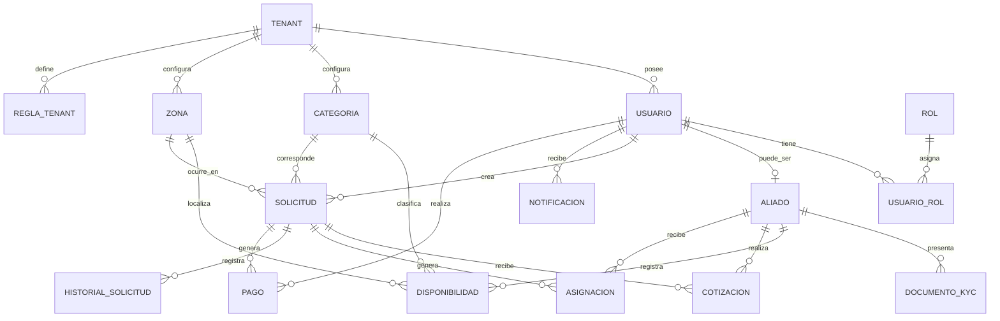
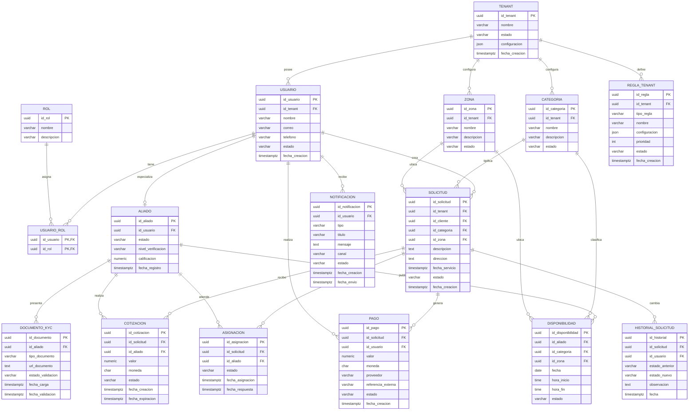
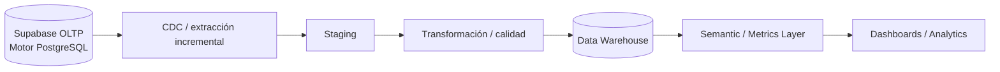
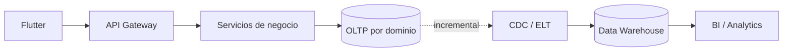

# MANI — Modelo de Datos
## Modelo conceptual, lógico, físico, DDL, diccionario de datos y plataforma analítica

**Plataforma operacional:** Supabase  
**Motor de base de datos:** PostgreSQL  
**Arquitectura de datos:** multi-tenant con propiedad por dominio  

---

## Estructura del documento

1. Propósito y separación de responsabilidades
2. Glosario de datos
3. Modelo conceptual
4. Modelo lógico
5. DER lógico
6. Modelo físico
7. DDL operacional
8. Diccionario de datos
9. Data Warehouse
10. Modelo dimensional
11. DDL del Data Warehouse
12. Calidad de datos y controles
13. Relación datos ↔ servicios

---

# 1. Propósito y separación de responsabilidades

Este documento es la fuente de verdad del **modelo de datos** de MANI. No redefine la arquitectura de software: la arquitectura SOA, las vistas C4, atributos de calidad, patrones y despliegue se especifican en [SDD.md](./SDD.md).

La separación es intencional:

- **SDD:** cómo está organizado y desplegado el software.
- **Modelo de Datos:** qué información existe, cómo se relaciona, cómo se persiste y cómo se transforma para analítica.

---

## 1.1 Decisiones de persistencia

- **Supabase** es la plataforma administrada de datos de MANI.
- **PostgreSQL** es el motor relacional utilizado por Supabase.
- El diseño no contempla “PostgreSQL o Supabase” como alternativas separadas.
- RLS, Auth, Storage y Realtime se utilizan como capacidades de Supabase cuando correspondan.
- La propiedad de datos sigue organizada por dominio y servicio.

---

# 2. Glosario de datos

Este glosario define los términos que se utilizan de forma recurrente en el modelo de datos.
El glosario general de negocio y metodología del proyecto continúa siendo la fuente autoritativa
para conceptos que no sean específicamente de datos.

| Término | Definición |
|---|---|
| **Tenant** | Empresa independiente que utiliza MANI y cuyos datos, usuarios y configuración deben permanecer aislados de los demás tenants. |
| **Usuario** | Identidad registrada en MANI que puede asumir uno o varios roles dentro del contexto autorizado. |
| **Cliente** | Actor que solicita un servicio. Puede ser persona natural o empresa. |
| **Aliado** | Prestador habilitado para atender servicios dentro de las categorías y zonas declaradas. |
| **KYC** | Información y documentación utilizada para verificar un aliado. |
| **Categoría** | Tipo de servicio ofrecido dentro de MANI. |
| **Zona** | Unidad administrativa del catálogo geográfico utilizada para definir cobertura. |
| **Cobertura** | Asociación entre un aliado y las zonas en las que declara prestar servicios. |
| **Disponibilidad** | Intervalo o condición operacional en la que un aliado puede atender servicios. |
| **Solicitud** | Petición de servicio creada por un cliente para un sitio y una categoría determinados. |
| **Cotización** | Propuesta económica asociada a una solicitud, diferenciando los componentes definidos por el negocio. |
| **Asignación** | Vinculación efectiva entre una solicitud y el aliado que obtuvo la aceptación válida. |
| **Regla de tenant** | Configuración de negocio que modifica el comportamiento operacional de MANI para un tenant sin requerir despliegue de código específico. |
| **RLS** | *Row-Level Security* de PostgreSQL utilizada como barrera adicional de aislamiento de filas entre tenants. |
| **OLTP** | Modelo de datos operacional orientado al procesamiento transaccional de MANI. |
| **Data Warehouse (DW)** | Repositorio analítico separado del OLTP, orientado a consultas históricas y métricas. |
| **Dimensión** | Entidad descriptiva del modelo dimensional utilizada para contextualizar hechos analíticos. |
| **Hecho** | Evento o medición registrada en una tabla de hechos del Data Warehouse. |
| **Grano** | Nivel exacto de detalle que representa una fila de una tabla de hechos. |
| **SCD** | *Slowly Changing Dimension*; estrategia para conservar cambios históricos en dimensiones. |
| **CDC** | *Change Data Capture*; mecanismo para capturar de forma incremental cambios del sistema operacional. |
| **DDL** | *Data Definition Language*; sentencias SQL utilizadas para crear y modificar estructuras de base de datos. |
| **Diccionario de datos (DD)** | Catálogo estructurado de tablas, atributos, tipos, restricciones y significado funcional de los datos. |

---

# 3. Modelo conceptual

El modelo conceptual describe las entidades del negocio sin depender de PostgreSQL, UUID, índices o detalles de implementación.

Dominios:

- **Identidad:** Tenant, Usuario, Rol, Aliado, Documento KYC.
- **Catálogo:** Categoría y Zona.
- **Disponibilidad:** disponibilidad operacional de aliados.
- **Operación:** Solicitud, Cotización, Asignación e Historial.
- **Reglas:** reglas configurables por tenant.
- **Comunicaciones:** notificaciones.
- **Pagos:** transacciones y referencias de proveedor.



---

# 4. Modelo lógico

El modelo lógico incorpora atributos, claves y cardinalidades, pero sigue expresando la estructura del negocio sin depender de decisiones físicas específicas.

## 4.1 Identidad

### Tenant

```text
Tenant
PK id_tenant
nombre
estado
configuracion
fecha_creacion
```

### Usuario

```text
Usuario
PK id_usuario
FK id_tenant
nombre
correo
telefono
estado
fecha_creacion
```

### Rol

```text
Rol
PK id_rol
nombre
descripcion
```

### UsuarioRol

```text
UsuarioRol
PK/FK id_usuario
PK/FK id_rol
```

### Aliado

```text
Aliado
PK id_aliado
FK id_usuario
estado
nivel_verificacion
calificacion
fecha_registro
```

### DocumentoKYC

```text
DocumentoKYC
PK id_documento
FK id_aliado
tipo_documento
url_documento
estado_validacion
fecha_carga
fecha_validacion
```

## 4.2 Catálogo

```text
Categoria
PK id_categoria
FK id_tenant
nombre
descripcion
estado
```

```text
Zona
PK id_zona
FK id_tenant
nombre
descripcion
estado
```

## 4.3 Disponibilidad

```text
Disponibilidad
PK id_disponibilidad
FK id_aliado
FK id_categoria
FK id_zona
fecha
hora_inicio
hora_fin
estado
```

## 4.4 Operación

```text
Solicitud
PK id_solicitud
FK id_tenant
FK id_cliente
FK id_categoria
FK id_zona
descripcion
direccion
fecha_servicio
estado
fecha_creacion
```

```text
Cotizacion
PK id_cotizacion
FK id_solicitud
FK id_aliado
valor
moneda
estado
fecha_creacion
fecha_expiracion
```

```text
Asignacion
PK id_asignacion
FK id_solicitud
FK id_aliado
estado
fecha_asignacion
fecha_respuesta
```

```text
HistorialSolicitud
PK id_historial
FK id_solicitud
FK id_usuario
estado_anterior
estado_nuevo
observacion
fecha
```

## 4.5 Reglas

```text
ReglaTenant
PK id_regla
FK id_tenant
tipo_regla
nombre
configuracion
prioridad
estado
fecha_creacion
```

## 4.6 Comunicaciones

```text
Notificacion
PK id_notificacion
FK id_usuario
tipo
titulo
mensaje
canal
estado
fecha_creacion
fecha_envio
```

## 4.7 Pagos

```text
Pago
PK id_pago
FK id_solicitud
FK id_usuario
valor
moneda
proveedor
referencia_externa
estado
fecha_creacion
```

---

# 5. DER lógico



---

# 6. Modelo físico

## 6.1 Separación por esquemas

```text
core
├── tenant
├── usuario
├── rol
├── usuario_rol
├── aliado
├── documento_kyc
├── categoria
└── zona

reglas
└── regla_tenant

disponibilidad
└── disponibilidad

despacho
├── solicitud
├── cotizacion
├── asignacion
└── historial_solicitud

comunicaciones
└── notificacion

pagos
└── pago
```

La separación por esquema organiza el modelo por dominio. En una evolución hacia bases totalmente independientes, los IDs remotos pueden mantenerse como referencias lógicas sin FK física entre bases.

---

# 7. DDL operacional — PostgreSQL sobre Supabase

```sql
CREATE EXTENSION IF NOT EXISTS pgcrypto;

CREATE SCHEMA IF NOT EXISTS core;
CREATE SCHEMA IF NOT EXISTS reglas;
CREATE SCHEMA IF NOT EXISTS disponibilidad;
CREATE SCHEMA IF NOT EXISTS despacho;
CREATE SCHEMA IF NOT EXISTS comunicaciones;
CREATE SCHEMA IF NOT EXISTS pagos;

CREATE TABLE core.tenant (
    id_tenant UUID PRIMARY KEY DEFAULT gen_random_uuid(),
    nombre VARCHAR(150) NOT NULL,
    estado VARCHAR(20) NOT NULL DEFAULT 'ACTIVO'
        CHECK (estado IN ('ACTIVO', 'INACTIVO')),
    configuracion JSONB,
    fecha_creacion TIMESTAMPTZ NOT NULL DEFAULT NOW()
);

CREATE TABLE core.usuario (
    id_usuario UUID PRIMARY KEY DEFAULT gen_random_uuid(),
    id_tenant UUID NOT NULL,
    nombre VARCHAR(150) NOT NULL,
    correo VARCHAR(180) NOT NULL,
    telefono VARCHAR(30),
    estado VARCHAR(20) NOT NULL DEFAULT 'ACTIVO'
        CHECK (estado IN ('ACTIVO', 'INACTIVO', 'BLOQUEADO')),
    fecha_creacion TIMESTAMPTZ NOT NULL DEFAULT NOW(),
    CONSTRAINT fk_usuario_tenant
        FOREIGN KEY (id_tenant) REFERENCES core.tenant(id_tenant),
    CONSTRAINT uq_usuario_correo_tenant
        UNIQUE (id_tenant, correo)
);

CREATE TABLE core.rol (
    id_rol UUID PRIMARY KEY DEFAULT gen_random_uuid(),
    nombre VARCHAR(50) NOT NULL UNIQUE,
    descripcion VARCHAR(255)
);

CREATE TABLE core.usuario_rol (
    id_usuario UUID NOT NULL,
    id_rol UUID NOT NULL,
    PRIMARY KEY (id_usuario, id_rol),
    FOREIGN KEY (id_usuario) REFERENCES core.usuario(id_usuario),
    FOREIGN KEY (id_rol) REFERENCES core.rol(id_rol)
);

CREATE TABLE core.aliado (
    id_aliado UUID PRIMARY KEY DEFAULT gen_random_uuid(),
    id_usuario UUID NOT NULL UNIQUE,
    estado VARCHAR(30) NOT NULL DEFAULT 'PENDIENTE'
        CHECK (estado IN ('PENDIENTE','ACTIVO','SUSPENDIDO','INACTIVO')),
    nivel_verificacion VARCHAR(30),
    calificacion NUMERIC(3,2) CHECK (calificacion BETWEEN 0 AND 5),
    fecha_registro TIMESTAMPTZ NOT NULL DEFAULT NOW(),
    FOREIGN KEY (id_usuario) REFERENCES core.usuario(id_usuario)
);

CREATE TABLE core.documento_kyc (
    id_documento UUID PRIMARY KEY DEFAULT gen_random_uuid(),
    id_aliado UUID NOT NULL,
    tipo_documento VARCHAR(50) NOT NULL,
    url_documento TEXT NOT NULL,
    estado_validacion VARCHAR(30) NOT NULL DEFAULT 'PENDIENTE'
        CHECK (estado_validacion IN ('PENDIENTE','APROBADO','RECHAZADO')),
    fecha_carga TIMESTAMPTZ NOT NULL DEFAULT NOW(),
    fecha_validacion TIMESTAMPTZ,
    FOREIGN KEY (id_aliado) REFERENCES core.aliado(id_aliado)
);

CREATE TABLE core.categoria (
    id_categoria UUID PRIMARY KEY DEFAULT gen_random_uuid(),
    id_tenant UUID NOT NULL,
    nombre VARCHAR(100) NOT NULL,
    descripcion VARCHAR(255),
    estado VARCHAR(20) NOT NULL DEFAULT 'ACTIVO'
        CHECK (estado IN ('ACTIVO','INACTIVO')),
    FOREIGN KEY (id_tenant) REFERENCES core.tenant(id_tenant),
    UNIQUE (id_tenant, nombre)
);

CREATE TABLE core.zona (
    id_zona UUID PRIMARY KEY DEFAULT gen_random_uuid(),
    id_tenant UUID NOT NULL,
    nombre VARCHAR(120) NOT NULL,
    descripcion VARCHAR(255),
    estado VARCHAR(20) NOT NULL DEFAULT 'ACTIVO'
        CHECK (estado IN ('ACTIVO','INACTIVO')),
    FOREIGN KEY (id_tenant) REFERENCES core.tenant(id_tenant),
    UNIQUE (id_tenant, nombre)
);

CREATE TABLE disponibilidad.disponibilidad (
    id_disponibilidad UUID PRIMARY KEY DEFAULT gen_random_uuid(),
    id_aliado UUID NOT NULL,
    id_categoria UUID NOT NULL,
    id_zona UUID NOT NULL,
    fecha DATE NOT NULL,
    hora_inicio TIME NOT NULL,
    hora_fin TIME NOT NULL,
    estado VARCHAR(20) NOT NULL DEFAULT 'DISPONIBLE'
        CHECK (estado IN ('DISPONIBLE','RESERVADO','NO_DISPONIBLE')),
    FOREIGN KEY (id_aliado) REFERENCES core.aliado(id_aliado),
    FOREIGN KEY (id_categoria) REFERENCES core.categoria(id_categoria),
    FOREIGN KEY (id_zona) REFERENCES core.zona(id_zona),
    CHECK (hora_fin > hora_inicio)
);

CREATE TABLE despacho.solicitud (
    id_solicitud UUID PRIMARY KEY DEFAULT gen_random_uuid(),
    id_tenant UUID NOT NULL,
    id_cliente UUID NOT NULL,
    id_categoria UUID NOT NULL,
    id_zona UUID NOT NULL,
    descripcion TEXT NOT NULL,
    direccion TEXT,
    fecha_servicio TIMESTAMPTZ,
    estado VARCHAR(30) NOT NULL DEFAULT 'CREADA'
        CHECK (estado IN (
            'CREADA','COTIZANDO','ASIGNADA','ACEPTADA',
            'RECHAZADA','EN_EJECUCION','FINALIZADA','CANCELADA'
        )),
    fecha_creacion TIMESTAMPTZ NOT NULL DEFAULT NOW(),
    FOREIGN KEY (id_tenant) REFERENCES core.tenant(id_tenant),
    FOREIGN KEY (id_cliente) REFERENCES core.usuario(id_usuario),
    FOREIGN KEY (id_categoria) REFERENCES core.categoria(id_categoria),
    FOREIGN KEY (id_zona) REFERENCES core.zona(id_zona)
);

CREATE TABLE despacho.cotizacion (
    id_cotizacion UUID PRIMARY KEY DEFAULT gen_random_uuid(),
    id_solicitud UUID NOT NULL,
    id_aliado UUID NOT NULL,
    valor NUMERIC(14,2) NOT NULL CHECK (valor >= 0),
    moneda CHAR(3) NOT NULL DEFAULT 'COP',
    estado VARCHAR(20) NOT NULL DEFAULT 'PENDIENTE'
        CHECK (estado IN ('PENDIENTE','ACEPTADA','RECHAZADA','EXPIRADA')),
    fecha_creacion TIMESTAMPTZ NOT NULL DEFAULT NOW(),
    fecha_expiracion TIMESTAMPTZ,
    FOREIGN KEY (id_solicitud) REFERENCES despacho.solicitud(id_solicitud),
    FOREIGN KEY (id_aliado) REFERENCES core.aliado(id_aliado)
);

CREATE TABLE despacho.asignacion (
    id_asignacion UUID PRIMARY KEY DEFAULT gen_random_uuid(),
    id_solicitud UUID NOT NULL,
    id_aliado UUID NOT NULL,
    estado VARCHAR(20) NOT NULL DEFAULT 'PENDIENTE'
        CHECK (estado IN ('PENDIENTE','ACEPTADA','RECHAZADA','CANCELADA')),
    fecha_asignacion TIMESTAMPTZ NOT NULL DEFAULT NOW(),
    fecha_respuesta TIMESTAMPTZ,
    FOREIGN KEY (id_solicitud) REFERENCES despacho.solicitud(id_solicitud),
    FOREIGN KEY (id_aliado) REFERENCES core.aliado(id_aliado)
);

CREATE TABLE despacho.historial_solicitud (
    id_historial UUID PRIMARY KEY DEFAULT gen_random_uuid(),
    id_solicitud UUID NOT NULL,
    id_usuario UUID,
    estado_anterior VARCHAR(30),
    estado_nuevo VARCHAR(30) NOT NULL,
    observacion TEXT,
    fecha TIMESTAMPTZ NOT NULL DEFAULT NOW(),
    FOREIGN KEY (id_solicitud) REFERENCES despacho.solicitud(id_solicitud),
    FOREIGN KEY (id_usuario) REFERENCES core.usuario(id_usuario)
);

CREATE TABLE reglas.regla_tenant (
    id_regla UUID PRIMARY KEY DEFAULT gen_random_uuid(),
    id_tenant UUID NOT NULL,
    tipo_regla VARCHAR(50) NOT NULL,
    nombre VARCHAR(150) NOT NULL,
    configuracion JSONB NOT NULL,
    prioridad INTEGER NOT NULL DEFAULT 0,
    estado VARCHAR(20) NOT NULL DEFAULT 'ACTIVO'
        CHECK (estado IN ('ACTIVO','INACTIVO')),
    fecha_creacion TIMESTAMPTZ NOT NULL DEFAULT NOW(),
    FOREIGN KEY (id_tenant) REFERENCES core.tenant(id_tenant)
);

CREATE TABLE comunicaciones.notificacion (
    id_notificacion UUID PRIMARY KEY DEFAULT gen_random_uuid(),
    id_usuario UUID NOT NULL,
    tipo VARCHAR(50),
    titulo VARCHAR(150) NOT NULL,
    mensaje TEXT NOT NULL,
    canal VARCHAR(20) NOT NULL
        CHECK (canal IN ('PUSH','EMAIL','SMS','IN_APP')),
    estado VARCHAR(20) NOT NULL DEFAULT 'PENDIENTE'
        CHECK (estado IN ('PENDIENTE','ENVIADA','FALLIDA','LEIDA')),
    fecha_creacion TIMESTAMPTZ NOT NULL DEFAULT NOW(),
    fecha_envio TIMESTAMPTZ,
    FOREIGN KEY (id_usuario) REFERENCES core.usuario(id_usuario)
);

CREATE TABLE pagos.pago (
    id_pago UUID PRIMARY KEY DEFAULT gen_random_uuid(),
    id_solicitud UUID NOT NULL,
    id_usuario UUID NOT NULL,
    valor NUMERIC(14,2) NOT NULL CHECK (valor > 0),
    moneda CHAR(3) NOT NULL DEFAULT 'COP',
    proveedor VARCHAR(50),
    referencia_externa VARCHAR(150),
    estado VARCHAR(20) NOT NULL DEFAULT 'PENDIENTE'
        CHECK (estado IN ('PENDIENTE','APROBADO','RECHAZADO','REVERSADO')),
    fecha_creacion TIMESTAMPTZ NOT NULL DEFAULT NOW(),
    FOREIGN KEY (id_solicitud) REFERENCES despacho.solicitud(id_solicitud),
    FOREIGN KEY (id_usuario) REFERENCES core.usuario(id_usuario)
);

CREATE INDEX idx_usuario_tenant
ON core.usuario(id_tenant);

CREATE INDEX idx_usuario_correo
ON core.usuario(correo);

CREATE INDEX idx_disponibilidad_busqueda
ON disponibilidad.disponibilidad(id_categoria,id_zona,fecha,estado);

CREATE INDEX idx_solicitud_cliente
ON despacho.solicitud(id_cliente);

CREATE INDEX idx_solicitud_estado
ON despacho.solicitud(estado);

CREATE INDEX idx_cotizacion_solicitud
ON despacho.cotizacion(id_solicitud);

CREATE INDEX idx_asignacion_solicitud
ON despacho.asignacion(id_solicitud);

CREATE INDEX idx_historial_solicitud
ON despacho.historial_solicitud(id_solicitud,fecha);

CREATE INDEX idx_reglas_tenant
ON reglas.regla_tenant(id_tenant,tipo_regla,estado);

CREATE INDEX idx_notificacion_usuario
ON comunicaciones.notificacion(id_usuario,estado);

CREATE INDEX idx_pago_solicitud
ON pagos.pago(id_solicitud);
```

---

# 8. Diccionario de datos

## `core.tenant`

| Campo | Tipo | Restricción | Descripción |
|---|---|---|---|
| id_tenant | UUID | PK | Identificador del tenant |
| nombre | VARCHAR(150) | NOT NULL | Nombre de la organización |
| estado | VARCHAR(20) | CHECK | Estado del tenant |
| configuracion | JSONB | NULL | Configuración extensible |
| fecha_creacion | TIMESTAMPTZ | NOT NULL | Alta del registro |

## `core.usuario`

| Campo | Tipo | Restricción | Descripción |
|---|---|---|---|
| id_usuario | UUID | PK | Identificador del usuario |
| id_tenant | UUID | FK | Tenant propietario |
| nombre | VARCHAR(150) | NOT NULL | Nombre |
| correo | VARCHAR(180) | UNIQUE por tenant | Correo |
| telefono | VARCHAR(30) | NULL | Teléfono |
| estado | VARCHAR(20) | CHECK | Estado de cuenta |
| fecha_creacion | TIMESTAMPTZ | NOT NULL | Alta |

## `core.aliado`

| Campo | Tipo | Restricción | Descripción |
|---|---|---|---|
| id_aliado | UUID | PK | Identificador de aliado |
| id_usuario | UUID | FK, UNIQUE | Usuario asociado |
| estado | VARCHAR(30) | CHECK | Estado operacional |
| nivel_verificacion | VARCHAR(30) | NULL | Nivel KYC |
| calificacion | NUMERIC(3,2) | 0..5 | Calificación |
| fecha_registro | TIMESTAMPTZ | NOT NULL | Alta |

## `core.documento_kyc`

| Campo | Tipo | Restricción | Descripción |
|---|---|---|---|
| id_documento | UUID | PK | Identificador |
| id_aliado | UUID | FK | Propietario |
| tipo_documento | VARCHAR(50) | NOT NULL | Tipo KYC |
| url_documento | TEXT | NOT NULL | Referencia al archivo |
| estado_validacion | VARCHAR(30) | CHECK | Resultado |
| fecha_carga | TIMESTAMPTZ | NOT NULL | Carga |
| fecha_validacion | TIMESTAMPTZ | NULL | Validación |

## `core.categoria`

| Campo | Tipo | Restricción | Descripción |
|---|---|---|---|
| id_categoria | UUID | PK | Identificador |
| id_tenant | UUID | FK | Tenant |
| nombre | VARCHAR(100) | UNIQUE por tenant | Categoría |
| descripcion | VARCHAR(255) | NULL | Descripción |
| estado | VARCHAR(20) | CHECK | Estado |

## `core.zona`

| Campo | Tipo | Restricción | Descripción |
|---|---|---|---|
| id_zona | UUID | PK | Identificador |
| id_tenant | UUID | FK | Tenant |
| nombre | VARCHAR(120) | UNIQUE por tenant | Zona |
| descripcion | VARCHAR(255) | NULL | Descripción |
| estado | VARCHAR(20) | CHECK | Estado |

## `disponibilidad.disponibilidad`

| Campo | Tipo | Restricción | Descripción |
|---|---|---|---|
| id_disponibilidad | UUID | PK | Identificador |
| id_aliado | UUID | FK | Aliado |
| id_categoria | UUID | FK | Categoría |
| id_zona | UUID | FK | Zona |
| fecha | DATE | NOT NULL | Día |
| hora_inicio | TIME | NOT NULL | Inicio |
| hora_fin | TIME | NOT NULL | Fin |
| estado | VARCHAR(20) | CHECK | Estado de disponibilidad |

## `despacho.solicitud`

| Campo | Tipo | Restricción | Descripción |
|---|---|---|---|
| id_solicitud | UUID | PK | Identificador |
| id_tenant | UUID | FK | Tenant |
| id_cliente | UUID | FK | Solicitante |
| id_categoria | UUID | FK | Categoría |
| id_zona | UUID | FK | Zona |
| descripcion | TEXT | NOT NULL | Necesidad |
| direccion | TEXT | NULL | Lugar |
| fecha_servicio | TIMESTAMPTZ | NULL | Fecha objetivo |
| estado | VARCHAR(30) | CHECK | Estado operacional |
| fecha_creacion | TIMESTAMPTZ | NOT NULL | Alta |

## `despacho.cotizacion`

| Campo | Tipo | Restricción | Descripción |
|---|---|---|---|
| id_cotizacion | UUID | PK | Identificador |
| id_solicitud | UUID | FK | Solicitud |
| id_aliado | UUID | FK | Aliado |
| valor | NUMERIC(14,2) | >= 0 | Valor |
| moneda | CHAR(3) | NOT NULL | Moneda ISO |
| estado | VARCHAR(20) | CHECK | Estado |
| fecha_creacion | TIMESTAMPTZ | NOT NULL | Alta |
| fecha_expiracion | TIMESTAMPTZ | NULL | Vencimiento |

## `despacho.asignacion`

| Campo | Tipo | Restricción | Descripción |
|---|---|---|---|
| id_asignacion | UUID | PK | Identificador |
| id_solicitud | UUID | FK | Solicitud |
| id_aliado | UUID | FK | Aliado seleccionado |
| estado | VARCHAR(20) | CHECK | Estado |
| fecha_asignacion | TIMESTAMPTZ | NOT NULL | Asignación |
| fecha_respuesta | TIMESTAMPTZ | NULL | Respuesta |

## `despacho.historial_solicitud`

| Campo | Tipo | Restricción | Descripción |
|---|---|---|---|
| id_historial | UUID | PK | Identificador |
| id_solicitud | UUID | FK | Solicitud |
| id_usuario | UUID | FK/NULL | Actor |
| estado_anterior | VARCHAR(30) | NULL | Estado anterior |
| estado_nuevo | VARCHAR(30) | NOT NULL | Nuevo estado |
| observacion | TEXT | NULL | Detalle |
| fecha | TIMESTAMPTZ | NOT NULL | Momento del cambio |

## `reglas.regla_tenant`

| Campo | Tipo | Restricción | Descripción |
|---|---|---|---|
| id_regla | UUID | PK | Identificador |
| id_tenant | UUID | FK | Tenant |
| tipo_regla | VARCHAR(50) | NOT NULL | Tipo |
| nombre | VARCHAR(150) | NOT NULL | Nombre |
| configuracion | JSONB | NOT NULL | Parámetros |
| prioridad | INTEGER | NOT NULL | Orden |
| estado | VARCHAR(20) | CHECK | Estado |
| fecha_creacion | TIMESTAMPTZ | NOT NULL | Alta |

## `comunicaciones.notificacion`

| Campo | Tipo | Restricción | Descripción |
|---|---|---|---|
| id_notificacion | UUID | PK | Identificador |
| id_usuario | UUID | FK | Destinatario |
| tipo | VARCHAR(50) | NULL | Evento |
| titulo | VARCHAR(150) | NOT NULL | Título |
| mensaje | TEXT | NOT NULL | Contenido |
| canal | VARCHAR(20) | CHECK | PUSH/EMAIL/SMS/IN_APP |
| estado | VARCHAR(20) | CHECK | Estado |
| fecha_creacion | TIMESTAMPTZ | NOT NULL | Alta |
| fecha_envio | TIMESTAMPTZ | NULL | Envío |

## `pagos.pago`

| Campo | Tipo | Restricción | Descripción |
|---|---|---|---|
| id_pago | UUID | PK | Identificador |
| id_solicitud | UUID | FK | Solicitud |
| id_usuario | UUID | FK | Pagador |
| valor | NUMERIC(14,2) | > 0 | Importe |
| moneda | CHAR(3) | NOT NULL | Moneda |
| proveedor | VARCHAR(50) | NULL | Pasarela |
| referencia_externa | VARCHAR(150) | NULL | ID externo |
| estado | VARCHAR(20) | CHECK | Estado |
| fecha_creacion | TIMESTAMPTZ | NOT NULL | Alta |

---

# 9. Data Warehouse

## 9.1 Objetivo

El Data Warehouse se utiliza para análisis histórico y BI sin degradar el OLTP.

Preguntas que debe responder:

- solicitudes por tenant, categoría, zona y periodo;
- tiempo medio de asignación;
- tasa de aceptación/rechazo;
- aliados con mayor volumen y tasa de cumplimiento;
- valores cotizados y pagados;
- conversión solicitud → asignación → finalización;
- comportamiento de disponibilidad;
- desempeño por tenant y zona.

## 9.2 Flujo



Principios:

- el DW no escribe en OLTP;
- consistencia eventual;
- claves sustitutas en dimensiones;
- historial cuando sea relevante;
- PII minimizada;
- controles de calidad antes de publicar hechos.

## 9.3 Modelo dimensional

```mermaid
erDiagram
    DIM_FECHA ||--o{ FACT_SOLICITUD : fecha
    DIM_TENANT ||--o{ FACT_SOLICITUD : tenant
    DIM_USUARIO ||--o{ FACT_SOLICITUD : cliente
    DIM_CATEGORIA ||--o{ FACT_SOLICITUD : categoria
    DIM_ZONA ||--o{ FACT_SOLICITUD : zona

    DIM_FECHA ||--o{ FACT_COTIZACION : fecha
    DIM_TENANT ||--o{ FACT_COTIZACION : tenant
    DIM_ALIADO ||--o{ FACT_COTIZACION : aliado
    DIM_CATEGORIA ||--o{ FACT_COTIZACION : categoria

    DIM_FECHA ||--o{ FACT_ASIGNACION : fecha
    DIM_TENANT ||--o{ FACT_ASIGNACION : tenant
    DIM_ALIADO ||--o{ FACT_ASIGNACION : aliado
    DIM_CATEGORIA ||--o{ FACT_ASIGNACION : categoria
    DIM_ZONA ||--o{ FACT_ASIGNACION : zona

    DIM_FECHA ||--o{ FACT_PAGO : fecha
    DIM_TENANT ||--o{ FACT_PAGO : tenant

    DIM_FECHA {
      int fecha_key PK
      date fecha
      int anio
      int mes
      int dia
      int trimestre
      int dia_semana
    }

    DIM_TENANT {
      bigint tenant_key PK
      uuid tenant_id_natural
      string nombre
      string estado
    }

    DIM_USUARIO {
      bigint usuario_key PK
      uuid usuario_id_natural
      string tipo_usuario
      string estado
    }

    DIM_ALIADO {
      bigint aliado_key PK
      uuid aliado_id_natural
      string nivel_verificacion
      decimal calificacion
      string estado
    }

    DIM_CATEGORIA {
      bigint categoria_key PK
      uuid categoria_id_natural
      string nombre
    }

    DIM_ZONA {
      bigint zona_key PK
      uuid zona_id_natural
      string nombre
    }

    FACT_SOLICITUD {
      bigint fact_solicitud_key PK
      uuid solicitud_id DD
      int fecha_key FK
      bigint tenant_key FK
      bigint usuario_key FK
      bigint categoria_key FK
      bigint zona_key FK
      string estado
      decimal horas_hasta_asignacion
      int cantidad
    }

    FACT_COTIZACION {
      bigint fact_cotizacion_key PK
      uuid cotizacion_id DD
      int fecha_key FK
      bigint tenant_key FK
      bigint aliado_key FK
      bigint categoria_key FK
      decimal valor
      string estado
      int cantidad
    }

    FACT_ASIGNACION {
      bigint fact_asignacion_key PK
      uuid asignacion_id DD
      int fecha_key FK
      bigint tenant_key FK
      bigint aliado_key FK
      bigint categoria_key FK
      bigint zona_key FK
      string estado
      decimal segundos_respuesta
      int cantidad
    }

    FACT_PAGO {
      bigint fact_pago_key PK
      uuid pago_id DD
      int fecha_key FK
      bigint tenant_key FK
      decimal valor
      string estado
      int cantidad
    }
```

`DD` indica dimensión degenerada: se conserva el identificador operacional en la tabla de hechos sin crear una dimensión adicional.

---

## 9.4 Flujo total de datos



La arquitectura operacional y la plataforma analítica están conectadas, pero desacopladas: el usuario no espera una carga de DW para completar una solicitud, una cotización o una asignación.

---

# 10. Modelo dimensional

El modelo dimensional organiza la información analítica en tablas de hechos y dimensiones.
Se mantiene separado del OLTP para evitar que las consultas históricas y agregaciones degraden
el flujo transaccional de la aplicación.

## 10.1 Grano de las tablas de hechos

| Hecho | Grano |
|---|---|
| `fact_solicitud` | una fila por solicitud |
| `fact_cotizacion` | una fila por cotización emitida |
| `fact_asignacion` | una fila por intento/registro de asignación |
| `fact_pago` | una fila por transacción de pago |

Definir el grano antes de las métricas evita duplicidades y sumas incorrectas.

---

## 10.2 Dimensiones lentamente cambiantes

Recomendación:

- `dim_tenant`: SCD Tipo 2 si se requiere histórico de estado/configuración relevante.
- `dim_aliado`: SCD Tipo 2 para nivel de verificación, estado y segmentos analíticos.
- `dim_categoria`: Tipo 1 para correcciones simples; Tipo 2 si cambios semánticos deben conservar historia.
- `dim_zona`: Tipo 2 si las delimitaciones cambian y deben analizarse históricamente.

Campos típicos SCD2:

```text
valid_from
valid_to
is_current
```

---

## 10.3 Métricas analíticas

| KPI | Definición |
|---|---|
| Solicitudes creadas | `COUNT(fact_solicitud)` |
| Tasa de finalización | finalizadas / creadas |
| Tiempo medio de asignación | `AVG(horas_hasta_asignacion)` |
| Cotización promedio | `AVG(fact_cotizacion.valor)` |
| Tasa de aceptación | cotizaciones/asignaciones aceptadas sobre total correspondiente |
| Tiempo de respuesta de aliado | `AVG(segundos_respuesta)` |
| GMV / valor procesado | suma de pagos aprobados |
| Tasa de pago aprobado | pagos aprobados / intentos |
| Solicitudes por zona | solicitudes agrupadas por `dim_zona` |
| Solicitudes por categoría | solicitudes agrupadas por `dim_categoria` |

---

# 11. DDL del Data Warehouse

```sql
CREATE SCHEMA IF NOT EXISTS dw;

CREATE TABLE dw.dim_fecha (
    fecha_key INTEGER PRIMARY KEY,
    fecha DATE NOT NULL UNIQUE,
    anio SMALLINT NOT NULL,
    trimestre SMALLINT NOT NULL,
    mes SMALLINT NOT NULL,
    dia SMALLINT NOT NULL,
    dia_semana SMALLINT NOT NULL
);

CREATE TABLE dw.dim_tenant (
    tenant_key BIGSERIAL PRIMARY KEY,
    tenant_id_natural UUID NOT NULL,
    nombre VARCHAR(150) NOT NULL,
    estado VARCHAR(20),
    valid_from TIMESTAMPTZ NOT NULL,
    valid_to TIMESTAMPTZ,
    is_current BOOLEAN NOT NULL DEFAULT TRUE
);

CREATE TABLE dw.dim_usuario (
    usuario_key BIGSERIAL PRIMARY KEY,
    usuario_id_natural UUID NOT NULL,
    tipo_usuario VARCHAR(30),
    estado VARCHAR(20),
    valid_from TIMESTAMPTZ NOT NULL,
    valid_to TIMESTAMPTZ,
    is_current BOOLEAN NOT NULL DEFAULT TRUE
);

CREATE TABLE dw.dim_aliado (
    aliado_key BIGSERIAL PRIMARY KEY,
    aliado_id_natural UUID NOT NULL,
    nivel_verificacion VARCHAR(30),
    calificacion NUMERIC(3,2),
    estado VARCHAR(30),
    valid_from TIMESTAMPTZ NOT NULL,
    valid_to TIMESTAMPTZ,
    is_current BOOLEAN NOT NULL DEFAULT TRUE
);

CREATE TABLE dw.dim_categoria (
    categoria_key BIGSERIAL PRIMARY KEY,
    categoria_id_natural UUID NOT NULL,
    nombre VARCHAR(100) NOT NULL,
    valid_from TIMESTAMPTZ NOT NULL,
    valid_to TIMESTAMPTZ,
    is_current BOOLEAN NOT NULL DEFAULT TRUE
);

CREATE TABLE dw.dim_zona (
    zona_key BIGSERIAL PRIMARY KEY,
    zona_id_natural UUID NOT NULL,
    nombre VARCHAR(120) NOT NULL,
    valid_from TIMESTAMPTZ NOT NULL,
    valid_to TIMESTAMPTZ,
    is_current BOOLEAN NOT NULL DEFAULT TRUE
);

CREATE TABLE dw.fact_solicitud (
    fact_solicitud_key BIGSERIAL PRIMARY KEY,
    solicitud_id UUID NOT NULL,
    fecha_key INTEGER NOT NULL REFERENCES dw.dim_fecha(fecha_key),
    tenant_key BIGINT NOT NULL REFERENCES dw.dim_tenant(tenant_key),
    usuario_key BIGINT NOT NULL REFERENCES dw.dim_usuario(usuario_key),
    categoria_key BIGINT NOT NULL REFERENCES dw.dim_categoria(categoria_key),
    zona_key BIGINT NOT NULL REFERENCES dw.dim_zona(zona_key),
    estado VARCHAR(30) NOT NULL,
    horas_hasta_asignacion NUMERIC(12,2),
    cantidad INTEGER NOT NULL DEFAULT 1
);

CREATE TABLE dw.fact_cotizacion (
    fact_cotizacion_key BIGSERIAL PRIMARY KEY,
    cotizacion_id UUID NOT NULL,
    fecha_key INTEGER NOT NULL REFERENCES dw.dim_fecha(fecha_key),
    tenant_key BIGINT NOT NULL REFERENCES dw.dim_tenant(tenant_key),
    aliado_key BIGINT NOT NULL REFERENCES dw.dim_aliado(aliado_key),
    categoria_key BIGINT NOT NULL REFERENCES dw.dim_categoria(categoria_key),
    valor NUMERIC(14,2) NOT NULL,
    estado VARCHAR(20) NOT NULL,
    cantidad INTEGER NOT NULL DEFAULT 1
);

CREATE TABLE dw.fact_asignacion (
    fact_asignacion_key BIGSERIAL PRIMARY KEY,
    asignacion_id UUID NOT NULL,
    fecha_key INTEGER NOT NULL REFERENCES dw.dim_fecha(fecha_key),
    tenant_key BIGINT NOT NULL REFERENCES dw.dim_tenant(tenant_key),
    aliado_key BIGINT NOT NULL REFERENCES dw.dim_aliado(aliado_key),
    categoria_key BIGINT NOT NULL REFERENCES dw.dim_categoria(categoria_key),
    zona_key BIGINT NOT NULL REFERENCES dw.dim_zona(zona_key),
    estado VARCHAR(20) NOT NULL,
    segundos_respuesta INTEGER,
    cantidad INTEGER NOT NULL DEFAULT 1
);

CREATE TABLE dw.fact_pago (
    fact_pago_key BIGSERIAL PRIMARY KEY,
    pago_id UUID NOT NULL,
    fecha_key INTEGER NOT NULL REFERENCES dw.dim_fecha(fecha_key),
    tenant_key BIGINT NOT NULL REFERENCES dw.dim_tenant(tenant_key),
    valor NUMERIC(14,2) NOT NULL,
    estado VARCHAR(20) NOT NULL,
    cantidad INTEGER NOT NULL DEFAULT 1
);
```

---

# 12. Calidad de datos y controles

Antes de publicar información analítica:

- claves naturales no nulas en dimensiones críticas;
- deduplicación por ID operacional;
- reconciliación de conteos OLTP ↔ staging ↔ DW;
- validación de estados conocidos;
- validación de importes no negativos;
- rechazo o cuarentena de registros huérfanos;
- timestamps normalizados;
- PII minimizada en dimensiones analíticas.

Umbrales iniciales:

| Control | Umbral |
|---|---:|
| duplicados por ID operacional en hechos | 0 |
| registros huérfanos publicados | 0 |
| cargas fallidas sin alerta | 0 |
| reconciliación de conteos críticos | ≥ 99.9% |
| frescura analítica objetivo | ≤ 15 min para incremental |
| disponibilidad diaria del pipeline | ≥ 99.5% |

---

# 13. Relación datos ↔ servicios

| Dominio de datos | Servicio propietario |
|---|---|
| `reglas.*` | Rules Service — Java |
| `despacho.*` | Dispatch Service — .NET |
| `core.*` | Core Services — Node.js |
| `comunicaciones.*` | Core/Notification Service — Node.js |
| `pagos.*` | Payment Integration / Core Service |
| `disponibilidad.*` | Core Services (dominio de disponibilidad) |
| `dw.*` | Plataforma analítica |

La propiedad implica **escritura exclusiva** del servicio responsable. Otros servicios acceden mediante API, evento o réplica analítica, no mediante escritura directa a tablas privadas.

---

## 13.1 Criterios de evolución

1. Eliminar progresivamente accesos directos del cliente a tablas de negocio.
2. Separar físicamente bases por servicio si la escala o autonomía lo exige.
3. Mantener IDs naturales estables para integración y claves sustitutas en DW.
4. Incorporar CDC real cuando el volumen justifique dejar polling incremental.
5. Implementar SCD Tipo 2 solo en dimensiones donde el histórico tenga valor analítico.
6. No convertir el Data Warehouse en fuente de verdad transaccional.
