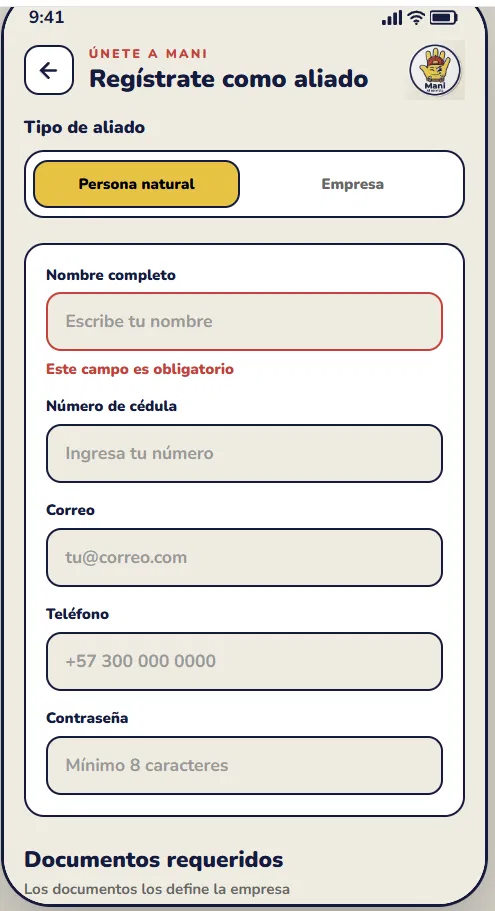
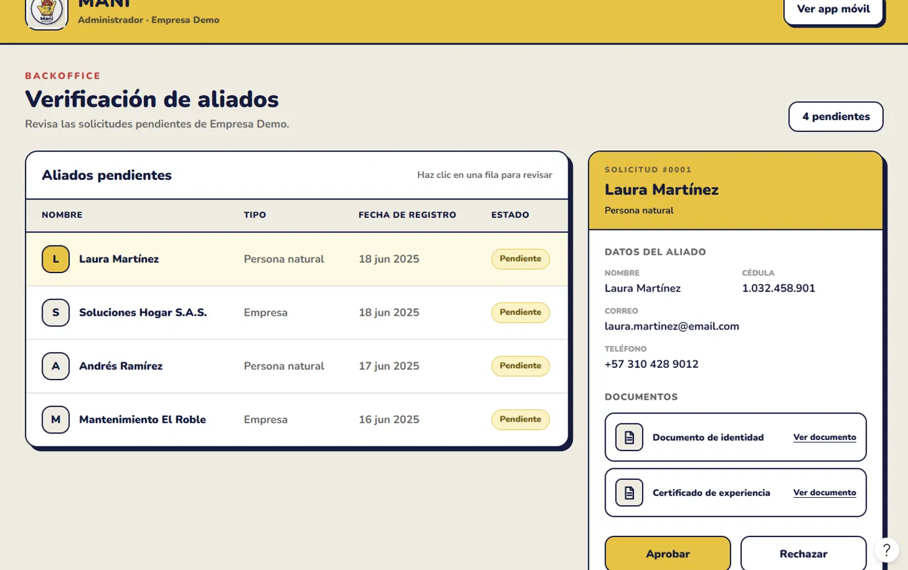

# SAD — Software Architecture Document — MANI

**Producto:** MANI — plataforma SaaS multi-tenant para formalización de operaciones de servicio  
**Documento vivo:** sin número de versión; la vigente es la de `main` y el historial está en el log del repositorio.  
**Arquitectura:** SOA distribuida + API Gateway + enfoque políglota  
**Persistencia:** Supabase como plataforma administrada, PostgreSQL como motor  
**Despliegue:** Docker + Kubernetes  
**Ambientes:** DEV → QA → PROD  
**Estrategia de repositorios:** Multi-repo  
**Diagramas de este documento:** los tres de alto nivel de [`diagrams/HLD/`](../diagrams/HLD/), inventariados y descritos en §4.2. Las doce vistas del modelo Structurizr las documenta [`SDD.md`](./SDD.md) §4.0  
**Modelo C4 formal:** [`workspace.dsl`](../diagrams/LLD/workspace.dsl), documentado vista por vista en [`SDD.md`](./SDD.md) §4  

---

# 1. Propósito

Este documento define la arquitectura de software de MANI y traduce los requerimientos funcionales, no funcionales y restricciones de producto del SRS en decisiones de diseño.

El SRS conserva autoridad sobre **qué debe hacer el sistema**. Este SAD define **cómo se estructura la solución** para satisfacer esos requerimientos.

Para evitar contaminación entre requisitos y solución, esta versión:

- usa RF, RNF y REST del SRS como drivers;
- no toma como drivers las notas históricas de inconsistencias arquitectónicas del SRS;
- no redefine requisitos;
- no duplica el modelo de datos físico ni el DDL, que viven en `ModeloDatos.md`;
- no duplica decisiones históricas completas de ADR, solo referencia las decisiones vigentes.

---

# 2. Alcance arquitectónico

MANI es una plataforma SaaS multi-tenant que soporta:

- administración de tenants;
- autenticación y autorización;
- directorio de aliados y clientes;
- KYC;
- categorías y cobertura por zonas;
- solicitudes;
- despacho;
- cotizaciones;
- ejecución;
- calificaciones;
- mensajería;
- notificaciones;
- tarifarios;
- reportes operativos;
- pagos y funcionalidades administrativas en un segundo incremento.

La arquitectura debe permitir que cada tenant opere con datos y reglas aisladas, sin requerir una versión diferente del software por empresa.

---

# 3. Drivers derivados del SRS

## 3.1 Drivers funcionales

Los principales drivers funcionales que condicionan el diseño son:

| Driver | Origen SRS | Impacto arquitectónico |
|---|---|---|
| Multi-tenancy y administración de tenants | RF-01, RF-02, RF-03 | contexto de tenant en todas las operaciones, configuración por tenant y autorización |
| KYC aislado | RF-05, RF-06, REST-02 | almacenamiento privado, autorización y aislamiento de archivos |
| Cobertura por zonas | RF-07, RF-09, RF-12, REST-01 | catálogo de zonas y servicio de disponibilidad/cobertura |
| Ranking configurable | RF-13 | motor de reglas por tenant |
| Despacho concurrente | RF-14 | servicio transaccional con exclusión atómica |
| Cotización y tarifario | RF-15, RF-16, RF-22, RF-23 | reglas, persistencia y reportes |
| Trazabilidad de ejecución | RF-18 | historial/auditoría de eventos |
| Calificación bidireccional | RF-19 | control de estado de cierre |
| Mensajería y notificaciones | RF-20, RF-21 | realtime + persistencia + push |
| Segundo incremento | RF-24..RF-28 | extensibilidad para pagos, quejas, consola y métricas |

## 3.2 Drivers no funcionales

| Driver | Origen SRS | Prioridad arquitectónica |
|---|---|---|
| Aislamiento multi-tenant | RNF-01 / REST-04 | Crítica |
| Configuración sin despliegue por tenant | RNF-02 / REST-05 | Crítica |
| Idempotencia | RNF-03 | Alta |
| Auditabilidad | RNF-04 | Alta |
| Exclusión concurrente | RNF-05 | Alta |
| Cumplimiento de pagos | RNF-06 / RNF-11 | Alta / segundo incremento |
| Rendimiento y concurrencia | RNF-07 | Alta como riesgo de diseño |
| Uso móvil | RNF-08 | Media |
| Cobertura por zonas | RNF-09 | Alta |
| Configuración KYC/tiempos/comisión | RNF-10 | Alta |

---

# 4. Arquitectura objetivo

MANI adopta una **arquitectura SOA distribuida**, con un **API Gateway** como frontera de entrada y un **enfoque políglota** para los servicios de negocio.

## 4.1 Principios

1. Flutter contiene presentación y lógica de interacción, no reglas de negocio centrales.
2. Toda API operacional entra por NGINX/API Gateway.
3. La lógica de dominio vive en servicios.
4. Cada servicio es responsable de su capacidad funcional.
5. Supabase es la plataforma de persistencia administrada; PostgreSQL es su motor.
6. El aislamiento multi-tenant se aplica en varios niveles: JWT, autorización de servicios y RLS.
7. Los servicios no escriben directamente en datos privados de otros dominios.
8. Los cambios de configuración por tenant no deben requerir nuevo despliegue.
9. La analítica se desacopla del OLTP.
10. Los artefactos desplegados son contenerizados, versionados e inmutables.

---

## 4.2 Inventario de diagramas de alto nivel

Los tres diagramas de alto nivel viven en [`diagrams/HLD/`](../diagrams/HLD/). **No se generan desde
el modelo Structurizr**: a diferencia de las doce vistas de [`SDD.md`](./SDD.md) §4.0, se dibujan a
mano y se mantienen a mano. Si uno contradice a este documento, manda el documento.

| # | Diagrama | Pregunta que responde | Archivo | Dónde se desarrolla |
|---|---|---|---|---|
| 1 | **DHL-ARQ** — arquitectura general | ¿Cómo está construida MANI? | [`DHL.png`](../diagrams/HLD/DHL.png) | §5, §6 y §7 |
| 2 | **DHL-INFRA** — infraestructura, CI/CD y operación | ¿Cómo se desarrolla, despliega y opera MANI? | [`Infra.png`](../diagrams/HLD/Infra.png) | §16, §17 y §18 |
| 3 | **TECHRADAR** — priorización tecnológica | ¿Qué tecnologías se adoptan, se evalúan o se descartan? | [`TechRadar.png`](../diagrams/HLD/TechRadar.png) | [`TECH_RADAR.md`](./TECH_RADAR.md) |

### 4.2.1 DHL-ARQ — arquitectura general

Representa la arquitectura lógica de MANI: una plataforma SaaS multi-tenant que gestiona
solicitudes, cotizaciones, asignaciones y ejecución de servicios entre clientes y aliados.

La capa de presentación es **Flutter**, que da acceso web y móvil a clientes, aliados y
administradores de tenant. Toda API operacional entra por el **API Gateway NGINX**, que enruta hacia
el servicio correspondiente.

La capa de negocio son **tres servicios**, y el diagrama muestra el reparto de responsabilidades que
fija §7:

| Servicio | Runtime | De qué responde |
|---|---|---|
| Rules Service | Java | reglas configurables por tenant, ranking del listado de aliados y validación de la cotización contra el tarifario |
| Dispatch Service | .NET | solicitudes, despacho, asignación, control de estados y exclusión concurrente |
| Core Service | Node.js | tenants e identidad, aliados y KYC, clientes y sitios, catálogo, **cobertura y disponibilidad**, cotización, ejecución, calificación, comunicaciones y reportes |

La persistencia es **Supabase sobre PostgreSQL**, con separación por esquemas de dominio,
Row-Level Security por tenant, almacenamiento privado de archivos y transporte de eventos en tiempo
real. Se completa con integraciones externas de notificación y de pagos, y con observabilidad.

Dos precisiones donde el dibujo se queda corto frente a este documento:

- **La elegibilidad de aliados la resuelve el Core Service, no el Rules Service.** Es la conjunción
  de categoría declarada, zona de cobertura y franja de agenda (§7.3 y §10); Rules aporta el
  **orden** del listado, no quién es elegible.
- **Las solicitudes pertenecen a Dispatch**, no al Core. El Core aporta la elegibilidad por API.

### 4.2.2 DHL-INFRA — infraestructura, CI/CD y operación

Representa el modelo operativo, desde la gestión del trabajo hasta la construcción, validación,
publicación y despliegue.

El proyecto usa una estrategia **multi-repo** en GitHub con los seis repositorios de §17, y **Jira**
centraliza actividades, incidencias y seguimiento. Cada repositorio desplegable tiene integración
continua con **GitHub Actions**: pruebas automatizadas, análisis estático con SonarQube, evaluación
de seguridad con OWASP ZAP, construcción de imágenes Docker y publicación en **GHCR**. La promoción
preserva la imagen validada (§18).

Los ambientes son **tres: DEV → QA → PROD** (§16). Supabase aporta PostgreSQL, Auth, Storage y
Realtime gestionados, y la operación se completa con Prometheus y Grafana para métricas, y Datadog
para logs, APM y trazas (§19).

Una precisión importante sobre este diagrama:

> **El diagrama muestra Kubernetes, y Kubernetes no es el estado actual.** Es la plataforma de
> orquestación **objetivo** exigida por PROY-08, pero su proveedor y topología siguen abiertos como
> INFRA-01 e INFRA-02. Hoy QA y PROD corren con **Docker sobre una máquina virtual por ambiente**, y
> DEV en las máquinas personales del equipo (§16.4). Mientras esa decisión no se cierre, el diagrama
> se lee como objetivo y no como inventario.

### 4.2.3 TECHRADAR — priorización tecnológica

Documenta qué tecnologías se adoptan y cuáles se evalúan o se descartan, para estandarizar, controlar
dependencias y evitar duplicidad de herramientas y costo operativo innecesario.

Clasifica por categoría —plataformas, lenguajes y frameworks, técnicas y gestión, herramientas e
infraestructura— en tres niveles: **Sí o sí** para la base adoptada, **Tal vez** para lo sujeto a
evaluación y **Mejor no** para lo que no se prioriza.

La base adoptada incluye Flutter y Dart, Node.js, Java, .NET, PostgreSQL, Supabase, GitHub, NGINX,
Docker, GitHub Actions, GHCR, SonarQube, OWASP ZAP, Newman, k6, OpenAPI, Prometheus, Grafana,
Datadog y Jira.

> **Kubernetes figura en el radar como objetivo, no como adoptado.** [`TECH_RADAR.md`](./TECH_RADAR.md)
> lo mantiene **en evaluación** por la misma razón que §16.4: la decisión de orquestación está
> abierta. Si el diagrama lo muestra en «Sí o sí», manda el documento.

### 4.2.4 Los tres diagramas describen arquitectura objetivo

Conviene leerlos distinguiendo lo implementado de lo planificado. En particular: **que SonarQube,
OWASP ZAP, Newman y los controles de calidad aparezcan en el diagrama de infraestructura no
demuestra que esos procesos estén operativos** en los repositorios.

El estado real de cada gate se registra aparte, no en el dibujo:

- el estado del análisis de SonarCloud por repositorio, en
  [`INFRAESTRUCTURA_MANI.md`](../governance/INFRAESTRUCTURA_MANI.md) §24.1;
- la regla para considerar un gate **vinculante** —check obligatorio en un ruleset activo y evidencia
  de un PR bloqueado—, en
  [`POLITICAS_DEVOPS_HERRAMIENTAS.md`](../governance/POLITICAS_DEVOPS_HERRAMIENTAS.md) §6.2.

---

# 5. Vista de contexto — C4 Nivel 1


> **Figura 1 — Diagrama de alto nivel (DHL).** Archivo: [`diagrams/HLD/DHL.png`](../diagrams/HLD/DHL.png).
> La vista C4 formal correspondiente es `contexto` en [`workspace.dsl`](../diagrams/LLD/workspace.dsl), documentada en SDD §4.1.

```text
Actores
  Cliente · Aliado · Administrador de tenant · Administrador de plataforma
        ↓
                          [ MANI ]
        ↓
Sistemas externos
  FCM / APNs · Operador de pagos (2.º incremento) · Observabilidad · Data Warehouse / BI
```

---

# 6. Vista de contenedores — C4 Nivel 2


> **Figura 2 — Componentes de la solución en el DHL.** Archivo: [`diagrams/HLD/DHL.png`](../diagrams/HLD/DHL.png).
> La vista C4 formal correspondiente es `contenedores` en [`workspace.dsl`](../diagrams/LLD/workspace.dsl), documentada en SDD §4.2.

```text
Usuarios
   ↓
Flutter Web / Mobile                    presentación e interacción
   ↓ HTTPS
NGINX API Gateway                       entrada única, routing y políticas transversales
   ↓
Rules (Java) · Dispatch (.NET) · Core (Node.js)
   ↓
Supabase: Auth · PostgreSQL + RLS · Storage · Realtime
   ↓
Integraciones: FCM/APNs · Operador de pagos (2.º incremento)
```

---

# 7. Responsabilidad de servicios

## 7.1 Rules Service — Java

Responsable de:

- RF-02: evaluación de reglas configurables por tenant;
- RF-13: ranking de aliados;
- RF-16: validación contra tarifario;
- RF-22: reglas y rangos tarifarios;
- parte de RNF-02 y RNF-10.

No almacena reglas fijas por tenant en código. Obtiene configuración desde persistencia.

## 7.2 Dispatch Service — .NET

Responsable de:

- RF-12: creación y coordinación operacional de solicitudes;
- RF-14: aceptación/rechazo;
- RNF-03: idempotencia;
- RNF-05: exclusión concurrente;
- control de estados de asignación;
- auditoría transaccional del despacho.

La primera aceptación válida se confirma mediante actualización condicional atómica. Las aceptaciones posteriores obtienen `409 Conflict`.

## 7.3 Core Service — Node.js

Responsable de:

- RF-01: tenants;
- RF-03 y RF-04: integración de identidad y acceso;
- RF-05 y RF-06: aliados y KYC;
- RF-08 y RF-09: clientes y sitios;
- RF-10 y RF-11: categorías y asociaciones;
- RF-15, RF-17, RF-18, RF-19;
- RF-20 y RF-21;
- RF-23;
- RF-07: cobertura del aliado;
- RF-12: consulta de elegibilidad por categoría y zona, disponibilidad, horarios y zonas, con soporte a RNF-07 en la ruta crítica de consulta;
- segundo incremento RF-24..RF-28, cuando se implemente.

En módulos de alta complejidad puede dividirse internamente por dominios sin convertir cada operación CRUD en un servicio independiente. La **disponibilidad es uno de esos dominios internos**, no un servicio desplegable aparte: vive en el bloque Node junto al catálogo y la comunicación, y es lo que Despacho consulta antes de conformar el listado de candidatos.

---

# 8. Multi-tenancy y seguridad

## 8.1 Identificación de tenant

Para operaciones autenticadas:

```text
Authorization: Bearer <JWT>
```

El `tenant_id` se obtiene de un JWT firmado.

El cliente no puede decidir el tenant de autorización mediante un header libre.

En preautenticación puede utilizarse `X-Tenant-Slug` únicamente como contexto de resolución, nunca como fuente de autorización.

## 8.2 Capas de control

```text
Cliente
  ↓
API Gateway
  ↓  valida token / políticas de acceso
Servicio
  ↓  valida rol y permiso
Supabase / PostgreSQL
  ↓  RLS por tenant
Datos
```

La arquitectura cumple RNF-01 mediante defensa en profundidad.

## 8.3 Acceso del cliente a Supabase

El cliente Flutter alcanza Supabase por **exactamente dos caminos**, y **no existe ninguna
excepción**:

| Camino | Para qué | Por qué es legítimo |
|---|---|---|
| `Flutter → Supabase Auth` | iniciar sesión, registrar usuario y refrescar el JWT | la identidad la emite Supabase GoTrue y el tenant viaja como claim firmado (ADR-0018, ADR-0027) |
| `Flutter ← Supabase Realtime` | recibir eventos de mensajería mientras el usuario está conectado | Realtime es un **transporte de eventos**: no lee tablas de negocio, no ejecuta reglas y no decide nada. El evento lo publica el Core después de persistir el mensaje |

Queda prohibido y retirado del cliente, sin excepción transitoria ni de disponibilidades:

- `.from()` — acceso a tablas vía PostgREST;
- `.rpc()` — invocación de funciones almacenadas;
- `.storage.from()` — acceso directo a Storage. Los documentos KYC se suben por endpoint
  intermediario o URL prefirmada que emite el Core.

La consulta de disponibilidades **no** es una excepción: entra por el Gateway al Core como
cualquier otra lectura de negocio. Esto materializa
[ADR-0022](../adr/ADR-0022-logica-de-negocio-en-servicios.md) y
[ADR-0027](../adr/ADR-0027-alcance-supabase-cliente-flutter.md).

El detalle, con la tabla de dependencias permitidas y prohibidas, está en
[`SDD.md`](./SDD.md) §2.2 y §14.

## 8.4 Documentos KYC

Los documentos se almacenan en Supabase Storage.

Convención:

```text
tenant_id/aliado_id/documento
```

Controles:

- bucket privado;
- políticas de acceso;
- separación por tenant;
- separación por aliado;
- administrador de tenant limitado a su tenant.

Esto responde a RF-05, RF-06 y REST-02.

## 8.5 Vista de interfaz del registro y la verificación de aliados

Las historias migradas de `EP-02` tienen mockup aprobado en Figma (`PO-06`, `SCRUM-1093`). El archivo fuente es
[MANI — Figma Make](https://www.figma.com/make/VsrVQhwNp6r9t0WEpcpX8s/Review-design-link) y las exportaciones
versionadas viven en [`diagrams/MOCKUPS/`](../diagrams/MOCKUPS/). Las dos figuras siguientes ilustran cómo la
interfaz materializa los controles de esta sección: la carga de documentos KYC definidos por el tenant y una
bandeja de verificación limitada a la empresa del administrador.



**Figura 8.1 — Registro de aliado (persona natural).** Selector de tipo de aliado, datos de identificación y
sección de documentos requeridos, cuya lista la configura cada tenant (RF-02, RNF-10). Ilustra `US-02.1.1`
Registro aliado persona natural (`SCRUM-846`), migrada en `US-02.1.1-M2` (`SCRUM-1065`); la variante de empresa
corresponde a `US-02.1.2` (`SCRUM-847`). Fuente: [Figma](https://www.figma.com/make/VsrVQhwNp6r9t0WEpcpX8s/Review-design-link).



**Figura 8.2 — Bandeja de verificación del Backoffice.** El administrador ve solo los aliados pendientes de su
tenant, consulta sus documentos y aprueba o rechaza; el rechazo exige un motivo. Ilustra `US-02.1.3`
Aprobar/rechazar registro de aliado (`SCRUM-848`), migrada en `US-02.1.3-M2` (`SCRUM-1066`), y responde a RF-06 y
RNF-01. Fuente: [Figma](https://www.figma.com/make/VsrVQhwNp6r9t0WEpcpX8s/Review-design-link).

Exportaciones disponibles en `diagrams/MOCKUPS/`:

| Archivo | Pantalla | Historia |
|---|---|---|
| `perfil-acceso-registros.png` | Acceso a los registros desde el perfil | `US-02.1.1`, `US-02.2.1` |
| `registro-aliado-persona-natural.png` | Registro de aliado persona natural | `US-02.1.1` (`SCRUM-846`) |
| `registro-aliado-empresa.png` | Registro de aliado empresa | `US-02.1.2` (`SCRUM-847`) |
| `registro-aliado-confirmacion.png` | Confirmación: registro pendiente de verificación | `US-02.1.1`, `US-02.1.2` |
| `backoffice-verificacion-aliados.png` | Bandeja de verificación de aliados | `US-02.1.3` (`SCRUM-848`) |
| `backoffice-aliado-aprobado.png` | Aliado aprobado en la bandeja | `US-02.1.3` (`SCRUM-848`) |
| `registro-cliente.png` | Registro de cliente persona natural | `US-02.2.1` (`SCRUM-851`) |

---

# 9. Configuración por tenant

RF-02, RNF-02, RNF-10 y REST-05 exigen evitar código específico por empresa.

La configuración se mantiene como datos:

- documentos KYC requeridos;
- reglas de ranking;
- categorías;
- tarifarios;
- comisión;
- tiempos;
- parámetros operativos.

```text
Tenant
  ↓
Configuración / Reglas
  ↓
Rules Service
  ↓
Comportamiento dinámico
```

Una modificación de una regla de tenant no exige un despliegue de software.

---

# 10. Cobertura y disponibilidad

El diseño respeta REST-01 y RNF-09:

- cobertura mediante catálogo de zonas;
- granularidad operativa MVP: localidad/comuna;
- no radio geográfico;
- no geolocalización en tiempo real;
- no cálculo de proximidad;
- match exacto por identificador de zona.

```text
Sitio
  └── Zona

Aliado
  ├── Categoría
  └── CoberturaZona

Elegible =
  misma categoría
  AND
  misma zona
  AND
  disponible
```

---

# 11. Ciclo del servicio

```text
Solicitud
  → Selección de aliados válidos (categoría + zona)
  → Broadcast
  → Aceptación atómica
  → Cotización
  → Aceptación / ajuste del cliente
  → Ejecución
  → Calificación del cliente  +  Calificación del aliado
  → Cierre
```

El cierre solo ocurre cuando ambas calificaciones requeridas por RF-19 existen.

---

# 12. Mensajería y notificaciones

Para RF-20 y RF-21:

- Supabase Realtime entrega eventos mientras los participantes están conectados;
- FCM/APNs entrega push cuando el cliente está en background o desconectado;
- los mensajes asociados al servicio se persisten;
- el historial de conversación puede consultarse posteriormente;
- Realtime transporta eventos, pero no ejecuta reglas de negocio.

Esto evita que una reconexión implique pérdida del estado del servicio.

---

# 13. Auditabilidad

RNF-04 y RF-18 requieren reconstrucción de los eventos relevantes.

Se mantienen:

- historial de estados de solicitud;
- actor;
- fecha/hora;
- operación;
- correlation ID;
- eventos de despacho;
- cambios de cotización;
- eventos de ejecución;
- auditoría de operaciones sensibles.

Para el segundo incremento, las operaciones financieras requieren registro inmutable.

---

# 14. Persistencia

MANI utiliza:

> **Supabase como plataforma administrada y PostgreSQL como motor relacional.**

No se consideran Supabase y PostgreSQL alternativas distintas.

Capacidades utilizadas:

- PostgreSQL;
- RLS;
- Auth;
- Storage;
- Realtime.

El detalle conceptual, lógico, físico, DDL y diccionario vive en `ModeloDatos.md`.

---

# 15. Data Warehouse y análisis

RF-28 requiere métricas operativas por tenant en el segundo incremento.

La solución analítica se mantiene separada del flujo transaccional:

```text
Supabase / PostgreSQL (OLTP) → CDC / ELT incremental → Data Warehouse → Dashboards / Analytics
```

Esto evita ejecutar consultas analíticas intensivas directamente sobre las tablas operacionales.

El modelo dimensional se especifica en `ModeloDatos.md`.

---

# 16. Vista de despliegue


> **Figura 3 — Infraestructura de alto nivel.** Archivo: [`diagrams/HLD/Infra.png`](../diagrams/HLD/Infra.png).
> La vista C4 de despliegue formal es `despliegue-prod` en [`workspace.dsl`](../diagrams/LLD/workspace.dsl), documentada en SDD §9.1. Los demás ambientes comparten esa topología y cambian escalado, secretos y datos (SDD §10).

MANI mantiene tres ambientes:

```text
DEV → QA → PROD
```

No se define STAGING como cuarto ambiente.

## 16.1 DEV

- desarrollo e integración;
- Docker local cuando aplique;
- Kubernetes para la validación del modelo de despliegue cuando corresponda;
- datos sintéticos;
- sin datos reales de usuarios o KYC.

## 16.2 QA

- pruebas funcionales;
- integración;
- contract tests;
- aislamiento multi-tenant;
- Newman;
- OWASP ZAP;
- pruebas de concurrencia;
- Supabase separado de producción.

## 16.3 PROD

- usuarios y datos reales;
- Supabase productivo;
- artefactos inmutables;
- controles de acceso productivos;
- monitoreo y alertamiento.

## 16.4 Kubernetes

Kubernetes es el orquestador de la solución contenerizada.

La decisión de proveedor de cómputo o dimensionamiento físico puede cambiar sin alterar la arquitectura lógica descrita en este SAD.

---

# 17. Estrategia multi-repositorio

La solución mantiene una estrategia **multi-repo**:

| Repositorio | Tecnología | Responsabilidad principal |
|---|---|---|
| `MANI-Frontend` | Flutter / Dart | Cliente web y móvil |
| `MANI-API-Gateway` | NGINX | Punto de entrada y enrutamiento de APIs |
| `MANI-Rules-Service` | Java | Reglas de negocio por tenant |
| `MANI-Dispatch-Service` | .NET | Solicitudes, despacho y asignación |
| `MANI-Core-Service` | Node.js | Servicios core y disponibilidades |
| `MANI-Docs` | Markdown / diagramas / ADR | Documentación arquitectónica y técnica |

Son **seis repositorios** y cinco desplegables ([ADR-0028](../adr/ADR-0028-nombres-repositorios-y-ambientes.md)).
No existe `MANI-Availability` —la disponibilidad es un dominio del Core— ni `MANI-Infra`, que DevOps
borró: la infraestructura de datos y el stack local viven en `MANI-API-Gateway` (ADR-0004, enmienda
del 2026-10-07).

Cada unidad desplegable mantiene:

- dependencias;
- pruebas;
- build;
- versionamiento;
- pipeline;
- artefacto contenerizado.

`MANI-Docs` mantiene SDD, ADR, modelo de datos y diagramas técnicos.

---

# 18. CI/CD

```text
Pull Request
  → Unit / Integration / Contract Tests
  → SonarQube
  → Docker Build
  → Dependency / Image Scan
  → Deploy QA
  → Newman
  → OWASP ZAP
  → Promoción del mismo artefacto a PROD
```

Principio:

> **Build once, deploy many.**

El artefacto validado se promueve sin reconstruirse.

---

# 19. Observabilidad

Se emplean:

- Prometheus para métricas;
- Grafana para dashboards;
- Datadog para logs/APM/trazas;
- correlation ID para seguimiento entre servicios;
- alertas integradas con Jira.

La instrumentación cubre:

- API Gateway;
- Rules Service;
- Dispatch Service;
- Core Service;
- infraestructura Kubernetes.

---

# 20. Atributos de calidad priorizados

Este SAD declara **qué atributo es prioritario y por qué**. Los umbrales con los que se verifica
viven únicamente en [`SDD.md`](./SDD.md) §7, y los escenarios con los que QA los comprueba en
[`SDD.md`](./SDD.md) §8.

| Atributo | Prioridad | Por qué lo es en MANI | Driver | Umbrales |
|---|---|---|---|---|
| **Seguridad** | P1 | el aislamiento multi-tenant cubre datos, archivos KYC, usuarios y configuración; una fuga cruza empresas, no usuarios | RNF-01, REST-02, REST-04 | [SDD §7.2](./SDD.md) |
| **Fiabilidad** | P1 | el despacho debe terminar en exactamente una asignación válida y las operaciones críticas toleran reintentos | RNF-03, RNF-05 | [SDD §7.3](./SDD.md) |
| **Eficiencia de desempeño** | P1 | la consulta de elegibilidad y el ranking están en la ruta crítica de cada solicitud | RNF-07 | [SDD §7.4](./SDD.md) |
| **Mantenibilidad** | P1 | tres runtimes y varios dominios elevan el costo de cambio; sin límites claros aparece el monolito distribuido | PROY-07 | [SDD §7.5](./SDD.md) |
| **Flexibilidad** | P1 | cada tenant configura sus reglas sin despliegue propio, y la plataforma de orquestación aún puede cambiar | RNF-02, RNF-10, REST-05 | [SDD §7.6](./SDD.md) |
| **Compatibilidad** | P2 | los servicios se integran entre tecnologías distintas y con terceros | PROY-07 | [SDD §7.7](./SDD.md) |
| **Adecuación funcional** | P2 | la exactitud de reglas, asignaciones y estados es verificable por pruebas | RF-13, RF-14, RF-16 | [SDD §7.8](./SDD.md) |
| **Capacidad de interacción** | P2 | clientes y aliados operan desde móvil | RNF-08 | [SDD §7.9](./SDD.md) |
| **Protección / Safety** | P3 | no es un sistema safety-critical, pero debe evitar operaciones irreversibles inseguras | — | [SDD §7.10](./SDD.md) |

## 20.1 Decisiones que esta priorización obliga

La priorización no es declarativa: condiciona el diseño descrito en este documento.

| Prioridad | Decisión que obliga | Dónde está |
|---|---|---|
| Seguridad P1 | defensa en profundidad: JWT + autorización en servicio + RLS, y aislamiento equivalente en Storage | §8 |
| Seguridad P1 | el cliente alcanza Supabase solo por Auth y Realtime | §8.3 |
| Fiabilidad P1 | exclusión concurrente por actualización condicional atómica en Dispatch | §7.2, §11 |
| Fiabilidad P1 | efectos secundarios por eventos: un fallo de push no revierte una operación confirmada | §12, §21 |
| Desempeño P1 | índice de búsqueda de elegibilidad por categoría, zona, fecha y estado | §7.3, §10 |
| Mantenibilidad P1 | propiedad de datos por dominio; ningún servicio escribe el esquema de otro | §14, ModeloDatos §13 |
| Flexibilidad P1 | configuración por tenant como datos, no como código ni como rama | §9 |
| Flexibilidad P1 | artefactos OCI inmutables y configuración externa, para que la orquestación pueda cambiar | §18 |

> **Por qué esta sección no trae cifras.** Antes repetía umbrales que contradecían al SDD: `p95 ≤ 1 s`
> aquí frente a `p95 ≤ 500 ms` allí, y 20 usuarios concurrentes frente a 300 sesiones. Con dos
> fuentes para el mismo número, ninguna era verificable. Cambiar un umbral es cambiar el SDD.

---

# 21. Patrones arquitectónicos

## 21.1 SOA

Capacidades de negocio separadas en servicios con contratos explícitos.

## 21.2 API Gateway

NGINX concentra:

- entrada;
- autenticación inicial;
- routing;
- rate limiting;
- políticas transversales.

## 21.3 Layered Architecture interna

Cada servicio mantiene:

```text
API
↓
Application
↓
Domain
↓
Ports
↑
Adapters / Infrastructure
```

## 21.4 Repository / Ports and Adapters

La lógica del dominio no depende directamente de Supabase/PostgreSQL.

## 21.5 Event-driven para efectos secundarios

Aplicable a:

- notificaciones;
- auditoría;
- analítica;
- eventos no críticos para la respuesta sincrónica.

---

# 22. Patrones de diseño

| Patrón | Uso |
|---|---|
| Strategy | reglas variables por tenant |
| Factory | selección de estrategia |
| Repository | persistencia |
| Adapter | FCM/APNs, pagos, proveedores |
| Facade/Application Service | coordinación de casos de uso |
| Observer/Publish-Subscribe | notificaciones y eventos |
| Circuit Breaker | integraciones externas |
| Retry | fallas transitorias |
| Idempotency Key | evitar duplicados |
| Outbox | consistencia entre transacción y publicación de eventos |

---

# 23. Riesgos arquitectónicos

## Lógica de negocio en Flutter

**Riesgo:** duplicación, exposición de reglas y clientes inconsistentes.  
**Control:** mover lógica al backend.

## Acceso directo indiscriminado a Supabase

**Riesgo:** bypass de controles y acoplamiento.  
**Control:** servicios como frontera principal; RLS como defensa adicional.

## Servicios excesivamente pequeños

**Riesgo:** monolito distribuido.  
**Control:** dividir por capacidad de negocio, no por operación CRUD.

## Dependencias síncronas largas

**Riesgo:** fallos en cascada.  
**Control:** eventos para efectos secundarios y circuit breaker.

## Pérdida de aislamiento multi-tenant

**Riesgo:** exposición de datos entre empresas.  
**Control:** JWT + autorización + RLS + pruebas automatizadas.

## Doble asignación

**Riesgo:** inconsistencia operacional.  
**Control:** exclusión atómica en PostgreSQL.

## Consultas analíticas sobre OLTP

**Riesgo:** degradación del flujo operacional.  
**Control:** Data Warehouse separado.

## Complejidad políglota

**Riesgo:** mayor costo de operación y soporte.  
**Control:** contratos estandarizados, CI/CD homogéneo y límites claros por servicio.

## Custodia de pagos del segundo incremento

**Riesgo:** si MANI retiene en cuentas propias el dinero de los clientes (escrow), podría incurrir en captación masiva y habitual de dineros del público sin autorización (Código Penal art. 316; Decreto 1981 de 1988).  
**Control:** la custodia del dinero queda en un operador de pagos regulado y MANI solo gestiona el estado del pago (ADR-0023, ADR-0024; RNF-06, RNF-11).

---

# 24. Matriz de trazabilidad SRS → Arquitectura

## 24.1 MVP

| Requisito | Componente principal | Mecanismo |
|---|---|---|
| RF-01 | Core | tenant |
| RF-02 | Rules/Core | configuración dinámica |
| RF-03 | Gateway + Auth + servicios + RLS | JWT multi-tenant |
| RF-04 | Supabase Auth/Core | recuperación segura |
| RF-05 | Core + Storage | registro + KYC |
| RF-06 | Core | workflow de aprobación |
| RF-07 | Core | cobertura por zonas |
| RF-08 | Core | clientes y sitios |
| RF-09 | Core | sitio + zona + condiciones |
| RF-10 | Core | categorías |
| RF-11 | Core | aliado-categoría |
| RF-12 | Dispatch + Core | solicitud y aliados válidos |
| RF-13 | Rules | ranking |
| RF-14 | Dispatch | broadcast + exclusión atómica |
| RF-15 | Core/Dispatch | cotización |
| RF-16 | Rules | validación tarifaria |
| RF-17 | Core | aceptar/rechazar/ajustar |
| RF-18 | Core | historial de ejecución |
| RF-19 | Core | calificación bidireccional y cierre |
| RF-20 | Core + Realtime + FCM/APNs | mensajería/notificación |
| RF-21 | Core + persistencia | consulta de conversaciones |
| RF-22 | Rules/Core | tarifario por tenant |
| RF-23 | Core + Data Warehouse/Reporting | reporte de cotizaciones |

## 24.2 Segundo incremento

| Requisito | Evolución prevista |
|---|---|
| RF-24 | Adapter a operador de pagos |
| RF-25 | módulo de liquidación/comisión |
| RF-26 | módulo de quejas |
| RF-27 | consola de tenant |
| RF-28 | Data Warehouse + BI |

---

# 25. Verificación de cobertura frente al SRS

## Cubierto por el diseño

La arquitectura contempla explícitamente:

- aislamiento de tenants;
- reglas configurables;
- autenticación;
- KYC;
- cobertura por zonas;
- categorías;
- solicitud;
- ranking;
- despacho concurrente;
- cotizaciones;
- tarifarios;
- ejecución;
- calificación;
- mensajería;
- notificaciones;
- reportes;
- extensibilidad para el segundo incremento.

## Ajustes incorporados respecto al SAD anterior

1. Se elimina Serverpod como backend principal.
2. Se consolida Java + .NET + Node.js.
3. Se incorpora API Gateway.
4. Se mantiene Supabase, aclarando que PostgreSQL es su motor.
5. Se fija multi-repo.
6. Se fijan tres ambientes: DEV, QA y PROD.
7. Se elimina STAGING como cuarto ambiente.
8. Se mantiene Kubernetes como orquestador.
9. Se incorpora explícitamente el dominio de disponibilidad (RF-07, RF-12) dentro de Core Service.
10. Se incorpora trazabilidad completa RF/RNF → componente.
11. Se incorpora Data Warehouse para RF-28 y analítica.
12. Se amplía el diseño para RF-19, RF-20, RF-21, RF-22 y RF-23, que no deben quedar implícitos.

---

# 26. Documentos relacionados

- `SRS_MANI.md` — fuente de verdad de requerimientos.
- `ModeloDatos.md` — diseño conceptual, lógico, físico y analítico.
- `SDD.md` — descripción detallada de diseño de software.
- `/docs/adr/` — decisiones arquitectónicas.
- [`workspace.dsl`](../diagrams/LLD/workspace.dsl) — modelo C4 en Structurizr DSL: vistas `panorama`, `contexto`, `contenedores`, `componentes-*`, `dinamico-*` y `despliegue-prod`.
- [`diagrams/HLD/`](../diagrams/HLD/) — diagramas de alto nivel (DHL) e infraestructura ilustrativa que referencia este SAD.
- [`diagrams/MOCKUPS/`](../diagrams/MOCKUPS/) — mockups de interfaz exportados desde Figma que referencia la §8.4.
