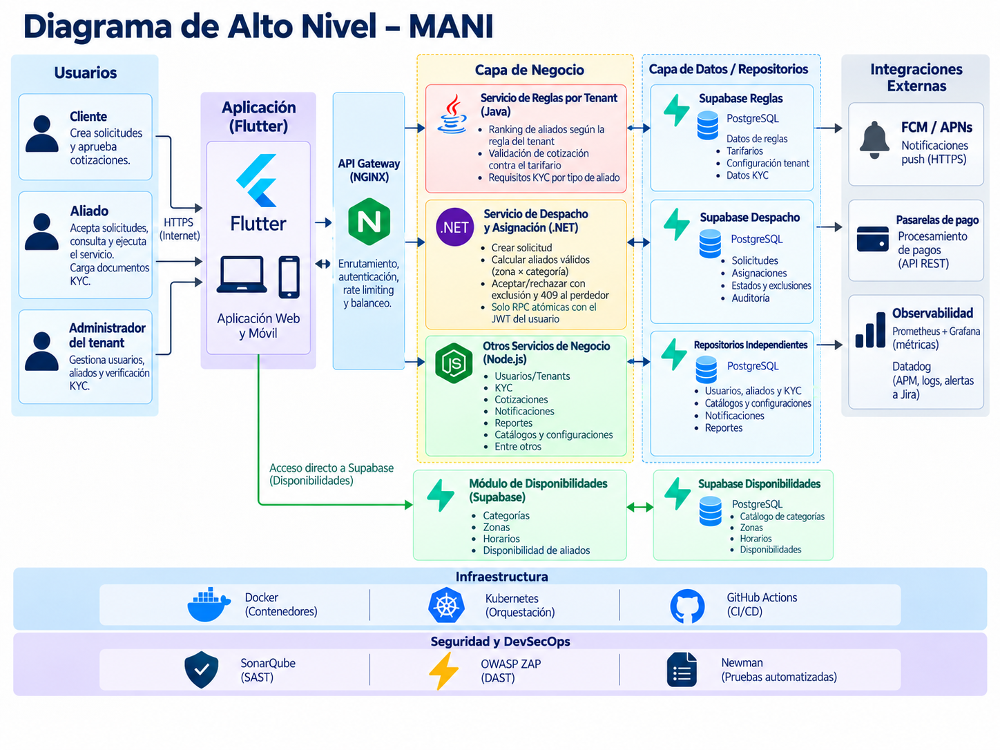
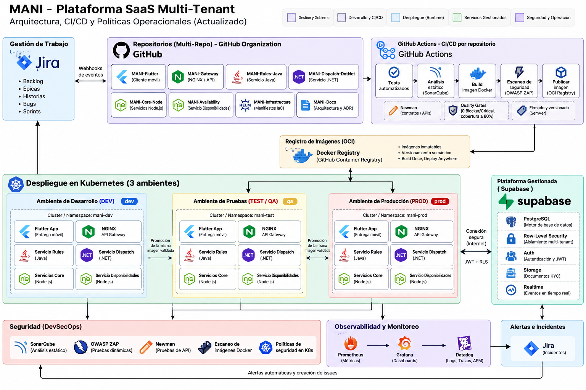

# SAD — Software Architecture Document — MANI

**Producto:** MANI — plataforma SaaS multi-tenant para formalización de operaciones de servicio  
**Versión:** Actualización alineada con SRS V3 y arquitectura objetivo  
**Arquitectura:** SOA distribuida + API Gateway + enfoque políglota  
**Persistencia:** Supabase como plataforma administrada, PostgreSQL como motor  
**Despliegue:** Docker + Kubernetes  
**Ambientes:** DEV → TEST/QA → PROD  
**Estrategia de repositorios:** Multi-repo  
**Diagramas de este documento:** diagramas de alto nivel (DHL) en [`diagrams/ALTO_NIVEL/`](../diagrams/ALTO_NIVEL/) — [DHL.png](../diagrams/ALTO_NIVEL/DHL.png), [Infra.png](../diagrams/ALTO_NIVEL/Infra.png), [TechRadar.png](../diagrams/ALTO_NIVEL/TechRadar.png)  
**Modelo C4 formal:** [`workspace.dsl`](../diagrams/C4Model/workspace.dsl), documentado vista por vista en [`SDD.md`](./SDD.md) §4  

---

# 1. Propósito

Este documento define la arquitectura de software de MANI y traduce los requerimientos funcionales, no funcionales y restricciones de producto del SRS en decisiones de diseño.

El SRS conserva autoridad sobre **qué debe hacer el sistema**. Este SAD define **cómo se estructura la solución** para satisfacer esos requerimientos.

Para evitar contaminación entre requisitos y solución, esta versión:

- usa RF, RNF y REST del SRS como drivers;
- no toma como drivers las notas históricas de inconsistencias arquitectónicas del SRS;
- no redefine requisitos;
- no duplica el modelo de datos físico ni el DDL, que viven en `ModeloDatos.md`;
- no duplica decisiones históricas completas de ADR, solo referencia las decisiones vigentes.

---

# 2. Alcance arquitectónico

MANI es una plataforma SaaS multi-tenant que soporta:

- administración de tenants;
- autenticación y autorización;
- directorio de aliados y clientes;
- KYC;
- categorías y cobertura por zonas;
- solicitudes;
- despacho;
- cotizaciones;
- ejecución;
- calificaciones;
- mensajería;
- notificaciones;
- tarifarios;
- reportes operativos;
- pagos y funcionalidades administrativas en un segundo incremento.

La arquitectura debe permitir que cada tenant opere con datos y reglas aisladas, sin requerir una versión diferente del software por empresa.

---

# 3. Drivers derivados del SRS

## 3.1 Drivers funcionales

Los principales drivers funcionales que condicionan el diseño son:

| Driver | Origen SRS | Impacto arquitectónico |
|---|---|---|
| Multi-tenancy y administración de tenants | RF-01, RF-02, RF-03 | contexto de tenant en todas las operaciones, configuración por tenant y autorización |
| KYC aislado | RF-05, RF-06, REST-02 | almacenamiento privado, autorización y aislamiento de archivos |
| Cobertura por zonas | RF-07, RF-09, RF-12, REST-01 | catálogo de zonas y servicio de disponibilidad/cobertura |
| Ranking configurable | RF-13 | motor de reglas por tenant |
| Despacho concurrente | RF-14 | servicio transaccional con exclusión atómica |
| Cotización y tarifario | RF-15, RF-16, RF-22, RF-23 | reglas, persistencia y reportes |
| Trazabilidad de ejecución | RF-18 | historial/auditoría de eventos |
| Calificación bidireccional | RF-19 | control de estado de cierre |
| Mensajería y notificaciones | RF-20, RF-21 | realtime + persistencia + push |
| Segundo incremento | RF-24..RF-28 | extensibilidad para pagos, quejas, consola y métricas |

## 3.2 Drivers no funcionales

| Driver | Origen SRS | Prioridad arquitectónica |
|---|---|---|
| Aislamiento multi-tenant | RNF-01 / REST-04 | Crítica |
| Configuración sin despliegue por tenant | RNF-02 / REST-05 | Crítica |
| Idempotencia | RNF-03 | Alta |
| Auditabilidad | RNF-04 | Alta |
| Exclusión concurrente | RNF-05 | Alta |
| Cumplimiento de pagos | RNF-06 / RNF-11 | Alta / segundo incremento |
| Rendimiento y concurrencia | RNF-07 | Alta como riesgo de diseño |
| Uso móvil | RNF-08 | Media |
| Cobertura por zonas | RNF-09 | Alta |
| Configuración KYC/tiempos/comisión | RNF-10 | Alta |

---

# 4. Arquitectura objetivo

MANI adopta una **arquitectura SOA distribuida**, con un **API Gateway** como frontera de entrada y un **enfoque políglota** para los servicios de negocio.

## 4.1 Principios

1. Flutter contiene presentación y lógica de interacción, no reglas de negocio centrales.
2. Toda API operacional entra por NGINX/API Gateway.
3. La lógica de dominio vive en servicios.
4. Cada servicio es responsable de su capacidad funcional.
5. Supabase es la plataforma de persistencia administrada; PostgreSQL es su motor.
6. El aislamiento multi-tenant se aplica en varios niveles: JWT, autorización de servicios y RLS.
7. Los servicios no escriben directamente en datos privados de otros dominios.
8. Los cambios de configuración por tenant no deben requerir nuevo despliegue.
9. La analítica se desacopla del OLTP.
10. Los artefactos desplegados son contenerizados, versionados e inmutables.

---

# 5. Vista de contexto — C4 Nivel 1



> **Figura 1 — Diagrama de alto nivel (DHL).** Archivo: [`diagrams/ALTO_NIVEL/DHL.png`](../diagrams/ALTO_NIVEL/DHL.png).
> La vista C4 formal correspondiente es `contexto` en [`workspace.dsl`](../diagrams/C4Model/workspace.dsl), documentada en SDD §4.1.

```text
Actores
  Cliente · Aliado · Administrador de tenant · Administrador de plataforma
        ↓
                          [ MANI ]
        ↓
Sistemas externos
  FCM / APNs · Operador de pagos (2.º incremento) · Observabilidad · Data Warehouse / BI
```

---

# 6. Vista de contenedores — C4 Nivel 2


> **Figura 2 — Componentes de la solución en el DHL.** Archivo: [`diagrams/ALTO_NIVEL/DHL.png`](../diagrams/ALTO_NIVEL/DHL.png).
> La vista C4 formal correspondiente es `contenedores` en [`workspace.dsl`](../diagrams/C4Model/workspace.dsl), documentada en SDD §4.2.

```text
Usuarios
   ↓
Flutter Web / Mobile                    presentación e interacción
   ↓ HTTPS
NGINX API Gateway                       entrada única, routing y políticas transversales
   ↓
Rules (Java) · Dispatch (.NET) · Core (Node.js) · Availability (Node.js)
   ↓
Supabase: Auth · PostgreSQL + RLS · Storage · Realtime
   ↓
Integraciones: FCM/APNs · Operador de pagos (2.º incremento)
```

---

# 7. Responsabilidad de servicios

## 7.1 Rules Service — Java

Responsable de:

- RF-02: evaluación de reglas configurables por tenant;
- RF-13: ranking de aliados;
- RF-16: validación contra tarifario;
- RF-22: reglas y rangos tarifarios;
- parte de RNF-02 y RNF-10.

No almacena reglas fijas por tenant en código. Obtiene configuración desde persistencia.

## 7.2 Dispatch Service — .NET

Responsable de:

- RF-12: creación y coordinación operacional de solicitudes;
- RF-14: aceptación/rechazo;
- RNF-03: idempotencia;
- RNF-05: exclusión concurrente;
- control de estados de asignación;
- auditoría transaccional del despacho.

La primera aceptación válida se confirma mediante actualización condicional atómica. Las aceptaciones posteriores obtienen `409 Conflict`.

## 7.3 Core Services — Node.js

Responsable de:

- RF-01: tenants;
- RF-03 y RF-04: integración de identidad y acceso;
- RF-05 y RF-06: aliados y KYC;
- RF-08 y RF-09: clientes y sitios;
- RF-10 y RF-11: categorías y asociaciones;
- RF-15, RF-17, RF-18, RF-19;
- RF-20 y RF-21;
- RF-23;
- segundo incremento RF-24..RF-28, cuando se implemente.

En módulos de alta complejidad puede dividirse internamente por dominios sin convertir cada operación CRUD en un servicio independiente.

## 7.4 Availability Service — Node.js

Responsable de:

- RF-07: cobertura del aliado;
- RF-12: consulta de elegibilidad por categoría + zona;
- disponibilidad, horarios y zonas;
- soporte a RNF-07 para la ruta crítica de consulta.

---

# 8. Multi-tenancy y seguridad

## 8.1 Identificación de tenant

Para operaciones autenticadas:

```text
Authorization: Bearer <JWT>
```

El `tenant_id` se obtiene de un JWT firmado.

El cliente no puede decidir el tenant de autorización mediante un header libre.

En preautenticación puede utilizarse `X-Tenant-Slug` únicamente como contexto de resolución, nunca como fuente de autorización.

## 8.2 Capas de control

```text
Cliente
  ↓
API Gateway
  ↓  valida token / políticas de acceso
Servicio
  ↓  valida rol y permiso
Supabase / PostgreSQL
  ↓  RLS por tenant
Datos
```

La arquitectura cumple RNF-01 mediante defensa en profundidad.

## 8.3 Documentos KYC

Los documentos se almacenan en Supabase Storage.

Convención:

```text
tenant_id/aliado_id/documento
```

Controles:

- bucket privado;
- políticas de acceso;
- separación por tenant;
- separación por aliado;
- administrador de tenant limitado a su tenant.

Esto responde a RF-05, RF-06 y REST-02.

## 8.4 Vista de interfaz del registro y la verificación de aliados

Las historias migradas de `EP-02` tienen mockup aprobado en Figma (`PO-06`, `SCRUM-1093`). El archivo fuente es
[MANI — Figma Make](https://www.figma.com/make/VsrVQhwNp6r9t0WEpcpX8s/Review-design-link) y las exportaciones
versionadas viven en [`diagrams/MOCKUPS/`](../diagrams/MOCKUPS/). Las dos figuras siguientes ilustran cómo la
interfaz materializa los controles de esta sección: la carga de documentos KYC definidos por el tenant y una
bandeja de verificación limitada a la empresa del administrador.


**Figura 8.1 — Registro de aliado (persona natural).** Selector de tipo de aliado, datos de identificación y
sección de documentos requeridos, cuya lista la configura cada tenant (RF-02, RNF-10). Ilustra `US-02.1.1`
Registro aliado persona natural (`SCRUM-846`), migrada en `US-02.1.1-M2` (`SCRUM-1065`); la variante de empresa
corresponde a `US-02.1.2` (`SCRUM-847`). Fuente: [Figma](https://www.figma.com/make/VsrVQhwNp6r9t0WEpcpX8s/Review-design-link).


**Figura 8.2 — Bandeja de verificación del Backoffice.** El administrador ve solo los aliados pendientes de su
tenant, consulta sus documentos y aprueba o rechaza; el rechazo exige un motivo. Ilustra `US-02.1.3`
Aprobar/rechazar registro de aliado (`SCRUM-848`), migrada en `US-02.1.3-M2` (`SCRUM-1066`), y responde a RF-06 y
RNF-01. Fuente: [Figma](https://www.figma.com/make/VsrVQhwNp6r9t0WEpcpX8s/Review-design-link).

Exportaciones disponibles en `diagrams/MOCKUPS/`:

| Archivo | Pantalla | Historia |
|---|---|---|
| `perfil-acceso-registros.png` | Acceso a los registros desde el perfil | `US-02.1.1`, `US-02.2.1` |
| `registro-aliado-persona-natural.png` | Registro de aliado persona natural | `US-02.1.1` (`SCRUM-846`) |
| `registro-aliado-empresa.png` | Registro de aliado empresa | `US-02.1.2` (`SCRUM-847`) |
| `registro-aliado-confirmacion.png` | Confirmación: registro pendiente de verificación | `US-02.1.1`, `US-02.1.2` |
| `backoffice-verificacion-aliados.png` | Bandeja de verificación de aliados | `US-02.1.3` (`SCRUM-848`) |
| `backoffice-aliado-aprobado.png` | Aliado aprobado en la bandeja | `US-02.1.3` (`SCRUM-848`) |
| `registro-cliente.png` | Registro de cliente persona natural | `US-02.2.1` (`SCRUM-851`) |

---

# 9. Configuración por tenant

RF-02, RNF-02, RNF-10 y REST-05 exigen evitar código específico por empresa.

La configuración se mantiene como datos:

- documentos KYC requeridos;
- reglas de ranking;
- categorías;
- tarifarios;
- comisión;
- tiempos;
- parámetros operativos.

```text
Tenant
  ↓
Configuración / Reglas
  ↓
Rules Service
  ↓
Comportamiento dinámico
```

Una modificación de una regla de tenant no exige un despliegue de software.

---

# 10. Cobertura y disponibilidad

El diseño respeta REST-01 y RNF-09:

- cobertura mediante catálogo de zonas;
- granularidad operativa MVP: localidad/comuna;
- no radio geográfico;
- no geolocalización en tiempo real;
- no cálculo de proximidad;
- match exacto por identificador de zona.

```text
Sitio
  └── Zona

Aliado
  ├── Categoría
  └── CoberturaZona

Elegible =
  misma categoría
  AND
  misma zona
  AND
  disponible
```

---

# 11. Ciclo del servicio

```text
Solicitud
  → Selección de aliados válidos (categoría + zona)
  → Broadcast
  → Aceptación atómica
  → Cotización
  → Aceptación / ajuste del cliente
  → Ejecución
  → Calificación del cliente  +  Calificación del aliado
  → Cierre
```

El cierre solo ocurre cuando ambas calificaciones requeridas por RF-19 existen.

---

# 12. Mensajería y notificaciones

Para RF-20 y RF-21:

- Supabase Realtime entrega eventos mientras los participantes están conectados;
- FCM/APNs entrega push cuando el cliente está en background o desconectado;
- los mensajes asociados al servicio se persisten;
- el historial de conversación puede consultarse posteriormente;
- Realtime transporta eventos, pero no ejecuta reglas de negocio.

Esto evita que una reconexión implique pérdida del estado del servicio.

---

# 13. Auditabilidad

RNF-04 y RF-18 requieren reconstrucción de los eventos relevantes.

Se mantienen:

- historial de estados de solicitud;
- actor;
- fecha/hora;
- operación;
- correlation ID;
- eventos de despacho;
- cambios de cotización;
- eventos de ejecución;
- auditoría de operaciones sensibles.

Para el segundo incremento, las operaciones financieras requieren registro inmutable.

---

# 14. Persistencia

MANI utiliza:

> **Supabase como plataforma administrada y PostgreSQL como motor relacional.**

No se consideran Supabase y PostgreSQL alternativas distintas.

Capacidades utilizadas:

- PostgreSQL;
- RLS;
- Auth;
- Storage;
- Realtime.

El detalle conceptual, lógico, físico, DDL y diccionario vive en `ModeloDatos.md`.

---

# 15. Data Warehouse y análisis

RF-28 requiere métricas operativas por tenant en el segundo incremento.

La solución analítica se mantiene separada del flujo transaccional:

```text
Supabase / PostgreSQL (OLTP) → CDC / ELT incremental → Data Warehouse → Dashboards / Analytics
```

Esto evita ejecutar consultas analíticas intensivas directamente sobre las tablas operacionales.

El modelo dimensional se especifica en `ModeloDatos.md`.

---

# 16. Vista de despliegue



> **Figura 3 — Infraestructura de alto nivel.** Archivo: [`diagrams/ALTO_NIVEL/Infra.png`](../diagrams/ALTO_NIVEL/Infra.png).
> La vista C4 de despliegue formal es `despliegue-prod` en [`workspace.dsl`](../diagrams/C4Model/workspace.dsl), documentada en SDD §9.

MANI mantiene tres ambientes:

```text
DEV → TEST/QA → PROD
```

No se define STAGING como cuarto ambiente.

## 16.1 DEV

- desarrollo e integración;
- Docker local cuando aplique;
- Kubernetes para la validación del modelo de despliegue cuando corresponda;
- datos sintéticos;
- sin datos reales de usuarios o KYC.

## 16.2 TEST / QA

- pruebas funcionales;
- integración;
- contract tests;
- aislamiento multi-tenant;
- Newman;
- OWASP ZAP;
- pruebas de concurrencia;
- Supabase separado de producción.

## 16.3 PROD

- usuarios y datos reales;
- Supabase productivo;
- artefactos inmutables;
- controles de acceso productivos;
- monitoreo y alertamiento.

## 16.4 Kubernetes

Kubernetes es el orquestador de la solución contenerizada.

La decisión de proveedor de cómputo o dimensionamiento físico puede cambiar sin alterar la arquitectura lógica descrita en este SAD.

---

# 17. Estrategia multi-repositorio

La solución mantiene una estrategia **multi-repo**:

```text
MANI-Flutter
MANI-Gateway
MANI-Rules-Java
MANI-Dispatch-DotNet
MANI-Core-Node
MANI-Availability
MANI-Infra
MANI-Docs
```

Cada unidad desplegable mantiene:

- dependencias;
- pruebas;
- build;
- versionamiento;
- pipeline;
- artefacto contenerizado.

`MANI-Docs` mantiene SDD, ADR, modelo de datos y diagramas técnicos.

---

# 18. CI/CD

```text
Pull Request
  → Unit / Integration / Contract Tests
  → SonarQube
  → Docker Build
  → Dependency / Image Scan
  → Deploy TEST/QA
  → Newman
  → OWASP ZAP
  → Promoción del mismo artefacto a PROD
```

Principio:

> **Build once, deploy many.**

El artefacto validado se promueve sin reconstruirse.

---

# 19. Observabilidad

Se emplean:

- Prometheus para métricas;
- Grafana para dashboards;
- Datadog para logs/APM/trazas;
- correlation ID para seguimiento entre servicios;
- alertas integradas con Jira.

La instrumentación cubre:

- API Gateway;
- Rules Service;
- Dispatch Service;
- Core Services;
- Availability Service;
- infraestructura Kubernetes.

---

# 20. Atributos de calidad priorizados

La priorización se deriva de los RNF del SRS.

## 20.1 P1 — Seguridad

### Subatributos prioritarios

- confidencialidad;
- integridad;
- autenticidad;
- trazabilidad/accountability;
- resistencia.

### Umbrales

- 100% de endpoints privados autenticados;
- 100% de pruebas cross-tenant deben negar acceso;
- 0 vulnerabilidades Blocker/Critical en release;
- 0 High conocidas abiertas en producción;
- TLS para tráfico externo;
- cambios críticos auditados.

Justificación: RNF-01 es crítico y afecta datos, archivos, usuarios y configuración.

## 20.2 P1 — Fiabilidad

Subatributos:

- disponibilidad;
- tolerancia a fallos;
- recuperabilidad;
- consistencia transaccional.

Umbrales iniciales:

- disponibilidad objetivo de APIs críticas ≥ 99.9%;
- 0 dobles asignaciones;
- operaciones críticas idempotentes;
- fallo de push no revierte una operación confirmada.

## 20.3 P1 — Eficiencia de desempeño

Subatributos:

- comportamiento temporal;
- capacidad;
- utilización de recursos.

Umbrales iniciales:

- consulta de disponibilidad/ranking p95 ≤ 1 s bajo el escenario provisional del SRS;
- objetivo de pruebas inicial: 20 usuarios concurrentes para el escenario definido por RNF-07;
- saturación debe detectarse mediante observabilidad.

Los volúmenes definitivos deben ajustarse cuando existan datos reales del cliente.

## 20.4 P1 — Mantenibilidad

Subatributos:

- modularidad;
- analizabilidad;
- modificabilidad;
- testabilidad.

Umbrales:

- un servicio no escribe tablas privadas de otro dominio;
- cobertura de código nuevo ≥ 80%;
- casos críticos ≥ 90%;
- correlation ID en requests distribuidos;
- contratos de API versionados.

## 20.5 P1 — Flexibilidad

Subatributos:

- adaptabilidad;
- escalabilidad;
- instalabilidad;
- reemplazabilidad.

Umbrales:

- misma imagen promovible entre ambientes;
- configuración externa al artefacto;
- integraciones externas encapsuladas mediante Adapter;
- posibilidad de escalar servicios de forma independiente.

---

# 21. Patrones arquitectónicos

## 21.1 SOA

Capacidades de negocio separadas en servicios con contratos explícitos.

## 21.2 API Gateway

NGINX concentra:

- entrada;
- autenticación inicial;
- routing;
- rate limiting;
- políticas transversales.

## 21.3 Layered Architecture interna

Cada servicio mantiene:

```text
API
↓
Application
↓
Domain
↓
Ports
↑
Adapters / Infrastructure
```

## 21.4 Repository / Ports and Adapters

La lógica del dominio no depende directamente de Supabase/PostgreSQL.

## 21.5 Event-driven para efectos secundarios

Aplicable a:

- notificaciones;
- auditoría;
- analítica;
- eventos no críticos para la respuesta sincrónica.

---

# 22. Patrones de diseño

| Patrón | Uso |
|---|---|
| Strategy | reglas variables por tenant |
| Factory | selección de estrategia |
| Repository | persistencia |
| Adapter | FCM/APNs, pagos, proveedores |
| Facade/Application Service | coordinación de casos de uso |
| Observer/Publish-Subscribe | notificaciones y eventos |
| Circuit Breaker | integraciones externas |
| Retry | fallas transitorias |
| Idempotency Key | evitar duplicados |
| Outbox | consistencia entre transacción y publicación de eventos |

---

# 23. Riesgos arquitectónicos

## Lógica de negocio en Flutter

**Riesgo:** duplicación, exposición de reglas y clientes inconsistentes.  
**Control:** mover lógica al backend.

## Acceso directo indiscriminado a Supabase

**Riesgo:** bypass de controles y acoplamiento.  
**Control:** servicios como frontera principal; RLS como defensa adicional.

## Servicios excesivamente pequeños

**Riesgo:** monolito distribuido.  
**Control:** dividir por capacidad de negocio, no por operación CRUD.

## Dependencias síncronas largas

**Riesgo:** fallos en cascada.  
**Control:** eventos para efectos secundarios y circuit breaker.

## Pérdida de aislamiento multi-tenant

**Riesgo:** exposición de datos entre empresas.  
**Control:** JWT + autorización + RLS + pruebas automatizadas.

## Doble asignación

**Riesgo:** inconsistencia operacional.  
**Control:** exclusión atómica en PostgreSQL.

## Consultas analíticas sobre OLTP

**Riesgo:** degradación del flujo operacional.  
**Control:** Data Warehouse separado.

## Complejidad políglota

**Riesgo:** mayor costo de operación y soporte.  
**Control:** contratos estandarizados, CI/CD homogéneo y límites claros por servicio.

---

# 24. Matriz de trazabilidad SRS → Arquitectura

## 24.1 MVP

| Requisito | Componente principal | Mecanismo |
|---|---|---|
| RF-01 | Core | tenant |
| RF-02 | Rules/Core | configuración dinámica |
| RF-03 | Gateway + Auth + servicios + RLS | JWT multi-tenant |
| RF-04 | Supabase Auth/Core | recuperación segura |
| RF-05 | Core + Storage | registro + KYC |
| RF-06 | Core | workflow de aprobación |
| RF-07 | Availability | cobertura por zonas |
| RF-08 | Core | clientes y sitios |
| RF-09 | Core/Availability | sitio + zona + condiciones |
| RF-10 | Core | categorías |
| RF-11 | Core/Availability | aliado-categoría |
| RF-12 | Dispatch + Availability | solicitud y aliados válidos |
| RF-13 | Rules | ranking |
| RF-14 | Dispatch | broadcast + exclusión atómica |
| RF-15 | Core/Dispatch | cotización |
| RF-16 | Rules | validación tarifaria |
| RF-17 | Core | aceptar/rechazar/ajustar |
| RF-18 | Core | historial de ejecución |
| RF-19 | Core | calificación bidireccional y cierre |
| RF-20 | Core + Realtime + FCM/APNs | mensajería/notificación |
| RF-21 | Core + persistencia | consulta de conversaciones |
| RF-22 | Rules/Core | tarifario por tenant |
| RF-23 | Core + Data Warehouse/Reporting | reporte de cotizaciones |

## 24.2 Segundo incremento

| Requisito | Evolución prevista |
|---|---|
| RF-24 | Adapter a operador de pagos |
| RF-25 | módulo de liquidación/comisión |
| RF-26 | módulo de quejas |
| RF-27 | consola de tenant |
| RF-28 | Data Warehouse + BI |

---

# 25. Verificación de cobertura frente al SRS

## Cubierto por el diseño

La arquitectura contempla explícitamente:

- aislamiento de tenants;
- reglas configurables;
- autenticación;
- KYC;
- cobertura por zonas;
- categorías;
- solicitud;
- ranking;
- despacho concurrente;
- cotizaciones;
- tarifarios;
- ejecución;
- calificación;
- mensajería;
- notificaciones;
- reportes;
- extensibilidad para el segundo incremento.

## Ajustes incorporados respecto al SAD anterior

1. Se elimina Serverpod como backend principal.
2. Se consolida Java + .NET + Node.js.
3. Se incorpora API Gateway.
4. Se mantiene Supabase, aclarando que PostgreSQL es su motor.
5. Se fija multi-repo.
6. Se fijan tres ambientes: DEV, TEST/QA y PROD.
7. Se elimina STAGING como cuarto ambiente.
8. Se mantiene Kubernetes como orquestador.
9. Se incorpora explícitamente Availability Service.
10. Se incorpora trazabilidad completa RF/RNF → componente.
11. Se incorpora Data Warehouse para RF-28 y analítica.
12. Se amplía el diseño para RF-19, RF-20, RF-21, RF-22 y RF-23, que no deben quedar implícitos.

---

# 26. Documentos relacionados

- `SRS_MANI.md` — fuente de verdad de requerimientos.
- `ModeloDatos.md` — diseño conceptual, lógico, físico y analítico.
- `SDD.md` — descripción detallada de diseño de software.
- `/docs/adr/` — decisiones arquitectónicas.
- [`workspace.dsl`](../diagrams/C4Model/workspace.dsl) — modelo C4 en Structurizr DSL: vistas `contexto`, `contenedores`, `componentes-*` y `despliegue-prod`.
- [`diagrams/ALTO_NIVEL/`](../diagrams/ALTO_NIVEL/) — diagramas de alto nivel (DHL) e infraestructura ilustrativa que referencia este SAD.
- [`diagrams/MOCKUPS/`](../diagrams/MOCKUPS/) — mockups de interfaz exportados desde Figma que referencia la §8.4.
