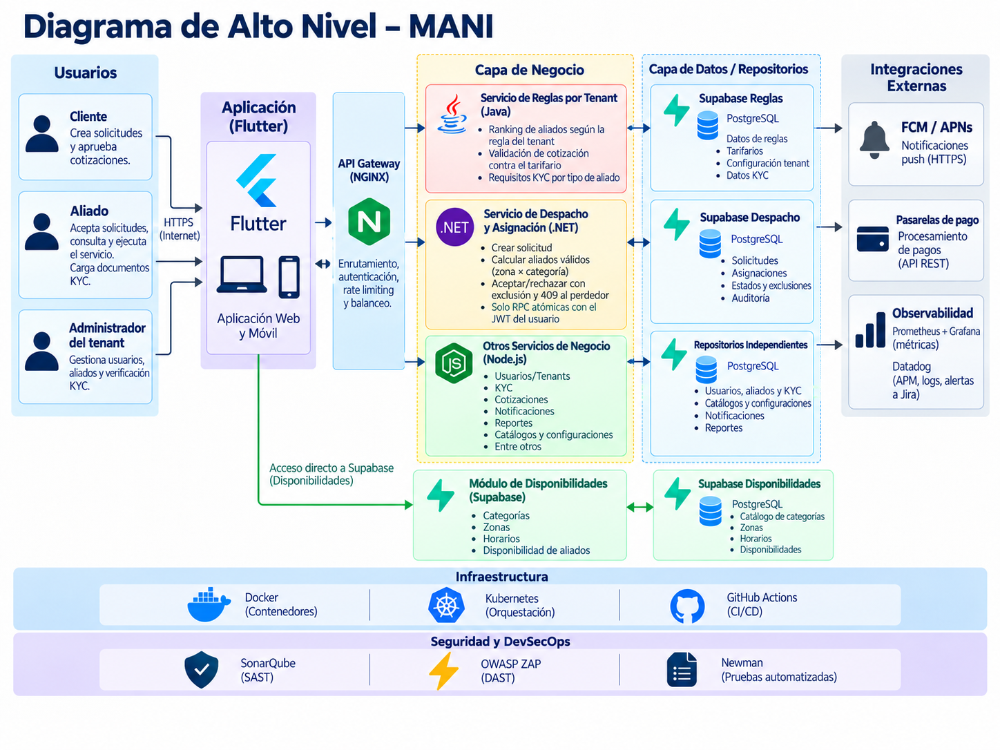

# SAD — Software Architecture Document — MANI

**Producto:** MANI — plataforma SaaS multi-tenant para formalización de operaciones de servicio  
**Documento vivo:** sin número de versión; la vigente es la de `main` y el historial está en el log del repositorio.  
**Arquitectura:** SOA distribuida + API Gateway + enfoque políglota  
**Persistencia:** Supabase como plataforma administrada, PostgreSQL como motor  
**Despliegue:** Docker sobre máquina virtual, una por ambiente. Orquestación por decidir (INFRA-01, INFRA-02)  
**Ambientes:** DEV → QA → PROD  
**Estrategia de repositorios:** Multi-repo  
**Diagramas de este documento:** diagramas de alto nivel (DHL) en [`diagrams/HLD/`](../diagrams/HLD/) — [DHL.png](../diagrams/HLD/DHL.png), [Infra.png](../diagrams/HLD/Infra.png), [TechRadar.png](../diagrams/HLD/TechRadar.png)  
**Modelo C4 formal:** [`workspace.dsl`](../diagrams/LLD/workspace.dsl), documentado vista por vista en [`SDD.md`](./SDD.md) §4  

---

# 1. Propósito

Este documento define la arquitectura de software de MANI y traduce los requerimientos funcionales, no funcionales y restricciones de producto del SRS en decisiones de diseño.

El SRS conserva autoridad sobre **qué debe hacer el sistema**. Este SAD define **cómo se estructura la solución** para satisfacer esos requerimientos.

Para evitar contaminación entre requisitos y solución, esta versión:

- usa RF, RNF y REST del SRS como drivers;
- no toma como drivers las notas históricas de inconsistencias arquitectónicas del SRS;
- no redefine requisitos;
- no duplica el modelo de datos físico ni el DDL, que viven en [`ModeloDatos.md`](./ModeloDatos.md);
- no duplica decisiones históricas completas de ADR, solo referencia las decisiones vigentes;
- **no define umbrales de calidad.** Los umbrales medibles viven únicamente en
  [`SDD.md`](./SDD.md) §7 y §8. Este SAD declara qué atributo es prioritario y por qué, no con qué
  número se verifica;
- no detalla pipeline, herramientas ni observabilidad: eso vive en
  [`POLITICAS_DEVOPS_HERRAMIENTAS.md`](../governance/POLITICAS_DEVOPS_HERRAMIENTAS.md) y
  [`INFRAESTRUCTURA_MANI.md`](../governance/INFRAESTRUCTURA_MANI.md).

---

# 2. Alcance arquitectónico

MANI es una plataforma SaaS multi-tenant que soporta:

- administración de tenants;
- autenticación y autorización;
- directorio de aliados y clientes;
- KYC;
- categorías y cobertura por zonas;
- solicitudes;
- despacho;
- cotizaciones;
- ejecución;
- calificaciones;
- mensajería;
- notificaciones;
- tarifarios;
- reportes operativos;
- pagos y funcionalidades administrativas en un segundo incremento.

La arquitectura debe permitir que cada tenant opere con datos y reglas aisladas, sin requerir una versión diferente del software por empresa.

---

# 3. Drivers derivados del SRS

## 3.1 Drivers funcionales

Los principales drivers funcionales que condicionan el diseño son:

| Driver | Origen SRS | Impacto arquitectónico |
|---|---|---|
| Multi-tenancy y administración de tenants | RF-01, RF-02, RF-03 | contexto de tenant en todas las operaciones, configuración por tenant y autorización |
| KYC aislado | RF-05, RF-06, REST-02 | almacenamiento privado, autorización y aislamiento de archivos |
| Cobertura por zonas | RF-07, RF-09, RF-12, REST-01 | catálogo de zonas y servicio de disponibilidad/cobertura |
| Ranking configurable | RF-13 | motor de reglas por tenant |
| Despacho concurrente | RF-14 | servicio transaccional con exclusión atómica |
| Cotización y tarifario | RF-15, RF-16, RF-22, RF-23 | reglas, persistencia y reportes |
| Trazabilidad de ejecución | RF-18 | historial/auditoría de eventos |
| Calificación bidireccional | RF-19 | control de estado de cierre |
| Mensajería y notificaciones | RF-20, RF-21 | realtime + persistencia + push |
| Segundo incremento | RF-24..RF-28 | extensibilidad para pagos, quejas, consola y métricas |

## 3.2 Drivers no funcionales

| Driver | Origen SRS | Prioridad arquitectónica |
|---|---|---|
| Aislamiento multi-tenant | RNF-01 / REST-04 | Crítica |
| Configuración sin despliegue por tenant | RNF-02 / REST-05 | Crítica |
| Idempotencia | RNF-03 | Alta |
| Auditabilidad | RNF-04 | Alta |
| Exclusión concurrente | RNF-05 | Alta |
| Cumplimiento de pagos | RNF-06 / RNF-11 | Alta / segundo incremento |
| Rendimiento y concurrencia | RNF-07 | Alta como riesgo de diseño |
| Uso móvil | RNF-08 | Media |
| Cobertura por zonas | RNF-09 | Alta |
| Configuración KYC/tiempos/comisión | RNF-10 | Alta |

---

# 4. Arquitectura objetivo

MANI adopta una **arquitectura SOA distribuida**, con un **API Gateway** como frontera de entrada y un **enfoque políglota** para los servicios de negocio.

## 4.1 Principios

1. Flutter contiene presentación y lógica de interacción, no reglas de negocio centrales.
2. Toda API operacional entra por NGINX/API Gateway.
3. La lógica de dominio vive en servicios.
4. Cada servicio es responsable de su capacidad funcional.
5. Supabase es la plataforma de persistencia administrada; PostgreSQL es su motor.
6. El aislamiento multi-tenant se aplica en varios niveles: JWT, autorización de servicios y RLS.
7. Los servicios no escriben directamente en datos privados de otros dominios.
8. Los cambios de configuración por tenant no deben requerir nuevo despliegue.
9. La analítica se desacopla del OLTP.
10. Los artefactos desplegados son contenerizados, versionados e inmutables.

---

# 5. Vista de contexto — C4 Nivel 1



> **Figura 1 — Diagrama de alto nivel (DHL).** Archivo: [`diagrams/HLD/DHL.png`](../diagrams/HLD/DHL.png).
> La vista C4 formal correspondiente es `contexto` en [`workspace.dsl`](../diagrams/LLD/workspace.dsl), documentada en SDD §4.1.

```text
Actores
  Cliente · Aliado · Administrador de tenant · Administrador de plataforma
        ↓
                          [ MANI ]
        ↓
Sistemas externos
  FCM / APNs · Operador de pagos (2.º incremento) · Observabilidad · Data Warehouse / BI
```

---

# 6. Vista de contenedores — C4 Nivel 2


> **Figura 2 — Componentes de la solución en el DHL.** Archivo: [`diagrams/HLD/DHL.png`](../diagrams/HLD/DHL.png).
> La vista C4 formal correspondiente es `contenedores` en [`workspace.dsl`](../diagrams/LLD/workspace.dsl), documentada en SDD §4.2.

```text
Usuarios
   ↓
Flutter Web / Mobile                    presentación e interacción, sin reglas de negocio
   │
   ├─ HTTPS ─→ NGINX API Gateway        entrada única, routing y políticas transversales
   │              ↓
   │           Rules (Java) · Dispatch (.NET) · Core (Node.js)
   │                                                 └── módulo Disponibilidades
   │              ↓
   │           Supabase: PostgreSQL + RLS · Storage
   │              ↓
   │           Integraciones: FCM/APNs · Operador de pagos (2.º incremento)
   │
   ├─ HTTPS ─→ Supabase Auth            sesión y JWT firmado
   └─ WSS  ←─  Supabase Realtime        recepción de eventos de mensajería
```

Tres servicios de negocio, no cuatro: disponibilidades es un módulo del Core Service (§7.4).

Los dos caminos directos del cliente a Supabase son los únicos que existen y están acotados en
§8.3: todo acceso a datos de negocio pasa por el Gateway.

---

# 7. Responsabilidad de servicios

## 7.1 Rules Service — Java

Responsable de:

- RF-02: evaluación de reglas configurables por tenant;
- RF-13: ranking de aliados;
- RF-16: validación contra tarifario;
- RF-22: reglas y rangos tarifarios;
- parte de RNF-02 y RNF-10.

No almacena reglas fijas por tenant en código. Obtiene configuración desde persistencia.

## 7.2 Dispatch Service — .NET

Responsable de:

- RF-12: creación y coordinación operacional de solicitudes;
- RF-14: aceptación/rechazo;
- RNF-03: idempotencia;
- RNF-05: exclusión concurrente;
- control de estados de asignación;
- auditoría transaccional del despacho.

La primera aceptación válida se confirma mediante actualización condicional atómica. Las aceptaciones posteriores obtienen `409 Conflict`.

## 7.3 Core Service — Node.js

Responsable de:

- RF-01: tenants;
- RF-03 y RF-04: integración de identidad y acceso;
- RF-05 y RF-06: aliados y KYC;
- RF-08 y RF-09: clientes y sitios de servicio;
- RF-10 y RF-11: categorías y asociaciones;
- RF-15, RF-16 (escritura del veredicto), RF-17: cotización y respuesta del cliente;
- RF-18: historial de ejecución;
- RF-19: calificación bidireccional y condición de cierre;
- RF-20 y RF-21: conversaciones, mensajes y notificaciones;
- RF-23: reportes operativos;
- segundo incremento RF-24..RF-28, cuando se implemente;
- **módulo de disponibilidades** (§7.4).

Es dueño de los esquemas `core`, `servicio`, `comunicaciones`, `disponibilidad` y `pagos`
(ModeloDatos §13). Rules emite el veredicto tarifario, pero es Core quien escribe
`servicio.cotizacion`.

En módulos de alta complejidad puede dividirse internamente por dominios sin convertir cada operación CRUD en un servicio independiente (riesgo KI-03).

## 7.4 Módulo de Disponibilidades — Node.js

Módulo del Core Service, **no un desplegable independiente**. Responsable de:

- RF-07: cobertura declarada del aliado;
- RF-12: consulta de elegibilidad por categoría + zona + agenda;
- disponibilidad, horarios y solapamientos;
- soporte a RNF-07 en la ruta crítica de consulta.

Mantiene frontera de capacidad propia: su esquema `disponibilidad`, su vista de componentes
(SDD §4.4.4) y su propia API dentro del Core Service. Dispatch lo consume por API.

La decisión de no separarlo en un desplegable adicional responde al riesgo KI-03: su único consumidor
es Dispatch, y un servicio más habría añadido un salto de red y un pipeline sin beneficio.

---

# 8. Multi-tenancy y seguridad

## 8.1 Identificación de tenant

Para operaciones autenticadas:

```text
Authorization: Bearer <JWT>
```

El `tenant_id` se obtiene de un JWT firmado.

El cliente no puede decidir el tenant de autorización mediante un header libre.

En preautenticación puede utilizarse `X-Tenant-Slug` únicamente como contexto de resolución, nunca como fuente de autorización.

## 8.2 Capas de control

```text
Cliente
  ↓
API Gateway
  ↓  valida token / políticas de acceso
Servicio
  ↓  valida rol y permiso
Supabase / PostgreSQL
  ↓  RLS por tenant
Datos
```

La arquitectura cumple RNF-01 mediante defensa en profundidad.

## 8.3 Acceso del cliente a Supabase

El cliente Flutter alcanza Supabase por **exactamente dos caminos**, y **no existe ninguna
excepción**:

| Camino | Para qué | Por qué es legítimo |
|---|---|---|
| `Flutter → Supabase Auth` | iniciar sesión, registrar usuario y refrescar el JWT | la identidad la emite Supabase GoTrue y el tenant viaja como claim firmado (ADR-0018, ADR-0027) |
| `Flutter ← Supabase Realtime` | recibir eventos de mensajería mientras el usuario está conectado | Realtime es un **transporte de eventos**: no lee tablas de negocio, no ejecuta reglas y no decide nada. El evento lo publica el Core Service después de persistir el mensaje |

Queda prohibido y retirado del cliente, sin excepción transitoria ni de disponibilidades:

- `.from()` — acceso a tablas vía PostgREST;
- `.rpc()` — invocación de funciones almacenadas;
- `.storage.from()` — acceso directo a Storage. Los documentos KYC se suben por endpoint
  intermediario o URL prefirmada que emite el Core Service.

La consulta de disponibilidades **no** es una excepción: entra por el Gateway al Core Service como
cualquier otra lectura de negocio. Esto cierra el riesgo KI-02 (§23) y materializa ADR-0022 y
ADR-0027.

El detalle de la regla, con la tabla de dependencias permitidas y prohibidas, está en
[`SDD.md`](./SDD.md) §2.2 y §14.

## 8.4 Documentos KYC

Los documentos se almacenan en Supabase Storage.

Convención:

```text
tenant_id/aliado_id/documento
```

Controles:

- bucket privado;
- políticas de acceso;
- separación por tenant;
- separación por aliado;
- administrador de tenant limitado a su tenant.

Esto responde a RF-05, RF-06 y REST-02.

---

# 9. Configuración por tenant

RF-02, RNF-02, RNF-10 y REST-05 exigen evitar código específico por empresa.

La configuración se mantiene como datos:

- documentos KYC requeridos;
- reglas de ranking;
- categorías;
- tarifarios;
- comisión;
- tiempos;
- parámetros operativos.

```text
Tenant
  ↓
Configuración / Reglas
  ↓
Rules Service
  ↓
Comportamiento dinámico
```

Una modificación de una regla de tenant no exige un despliegue de software.

---

# 10. Cobertura y disponibilidad

El diseño respeta REST-01 y RNF-09:

- cobertura mediante catálogo de zonas;
- granularidad operativa MVP: localidad/comuna;
- no radio geográfico;
- no geolocalización en tiempo real;
- no cálculo de proximidad;
- match exacto por identificador de zona.

```text
Sitio
  └── Zona

Aliado
  ├── Categoría
  └── CoberturaZona

Elegible =
  misma categoría
  AND
  misma zona
  AND
  disponible
```

---

# 11. Ciclo del servicio

```text
Solicitud
  → Selección de aliados válidos (categoría + zona)
  → Broadcast
  → Aceptación atómica
  → Cotización
  → Aceptación / ajuste del cliente
  → Ejecución
  → Calificación del cliente  +  Calificación del aliado
  → Cierre
```

El cierre solo ocurre cuando ambas calificaciones requeridas por RF-19 existen.

---

# 12. Mensajería y notificaciones

Para RF-20 y RF-21:

- Supabase Realtime entrega eventos mientras los participantes están conectados;
- FCM/APNs entrega push cuando el cliente está en background o desconectado;
- los mensajes asociados al servicio se persisten;
- el historial de conversación puede consultarse posteriormente;
- Realtime transporta eventos, pero no ejecuta reglas de negocio.

Esto evita que una reconexión implique pérdida del estado del servicio.

---

# 13. Auditabilidad

RNF-04 y RF-18 requieren reconstrucción de los eventos relevantes.

Se mantienen:

- historial de estados de solicitud;
- actor;
- fecha/hora;
- operación;
- correlation ID;
- eventos de despacho;
- cambios de cotización;
- eventos de ejecución;
- auditoría de operaciones sensibles.

Para el segundo incremento, las operaciones financieras requieren registro inmutable.

---

# 14. Persistencia

MANI utiliza:

> **Supabase como plataforma administrada y PostgreSQL como motor relacional.**

No se consideran Supabase y PostgreSQL alternativas distintas.

Capacidades utilizadas:

- PostgreSQL;
- RLS;
- Auth;
- Storage;
- Realtime.

El detalle conceptual, lógico, físico, DDL y diccionario vive en `ModeloDatos.md`.

---

# 15. Data Warehouse y análisis

RF-28 requiere métricas operativas por tenant en el segundo incremento.

La solución analítica se mantiene separada del flujo transaccional:

```text
Supabase / PostgreSQL (OLTP) → CDC / ELT incremental → Data Warehouse → Dashboards / Analytics
```

Esto evita ejecutar consultas analíticas intensivas directamente sobre las tablas operacionales.

El modelo dimensional se especifica en `ModeloDatos.md`.

---

# 16. Vista de despliegue


> **Figura 3 — Infraestructura de alto nivel.** Archivo: [`diagrams/HLD/Infra.png`](../diagrams/HLD/Infra.png).
> La vista C4 de despliegue formal es `despliegue-prod` en [`workspace.dsl`](../diagrams/LLD/workspace.dsl), documentada en SDD §9.

MANI mantiene **tres ambientes, y son exactamente tres**:

```text
DEV → QA → PROD
```

No existe STAGING ni un cuarto ambiente con otro nombre. El ambiente de pruebas se llama **QA** en
todos los documentos, pipelines y tags.

## 16.1 DEV

- desarrollo e integración temprana;
- **máquina personal de cada desarrollador**, con Docker local;
- Supabase de desarrollo;
- datos sintéticos;
- sin datos reales de usuarios ni de KYC.

## 16.2 QA

- **máquina virtual de QA con Docker**;
- pruebas funcionales, integración y contract tests;
- aislamiento multi-tenant;
- Newman, OWASP ZAP y k6;
- pruebas de concurrencia;
- Supabase separado de producción.

## 16.3 PROD

- **máquina virtual productiva con Docker**;
- usuarios y datos reales;
- Supabase productivo;
- artefactos inmutables, fijados por tag y digest;
- controles de acceso productivos;
- monitoreo y alertamiento.

## 16.4 Orquestación — decisión abierta

Kubernetes es el orquestador **exigido como objetivo** por PROY-08, pero **no es el estado actual y
no está decidido**: su proveedor y su topología siguen abiertos como INFRA-01 e INFRA-02.

Hasta que exista un ADR que los cierre:

- el despliegue vigente es Docker sobre VM, una por ambiente;
- ningún documento ni diagrama declara un clúster como estado actual;
- no se fija proveedor, número de nodos ni dimensionamiento;
- no se asume AKS ni Azure.

Esta decisión no altera la arquitectura lógica de este SAD. Los artefactos son imágenes OCI y la
promoción preserva la imagen validada, así que el cambio de plataforma no exige reconstruirlas ni
rediseñar los servicios. El detalle operativo vive en
[`INFRAESTRUCTURA_MANI.md`](../governance/INFRAESTRUCTURA_MANI.md).

---

# 17. Estrategia multi-repositorio

La solución mantiene una estrategia **multi-repo** con **seis repositorios**:

| Repositorio | Tecnología | Responsabilidad principal |
|---|---|---|
| `MANI-Frontend` | Flutter / Dart | Cliente web y móvil |
| `MANI-API-Gateway` | NGINX | Punto de entrada y enrutamiento de APIs |
| `MANI-Rules-Service` | Java | Reglas de negocio por tenant |
| `MANI-Dispatch-Service` | .NET | Solicitudes, despacho y asignación |
| `MANI-Core-Service` | Node.js | Servicios core y disponibilidades |
| `MANI-Docs` | Markdown / diagramas / ADR | Documentación arquitectónica y técnica |

Cada unidad desplegable mantiene:

- dependencias;
- pruebas;
- build;
- versionamiento;
- pipeline;
- artefacto contenerizado.

`MANI-API-Gateway` guarda además el Compose por ambiente y la configuración de observabilidad: es la
raíz de composición del despliegue. No existe un repositorio de infraestructura aparte.

`MANI-Docs` mantiene SAD, SDD, ADR, modelo de datos y diagramas técnicos, y no se despliega.

El desglose físico de carpetas está en [`SDD.md`](./SDD.md) §13.

---

# 18. CI/CD

Lo que este SAD fija es el **principio arquitectónico**, no el pipeline:

> **Build once, deploy many.** El artefacto validado se promueve entre ambientes sin reconstruirse.

De ese principio se derivan dos restricciones de diseño que los servicios deben cumplir:

- la configuración y los secretos son externos al artefacto, porque la misma imagen corre en los tres ambientes;
- el artefacto queda fijado por tag y digest, para que «el mismo artefacto» sea verificable y no una afirmación.

El pipeline concreto, sus etapas, herramientas y puertas de calidad viven en
[`POLITICAS_DEVOPS_HERRAMIENTAS.md`](../governance/POLITICAS_DEVOPS_HERRAMIENTAS.md) §8 y en
[`SDD.md`](./SDD.md) §11. No se repiten aquí.

---

# 19. Observabilidad

Requisito arquitectónico: toda operación distribuida debe poder reconstruirse. De ahí dos
obligaciones de diseño:

- **`correlation_id` propagado** por el Gateway y por cada servicio en toda petición;
- **instrumentación obligatoria** en el API Gateway, el Rules Service, el Dispatch Service, el Core
  Service —incluido su módulo de disponibilidades— y la plataforma de contenedores.

Un servicio sin telemetría de sus operaciones críticas no cumple el criterio de aceptación
arquitectónica (SDD §19).

El stack concreto, los dashboards y el manejo de incidentes viven en
[`POLITICAS_DEVOPS_HERRAMIENTAS.md`](../governance/POLITICAS_DEVOPS_HERRAMIENTAS.md) §17 y en
[ADR-0006](../adr/ADR-0006-observabilidad.md).

---

# 20. Atributos de calidad priorizados

Este SAD declara **qué atributo es prioritario y por qué**. Los umbrales con los que se verifica
viven únicamente en [`SDD.md`](./SDD.md) §7, y los escenarios con los que QA los comprueba en
[`SDD.md`](./SDD.md) §8.

| Atributo | Prioridad | Por qué lo es en MANI | Driver | Umbrales |
|---|---|---|---|---|
| **Seguridad** | P1 | el aislamiento multi-tenant cubre datos, archivos KYC, usuarios y configuración; una fuga cruza empresas, no usuarios | RNF-01, REST-02, REST-04 | [SDD §7.2](./SDD.md) |
| **Fiabilidad** | P1 | el despacho debe terminar en exactamente una asignación válida y las operaciones críticas toleran reintentos | RNF-03, RNF-05 | [SDD §7.3](./SDD.md) |
| **Eficiencia de desempeño** | P1 | la consulta de elegibilidad y el ranking están en la ruta crítica de cada solicitud | RNF-07 | [SDD §7.4](./SDD.md) |
| **Mantenibilidad** | P1 | tres runtimes y varios dominios elevan el costo de cambio; sin límites claros aparece el monolito distribuido | KI-03, KI-08 | [SDD §7.5](./SDD.md) |
| **Flexibilidad** | P1 | cada tenant configura sus reglas sin despliegue propio, y la plataforma de orquestación aún puede cambiar | RNF-02, RNF-10, REST-05 | [SDD §7.6](./SDD.md) |
| **Compatibilidad** | P2 | los servicios se integran entre tecnologías distintas y con terceros | PROY-07 | [SDD §7.7](./SDD.md) |
| **Adecuación funcional** | P2 | la exactitud de reglas, asignaciones y estados es verificable por pruebas | RF-13, RF-14, RF-16 | [SDD §7.8](./SDD.md) |
| **Capacidad de interacción** | P2 | clientes y aliados operan desde móvil | RNF-08 | [SDD §7.9](./SDD.md) |
| **Protección / Safety** | P3 | no es un sistema safety-critical, pero debe evitar operaciones irreversibles inseguras | — | [SDD §7.10](./SDD.md) |

## 20.1 Decisiones que esta priorización obliga

La priorización no es declarativa: condiciona el diseño descrito en este documento.

| Prioridad | Decisión que obliga | Dónde está |
|---|---|---|
| Seguridad P1 | defensa en profundidad: JWT + autorización en servicio + RLS, y aislamiento equivalente en Storage | §8 |
| Fiabilidad P1 | exclusión concurrente por actualización condicional atómica en Dispatch | §7.2, §11 |
| Fiabilidad P1 | efectos secundarios por eventos: un fallo de push no revierte una operación confirmada | §12, §21 |
| Desempeño P1 | módulo de disponibilidades con esquema propio e índice de búsqueda por categoría, zona y fecha | §7.4, §10 |
| Mantenibilidad P1 | propiedad de datos por dominio; ningún servicio escribe el esquema de otro | §14, ModeloDatos §13 |
| Flexibilidad P1 | configuración por tenant como datos, no como código ni como rama | §9 |
| Flexibilidad P1 | artefactos OCI inmutables y configuración externa, para que la orquestación pueda cambiar | §16.4, §18 |

> **Por qué cambió esta sección.** Antes repetía umbrales que contradecían al SDD: p95 ≤ 1 s aquí
> frente a p95 ≤ 500 ms allí, y 20 usuarios concurrentes frente a 300 sesiones. Con dos fuentes para
> el mismo número, ninguna era verificable.

---

# 21. Patrones arquitectónicos

El catálogo completo de patrones —arquitectónicos y de diseño, con su justificación— vive en
[`SDD.md`](./SDD.md) §5 y §6. Antes estaba duplicado en los dos documentos, con dos tablas
equivalentes que había que mantener a la vez.

Los patrones que las versiones anteriores de este SAD numeraban §21.1 a §21.5 —SOA, API Gateway,
Layered Architecture interna, Repository / Ports and Adapters y Event-driven para efectos
secundarios— siguen vigentes y se describen en [`SDD.md`](./SDD.md) §5.

Lo que este SAD fija es **qué patrón resuelve qué driver del SRS**, porque esa es la decisión
arquitectónica; el detalle de aplicación es diseño:

| Driver | Patrón que lo resuelve | Por qué ese |
|---|---|---|
| RF-02, RNF-02, RNF-10, REST-05 — reglas por tenant sin despliegue propio | **Strategy + Factory**, con la configuración como datos | permite cambiar el comportamiento de un tenant sin tocar código ni crear una rama por empresa |
| RNF-01, REST-04 — aislamiento estricto | **Defensa en profundidad** en tres capas (§8) | ninguna capa individual es suficiente: un bug de autorización no debe exponer datos |
| RNF-05 — exactamente una asignación válida | **Actualización condicional atómica** en la base | la exclusión se resuelve donde está el dato, no en memoria de un servicio replicable |
| RNF-03 — reintentos sin duplicar efectos | **Idempotency Key** | el cliente móvil reintenta por red inestable; el efecto debe ser uno |
| RNF-04 — trazabilidad reconstruible | **Observabilidad con `correlation_id`** y historial de estados | sin correlación, un flujo que cruza el Gateway y tres servicios no se reconstruye |
| RNF-07 + tolerancia a fallos de terceros | **Event-driven para efectos secundarios**, **Circuit Breaker**, **Retry**, **Outbox** | notificación, auditoría y analítica no deben estar en la ruta sincrónica ni poder revertir una operación confirmada |
| Flexibilidad P1 — cambio de proveedor | **Adapter** | FCM/APNs y el operador de pagos se sustituyen sin tocar el dominio |
| Mantenibilidad P1 — límites de dominio | **Repository / Ports and Adapters** y propiedad de datos por dominio | el dominio no depende de Supabase, y ningún servicio escribe el esquema de otro |
| PROY-07 — frontera única de API | **API Gateway** | centraliza TLS, routing, validación del token, rate limiting y correlación, sin replicarlos en cada cliente |

Dos restricciones sobre los patrones, que sí son decisión arquitectónica:

1. **El Gateway no implementa reglas de dominio.** Concentra entrada, validación del token, routing,
   rate limiting y políticas transversales; nada más.
2. **Event-driven aplica solo a efectos secundarios.** El flujo principal del ciclo del servicio es
   sincrónico y transaccional. Coordinar el despacho por eventos haría la exclusión concurrente
   mucho más difícil de garantizar.

---

# 22. Patrones de diseño

Strategy, Factory, Repository, Adapter, Facade/Application Service,
Observer/Publish-Subscribe, Circuit Breaker, Retry con backoff, Idempotency Key y Outbox.

La tabla con el uso y la justificación de cada uno vive en [`SDD.md`](./SDD.md) §6. Qué driver del
SRS resuelve cada patrón está en §21 de este documento.

Un patrón nuevo con impacto estructural pasa por Mesa de Arquitectura y produce un ADR.

---

# 23. Riesgos arquitectónicos

## KI-01 — Lógica de negocio en Flutter

**Riesgo:** duplicación, exposición de reglas y clientes inconsistentes.  
**Control:** mover lógica al backend.

## KI-02 — Acceso directo indiscriminado a Supabase

**Riesgo:** bypass de controles y acoplamiento.  
**Control:** servicios como frontera principal; RLS como defensa adicional.

## KI-03 — Servicios excesivamente pequeños

**Riesgo:** monolito distribuido.  
**Control:** dividir por capacidad de negocio, no por operación CRUD.

## KI-04 — Dependencias síncronas largas

**Riesgo:** fallos en cascada.  
**Control:** eventos para efectos secundarios y circuit breaker.

## KI-05 — Pérdida de aislamiento multi-tenant

**Riesgo:** exposición de datos entre empresas.  
**Control:** JWT + autorización + RLS + pruebas automatizadas.

## KI-06 — Doble asignación

**Riesgo:** inconsistencia operacional.  
**Control:** exclusión atómica en PostgreSQL.

## KI-07 — Consultas analíticas sobre OLTP

**Riesgo:** degradación del flujo operacional.  
**Control:** Data Warehouse separado.

## KI-08 — Complejidad políglota

**Riesgo:** mayor costo de operación y soporte.  
**Control:** contratos estandarizados, CI/CD homogéneo y límites claros por servicio.

---

# 24. Matriz de trazabilidad SRS → Arquitectura

## 24.1 MVP

Un solo componente responde por cada requisito. Donde antes decía «Core/Dispatch» o
«Core/Availability» ahora hay un dueño único: la propiedad compartida era la causa de que el SAD y
el modelo de datos se contradijeran sobre quién escribe qué.

| Requisito | Componente responsable | Mecanismo | Datos |
|---|---|---|---|
| RF-01 | Core | tenant | `core.tenant` |
| RF-02 | Rules | configuración dinámica evaluada por tenant | `reglas.regla_tenant` |
| RF-03 | Gateway + Auth + servicios + RLS | JWT multi-tenant | `core.usuario`, `core.rol` |
| RF-04 | Supabase Auth | recuperación segura | — |
| RF-05 | Core + Storage | registro por tipo de aliado + KYC | `core.aliado`, `core.documento_kyc` |
| RF-06 | Core | workflow de aprobación | `core.aliado.estado` |
| RF-07 | Core — disponibilidades | cobertura declarada por zonas | `core.aliado_cobertura` |
| RF-08 | Core | clientes persona natural y empresa | `core.cliente` |
| RF-09 | Core | sitio + zona obligatoria + condiciones | `core.sitio_servicio` |
| RF-10 | Core | categorías del tenant | `core.categoria` |
| RF-11 | Core | aliado-categoría | `core.aliado_categoria` |
| RF-12 | Dispatch, con elegibilidad por API del Core | solicitud + aliados válidos | `despacho.solicitud` |
| RF-13 | Rules | ranking configurable | `reglas.regla_tenant` |
| RF-14 | Dispatch | broadcast + exclusión atómica | `despacho.asignacion` |
| RF-15 | Core | cotización con mano de obra y materiales | `servicio.cotizacion` |
| RF-16 | Rules evalúa, **Core escribe** | validación tarifaria | `reglas.tarifario`, `servicio.cotizacion.fuera_de_rango` |
| RF-17 | Core | aceptar, rechazar o solicitar ajuste | `servicio.cotizacion.estado` |
| RF-18 | Core | historial de ejecución | `servicio.historial_solicitud` |
| RF-19 | Core | calificación bidireccional y condición de cierre | `servicio.calificacion` |
| RF-20 | Core + Realtime + FCM/APNs | mensajería y notificación | `comunicaciones.conversacion`, `comunicaciones.mensaje` |
| RF-21 | Core | consulta de conversaciones persistidas | `comunicaciones.mensaje` |
| RF-22 | Rules | tarifario por tenant y categoría | `reglas.tarifario` |
| RF-23 | Core + Data Warehouse | reporte de cotizaciones fuera de rango | `servicio.cotizacion`, `dw.fact_cotizacion` |

La cobertura de cada RF a nivel de tabla y restricción está en
[`ModeloDatos.md`](./ModeloDatos.md) §14.

## 24.2 Segundo incremento

| Requisito | Evolución prevista |
|---|---|
| RF-24 | Adapter a operador de pagos |
| RF-25 | módulo de liquidación/comisión |
| RF-26 | módulo de quejas |
| RF-27 | consola de tenant |
| RF-28 | Data Warehouse + BI |

---

# 25. Verificación de cobertura frente al SRS

## Cubierto por el diseño

La arquitectura contempla explícitamente:

- aislamiento de tenants;
- reglas configurables;
- autenticación;
- KYC;
- cobertura por zonas;
- categorías;
- solicitud;
- ranking;
- despacho concurrente;
- cotizaciones;
- tarifarios;
- ejecución;
- calificación;
- mensajería;
- notificaciones;
- reportes;
- extensibilidad para el segundo incremento.

## Línea base vigente

1. Serverpod no es el backend: la solución es SOA políglota con Java, .NET y Node.js.
2. El API Gateway NGINX es la frontera única de API.
3. Supabase es la plataforma administrada y PostgreSQL su motor; no son alternativas.
4. Multi-repo con seis repositorios (§17).
5. Tres ambientes y solo tres: DEV, QA y PROD. No existe STAGING.
6. DEV en máquinas personales; QA y PROD en VM con Docker.
7. La orquestación es una decisión abierta: Kubernetes es el objetivo de PROY-08, no el estado actual (§16.4).
8. Disponibilidades es un módulo del Core Service, no un desplegable aparte (§7.4).
9. El cliente alcanza Supabase solo por Auth y Realtime; no hay excepción de acceso a datos (§8.3).
10. Cada RF tiene un componente responsable único y datos identificados (§24).
11. El Data Warehouse está desacoplado del OLTP y sirve RF-23 y RF-28.
12. Los umbrales de calidad viven únicamente en el SDD (§20).

---

# 26. Documentos relacionados

- [`product/SRS.md`](../product/SRS.md) — fuente de verdad de requerimientos.
- [`ModeloDatos.md`](./ModeloDatos.md) — diseño conceptual, lógico, físico y analítico, DDL y cobertura de RF.
- [`SDD.md`](./SDD.md) — diseño detallado, vistas, umbrales de calidad y escenarios.
- [`adr/`](../adr/) — decisiones arquitectónicas.
- [`governance/INFRAESTRUCTURA_MANI.md`](../governance/INFRAESTRUCTURA_MANI.md) — ambientes e infraestructura.
- [`governance/POLITICAS_DEVOPS_HERRAMIENTAS.md`](../governance/POLITICAS_DEVOPS_HERRAMIENTAS.md) — pipeline, calidad y herramientas.
- [`workspace.dsl`](../diagrams/LLD/workspace.dsl) — modelo en Structurizr DSL. Inventario de vistas en [`SDD.md`](./SDD.md) §4.0.
- [`diagrams/HLD/`](../diagrams/HLD/) — diagramas de alto nivel que referencia este SAD.
