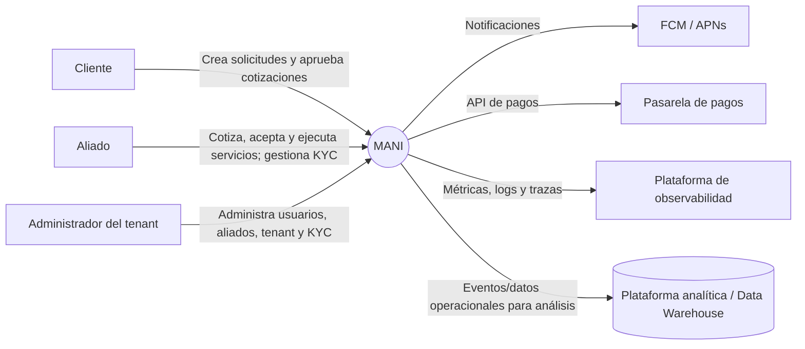
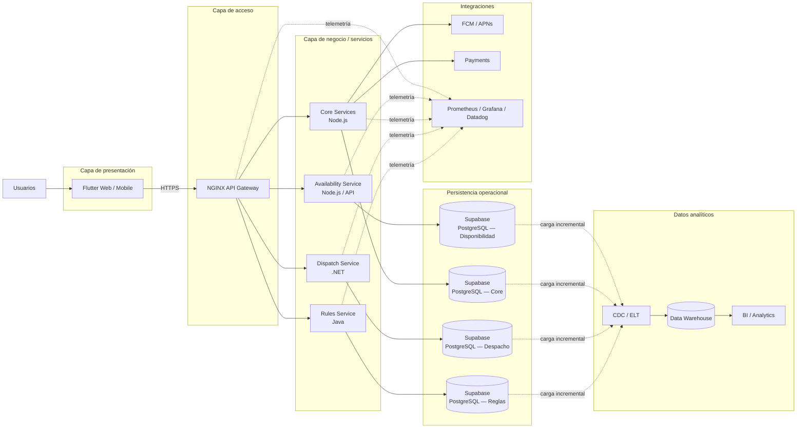
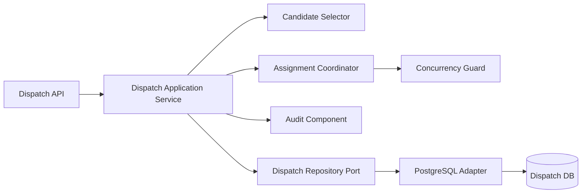
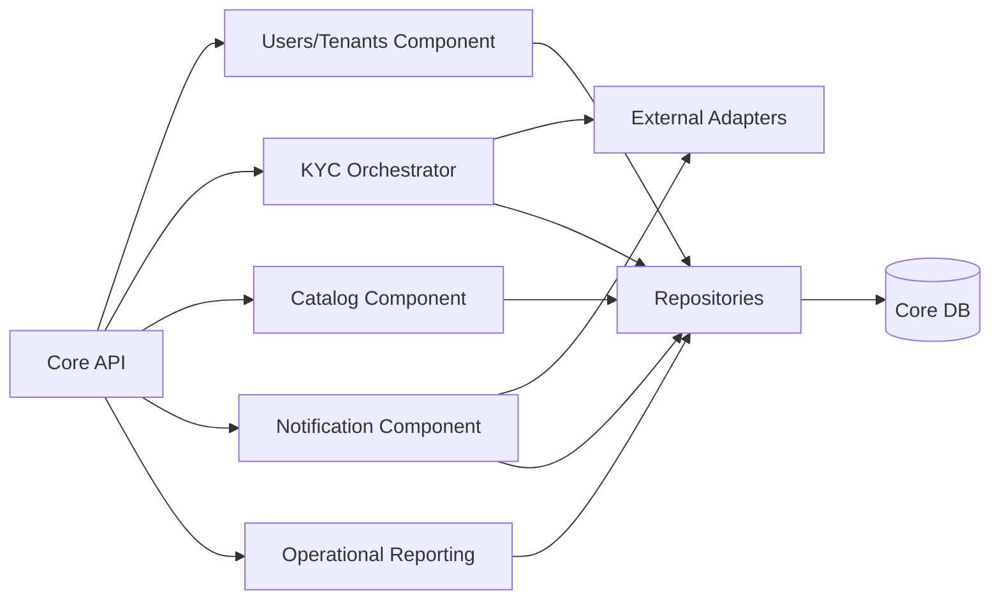
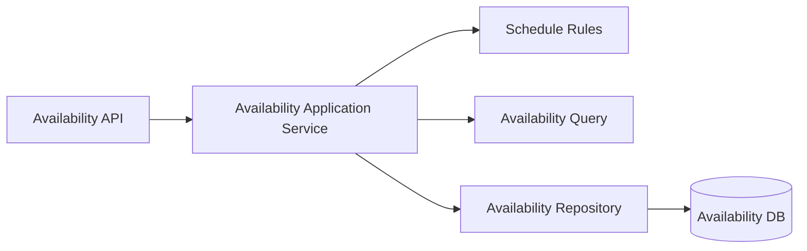
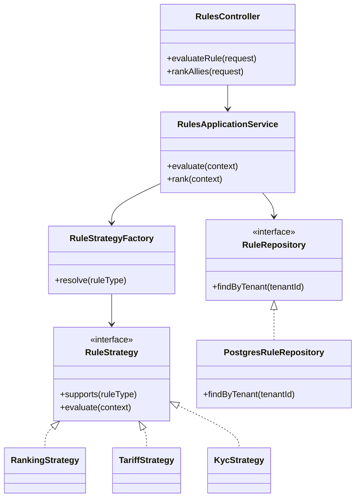
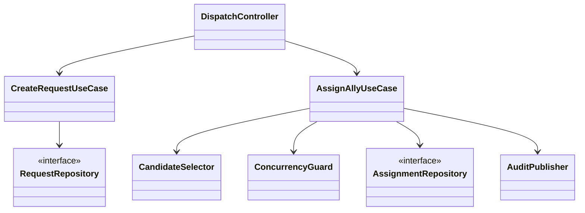
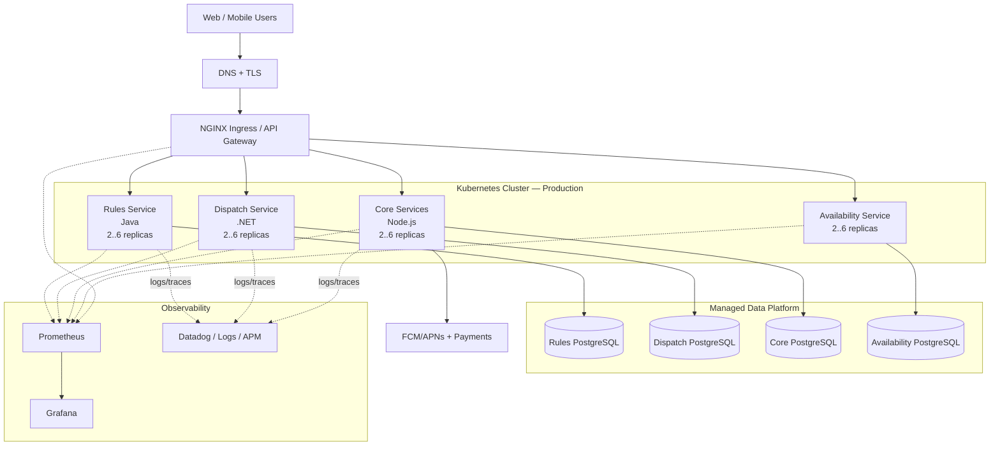

# SDD — Software Design Description
## MANI

**Arquitectura objetivo:** SOA + API Gateway + enfoque políglota  
**Norma de calidad de referencia:** ISO/IEC 25010:2023  
**Documento de datos asociado:** [MANI_Modelo_de_Datos.md](./MANI_Modelo_de_Datos.md)  
**Estado:** Diseño arquitectónico objetivo  
**Alcance:** arquitectura de software, vistas C4, atributos de calidad, patrones, despliegue, ambientes y vista física.

---

## 1. Propósito

Este Software Design Description (SDD) define la arquitectura de MANI desde la perspectiva de software. El documento cubre:

- arquitectura orientada a servicios (SOA);
- API Gateway como punto de entrada;
- enfoque políglota para servicios especializados;
- vistas C4 en los niveles de contexto, contenedores, componentes y código;
- decisiones y patrones arquitectónicos;
- atributos de calidad priorizados con base en ISO/IEC 25010:2023;
- escenarios medibles y umbrales de aceptación;
- vista de despliegue y ambientes;
- diseño físico del repositorio y de la infraestructura;
- estrategia de versionamiento, entrega y rollback.

> **Separación documental:** este SDD no redefine el modelo conceptual, lógico o físico de datos. La definición canónica de entidades, relaciones, DDL, diccionario de datos, Data Warehouse y flujo analítico se mantiene en [MANI_Modelo_de_Datos.md](./MANI_Modelo_de_Datos.md).

---

## 2. Alcance y principios

MANI es una plataforma multi-tenant para la creación y atención de solicitudes de servicio, cotización, selección y asignación de aliados, gestión KYC, disponibilidad, notificaciones y pagos.

Los principios que gobiernan el diseño son:

1. **La presentación no implementa reglas de negocio.**
2. **Los servicios son propietarios de su lógica de dominio.**
3. **El API Gateway es el punto de entrada de las APIs operacionales.**
4. **La persistencia se encapsula detrás de servicios y repositorios.**
5. **La tecnología puede variar por servicio, pero los contratos de integración son estables.**
6. **Los datos analíticos se separan del procesamiento transaccional.**
7. **Las decisiones arquitectónicas deben responder a atributos de calidad medibles.**

## 2.2 Decisiones explícitas de línea base

Para evitar ambigüedades entre ADR, diagramas y despliegue, se fijan las siguientes decisiones:

| Tema | Decisión |
|---|---|
| Ambientes | **3 ambientes: DEV → TEST/QA → PROD** |
| Repositorios | **Multi-repo** |
| Persistencia | **Supabase como plataforma administrada** |
| Motor de base de datos | **PostgreSQL provisto por Supabase** |
| Aislamiento multi-tenant | **JWT + autorización en servicios + RLS en PostgreSQL/Supabase** |
| Orquestación | **Kubernetes** |
| Contenedores | **Docker/OCI** |
| CI/CD | **GitHub Actions** |

**Supabase y PostgreSQL no son dos alternativas de persistencia.** Supabase es la plataforma administrada utilizada por MANI y PostgreSQL es su motor relacional subyacente.

### 2.1 Excepción transitoria de disponibilidades

El diagrama de alto nivel vigente muestra acceso directo de Flutter a Supabase para disponibilidades. Se considera una **excepción transitoria**, no el estado arquitectónico objetivo.

Reglas para esa excepción:

- no se implementan reglas de negocio en Flutter;
- no se exponen tablas sin controles de acceso;
- cualquier acceso directo debe estar protegido por RLS y limitarse a operaciones simples autorizadas;
- la evolución objetivo es `Flutter → API Gateway → Servicio de Disponibilidades → Supabase`.

---

# 3. Estilo arquitectónico

## 3.1 SOA

MANI se define como una **arquitectura orientada a servicios (SOA)**. Las capacidades del negocio se organizan en servicios con responsabilidades explícitas, interfaces contractuales y bajo acoplamiento.

Capacidades principales:

| Servicio / capacidad | Responsabilidad |
|---|---|
| Reglas por Tenant | ranking, validación tarifaria, políticas KYC y configuración por tenant |
| Despacho y Asignación | solicitudes, candidatos, aceptación/rechazo, exclusiones, concurrencia y auditoría |
| Core de Negocio | usuarios, tenants, aliados, KYC, catálogos, notificaciones y reportes operativos |
| Disponibilidades | categorías, zonas, horarios y disponibilidad operacional |
| Integraciones | FCM/APNs, pasarela de pagos, observabilidad y servicios externos |

La orientación a servicios permite que la lógica del dominio no quede acoplada a Flutter ni a la base de datos.

## 3.2 API Gateway

NGINX funciona como frontera de entrada para las APIs.

Responsabilidades:

- terminación HTTPS;
- enrutamiento;
- autenticación y propagación de identidad;
- rate limiting;
- balanceo;
- control de CORS;
- trazabilidad mediante correlation ID;
- políticas básicas de seguridad.

El Gateway **no debe contener reglas de negocio**.

## 3.3 Enfoque políglota

La solución utiliza diferentes tecnologías de implementación según el servicio:

| Componente | Tecnología |
|---|---|
| Aplicación web/móvil | Flutter / Dart |
| Gateway | NGINX |
| Servicio de reglas | Java |
| Despacho y asignación | .NET |
| Servicios restantes | Node.js |
| Persistencia | Supabase (PostgreSQL como motor) |
| Contenedores | Docker |
| Orquestación | Kubernetes |
| CI/CD | GitHub Actions |

El enfoque políglota no implica libertad tecnológica irrestricta. Cada tecnología debe justificar su existencia, mantener contratos estables y cumplir los mismos criterios de seguridad, observabilidad, pruebas y despliegue.

---

# 4. Vistas C4

## 4.1 Nivel 1 — System Context

**Objetivo:** mostrar MANI como un sistema y sus relaciones con personas y sistemas externos.



### Responsabilidades de frontera

- **MANI** ejecuta el flujo transaccional.
- **FCM/APNs** entrega notificaciones push.
- **Pasarela de pagos** procesa pagos; MANI conserva referencias y estados, no datos sensibles de tarjeta.
- **Observabilidad** recibe métricas, logs y trazas.
- **Data Warehouse** recibe datos mediante procesos desacoplados del flujo transaccional.

---

## 4.2 Nivel 2 — Containers

**Objetivo:** mostrar las unidades desplegables y almacenes principales.



### Reglas de dependencia

- Flutter consume contratos expuestos por el Gateway.
- Los servicios no acceden directamente a tablas propiedad de otro dominio.
- Las integraciones externas se encapsulan mediante adaptadores.
- El Data Warehouse no participa en transacciones operacionales.
- El detalle de esquemas, entidades y modelo dimensional se encuentra en `MANI_Modelo_de_Datos.md`.

---

## 4.3 Nivel 3 — Components

### 4.3.1 Servicio de Reglas — Java

```mermaid
flowchart LR
    API[Rules REST Controller]
    APP[Rules Application Service]
    FACT[Rule Strategy Factory]
    RANK[Ranking Strategy]
    TAR[Tariff Validation Strategy]
    KYC[KYC Policy Strategy]
    PORT[Rule Repository Port]
    ADP[Supabase Adapter (PostgreSQL)]
    DB[(Reglas DB)]

    API --> APP
    APP --> FACT
    FACT --> RANK
    FACT --> TAR
    FACT --> KYC
    APP --> PORT
    PORT --> ADP
    ADP --> DB
```

Responsabilidades:

- seleccionar reglas por tenant;
- calcular ranking de aliados;
- validar cotización contra tarifario;
- validar requisitos KYC;
- desacoplar lógica de reglas de la persistencia.

### 4.3.2 Servicio de Despacho — .NET



Responsabilidades:

- crear solicitudes;
- obtener candidatos válidos;
- coordinar asignación;
- evitar doble aceptación;
- responder conflicto `409` cuando la asignación ya fue tomada;
- auditar cambios de estado.

### 4.3.3 Core Services — Node.js



### 4.3.4 Servicio de Disponibilidades



La lógica de horarios, solapamientos, zonas y elegibilidad pertenece al servicio, no al cliente Flutter.

---

## 4.4 Nivel 4 — Code

El nivel 4 expresa la estructura interna de código. No pretende congelar clases concretas para siempre; define las dependencias que deben preservarse.

### Ejemplo: Rules Service



### Ejemplo: Dispatch Service



### Regla de dependencia de código

La dependencia debe apuntar desde adaptadores hacia contratos internos, no desde el dominio hacia frameworks externos:

```text
Controller / Adapter
        ↓
Application / Use Cases
        ↓
Domain
        ↑
Ports / Interfaces
        ↑
DB / External Adapters
```

---

# 5. Patrones arquitectónicos

| Patrón | Aplicación en MANI | Justificación |
|---|---|---|
| SOA | capacidades separadas como servicios | bajo acoplamiento y evolución independiente |
| API Gateway | NGINX | punto de entrada, políticas transversales y ocultamiento de topología interna |
| Layered Architecture interna | API → aplicación → dominio → infraestructura | evita mezclar HTTP, reglas y persistencia |
| Repository / Ports & Adapters | acceso a Supabase mediante interfaces sobre PostgreSQL | desacopla lógica de negocio del proveedor de datos |
| Database ownership por dominio | esquemas/repositorios separados | limita dependencias y cambios cruzados |
| Event-driven para efectos secundarios | notificaciones, auditoría, analítica | reduce cadenas síncronas |
| Externalized Configuration | secretos y configuración fuera del código | portabilidad y seguridad |
| Observability | métricas, logs, trazas y correlation ID | diagnóstico de sistemas distribuidos |

---

# 6. Patrones de diseño

| Patrón | Uso |
|---|---|
| Strategy | reglas variables por tenant |
| Factory | resolución de la estrategia correspondiente |
| Repository | abstracción de persistencia |
| Adapter | FCM/APNs, pagos, KYC y otros proveedores |
| Facade / Application Service | coordinación de casos de uso |
| Observer / Publish-Subscribe | notificaciones, auditoría y eventos analíticos |
| Circuit Breaker | protección frente a fallas de servicios externos |
| Retry con backoff | reintentos controlados en operaciones idempotentes |
| Outbox | publicación confiable de eventos tras una transacción |
| Idempotency Key | evitar pagos, asignaciones o comandos duplicados |

---

# 7. Atributos de calidad — ISO/IEC 25010:2023

ISO/IEC 25010:2023 define un modelo de calidad de producto con nueve características. MANI las utiliza como marco, pero **no todas reciben la misma prioridad**.

Escala:

- **P1 — Crítico:** condiciona decisiones estructurales y aceptación del sistema.
- **P2 — Alto:** debe cumplirse antes de producción, pero no domina todas las decisiones.
- **P3 — Controlado:** se verifica, aunque su impacto arquitectónico es menor para el alcance actual.

Los umbrales siguientes son **objetivos de aceptación inicial del MVP**. Deben recalibrarse con pruebas de carga y datos reales.

## 7.1 Priorización general

| Característica ISO/IEC 25010:2023 | Prioridad | Razón |
|---|---:|---|
| Seguridad | P1 | multi-tenant, KYC, identidad, pagos y datos sensibles |
| Fiabilidad | P1 | solicitudes, despacho y asignación requieren continuidad y consistencia |
| Eficiencia de desempeño | P1 | ranking, disponibilidad y despacho son sensibles a latencia |
| Mantenibilidad | P1 | arquitectura políglota y múltiples servicios elevan el costo de cambio |
| Flexibilidad | P1 | los servicios deben escalar, desplegarse y adaptarse por separado |
| Compatibilidad | P2 | integración entre Java, .NET, Node.js, Flutter y terceros |
| Adecuación funcional | P2 | exactitud de reglas, asignaciones y estados |
| Capacidad de interacción | P2 | cliente, aliado y administrador necesitan flujos claros |
| Protección (Safety) | P3 | no es un sistema safety-critical, pero debe evitar operaciones irreversibles inseguras |

---

## 7.2 Seguridad — P1

| Subcaracterística | Prioridad | Umbral / criterio de aceptación |
|---|---:|---|
| Confidencialidad | P1 | 100% de endpoints privados requieren autenticación; TLS 1.2+; secretos fuera del código |
| Integridad | P1 | 100% de operaciones críticas protegidas por validación de autorización y constraints transaccionales |
| Autenticidad | P1 | tokens firmados y validados en 100% de llamadas protegidas |
| Responsabilidad / accountability | P1 | 100% de cambios críticos generan actor, timestamp y correlation ID |
| No repudio | P2 | pagos, aceptación y cambios críticos conservan evidencia auditable |
| Resistencia | P1 | 0 vulnerabilidades Critical/High conocidas abiertas en release de producción; rate limiting en Gateway |

**Controles arquitectónicos:** JWT/OIDC, API Gateway, RBAC, aislamiento por tenant, RLS cuando aplique, auditoría, SAST con SonarQube, DAST con OWASP ZAP, gestión de secretos y mínimos privilegios.

---

## 7.3 Fiabilidad — P1

| Subcaracterística | Prioridad | Umbral / criterio |
|---|---:|---|
| Ausencia de fallos | P1 | tasa de error 5xx < 1% en ventana de 15 min bajo carga nominal |
| Disponibilidad | P1 | ≥ 99.9% mensual para APIs críticas |
| Tolerancia a fallos | P1 | falla de proveedor de notificaciones no cancela una solicitud o asignación confirmada |
| Recuperabilidad | P1 | RTO ≤ 30 min; RPO ≤ 5 min para datos operacionales críticos |

Controles: réplicas, health checks, restart automático, circuit breaker, retry controlado, backups, restauración probada y procesamiento asíncrono de efectos secundarios.

---

## 7.4 Eficiencia de desempeño — P1

| Subcaracterística | Prioridad | Umbral / criterio |
|---|---:|---|
| Comportamiento temporal | P1 | p95 ≤ 500 ms para lecturas internas simples y p95 ≤ 800 ms para comandos críticos, excluyendo tiempo de terceros |
| Utilización de recursos | P2 | utilización sostenida objetivo < 70% CPU por pod antes de escalar |
| Capacidad | P1 | soportar inicialmente 300 sesiones concurrentes y 50 req/s sostenidos sin incumplir p95 |

Controles: índices, consultas acotadas, paginación, caché selectiva, HPA, pooling, pruebas de carga y métricas.

---

## 7.5 Mantenibilidad — P1

| Subcaracterística | Prioridad | Umbral / criterio |
|---|---:|---|
| Modularidad | P1 | ningún servicio accede directamente a tablas de otro dominio |
| Reusabilidad | P2 | contratos y adaptadores comunes reutilizables sin duplicar reglas de dominio |
| Analizabilidad | P1 | 100% de requests distribuidos con correlation ID; logs estructurados |
| Capacidad para ser modificado | P1 | cambios internos compatibles no exigen modificar consumidores externos |
| Capacidad para ser probado | P1 | cobertura de código nuevo ≥ 80%; casos de uso críticos ≥ 90%; contract tests obligatorios |

**Quality Gate:** 0 issues Blocker/Critical en código nuevo; duplicación de código nuevo < 3%; pipeline debe fallar si el Quality Gate no se cumple.

---

## 7.6 Flexibilidad — P1

| Subcaracterística | Prioridad | Umbral / criterio |
|---|---:|---|
| Adaptabilidad | P1 | misma imagen desplegable en DEV/TEST-QA/PROD mediante configuración externa |
| Escalabilidad | P1 | servicios críticos escalables horizontalmente de 2 a 6 réplicas sin cambio de código |
| Instalabilidad | P1 | despliegue automatizado por ambiente ≤ 10 min en condiciones normales |
| Reemplazabilidad | P2 | proveedores externos encapsulados por Adapter; cambio de proveedor sin alterar dominio |

---

## 7.7 Compatibilidad — P2

| Subcaracterística | Prioridad | Umbral / criterio |
|---|---:|---|
| Coexistencia | P2 | servicios respetan límites configurados de CPU/memoria y no degradan otros workloads |
| Interoperabilidad | P1 dentro de la característica | 100% de APIs documentadas con OpenAPI; contract tests verdes antes de promoción |

---

## 7.8 Adecuación funcional — P2

| Subcaracterística | Prioridad | Umbral / criterio |
|---|---:|---|
| Completitud funcional | P2 | 100% de historias críticas trazadas a casos de prueba |
| Corrección funcional | P1 dentro de la característica | 100% de escenarios críticos de ranking, tarifa, asignación y conflicto pasan pruebas |
| Pertinencia funcional | P2 | cada endpoint productivo corresponde a un caso de uso identificado |

---

## 7.9 Capacidad de interacción — P2

| Subcaracterística | Prioridad | Umbral / criterio |
|---|---:|---|
| Reconocibilidad | P2 | usuario identifica acción principal de cada flujo sin documentación externa |
| Aprendizabilidad | P3 | usuarios de prueba completan flujos base con ≤ 1 asistencia |
| Operabilidad | P2 | ≥ 90% de éxito en pruebas de tareas críticas |
| Protección contra errores de usuario | P1 dentro de la característica | acciones irreversibles requieren validación/confirmación y errores accionables |
| Involucración | P3 | consistencia visual definida por sistema de diseño |
| Inclusividad | P2 | criterios de accesibilidad definidos para web/móvil |
| Asistencia al usuario | P3 | errores y estados vacíos incluyen orientación |
| Auto-descriptividad | P2 | formularios y estados críticos explican el siguiente paso |

---

## 7.10 Protección / Safety — P3

MANI no controla maquinaria ni procesos donde un fallo de software implique directamente riesgo de vida. Aun así:

| Subcaracterística | Prioridad | Umbral / criterio |
|---|---:|---|
| Restricción operativa | P2 | estados inválidos de solicitud/asignación deben rechazarse |
| Identificación de riesgos | P3 | operaciones sensibles identificadas en análisis de riesgo |
| Protección ante fallos | P2 | fallas de terceros no deben dejar transacciones críticas en estado ambiguo |
| Advertencia de peligro | P3 | mensajes explícitos antes de cancelaciones/reversiones críticas |
| Integración segura | P2 | integración externa requiere timeout, validación de respuesta y circuit breaker cuando aplique |

---

# 8. Escenarios de calidad prioritarios

## QAS-01 — Aislamiento multi-tenant

- **Fuente:** usuario autenticado.
- **Estímulo:** intenta consultar o modificar un recurso de otro tenant.
- **Respuesta:** solicitud rechazada y evento auditado.
- **Umbral:** 100% de pruebas de aislamiento deben bloquear acceso cruzado.

## QAS-02 — Concurrencia de asignación

- **Fuente:** dos aliados.
- **Estímulo:** ambos intentan aceptar la misma asignación.
- **Respuesta:** solo uno confirma; el otro recibe `409 Conflict`.
- **Umbral:** 0 dobles asignaciones en pruebas de concurrencia.

## QAS-03 — Disponibilidad

- **Fuente:** usuario.
- **Estímulo:** consulta disponibilidad por zona/categoría.
- **Respuesta:** sistema retorna candidatos elegibles.
- **Umbral:** p95 ≤ 500 ms bajo carga nominal.

## QAS-04 — Falla de notificaciones

- **Fuente:** FCM/APNs.
- **Estímulo:** proveedor no responde.
- **Respuesta:** la transacción principal permanece confirmada; notificación queda para retry.
- **Umbral:** 0 rollbacks de operación principal causados únicamente por fallo de push.

## QAS-05 — Modificación de regla

- **Fuente:** cambio de negocio.
- **Estímulo:** nueva política de ranking de un tenant.
- **Respuesta:** se agrega/configura estrategia sin alterar Flutter ni Dispatch.
- **Umbral:** cambio contenido en Rules Service y configuración correspondiente.

## QAS-06 — Recuperación

- **Fuente:** falla de servicio o nodo.
- **Estímulo:** pérdida de una réplica.
- **Respuesta:** Kubernetes restablece capacidad.
- **Umbral:** servicio recuperado sin intervención manual en ≤ 5 min; recuperación de desastre global conforme a RTO ≤ 30 min.

---

# 9. Vista de despliegue

## 9.1 Producción



### Reglas físicas

- contenedores inmutables;
- al menos dos réplicas para servicios críticos en producción;
- readiness y liveness probes;
- requests/limits de CPU y memoria;
- HPA para servicios sensibles a carga;
- secretos suministrados desde gestor seguro;
- bases productivas no accesibles desde Internet pública salvo controles explícitos;
- acceso administrativo con privilegio mínimo.

---

# 10. Ambientes

MANI adopta **tres ambientes de despliegue**. No se define un ambiente STAGING independiente.

| Ambiente | Objetivo | Infraestructura | Datos |
|---|---|---|---|
| Local | desarrollo individual | Docker Compose + Flutter + servicios + Supabase local | datos sintéticos |
| DEV | integración continua temprana | Kubernetes con aislamiento lógico del ambiente | datos sintéticos |
| TEST / QA | pruebas funcionales, integración, seguridad y validación previa a producción | Kubernetes con aislamiento lógico + instancia/base separada | dataset controlado y anonimizado |
| PROD | operación real | Kubernetes productivo + Supabase productivo | datos reales |

### Reglas

- el flujo oficial es **DEV → TEST/QA → PROD**;
- no existe STAGING como ambiente obligatorio;
- no compartir bases, secretos ni credenciales entre ambientes;
- no copiar datos KYC o datos personales reales a DEV o TEST/QA;
- configuración y secretos son externos a las imágenes;
- la misma imagen de contenedor validada se promueve entre TEST/QA y PROD;
- únicamente cambian parámetros externos, secretos y escalado;
- Kubernetes sigue siendo el orquestador; la separación física por clúster o namespace puede ajustarse sin cambiar esta decisión.

---

# 11. Flujo CI/CD y promoción

```mermaid
flowchart LR
    DEV[Commit / Pull Request]
    TEST[Unit + Integration + Contract Tests]
    SAST[SonarQube SAST]
    BUILD[Build Images]
    SCAN[Dependency / Image Scan]
    QA[Deploy TEST / QA]
    DAST[Newman + OWASP ZAP]
    PROD[Promote same validated artifact to PROD]
    OBS[Post-deploy Verification]

    DEV --> TEST --> SAST --> BUILD --> SCAN --> QA --> DAST --> PROD --> OBS
```



Un artefacto que no pasa los gates de calidad **no se reconstruye para producción**; se promueve exactamente la misma imagen verificada.

---

# 12. Versionamiento de despliegue

## 12.1 Servicios

Se utiliza **Semantic Versioning**:

```text
MAJOR.MINOR.PATCH
```

Ejemplo:

```text
rules-service:2.3.1
dispatch-service:1.8.0
core-service:1.5.4
```

- **MAJOR:** cambio incompatible de contrato.
- **MINOR:** funcionalidad compatible.
- **PATCH:** corrección compatible.

La imagen final debe quedar además fijada por digest o commit SHA.

## 12.2 API

Los cambios incompatibles se versionan en la ruta o contrato:

```text
/api/v1/...
/api/v2/...
```

Una versión MAJOR anterior se mantiene durante una ventana de transición definida.

## 12.3 Base de datos

Las migraciones son incrementales e inmutables:

```text
V001__initial_schema.sql
V002__add_assignment_status.sql
V003__add_rule_priority.sql
```

No se modifica una migración ya ejecutada en ambientes compartidos; se crea una nueva.

## 12.4 Releases

Ejemplo:

```text
v1.4.0-dev.3
v1.4.0-rc.1
v1.4.0
```

La etiqueta final representa el release productivo.

## 12.5 Rollback

- rollback de aplicación mediante imagen previa;
- migraciones destructivas requieren estrategia expand/contract;
- cambios de esquema incompatibles no se despliegan en el mismo paso que la eliminación de compatibilidad;
- objetivo de rollback operacional: ≤ 5 min.

---

# 13. Vista física de repositorios

MANI mantiene una estrategia **multi-repositorio**. La arquitectura distribuida no se representa como un monorepo.

```text
GitHub / Organización MANI
├── MANI-Flutter
│   └── aplicación web/móvil Flutter
├── MANI-Gateway
│   └── configuración NGINX / API Gateway
├── MANI-Rules-Java
│   └── servicio de reglas por tenant
├── MANI-Dispatch-DotNet
│   └── servicio de despacho y asignación
├── MANI-Core-Node
│   └── servicios de usuarios, tenants, KYC, catálogos y notificaciones
├── MANI-Availability
│   └── servicio/módulo de disponibilidades
├── MANI-Infra
│   ├── docker/
│   ├── k8s/
│   │   ├── dev/
│   │   ├── test-qa/
│   │   └── prod/
│   └── observability/
└── MANI-Docs
    ├── SDD.md
    ├── MANI_Modelo_de_Datos.md
    ├── adr/
    └── diagramas/
```

### Responsabilidades

- cada repositorio desplegable mantiene su propio ciclo de build, test y versionamiento;
- `MANI-Infra` centraliza manifests de Kubernetes, configuración transversal y observabilidad;
- `MANI-Docs` contiene la documentación técnica oficial;
- GitHub Actions puede reutilizar workflows compartidos, pero cada artefacto se construye y versiona de manera independiente;
- la promoción entre ambientes preserva el mismo artefacto validado;
- la estrategia multi-repo es una decisión explícita del proyecto y debe quedar reflejada en ADR-0004.

---

# 14. Dependencias permitidas y prohibidas

## Permitidas

```text
Flutter → API Gateway
API Gateway → Servicios
Servicio → Repositorio propio
Servicio → Adapter → Proveedor externo
OLTP → CDC/ELT → Data Warehouse
```

## Prohibidas

```text
Flutter → tabla operacional
Servicio A → tablas privadas de Servicio B
Data Warehouse → escritura en OLTP
Gateway → implementación de reglas de dominio
Servicio → credenciales hard-coded
DEV/QA → base de datos PROD
```

---

# 15. Decisiones arquitectónicas principales

## ADR-001 — SOA

**Decisión:** organizar capacidades del negocio como servicios.  
**Motivo:** modificabilidad, interoperabilidad y separación de responsabilidades.  
**Costo:** mayor complejidad operacional y de observabilidad.

## ADR-002 — API Gateway

**Decisión:** NGINX como frontera única de API.  
**Motivo:** centralizar políticas transversales sin replicarlas en clientes.  
**Costo:** componente crítico que debe ser redundante.

## ADR-003 — Arquitectura políglota

**Decisión:** Java, .NET y Node.js según dominio.  
**Motivo:** aprovechar componentes especializados y permitir evolución independiente.  
**Costo:** más toolchains, imágenes, skills y pipelines.

## ADR-004 — Propiedad de datos por dominio

**Decisión:** cada servicio modifica únicamente su propio modelo de persistencia.  
**Motivo:** reducir acoplamiento.  
**Costo:** algunas consultas requieren APIs, eventos o modelos analíticos.

## ADR-005 — Data Warehouse separado

**Decisión:** analítica fuera de OLTP.  
**Motivo:** evitar que reporting degrade transacciones.  
**Costo:** consistencia analítica eventual y necesidad de pipeline de datos.

---

# 16. Architectural Killers y mitigaciones

| Riesgo | Efecto | Mitigación |
|---|---|---|
| lógica de negocio en Flutter | duplicación y clientes inconsistentes | mover casos de uso a servicios |
| acceso directo indiscriminado a Supabase | acoplamiento y bypass de controles | APIs, RLS y encapsulación |
| base compartida sin ownership | monolito distribuido | propiedad por dominio |
| cadena síncrona extensa | fallos en cascada | eventos, timeout y circuit breaker |
| exceso de servicios pequeños | complejidad sin beneficio | límites por capacidad de negocio |
| tecnologías sin justificación | costo de operación | catálogo tecnológico aprobado |
| falta de idempotencia | pagos/asignaciones duplicadas | idempotency keys y constraints |
| sin observabilidad | incidentes difíciles de diagnosticar | métricas, logs, trazas y correlation ID |
| migraciones destructivas | rollback inviable | expand/contract y compatibilidad temporal |
| analítica sobre OLTP | degradación del flujo operativo | Data Warehouse desacoplado |

---

# 17. Trazabilidad arquitectura ↔ calidad

| Decisión | Atributos favorecidos |
|---|---|
| SOA | mantenibilidad, flexibilidad, compatibilidad |
| API Gateway | seguridad, interoperabilidad, fiabilidad |
| separación por dominio | modularidad, modificabilidad, integridad |
| Kubernetes | disponibilidad, escalabilidad, recuperabilidad |
| Docker | instalabilidad, adaptabilidad, reproducibilidad |
| CI/CD | testabilidad, modificabilidad, seguridad |
| observabilidad | analizabilidad, fiabilidad |
| Strategy/Factory | modificabilidad, modularidad |
| Adapter | reemplazabilidad, interoperabilidad |
| Circuit Breaker | tolerancia a fallos |
| Data Warehouse separado | desempeño, escalabilidad y mantenibilidad |

---

# 18. Relación con el diseño de datos

Este SDD define **quién es responsable de los datos y cómo se accede a ellos**, pero no sustituye su especificación.

Consultar [MANI_Modelo_de_Datos.md](./MANI_Modelo_de_Datos.md) para:

- modelo conceptual;
- modelo lógico;
- DER;
- modelo físico;
- DDL;
- diccionario de datos;
- separación de esquemas;
- integridad y restricciones;
- Data Warehouse;
- modelo estrella;
- dimensiones y hechos;
- CDC/ELT y frescura analítica.

---

# 19. Criterio de aceptación arquitectónica

Una versión puede promoverse a producción únicamente si:

1. cumple los Quality Gates de seguridad y mantenibilidad;
2. contract tests e integración están en verde;
3. no introduce accesos cruzados de datos no autorizados;
4. mantiene los umbrales P1 definidos en este SDD;
5. las migraciones tienen estrategia de compatibilidad y rollback;
6. existe telemetría para las operaciones críticas;
7. el artefacto desplegado es el mismo que fue validado en los ambientes previos.

---

# 20. Referencias

- ISO/IEC 25010:2023, *Systems and software engineering — Systems and software Quality Requirements and Evaluation (SQuaRE) — Product quality model*.
- C4 Model, vistas de contexto, contenedores, componentes y código.
- OpenAPI para contratos HTTP.
- OWASP para controles de seguridad de aplicaciones y APIs.
