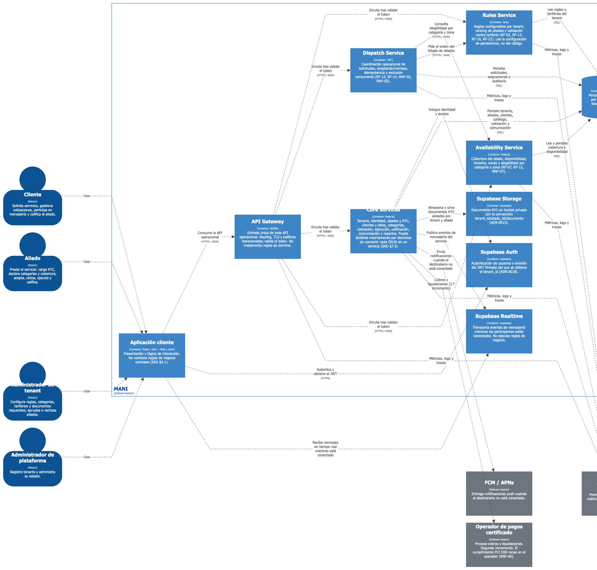
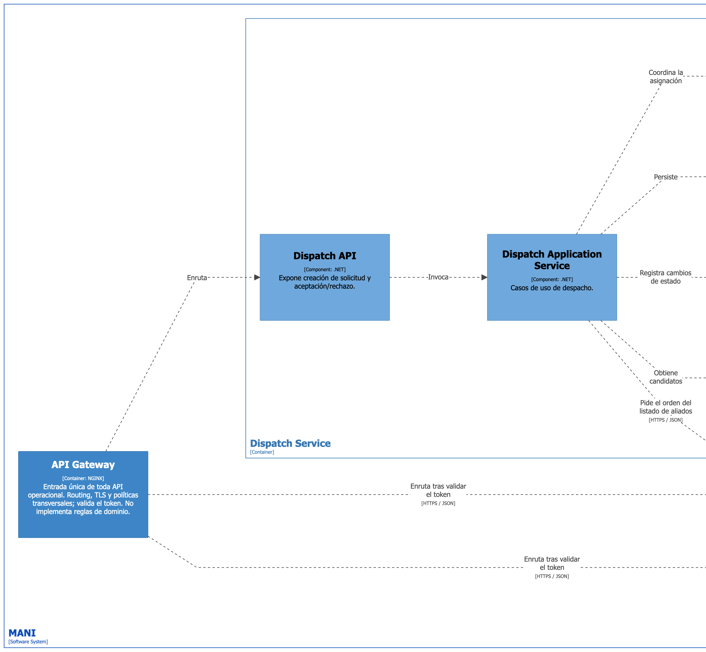
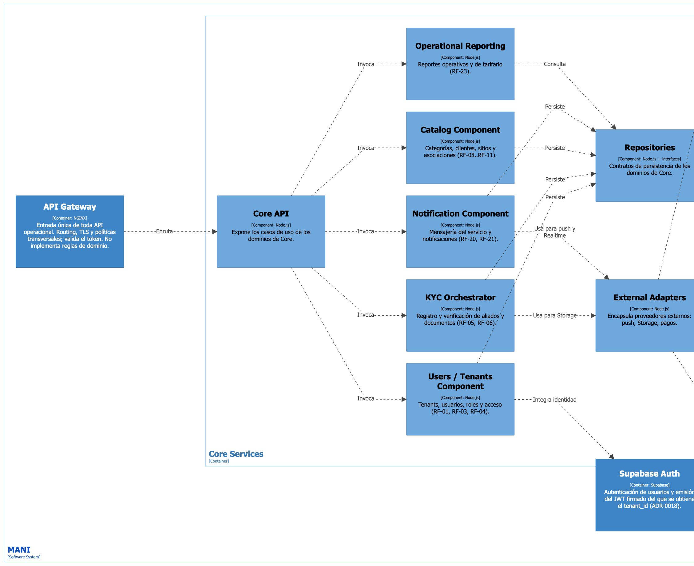
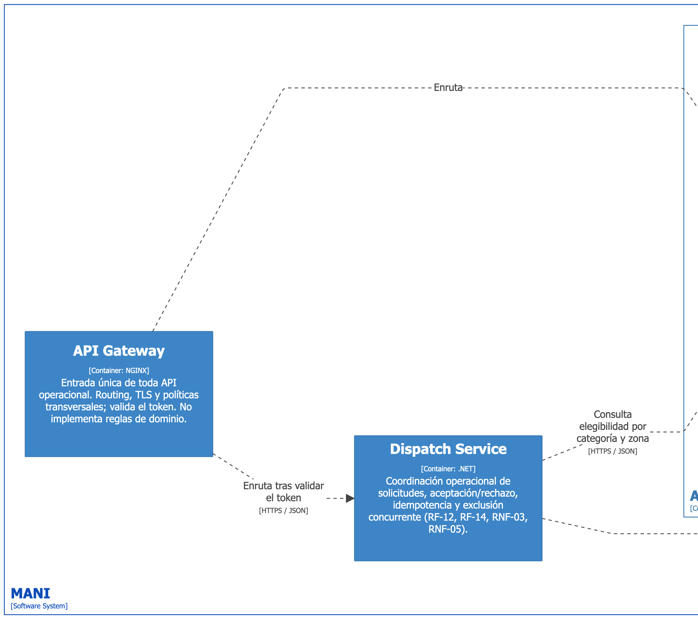

# SDD — Software Design Description
## MANI

**Arquitectura:** SOA + API Gateway + enfoque políglota  
**Norma de calidad de referencia:** ISO/IEC 25010:2023  
**Documento de datos asociado:** [ModeloDatos.md](./ModeloDatos.md)  
**Documento vivo:** sin número de versión; la vigente es la de `main` y el historial está en el log del repositorio.  
**Alcance:** arquitectura de software, vistas C4, atributos de calidad, patrones, despliegue, ambientes y vista física.  
**Fuente de los diagramas:** [`workspace.dsl`](../diagrams/LLD/workspace.dsl) — modelo Structurizr DSL. Inventario completo de vistas en §4.0.

---

## 1. Propósito

Este Software Design Description (SDD) define la arquitectura de MANI desde la perspectiva de software. El documento cubre:

- arquitectura orientada a servicios (SOA);
- API Gateway como punto de entrada;
- enfoque políglota para servicios especializados;
- vistas C4 en los niveles de contexto, contenedores, componentes y código;
- decisiones y patrones arquitectónicos;
- atributos de calidad priorizados con base en ISO/IEC 25010:2023;
- escenarios medibles y umbrales de aceptación;
- vista de despliegue y ambientes;
- diseño físico del repositorio y de la infraestructura;
- estrategia de versionamiento, entrega y rollback.

> **Separación documental:** este SDD no redefine el modelo conceptual, lógico o físico de datos. La definición canónica de entidades, relaciones, DDL, diccionario de datos, Data Warehouse y flujo analítico se mantiene en [ModeloDatos.md](./ModeloDatos.md).

---

## 2. Alcance y principios

MANI es una plataforma multi-tenant para la creación y atención de solicitudes de servicio, cotización, selección y asignación de aliados, gestión KYC, disponibilidad, notificaciones y pagos.

Los principios que gobiernan el diseño son:

1. **La presentación no implementa reglas de negocio.**
2. **Los servicios son propietarios de su lógica de dominio.**
3. **El API Gateway es el punto de entrada de las APIs operacionales.**
4. **La persistencia se encapsula detrás de servicios y repositorios.**
5. **La tecnología puede variar por servicio, pero los contratos de integración son estables.**
6. **Los datos analíticos se separan del procesamiento transaccional.**
7. **Las decisiones arquitectónicas deben responder a atributos de calidad medibles.**

## 2.1 Decisiones explícitas de línea base

Para evitar ambigüedades entre ADR, diagramas y despliegue, se fijan las siguientes decisiones:

| Tema | Decisión |
|---|---|
| Ambientes | **3 ambientes: DEV → QA → PROD** |
| DEV | máquinas personales de cada desarrollador, con Docker local |
| QA y PROD | una máquina virtual por ambiente, con Docker |
| Orquestación | **decisión abierta.** Kubernetes es el objetivo exigido por PROY-08, pero no está decidido ni desplegado: INFRA-01 e INFRA-02 siguen abiertos |
| Repositorios | **Multi-repo**, seis repositorios (§13) |
| Persistencia | **Supabase como plataforma administrada** |
| Motor de base de datos | **PostgreSQL provisto por Supabase** |
| Aislamiento multi-tenant | **JWT + autorización en servicios + RLS en PostgreSQL/Supabase** |
| Contenedores | **Docker/OCI** |
| CI/CD | **GitHub Actions** |

**Supabase y PostgreSQL no son dos alternativas de persistencia.** Supabase es la plataforma administrada utilizada por MANI y PostgreSQL es su motor relacional subyacente.

## 2.2 Acceso del cliente a Supabase

El cliente Flutter alcanza Supabase por exactamente dos caminos, y **no existe ninguna excepción
adicional**:

| Camino | Para qué | Por qué es legítimo |
|---|---|---|
| `Flutter → Supabase Auth` | iniciar sesión, registrar usuario, refrescar el JWT | la identidad la emite Supabase GoTrue y el tenant viaja como claim firmado (ADR-0018, ADR-0027) |
| `Flutter → Supabase Realtime` | recibir eventos de mensajería mientras el usuario está conectado | Realtime es un **transporte de eventos**, no un acceso a datos: no lee tablas de negocio ni ejecuta reglas |

Todo lo demás —consultas, escrituras, archivos, procedimientos— va por
`Flutter → API Gateway → servicio → Supabase`.

Queda prohibido y retirado, **sin excepción transitoria ni de disponibilidades**:

- `.from()` — acceso a tablas vía PostgREST;
- `.rpc()` — invocación de funciones almacenadas;
- `.storage.from()` — acceso directo a Storage. Los documentos KYC se suben por endpoint
  intermediario o URL prefirmada que emite el Core Service.

La consulta de disponibilidades **no** es una excepción: entra por el Gateway al Core Service como
cualquier otra lectura de negocio (ADR-0022, ADR-0027).

---

# 3. Estilo arquitectónico

## 3.1 SOA

MANI se define como una **arquitectura orientada a servicios (SOA)**. Las capacidades del negocio se organizan en servicios con responsabilidades explícitas, interfaces contractuales y bajo acoplamiento.

Capacidades principales:

| Servicio / capacidad | Responsabilidad |
|---|---|
| Reglas por Tenant | ranking, validación tarifaria, políticas KYC y configuración por tenant |
| Despacho y Asignación | solicitudes, candidatos, aceptación/rechazo, exclusiones, concurrencia y auditoría |
| Core de Negocio | usuarios, tenants, clientes y sitios, aliados y KYC, catálogos, cotización, ejecución, calificación, comunicaciones y reportes operativos |
| Disponibilidades | cobertura, zonas, horarios y elegibilidad; **módulo del Core Service**, no un desplegable aparte |
| Integraciones | FCM/APNs, pasarela de pagos, observabilidad y servicios externos |

Disponibilidades mantiene frontera de capacidad propia —su módulo, su esquema `disponibilidad` y su
vista de componentes— pero se construye y despliega dentro del `MANI-Core-Service`. Separarla en un
desplegable adicional no aportaba beneficio frente al costo operativo (riesgo KI-03, SAD §23).

La orientación a servicios permite que la lógica del dominio no quede acoplada a Flutter ni a la base de datos.

## 3.2 API Gateway

NGINX funciona como frontera de entrada para las APIs.

Responsabilidades:

- terminación HTTPS;
- enrutamiento;
- autenticación y propagación de identidad;
- rate limiting;
- balanceo;
- control de CORS;
- trazabilidad mediante correlation ID;
- políticas básicas de seguridad.

El Gateway **no debe contener reglas de negocio**.

## 3.3 Enfoque políglota

La solución utiliza diferentes tecnologías de implementación según el servicio:

| Componente | Tecnología | Repositorio |
|---|---|---|
| Aplicación web/móvil | Flutter / Dart | `MANI-Frontend` |
| API Gateway | NGINX | `MANI-API-Gateway` |
| Servicio de reglas | Java | `MANI-Rules-Service` |
| Despacho y asignación | **.NET** | `MANI-Dispatch-Service` |
| Core y disponibilidades | Node.js | `MANI-Core-Service` |
| Persistencia | Supabase (PostgreSQL como motor) | — |
| Contenedores | Docker / OCI | — |
| Orquestación | abierta: Kubernetes es el objetivo (PROY-08); hoy Docker sobre VM | — |
| CI/CD | GitHub Actions | — |

El enfoque políglota no implica libertad tecnológica irrestricta. Cada tecnología debe justificar su existencia, mantener contratos estables y cumplir los mismos criterios de seguridad, observabilidad, pruebas y despliegue.

---

# 4. Vistas y diagramas

Las vistas de esta sección se generan desde [`workspace.dsl`](../diagrams/LLD/workspace.dsl), que es su fuente. Cada subsección indica la vista que le corresponde y mantiene en texto la estructura y las responsabilidades, para que el documento se lea sin renderizar.

## 4.0 Inventario de vistas

Todo diagrama del proyecto está en esta tabla. Si una vista no aparece aquí, no es oficial.

| # | Vista | Nivel / tipo | Clave en el DSL | Archivo | Sección |
|---|---|---|---|---|---|
| 1 | Landscape del sistema | System Landscape | `landscape` | [`HLD/DHL.png`](../diagrams/HLD/DHL.png) | §4.1 |
| 2 | Contexto del sistema | C4 Nivel 1 | `contexto` | [`LLD/Software/contexto.png`](../diagrams/LLD/Software/contexto.png) | §4.2 |
| 3 | Contenedores | C4 Nivel 2 | `contenedores` | [`LLD/Software/contenedores.png`](../diagrams/LLD/Software/contenedores.png) | §4.3 |
| 4 | Rules Service | C4 Nivel 3 | `componentes-rules` | [`LLD/Software/componentes-rules.png`](../diagrams/LLD/Software/componentes-rules.png) | §4.4.1 |
| 5 | Dispatch Service (.NET) | C4 Nivel 3 | `componentes-dispatch` | [`LLD/Software/componentes-dispatch.png`](../diagrams/LLD/Software/componentes-dispatch.png) | §4.4.2 |
| 6 | Core Service | C4 Nivel 3 | `componentes-core` | [`LLD/Software/componentes-core.png`](../diagrams/LLD/Software/componentes-core.png) | §4.4.3 |
| 7 | Módulo de disponibilidades | C4 Nivel 3 | `componentes-availability` | [`LLD/Software/componentes-availability.png`](../diagrams/LLD/Software/componentes-availability.png) | §4.4.4 |
| 8 | Código — dependencias internas | C4 Nivel 4 | no se modela en DSL | — | §4.5 |
| 9 | Secuencia: despacho y aceptación concurrente | Dinámica | `secuencia-despacho` | [`LLD/Software/secuencia-despacho.png`](../diagrams/LLD/Software/secuencia-despacho.png) | §4.6.1 |
| 10 | Secuencia: cotización y validación tarifaria | Dinámica | `secuencia-cotizacion` | [`LLD/Software/secuencia-cotizacion.png`](../diagrams/LLD/Software/secuencia-cotizacion.png) | §4.6.2 |
| 11 | Secuencia: mensajería por Realtime | Dinámica | `secuencia-mensajeria` | [`LLD/Software/secuencia-mensajeria.png`](../diagrams/LLD/Software/secuencia-mensajeria.png) | §4.6.3 |
| 12 | Despliegue QA | Despliegue | `despliegue-qa` | [`LLD/Software/despliegue-qa.png`](../diagrams/LLD/Software/despliegue-qa.png) | §9.1 |
| 13 | Despliegue PROD | Despliegue | `despliegue-prod` | [`LLD/Software/despliegue-prod.png`](../diagrams/LLD/Software/despliegue-prod.png) | §9.2 |
| 14 | Infraestructura de alto nivel | HLD | no se modela en DSL | [`HLD/Infra.png`](../diagrams/HLD/Infra.png) | §9.3 |
| 15 | Tech Radar | HLD | no se modela en DSL | [`HLD/TechRadar.png`](../diagrams/HLD/TechRadar.png) | [`TECH_RADAR.md`](./TECH_RADAR.md) |

Convención de carpetas: `diagrams/HLD/` para las vistas de alto nivel y `diagrams/LLD/` para el
modelo y sus exportaciones, con los diagramas de software bajo `diagrams/LLD/Software/`.

Las vistas 9 a 12 están definidas en el DSL y **pendientes de exportar**. El texto de cada
sección describe el flujo, de modo que el documento se sostiene sin la imagen.

## 4.1 Landscape del sistema

**Objetivo:** situar MANI en el panorama completo de actores y sistemas con los que convive, antes
de entrar al detalle de contenedores. Es la vista que se usa para explicar el proyecto a alguien que
no lo conoce.


> **Figura 1 — Landscape.** Archivo: [`diagrams/HLD/DHL.png`](../diagrams/HLD/DHL.png).
> Vista `landscape` de [`workspace.dsl`](../diagrams/LLD/workspace.dsl).

```text
Personas
  Cliente · Aliado · Administrador de tenant · Administrador de plataforma
        ↓
  [ MANI ]  — plataforma SaaS multi-tenant
        ↓
Sistemas externos
  FCM / APNs · Operador de pagos certificado (2.º incremento)
  Plataforma de observabilidad · Data Warehouse / BI
```

La diferencia con §4.2: el landscape admite varios sistemas y el contexto se centra en MANI como
único sistema en foco.

---

## 4.2 Nivel 1 — System Context

**Objetivo:** mostrar MANI como un sistema y sus relaciones con personas y sistemas externos.


> **Figura 2 — Contexto del sistema (C4 Nivel 1).** Generada desde la vista `contexto` de [`workspace.dsl`](../diagrams/LLD/workspace.dsl); imagen en [`diagrams/LLD/Software/contexto.png`](../diagrams/LLD/Software/contexto.png).

```text
Cliente              → crea solicitudes y aprueba cotizaciones
Aliado               → cotiza, acepta y ejecuta servicios; gestiona KYC        → [ MANI ]
Administrador tenant → administra usuarios, aliados, tenant y KYC

[ MANI ] → FCM / APNs                    notificaciones
         → Operador de pagos             API de pagos
         → Plataforma de observabilidad  métricas, logs y trazas
         → Data Warehouse                datos operacionales para análisis
```

### Responsabilidades de frontera

- **MANI** ejecuta el flujo transaccional.
- **FCM/APNs** entrega notificaciones push.
- **Pasarela de pagos** procesa pagos; MANI conserva referencias y estados, no datos sensibles de tarjeta.
- **Observabilidad** recibe métricas, logs y trazas.
- **Data Warehouse** recibe datos mediante procesos desacoplados del flujo transaccional.

---

## 4.3 Nivel 2 — Containers

**Objetivo:** mostrar las unidades desplegables y almacenes principales.



> **Figura 3 — Contenedores (C4 Nivel 2).** Generada desde la vista `contenedores` de [`workspace.dsl`](../diagrams/LLD/workspace.dsl); imagen en [`diagrams/LLD/Software/contenedores.png`](../diagrams/LLD/Software/contenedores.png).

```text
Usuarios → Flutter Web / Mobile → (HTTPS) → NGINX API Gateway
                │                                  ↓
                │              ┌──────────────┬─────┴──────────┬──────────────────────┐
                │         Rules Service   Dispatch Service   Core Service
                │           (Java)            (.NET)          (Node.js)
                │                                              ├── dominios de negocio
                │                                              └── módulo Disponibilidades
                │              ↓                 ↓                ↓
                │     Supabase / PostgreSQL por esquema de dominio:
                │       reglas · despacho · core · servicio · disponibilidad ·
                │       comunicaciones · pagos
                │                                               ↓
                │     Core → FCM/APNs · Operador de pagos · Storage · Realtime
                │
                └──→ Supabase Auth       sesión y JWT
                └──← Supabase Realtime   recepción de eventos (§2.2)

   Gateway y servicios → telemetría → Prometheus / Grafana / Datadog
   PostgreSQL → carga incremental → CDC/ELT → Data Warehouse → BI
```

Tres desplegables de negocio, no cuatro: disponibilidades es un módulo del Core Service (§3.1).
Los dos únicos trazos que van del cliente a Supabase son Auth y Realtime, y están justificados en
§2.2.

### Reglas de dependencia

- Flutter consume contratos expuestos por el Gateway.
- Los servicios no acceden directamente a tablas propiedad de otro dominio.
- Las integraciones externas se encapsulan mediante adaptadores.
- El Data Warehouse no participa en transacciones operacionales.
- El detalle de esquemas, entidades y modelo dimensional se encuentra en `ModeloDatos.md`.

---

## 4.4 Nivel 3 — Components

### 4.4.1 Rules Service — Java


> **Figura 4 — Rules Service, Java (C4 Nivel 3).** Generada desde la vista `componentes-rules` de [`workspace.dsl`](../diagrams/LLD/workspace.dsl); imagen en [`diagrams/LLD/Software/componentes-rules.png`](../diagrams/LLD/Software/componentes-rules.png).

```text
Rules REST Controller
  → Rules Application Service
       → Rule Strategy Factory → Ranking Strategy | Tariff Validation Strategy | KYC Policy Strategy
       → Rule Repository Port  → Supabase Adapter (PostgreSQL) → Reglas DB
```

Responsabilidades:

- seleccionar reglas por tenant;
- calcular ranking de aliados;
- validar cotización contra tarifario;
- validar requisitos KYC;
- desacoplar lógica de reglas de la persistencia.

### 4.4.2 Dispatch Service — .NET



> **Figura 5 — Dispatch Service, .NET (C4 Nivel 3).** Generada desde la vista `componentes-dispatch` de [`workspace.dsl`](../diagrams/LLD/workspace.dsl); imagen en [`diagrams/LLD/Software/componentes-dispatch.png`](../diagrams/LLD/Software/componentes-dispatch.png).

```text
Dispatch API
  → Dispatch Application Service
       → Candidate Selector
       → Assignment Coordinator → Concurrency Guard
       → Audit Component
       → Dispatch Repository Port → PostgreSQL Adapter → Dispatch DB
```

Responsabilidades:

- crear solicitudes;
- obtener candidatos válidos;
- coordinar asignación;
- evitar doble aceptación;
- responder conflicto `409` cuando la asignación ya fue tomada;
- auditar cambios de estado.

### 4.4.3 Core Service — Node.js



> **Figura 6 — Core Service, Node.js (C4 Nivel 3).** Generada desde la vista `componentes-core` de [`workspace.dsl`](../diagrams/LLD/workspace.dsl); imagen en [`diagrams/LLD/Software/componentes-core.png`](../diagrams/LLD/Software/componentes-core.png).

```text
Core API
  → Users/Tenants Component ─┐
  → KYC Orchestrator ────────┤
  → Catalog Component ───────┼→ Repositories → Core DB
  → Notification Component ──┤
  → Operational Reporting ───┘

KYC Orchestrator y Notification Component → External Adapters → Storage · Realtime · FCM/APNs
```

### 4.4.4 Módulo de Disponibilidades — Node.js



> **Figura 7 — Módulo de Disponibilidades, Node.js (C4 Nivel 3).** Generada desde la vista `componentes-availability` de [`workspace.dsl`](../diagrams/LLD/workspace.dsl); imagen en [`diagrams/LLD/Software/componentes-availability.png`](../diagrams/LLD/Software/componentes-availability.png).

```text
Core API
  → Availability Application Service
       → Schedule Rules          horarios y solapamientos
       → Availability Query      elegibilidad: categoría declarada + zona de cobertura + agenda
       → Availability Repository → esquema disponibilidad
```

Responsabilidades:

- resolver la elegibilidad de un aliado como la conjunción de tres condiciones: categoría declarada
  (`core.aliado_categoria`), zona de cobertura declarada (`core.aliado_cobertura`) y franja de
  agenda disponible (`disponibilidad.disponibilidad`);
- aplicar coincidencia **exacta** de zona, sin radio ni distancia (REST-01, RNF-09, ADR-0011);
- evaluar horarios y solapamientos.

La lógica de horarios, solapamientos, zonas y elegibilidad pertenece al módulo, **no al cliente
Flutter**: el cliente la consulta por el Gateway como cualquier otra lectura de negocio (§2.2).

Es un módulo con esquema propio dentro del `MANI-Core-Service`, y expone sus casos de uso a través
de la Core API. Dispatch lo consume por API, nunca leyendo su esquema (ModeloDatos §13).

---

## 4.5 Nivel 4 — Code

El nivel 4 expresa la estructura interna de código. No pretende congelar clases concretas para siempre; define las dependencias que deben preservarse.

### Ejemplo: Rules Service

```text
RulesController
  +evaluateRule(request)
  +rankAllies(request)
      ↓
RulesApplicationService
  +evaluate(context)
  +rank(context)
      ↓                              ↓
RuleStrategyFactory             RuleRepository  «interfaz»
  +resolve(ruleType)              +findByTenant(tenantId)
      ↓                              ↑
RuleStrategy  «interfaz»        PostgresRuleRepository
  +supports(ruleType)             +findByTenant(tenantId)
  +evaluate(context)
      ↑
  RankingStrategy · TariffStrategy · KycStrategy   (implementaciones)
```

### Ejemplo: Dispatch Service

```text
DispatchController
  → CreateRequestUseCase → RequestRepository  «interfaz»
  → AssignAllyUseCase    → CandidateSelector
                         → ConcurrencyGuard
                         → AssignmentRepository  «interfaz»
                         → AuditPublisher
```

### Regla de dependencia de código

La dependencia debe apuntar desde adaptadores hacia contratos internos, no desde el dominio hacia frameworks externos:

```text
Controller / Adapter
        ↓
Application / Use Cases
        ↓
Domain
        ↑
Ports / Interfaces
        ↑
DB / External Adapters
```

---

## 4.6 Vistas dinámicas — secuencias

Las vistas C4 son estructurales: dicen quién existe, no en qué orden ocurren las cosas. Estas tres
secuencias cubren los flujos donde el orden **es** el diseño, y son las que QA debe poder seguir
paso a paso.

### 4.6.1 Despacho y aceptación concurrente

Flujo crítico de RF-14 y RNF-05. Es la secuencia que demuestra que no hay doble asignación.


> **Figura 9 — pendiente de exportar.** Vista `secuencia-despacho` de [`workspace.dsl`](../diagrams/LLD/workspace.dsl). El flujo en texto de abajo es normativo mientras la imagen no exista.

```text
Cliente → Gateway → Dispatch      crear solicitud (RF-12)
Dispatch → Core                   pedir candidatos elegibles por categoría y zona
Core → Dispatch                   lista de aliados elegibles
Dispatch → Rules                  pedir el orden del listado (RF-13)
Rules → Dispatch                  listado ordenado según la regla del tenant
Dispatch → Core                   notificar a los aliados del broadcast
Aliado A → Gateway → Dispatch     aceptar
Aliado B → Gateway → Dispatch     aceptar (concurrente)
Dispatch → PostgreSQL             UPDATE condicional atómico sobre la asignación
PostgreSQL → Dispatch             1 fila afectada para A, 0 filas para B
Dispatch → Aliado A               200 OK, asignación confirmada
Dispatch → Aliado B               409 Conflict
Dispatch → Core                   registrar el cambio de estado en el historial
```

La atomicidad vive en la actualización condicional, emitida por Dispatch. No la resuelve una
función PL/pgSQL ni un bloqueo en el cliente (ADR-0016, ADR-0022).

### 4.6.2 Cotización y validación tarifaria

Flujo de RF-15, RF-16 y RF-17.


> **Figura 10 — pendiente de exportar.** Vista `secuencia-cotizacion` de [`workspace.dsl`](../diagrams/LLD/workspace.dsl).

```text
Aliado → Gateway → Core           enviar cotización con mano de obra y materiales (RF-15)
Core → Rules                      validar el total contra el tarifario del tenant (RF-16)
Rules → Core                      veredicto: dentro de rango / fuera de rango
Core → PostgreSQL                 persistir en servicio.cotizacion con fuera_de_rango
Core → Aliado                     alerta si quedó fuera del rango de referencia
Core → Cliente                    notificar cotización disponible
Cliente → Gateway → Core          aceptar, rechazar o solicitar ajuste (RF-17)
Core → PostgreSQL                 actualizar estado de la cotización
Core → Aliado                     notificar la decisión del cliente
```

Rules emite el veredicto; **Core escribe**. Rules no escribe en `servicio.cotizacion`
(ModeloDatos §13).

### 4.6.3 Mensajería en tiempo real

Flujo de RF-20 y RF-21, y el único punto donde el cliente toca Supabase además de Auth (§2.2).


> **Figura 11 — pendiente de exportar.** Vista `secuencia-mensajeria` de [`workspace.dsl`](../diagrams/LLD/workspace.dsl).

```text
Cliente → Gateway → Core          enviar mensaje del servicio
Core → PostgreSQL                 persistir en comunicaciones.mensaje
Core → Supabase Realtime          publicar el evento del mensaje
Supabase Realtime → Aliado        entregar al aliado suscrito y conectado
                                  (único camino Flutter ← Supabase para datos de negocio)
Core → FCM / APNs                 si el destinatario no está conectado, enviar push
Aliado → Gateway → Core           consultar el historial de la conversación (RF-21)
```

Dos invariantes del flujo:

1. El mensaje **se persiste antes** de publicarse. Una reconexión no pierde historial, porque
   Realtime es transporte y no almacén.
2. El fallo de Realtime o de FCM/APNs no revierte el mensaje ya persistido: es el escenario QAS-02.

---

# 5. Patrones arquitectónicos

| Patrón | Aplicación en MANI | Justificación |
|---|---|---|
| SOA | capacidades separadas como servicios | bajo acoplamiento y evolución independiente |
| API Gateway | NGINX | punto de entrada, políticas transversales y ocultamiento de topología interna |
| Layered Architecture interna | API → aplicación → dominio → infraestructura | evita mezclar HTTP, reglas y persistencia |
| Repository / Ports & Adapters | acceso a Supabase mediante interfaces sobre PostgreSQL | desacopla lógica de negocio del proveedor de datos |
| Database ownership por dominio | esquemas/repositorios separados | limita dependencias y cambios cruzados |
| Event-driven para efectos secundarios | notificaciones, auditoría, analítica | reduce cadenas síncronas |
| Externalized Configuration | secretos y configuración fuera del código | portabilidad y seguridad |
| Observability | métricas, logs, trazas y correlation ID | diagnóstico de sistemas distribuidos |

---

# 6. Patrones de diseño

| Patrón | Uso |
|---|---|
| Strategy | reglas variables por tenant |
| Factory | resolución de la estrategia correspondiente |
| Repository | abstracción de persistencia |
| Adapter | FCM/APNs, pagos, KYC y otros proveedores |
| Facade / Application Service | coordinación de casos de uso |
| Observer / Publish-Subscribe | notificaciones, auditoría y eventos analíticos |
| Circuit Breaker | protección frente a fallas de servicios externos |
| Retry con backoff | reintentos controlados en operaciones idempotentes |
| Outbox | publicación confiable de eventos tras una transacción |
| Idempotency Key | evitar pagos, asignaciones o comandos duplicados |

---

# 7. Atributos de calidad — ISO/IEC 25010:2023

ISO/IEC 25010:2023 define un modelo de calidad de producto con nueve características. MANI las utiliza como marco, pero **no todas reciben la misma prioridad**.

Escala:

- **P1 — Crítico:** condiciona decisiones estructurales y aceptación del sistema.
- **P2 — Alto:** debe cumplirse antes de producción, pero no domina todas las decisiones.
- **P3 — Controlado:** se verifica, aunque su impacto arquitectónico es menor para el alcance actual.

Los umbrales siguientes son **objetivos de aceptación inicial del MVP**. Deben recalibrarse con pruebas de carga y datos reales.

> **Este documento es el único lugar donde viven los umbrales de calidad del proyecto.** El SAD, el
> backlog, las políticas DevOps y la wiki no los repiten: los referencian. Antes existían cuatro
> valores distintos de p95 (500 ms, 1 s y 3 s en dos documentos) y tres objetivos de concurrencia
> (20, 150 y 300). Un umbral que aparece en otro documento está desactualizado por definición y se
> corrige contra esta sección, nunca al revés.
>
> Cambiar un umbral es cambiar este documento, y pasa por Mesa de Arquitectura.

## 7.1 Priorización general

| Característica ISO/IEC 25010:2023 | Prioridad | Razón |
|---|---:|---|
| Seguridad | P1 | multi-tenant, KYC, identidad, pagos y datos sensibles |
| Fiabilidad | P1 | solicitudes, despacho y asignación requieren continuidad y consistencia |
| Eficiencia de desempeño | P1 | ranking, disponibilidad y despacho son sensibles a latencia |
| Mantenibilidad | P1 | arquitectura políglota y múltiples servicios elevan el costo de cambio |
| Flexibilidad | P1 | los servicios deben escalar, desplegarse y adaptarse por separado |
| Compatibilidad | P2 | integración entre Java, .NET, Node.js, Flutter y terceros |
| Adecuación funcional | P2 | exactitud de reglas, asignaciones y estados |
| Capacidad de interacción | P2 | cliente, aliado y administrador necesitan flujos claros |
| Protección (Safety) | P3 | no es un sistema safety-critical, pero debe evitar operaciones irreversibles inseguras |

---

## 7.2 Seguridad — P1

| Subcaracterística | Prioridad | Umbral / criterio de aceptación |
|---|---:|---|
| Confidencialidad | P1 | 100% de endpoints privados requieren autenticación; TLS 1.2+; secretos fuera del código |
| Integridad | P1 | 100% de operaciones críticas protegidas por validación de autorización y constraints transaccionales |
| Autenticidad | P1 | tokens firmados y validados en 100% de llamadas protegidas |
| Responsabilidad / accountability | P1 | 100% de cambios críticos generan actor, timestamp y correlation ID |
| No repudio | P2 | pagos, aceptación y cambios críticos conservan evidencia auditable |
| Resistencia | P1 | 0 vulnerabilidades Critical/High conocidas abiertas en release de producción; rate limiting en Gateway |

**Controles arquitectónicos:** JWT/OIDC, API Gateway, RBAC, aislamiento por tenant, RLS cuando aplique, auditoría, SAST con SonarQube, DAST con OWASP ZAP, gestión de secretos y mínimos privilegios.

---

## 7.3 Fiabilidad — P1

| Subcaracterística | Prioridad | Umbral / criterio |
|---|---:|---|
| Ausencia de fallos | P1 | tasa de error 5xx < 1% en ventana de 15 min bajo carga nominal |
| Disponibilidad | P1 | ≥ 99.9% mensual para APIs críticas |
| Tolerancia a fallos | P1 | falla de proveedor de notificaciones no cancela una solicitud o asignación confirmada |
| Recuperabilidad | P1 | RTO ≤ 30 min; RPO ≤ 5 min para datos operacionales críticos |

Controles: réplicas, health checks, restart automático, circuit breaker, retry controlado, backups, restauración probada y procesamiento asíncrono de efectos secundarios.

---

## 7.4 Eficiencia de desempeño — P1

| Subcaracterística | Prioridad | Umbral / criterio |
|---|---:|---|
| Comportamiento temporal | P1 | p95 ≤ 500 ms para lecturas internas simples y p95 ≤ 800 ms para comandos críticos, excluyendo tiempo de terceros |
| Utilización de recursos | P2 | utilización sostenida objetivo < 70% CPU por pod antes de escalar |
| Capacidad | P1 | soportar inicialmente 300 sesiones concurrentes y 50 req/s sostenidos sin incumplir p95 |

Controles: índices, consultas acotadas, paginación, caché selectiva, HPA, pooling, pruebas de carga y métricas.

---

## 7.5 Mantenibilidad — P1

| Subcaracterística | Prioridad | Umbral / criterio |
|---|---:|---|
| Modularidad | P1 | ningún servicio accede directamente a tablas de otro dominio |
| Reusabilidad | P2 | contratos y adaptadores comunes reutilizables sin duplicar reglas de dominio |
| Analizabilidad | P1 | 100% de requests distribuidos con correlation ID; logs estructurados |
| Capacidad para ser modificado | P1 | cambios internos compatibles no exigen modificar consumidores externos |
| Capacidad para ser probado | P1 | cobertura de código nuevo ≥ 80%; casos de uso críticos ≥ 90%; contract tests obligatorios |

**Quality Gate:** 0 issues Blocker/Critical en código nuevo; duplicación de código nuevo < 3%; pipeline debe fallar si el Quality Gate no se cumple.

---

## 7.6 Flexibilidad — P1

| Subcaracterística | Prioridad | Umbral / criterio |
|---|---:|---|
| Adaptabilidad | P1 | misma imagen desplegable en DEV/QA/PROD mediante configuración externa |
| Escalabilidad | P1 | el servicio escala sin cambio de código: la réplica se añade por configuración del ambiente. Con Docker sobre VM el techo es la VM; el autoescalado queda condicionado a la decisión de orquestación (INFRA-01) |
| Instalabilidad | P1 | despliegue automatizado por ambiente ≤ 10 min en condiciones normales |
| Reemplazabilidad | P2 | proveedores externos encapsulados por Adapter; cambio de proveedor sin alterar dominio |

El umbral de escalabilidad se enuncia como propiedad del artefacto —escala sin recompilar— y no
como un número de réplicas, porque el número depende de la plataforma de orquestación y esa
decisión está abierta. Fijar «2 a 6 réplicas» mientras el despliegue es una VM con Docker sería
declarar como verificable algo que hoy no se puede medir.

---

## 7.7 Compatibilidad — P2

| Subcaracterística | Prioridad | Umbral / criterio |
|---|---:|---|
| Coexistencia | P2 | servicios respetan límites configurados de CPU/memoria y no degradan otros workloads |
| Interoperabilidad | P1 dentro de la característica | 100% de APIs documentadas con OpenAPI; contract tests verdes antes de promoción |

---

## 7.8 Adecuación funcional — P2

| Subcaracterística | Prioridad | Umbral / criterio |
|---|---:|---|
| Completitud funcional | P2 | 100% de historias críticas trazadas a casos de prueba |
| Corrección funcional | P1 dentro de la característica | 100% de escenarios críticos de ranking, tarifa, asignación y conflicto pasan pruebas |
| Pertinencia funcional | P2 | cada endpoint productivo corresponde a un caso de uso identificado |

---

## 7.9 Capacidad de interacción — P2

| Subcaracterística | Prioridad | Umbral / criterio |
|---|---:|---|
| Reconocibilidad | P2 | usuario identifica acción principal de cada flujo sin documentación externa |
| Aprendizabilidad | P3 | usuarios de prueba completan flujos base con ≤ 1 asistencia |
| Operabilidad | P2 | ≥ 90% de éxito en pruebas de tareas críticas |
| Protección contra errores de usuario | P1 dentro de la característica | acciones irreversibles requieren validación/confirmación y errores accionables |
| Involucración | P3 | consistencia visual definida por sistema de diseño |
| Inclusividad | P2 | criterios de accesibilidad definidos para web/móvil |
| Asistencia al usuario | P3 | errores y estados vacíos incluyen orientación |
| Auto-descriptividad | P2 | formularios y estados críticos explican el siguiente paso |

---

## 7.10 Protección / Safety — P3

MANI no controla maquinaria ni procesos donde un fallo de software implique directamente riesgo de vida. Aun así:

| Subcaracterística | Prioridad | Umbral / criterio |
|---|---:|---|
| Restricción operativa | P2 | estados inválidos de solicitud/asignación deben rechazarse |
| Identificación de riesgos | P3 | operaciones sensibles identificadas en análisis de riesgo |
| Protección ante fallos | P2 | fallas de terceros no deben dejar transacciones críticas en estado ambiguo |
| Advertencia de peligro | P3 | mensajes explícitos antes de cancelaciones/reversiones críticas |
| Integración segura | P2 | integración externa requiere timeout, validación de respuesta y circuit breaker cuando aplique |

---

# 8. Escenarios de calidad priorizados

Esta sección operacionaliza la priorización definida en la sección 7 mediante **un escenario de calidad representativo por cada característica de ISO/IEC 25010:2023**. Cada escenario identifica la fuente del estímulo, el estímulo, el entorno de ejecución, el artefacto afectado, la respuesta esperada, el umbral de aceptación y el mecanismo mediante el cual QA debe verificarlo.

| ID | Característica ISO/IEC 25010:2023 | Subcaracterística seleccionada | Prioridad | Fuente | Estímulo | Entorno | Artefacto | Respuesta esperada | Umbral / criterio de aceptación | ¿Cómo lo mide QA? |
|---|---|---|:---:|---|---|---|---|---|---|---|
| **QAS-01** | **Seguridad** | **Confidencialidad** | P1 | Usuario autenticado de un tenant | Intenta consultar o modificar información perteneciente a otro tenant | QA o PROD en operación normal | API Gateway, servicio de dominio y PostgreSQL/RLS | El sistema rechaza la operación, no expone información del tenant destino y registra el evento cuando corresponda | **100% de accesos cross-tenant rechazados** | QA ejecuta pruebas automatizadas con tokens y recursos de tenants distintos sobre operaciones de lectura y escritura; verifica rechazo de acceso, ausencia de datos ajenos y evidencia de auditoría |
| **QAS-02** | **Fiabilidad** | **Tolerancia a fallos** | P1 | Proveedor externo de notificaciones | FCM/APNs deja de responder después de confirmarse una operación de negocio | QA con dependencia externa degradada o indisponible | Core Service, Notification Component y adaptador externo | La operación principal permanece confirmada y la notificación queda disponible para reintento controlado | **0 operaciones confirmadas revertidas únicamente por fallo de notificación** | QA simula timeout, error y caída del proveedor; verifica estado final de la operación, persistencia del evento, logs y ejecución del mecanismo de retry |
| **QAS-03** | **Eficiencia de desempeño** | **Comportamiento temporal** | P1 | Usuario o servicio consumidor | Consulta disponibilidad de aliados por categoría y zona | QA bajo carga nominal | Core Service — módulo de disponibilidades, persistencia y componentes de la consulta | El sistema retorna candidatos elegibles dentro del tiempo objetivo | **p95 ≤ 500 ms** para la consulta bajo carga nominal | QA ejecuta pruebas de carga, registra los tiempos de respuesta del endpoint y calcula el percentil 95; el escenario se aprueba si el p95 permanece dentro del umbral |
| **QAS-04** | **Mantenibilidad** | **Capacidad para ser modificado** | P1 | Equipo de desarrollo | Modifica una regla de ranking o comportamiento configurable de un tenant manteniendo el contrato externo | DEV y QA | Rules Service, configuración y contratos de integración | El cambio se implementa sin exigir modificaciones en consumidores externos compatibles | **0 cambios obligatorios en Flutter, Gateway o Dispatch para un cambio interno compatible** | QA ejecuta pruebas de regresión, integración y contract tests; verifica que los consumidores existentes continúen operando sin modificaciones derivadas del cambio |
| **QAS-05** | **Flexibilidad** | **Escalabilidad** | P1 | Incremento de demanda del sistema | La carga de un servicio crítico supera la capacidad de la instancia en ejecución | VM de QA con Docker bajo carga controlada | Contenedor del servicio crítico, Compose del ambiente y observabilidad | Se añade capacidad al servicio sin modificar código ni reconstruir la imagen, y el servicio sigue atendiendo durante el cambio | **La misma imagen admite capacidad adicional solo por configuración del ambiente; 0 cambios de código y 0 reconstrucciones** | QA genera carga progresiva con k6, añade capacidad al servicio por configuración y verifica con la plataforma de observabilidad que la latencia baja, que no aparecen errores nuevos y que el digest de la imagen no cambió |
| **QAS-06** | **Compatibilidad** | **Interoperabilidad** | P2 | Servicio interno o consumidor autorizado | Consume una API publicada por un servicio implementado en otra tecnología | QA de integración | APIs REST, API Gateway y contratos OpenAPI | Productor y consumidor intercambian información respetando el contrato publicado | **100% de APIs documentadas con OpenAPI y contract tests críticos aprobados antes de promoción** | QA ejecuta contract tests y pruebas de integración/Newman; valida códigos HTTP, payloads, tipos de datos, campos obligatorios y compatibilidad del contrato |
| **QAS-07** | **Adecuación funcional** | **Corrección funcional** | P2 | Usuarios o servicios que ejecutan reglas y operaciones críticas | Ejecutan escenarios críticos de ranking, tarifa, asignación o conflicto | QA con datos de prueba controlados | Rules Service, Dispatch Service y servicios involucrados | El sistema produce el resultado funcional definido para cada regla, asignación y transición de estado | **100% de escenarios críticos de ranking, tarifa, asignación y conflicto aprobados** | QA mantiene casos de prueba trazados a los requisitos críticos y verifica resultados esperados, estados persistidos, códigos de respuesta y reglas de negocio |
| **QAS-08** | **Capacidad de interacción** | **Protección contra errores de usuario** | P2 | Usuario autorizado | Intenta ejecutar una acción irreversible o envía información inválida en un flujo crítico | Aplicación web/móvil en operación normal | Flutter y API asociada al caso de uso | El sistema previene la ejecución accidental mediante validación o confirmación y devuelve errores accionables | **100% de acciones irreversibles definidas requieren validación o confirmación previa** | QA recorre los flujos críticos y prueba entradas inválidas, cancelaciones y acciones irreversibles; verifica validaciones, confirmaciones, mensajes y conservación del estado previo cuando la operación es rechazada |
| **QAS-09** | **Protección / Safety** | **Protección ante fallos** | P3 | Servicio o integración externa | Se produce una falla durante una operación que modifica información crítica | QA con falla controlada de una dependencia | Servicio de negocio, adaptador externo y persistencia | El sistema evita estados parciales o ambiguos y conserva un estado consistente o recuperable | **0 transacciones críticas en estado ambiguo por fallas de terceros** | QA aplica fault injection, timeouts o respuestas inválidas durante operaciones críticas y valida estados persistidos, logs, eventos y posibilidad de recuperación sin inconsistencias |

Los escenarios anteriores complementan los umbrales específicos definidos en las subsecciones 7.2 a 7.10. Cuando exista diferencia entre un escenario de esta tabla y un criterio más restrictivo definido para una subcaracterística en la sección 7, **prevalece el criterio más restrictivo**.

---

# 9. Vista de despliegue

El despliegue vigente es **Docker sobre máquina virtual, una VM por ambiente**. Kubernetes es el
objetivo exigido por PROY-08, pero su proveedor y topología siguen abiertos (INFRA-01, INFRA-02):
mientras no exista ADR que los cierre, ningún diagrama ni documento declara un clúster como estado
actual.

La promoción no depende de esa decisión. Las imágenes son OCI y la misma imagen validada se
promueve de QA a PROD, por lo que migrar a Kubernetes no exige reconstruirlas.

## 9.1 QA


> **Figura 12 — pendiente de exportar.** Vista `despliegue-qa` de [`workspace.dsl`](../diagrams/LLD/workspace.dsl).

```text
Equipo de QA y pruebas automatizadas
        ↓ HTTPS
VM de QA
  NGINX API Gateway (contenedor)
        ↓ red interna de Docker
  Rules (Java) · Dispatch (.NET) · Core + Disponibilidades (Node.js)
        ↓
  Supabase — proyecto de QA, separado de producción
        ↓
  Newman · OWASP ZAP · k6 ejecutan contra este ambiente
```

## 9.2 Producción


```text
Web / Mobile Users → DNS + TLS → NGINX API Gateway (contenedor)
                                          ↓ red interna de Docker
  Rules (Java) · Dispatch (.NET) · Core + Disponibilidades (Node.js)
                                          ↓
Supabase — proyecto productivo
  PostgreSQL con esquemas por dominio: core · disponibilidad · reglas · despacho · servicio ·
  comunicaciones · pagos
                                          ↓
Core → FCM/APNs + Operador de pagos (2.º incremento)
Gateway y servicios → Prometheus → Grafana · logs y trazas → Datadog
PostgreSQL → CDC/ELT → Data Warehouse → BI
```

### Reglas físicas

- contenedores inmutables, fijados por tag y digest;
- `restart: unless-stopped` y health checks por contenedor, para que la caída de uno no arrastre al resto;
- límites de CPU y memoria declarados por contenedor;
- secretos inyectados desde el gestor del ambiente, nunca en la imagen ni en el Compose;
- TLS terminado en el borde; el tráfico externo no viaja en claro;
- la base productiva no es accesible desde Internet pública salvo controles explícitos;
- acceso administrativo con privilegio mínimo;
- rollback por imagen anterior, sin reconstruir.

Réplicas y autoescalado quedan fuera de este diseño mientras la orquestación esté abierta: una VM
con Docker no da HPA. Es una limitación conocida del estado actual, no una decisión de arquitectura,
y se levanta cuando INFRA-01 se cierre.

## 9.3 Infraestructura de alto nivel


> **Figura 8 — Infraestructura de alto nivel.** Archivo: [`diagrams/HLD/Infra.png`](../diagrams/HLD/Infra.png).
> El detalle operativo por ambiente vive en [`INFRAESTRUCTURA_MANI.md`](../governance/INFRAESTRUCTURA_MANI.md).

---

# 10. Ambientes

MANI adopta **tres ambientes, y son exactamente tres**. No existe STAGING ni un cuarto ambiente
con otro nombre.

| Ambiente | Objetivo | Infraestructura | Datos |
|---|---|---|---|
| **DEV** | desarrollo e integración temprana | máquina personal de cada desarrollador, con Docker local y Supabase de desarrollo | datos sintéticos |
| **QA** | pruebas funcionales, integración, seguridad y validación previa a producción | VM de QA con Docker + proyecto Supabase de QA | dataset controlado y anonimizado |
| **PROD** | operación real | VM productiva con Docker + Supabase productivo | datos reales |

El ambiente de desarrollo se llama **DEV** y el de pruebas **QA** en todos los documentos,
pipelines y tags. No se usan «Local», «TEST» ni «TEST/QA» como nombres de ambiente.

### Reglas

- el flujo oficial es **DEV → QA → PROD**;
- no compartir bases, secretos ni credenciales entre ambientes;
- no copiar datos KYC ni datos personales reales a DEV o QA;
- configuración y secretos son externos a las imágenes;
- la misma imagen de contenedor validada se promueve de QA a PROD;
- entre ambientes solo cambian parámetros externos y secretos;
- cuando se cierre la decisión de orquestación, QA y PROD cambian de plataforma sin cambiar este flujo ni los nombres de los ambientes.

---

# 11. Flujo CI/CD y promoción

```text
Commit / Pull Request
  → Unit + Integration + Contract Tests
  → SonarQube (SAST)
  → Build Images
  → Dependency / Image Scan
  → Deploy QA
  → Newman + OWASP ZAP
  → Promoción del mismo artefacto validado a PROD
  → Verificación post-despliegue
```

Un artefacto que no pasa los gates de calidad **no se reconstruye para producción**; se promueve exactamente la misma imagen verificada.

---

# 12. Versionamiento de despliegue

## 12.1 Servicios

Se utiliza **Semantic Versioning**:

```text
MAJOR.MINOR.PATCH
```

Ejemplo:

```text
rules-service:2.3.1
dispatch-service:1.8.0
core-service:1.5.4
```

- **MAJOR:** cambio incompatible de contrato.
- **MINOR:** funcionalidad compatible.
- **PATCH:** corrección compatible.

La imagen final debe quedar además fijada por digest o commit SHA.

## 12.2 API

Los cambios incompatibles se versionan en la ruta o contrato:

```text
/api/v1/...
/api/v2/...
```

Una versión MAJOR anterior se mantiene durante una ventana de transición definida.

## 12.3 Base de datos

Las migraciones son incrementales e inmutables:

```text
V001__initial_schema.sql
V002__add_assignment_status.sql
V003__add_rule_priority.sql
```

No se modifica una migración ya ejecutada en ambientes compartidos; se crea una nueva.

## 12.4 Releases

Ejemplo:

```text
v1.4.0-dev.3
v1.4.0-rc.1
v1.4.0
```

La etiqueta final representa el release productivo.

## 12.5 Rollback

- rollback de aplicación mediante imagen previa;
- migraciones destructivas requieren estrategia expand/contract;
- cambios de esquema incompatibles no se despliegan en el mismo paso que la eliminación de compatibilidad;
- objetivo de rollback operacional: ≤ 5 min.

---

# 13. Vista física de repositorios

MANI mantiene una estrategia **multi-repositorio**. La arquitectura distribuida no se representa como un monorepo.

MANI mantiene **seis repositorios**. Esta es la lista completa y los nombres son exactos:

| Repositorio | Tecnología | Responsabilidad principal |
|---|---|---|
| `MANI-Frontend` | Flutter / Dart | Cliente web y móvil |
| `MANI-API-Gateway` | NGINX | Punto de entrada y enrutamiento de APIs |
| `MANI-Rules-Service` | Java | Reglas de negocio por tenant |
| `MANI-Dispatch-Service` | .NET | Solicitudes, despacho y asignación |
| `MANI-Core-Service` | Node.js | Servicios core y disponibilidades |
| `MANI-Docs` | Markdown / diagramas / ADR | Documentación arquitectónica y técnica |

```text
GitHub / Organización MANI
├── MANI-Frontend
│   └── aplicación web/móvil Flutter
├── MANI-API-Gateway
│   ├── nginx/            configuración del Gateway
│   ├── compose/          Compose por ambiente: dev · qa · prod
│   └── observability/    configuración de Prometheus, Grafana y Datadog
├── MANI-Rules-Service
│   └── reglas por tenant, ranking y validación tarifaria
├── MANI-Dispatch-Service
│   └── solicitudes, despacho, asignación y exclusión concurrente
├── MANI-Core-Service
│   ├── tenants, identidad, clientes y sitios, aliados y KYC, catálogo
│   ├── cotización, ejecución y calificación
│   ├── comunicaciones
│   └── disponibilidades   módulo con esquema propio
└── MANI-Docs
    ├── product/        SRS y backlog
    ├── architecture/   SAD.md, SDD.md, ModeloDatos.md, TECH_RADAR.md
    ├── adr/
    ├── governance/     gobierno, políticas DevOps e infraestructura
    ├── diagrams/       HLD (alto nivel) y LLD (workspace.dsl + Software/)
    └── wiki/           navegación; no añade reglas propias
```

### Responsabilidades

- cada repositorio desplegable mantiene su propio ciclo de build, test y versionamiento;
- `MANI-API-Gateway` es la raíz de composición del ambiente: además de la configuración de NGINX
  guarda el Compose por ambiente y la configuración de observabilidad. No existe un repositorio de
  infraestructura aparte;
- `MANI-Docs` contiene la documentación técnica oficial y no se despliega;
- GitHub Actions puede reutilizar workflows compartidos, pero cada artefacto se construye y versiona de manera independiente;
- la promoción entre ambientes preserva el mismo artefacto validado;
- la estrategia multi-repo es una decisión explícita del proyecto y queda reflejada en ADR-0004.

**Disponibilidades no tiene repositorio propio.** Mantiene frontera de capacidad —módulo, esquema
`disponibilidad` y vista de componentes— dentro de `MANI-Core-Service` (§3.1).

---

# 14. Dependencias permitidas y prohibidas

## Permitidas

```text
Flutter → API Gateway
Flutter → Supabase Auth            solo sesión y JWT
Flutter ← Supabase Realtime        solo recepción de eventos ya publicados por Core
API Gateway → Servicios
Servicio → Repositorio propio
Servicio → Adapter → Proveedor externo
Dispatch → API del Core Service    lectura de elegibilidad, nunca su esquema
OLTP → CDC/ELT → Data Warehouse
```

## Prohibidas

```text
Flutter → tabla operacional
Servicio A → tablas privadas de Servicio B
Data Warehouse → escritura en OLTP
Gateway → implementación de reglas de dominio
Servicio → credenciales hard-coded
DEV/QA → base de datos PROD
```

---

# 15. Decisiones arquitectónicas que sostienen este diseño

Este documento **no define ADR**. Los ADR viven en [`adr/`](../adr/), con su propia numeración, y son
la fuente de la decisión. Esta sección solo dice qué decisión sostiene qué parte del diseño.

| ADR | Decisión | Qué sostiene en este SDD |
|---|---|---|
| [ADR-0019](../adr/ADR-0019-arquitectura-soa-poliglota.md) | Arquitectura SOA distribuida, multi-tenant y políglota; API Gateway como frontera única | §3.1 SOA, §3.2 Gateway, §3.3 enfoque políglota, §4.3 contenedores |
| [ADR-0012](../adr/ADR-0012-persistencia-multitenant.md) | Supabase/PostgreSQL con RLS y propiedad por dominio | §2.1 línea base, §7.2 seguridad, §18 relación con datos |
| [ADR-0018](../adr/ADR-0018-identificacion-tenant.md) | Identificación y propagación segura del tenant | §2.2 acceso del cliente, §7.2 autenticidad |
| [ADR-0022](../adr/ADR-0022-logica-de-negocio-en-servicios.md) | La lógica de negocio vive en los servicios | §2 principios, §2.2, §4.6 secuencias |
| [ADR-0027](../adr/ADR-0027-alcance-supabase-cliente-flutter.md) | Alcance de `supabase_flutter`: solo Auth y Realtime | §2.2, §14 dependencias |
| [ADR-0016](../adr/ADR-0016-despacho-concurrencia.md) | Despacho broadcast y exclusión concurrente | §4.4.2 Dispatch, §4.6.1 secuencia de despacho |
| [ADR-0011](../adr/ADR-0011-cobertura-geografica.md) | Cobertura por zonas, sin radio ni geolocalización | §4.4.4 disponibilidades, §4.6.1 |
| [ADR-0013](../adr/ADR-0013-storage-kyc.md) | Almacenamiento aislado de documentos KYC | §4.4.3 Core, §7.2 confidencialidad |
| [ADR-0017](../adr/ADR-0017-realtime-notificaciones.md) | Mensajería en tiempo real y notificaciones push | §4.6.3 secuencia de mensajería |
| [ADR-0004](../adr/ADR-0004-cicd-multirepo-ambientes.md) | CI/CD multi-repo y promoción de ambientes | §10 ambientes, §11 CI/CD, §13 repositorios |
| [ADR-0006](../adr/ADR-0006-observabilidad.md) | Observabilidad distribuida y gestión de incidentes | §7.5 analizabilidad, §9 despliegue |

El Data Warehouse separado del OLTP es una decisión de diseño de datos y se justifica en
[`ModeloDatos.md`](./ModeloDatos.md) §9, no en un ADR propio.

> **Por qué cambió esta sección.** Antes definía «ADR-001» a «ADR-005» en línea, con números que
> colisionaban con los ADR reales del repositorio: `ADR-002` aquí era API Gateway mientras
> [ADR-0002](../adr/ADR-0002-jira-github.md) es Jira y GitHub. Dos decisiones distintas bajo el mismo
> identificador.

---

# 16. Architectural Killers

El registro de riesgos arquitectónicos con sus identificadores `KI-01`..`KI-08`, su efecto y su
control vive en [`SAD.md`](./SAD.md) §23. No se repite aquí para que no existan dos listas con
numeración distinta.

Lo que aporta este SDD es **dónde se materializa el control de cada riesgo en el diseño**:

| Riesgo | Control en este documento |
|---|---|
| KI-01 — lógica de negocio en Flutter | §2 principio 1, §2.2 acceso del cliente, §4.6 secuencias |
| KI-02 — acceso directo a Supabase | §2.2 (dos caminos, sin excepciones), §14 dependencias prohibidas |
| KI-03 — servicios excesivamente pequeños | §3.1 y §13: disponibilidades es módulo, no desplegable |
| KI-04 — dependencias síncronas largas | §5 event-driven para efectos secundarios, §6 Circuit Breaker y Retry |
| KI-05 — pérdida de aislamiento multi-tenant | §7.2 umbrales de seguridad, §8 QAS-01 |
| KI-06 — doble asignación | §4.4.2 Concurrency Guard, §4.6.1 secuencia de despacho |
| KI-07 — analítica sobre OLTP | §18 y [`ModeloDatos.md`](./ModeloDatos.md) §9 |
| KI-08 — complejidad políglota | §3.3 justificación por servicio, §11 CI/CD homogéneo |

---

# 17. Trazabilidad arquitectura ↔ calidad

| Decisión | Atributos favorecidos |
|---|---|
| SOA | mantenibilidad, flexibilidad, compatibilidad |
| API Gateway | seguridad, interoperabilidad, fiabilidad |
| separación por dominio | modularidad, modificabilidad, integridad |
| Docker / OCI | instalabilidad, adaptabilidad, reproducibilidad, recuperabilidad por imagen anterior |
| CI/CD | testabilidad, modificabilidad, seguridad |
| observabilidad | analizabilidad, fiabilidad |
| Strategy/Factory | modificabilidad, modularidad |
| Adapter | reemplazabilidad, interoperabilidad |
| Circuit Breaker | tolerancia a fallos |
| Data Warehouse separado | desempeño, escalabilidad y mantenibilidad |

---

# 18. Relación con el diseño de datos

Este SDD define **quién es responsable de los datos y cómo se accede a ellos**, pero no sustituye su especificación.

Consultar [ModeloDatos.md](./ModeloDatos.md) para:

- modelo conceptual;
- modelo lógico;
- DER;
- modelo físico;
- DDL;
- diccionario de datos;
- separación de esquemas;
- integridad y restricciones;
- Data Warehouse;
- modelo estrella;
- dimensiones y hechos;
- CDC/ELT y frescura analítica.

---

# 19. Criterio de aceptación arquitectónica

Una versión puede promoverse a producción únicamente si:

1. cumple los Quality Gates de seguridad y mantenibilidad;
2. contract tests e integración están en verde;
3. no introduce accesos cruzados de datos no autorizados;
4. mantiene los umbrales P1 definidos en este SDD;
5. las migraciones tienen estrategia de compatibilidad y rollback;
6. existe telemetría para las operaciones críticas;
7. el artefacto desplegado es el mismo que fue validado en los ambientes previos.

---

# 20. Referencias

- ISO/IEC 25010:2023, *Systems and software engineering — Systems and software Quality Requirements and Evaluation (SQuaRE) — Product quality model*.
- C4 Model, vistas de contexto, contenedores, componentes y código. Modelo del proyecto en [`workspace.dsl`](../diagrams/LLD/workspace.dsl).
- OpenAPI para contratos HTTP.
- OWASP para controles de seguridad de aplicaciones y APIs.
