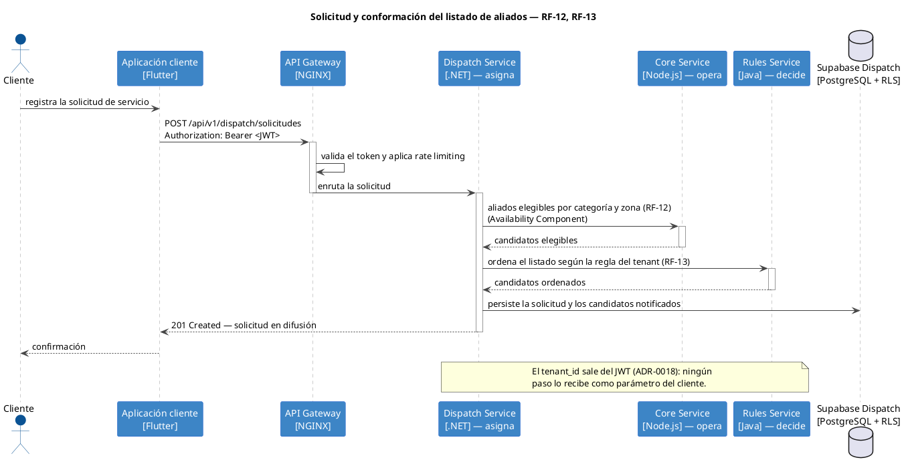
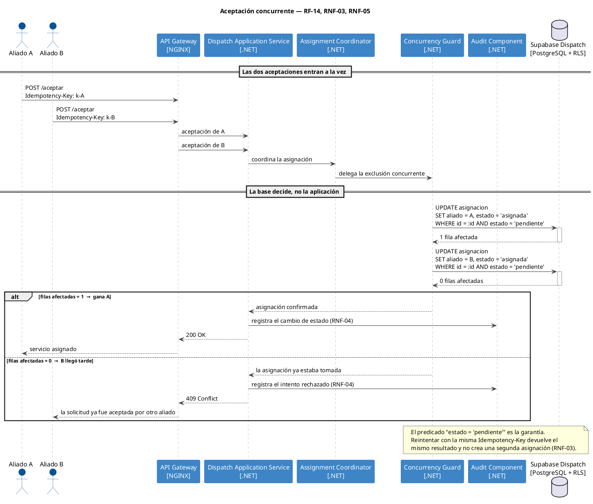
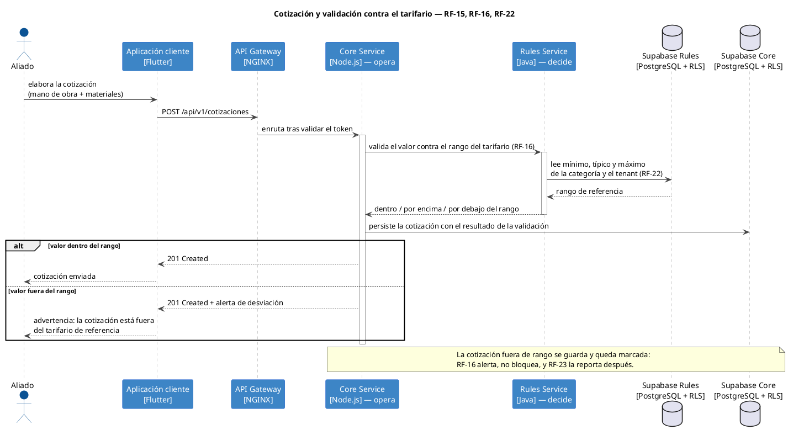
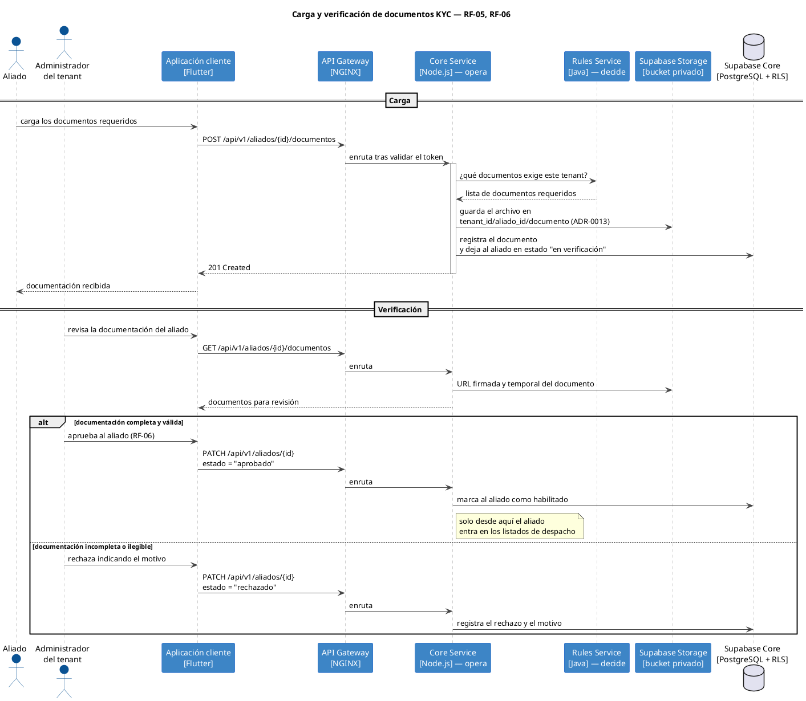
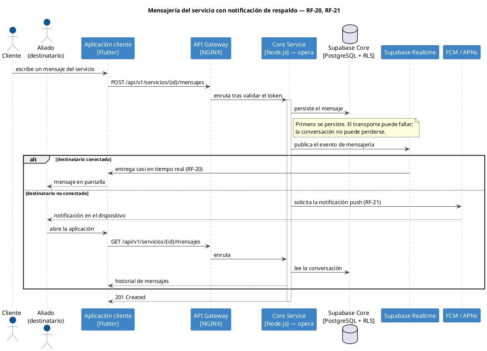

# Diagramas de secuencia — MANI

**Proyecto:** MANI — TRAMA · Ingeniería de Software
**Alcance:** los flujos críticos del ciclo Solicitud → Cotización → Ejecución → Calificación → Cierre, en notación de secuencia UML.
**Fuente del modelo:** [`workspace.dsl`](../diagrams/LLD/workspace.dsl) — las mismas colaboraciones están declaradas allí como vistas dinámicas (`dinamico-*`), descritas en [`SDD.md`](./SDD.md) §4.6.

---

## Por qué este documento existe aparte

Las vistas dinámicas del DSL sirven para mantener el modelo C4 coherente: cada paso tiene que corresponder a una relación declarada, así que el diagrama no puede inventar una colaboración que la arquitectura no permita.

Este documento es la otra mitad: **PlantUML suelto**, editable y pegable en cualquier visor, sin depender de Structurizr. Aquí sí caben cosas que el modelo C4 no expresa —dos actores compitiendo, una rama `alt`, una condición de error— y que son justamente las que hay que mostrar al sustentar.

Cuando un flujo cambie, cambian los dos: el DSL manda sobre la estructura, este documento sobre el detalle de la interacción.

### Cómo renderizar

```bash
# cualquiera de los bloques de abajo, guardado como .puml
java -jar plantuml.jar -tpng -Playout=smetana seq-solicitud.puml
```

También sirve pegar el bloque en <https://www.plantuml.com/plantuml> o en la extensión de PlantUML del IDE.

---

## 1. Solicitud y conformación del listado de aliados

**Requisitos:** RF-12 (creación y coordinación de la solicitud), RF-13 (orden del listado según la regla del tenant).

Lo que el diagrama debe dejar claro: **quien orquesta es Despacho**. Pregunta elegibilidad al dominio de disponibilidad en Core y el orden a Reglas. Ni el cliente Flutter ni el Gateway deciden nada.



---

## 2. Aceptación concurrente — dos aliados compiten

**Requisitos:** RF-14 (aceptar o rechazar sin dobles asignaciones), RNF-03 (idempotencia), RNF-05 (exclusión concurrente).

Este es el flujo que hay que saber defender. La garantía **no** está en la aplicación ni en el número de réplicas: está en una actualización condicional atómica sobre el estado de la asignación. La primera aceptación afecta una fila y gana; la segunda no afecta ninguna y recibe `409 Conflict`.



---

## 3. Cotización y validación contra el tarifario

**Requisitos:** RF-15 (cotización separando mano de obra y materiales), RF-16 (alerta fuera de rango), RF-22 (tarifario por categoría y tenant).

Reparto de responsabilidades: **Core es dueño de la cotización, Reglas es dueño del tarifario.** La validación es una llamada entre servicios, no lógica duplicada en Core. La cotización fuera de rango **se guarda igual**: RF-16 pide alertar, no bloquear, y RF-23 después reporta esas cotizaciones.



---

## 4. Carga y verificación de documentos KYC

**Requisitos:** RF-05 (registro de aliados y documentos), RF-06 (verificación y aprobación).

Dos puntos a sostener: los documentos viven en un bucket privado bajo la convención `tenant_id/aliado_id/documento` (ADR-0013), y la aprobación es una **decisión humana del administrador del tenant**, no un efecto automático de la carga.



---

## 5. Mensajería del servicio con notificación de respaldo

**Requisitos:** RF-20 (mensajería casi en tiempo real entre cliente y aliado), RF-21 (notificación cuando el destinatario no está conectado).

El mensaje **se persiste antes de transportarse**: la conversación no vive en el canal de tiempo real. Realtime transporta, no decide; si el destinatario no está conectado, el mismo mensaje sale por push.



---

## Trazabilidad

| Secuencia | Vista dinámica en el DSL | Servicios | Requisitos |
|---|---|---|---|
| 1. Solicitud | `dinamico-solicitud` | Dispatch · Core · Rules | RF-12, RF-13 |
| 2. Aceptación concurrente | `dinamico-aceptacion` | Dispatch | RF-14, RNF-03, RNF-05 |
| 3. Cotización | `dinamico-cotizacion` | Core · Rules | RF-15, RF-16, RF-22 |
| 4. KYC | `dinamico-kyc` | Core · Rules · Storage | RF-05, RF-06 |
| 5. Mensajería | `dinamico-mensajeria` | Core · Realtime · FCM/APNs | RF-20, RF-21 |

Documentos relacionados: [`SDD.md`](./SDD.md) §4.6 (las mismas vistas en el modelo C4), [`SAD.md`](./SAD.md) §7 (responsabilidad de cada servicio), [`COMUNICACION_SERVICIOS_GATEWAY.md`](./COMUNICACION_SERVICIOS_GATEWAY.md) (rutas y puertos del Gateway).
