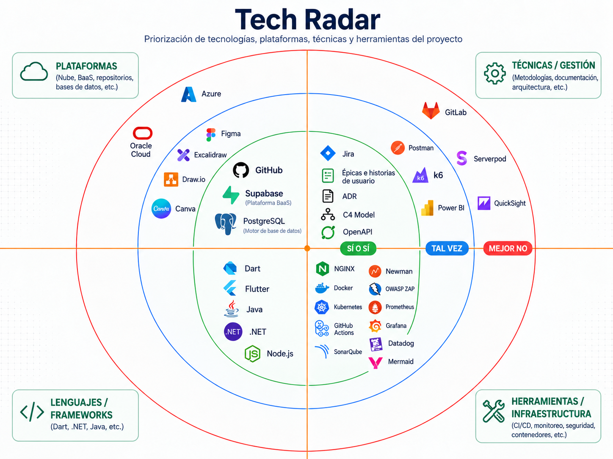

# Tech Radar — MANI

> **Figura 1 — Tech Radar.** Archivo: [`diagrams/HLD/TechRadar.png`](../diagrams/HLD/TechRadar.png). Si la imagen y las listas de abajo discrepan, manda este documento.

## Sí o sí

### Plataformas
- GitHub
- Supabase
- PostgreSQL como motor de Supabase

### Lenguajes / frameworks
- Flutter / Dart
- Java
- .NET
- Node.js

### Infraestructura y calidad
- NGINX
- Docker / OCI
- Kubernetes
- GitHub Actions
- SonarQube
- OWASP ZAP
- Newman
- OpenAPI
- Prometheus
- Grafana
- Datadog
- Jira
- Mermaid / Draw.io para documentación técnica

## Tal vez
- k6, sujeto a necesidad de pruebas de carga más profundas.

## Mejor no / descartado
- Azure como proveedor obligatorio.
- Serverpod como backend principal.
- MongoDB/NestJS como stack primario.
- GitHub Projects como backlog principal.
