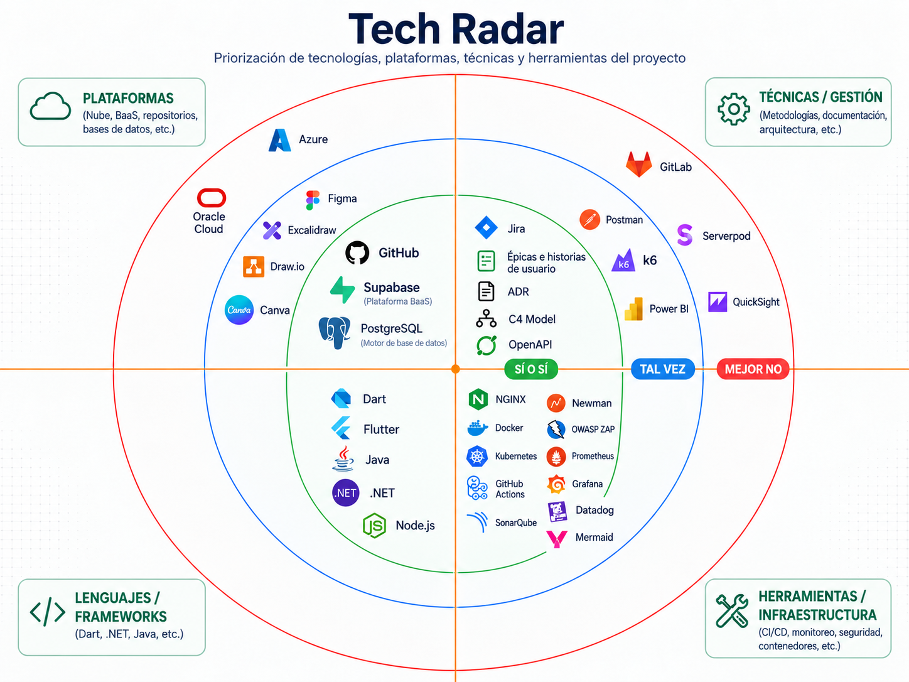

# Diagramas

[← 02 · Arquitectura](README.md) · [Índice](../Home.md)

**Fuente:** [`diagrams/C4Model/workspace.dsl`](../../diagrams/C4Model/workspace.dsl) · [`adr/ADR-0008`](../../adr/ADR-0008-diagramacion-tecnica.md) · [`architecture/TECH_RADAR.md`](../../architecture/TECH_RADAR.md) · contenido de [`diagrams/`](../../diagrams/).

## Dos familias, cada una con su documento

| Familia | Fuente | Documento que la referencia |
|---|---|---|
| **C4** — contexto, contenedores, componentes y despliegue | [`diagrams/C4Model/workspace.dsl`](../../diagrams/C4Model/workspace.dsl) (Structurizr DSL), exportado a [`diagrams/C4Model/`](../../diagrams/C4Model/) | [`SDD.md`](../../architecture/SDD.md) §4 y §9 |
| **DHL** — diagramas de alto nivel e infraestructura ilustrativa | [`diagrams/ALTO_NIVEL/`](../../diagrams/ALTO_NIVEL/) (PNG) | [`SAD.md`](../../architecture/SAD.md) §5, §6 y §16 |

El modelo C4 **no se dibuja en Mermaid**: el DSL es la fuente y los documentos la referencian por nombre de vista.

## Vistas C4 definidas

Declaradas en [`workspace.dsl`](../../diagrams/C4Model/workspace.dsl):

| Vista | Nivel C4 | Contenido | Imagen |
|---|---|---|---|
| `contexto` | 1 | MANI, sus cuatro actores y los sistemas externos | [PNG](../../diagrams/C4Model/png/contexto.png) |
| `contenedores` | 2 | Flutter, Gateway, los cuatro servicios, Supabase (Auth, PostgreSQL+RLS, Storage, Realtime), CDC/ELT e integraciones | [PNG](../../diagrams/C4Model/png/contenedores.png) |
| `componentes-rules` | 3 | Rules Service (Java): controller, application service, estrategias, puerto y adaptador | [PNG](../../diagrams/C4Model/png/componentes-rules.png) |
| `componentes-dispatch` | 3 | Dispatch Service (.NET): selector, coordinador, **Concurrency Guard**, auditoría, puerto y adaptador | [PNG](../../diagrams/C4Model/png/componentes-dispatch.png) |
| `componentes-core` | 3 | Core Services (Node.js): usuarios/tenants, KYC, catálogo, notificación, reportes, adaptadores externos | [PNG](../../diagrams/C4Model/png/componentes-core.png) |
| `componentes-availability` | 3 | Availability Service (Node.js): reglas de horario, consulta de elegibilidad, repositorio | [PNG](../../diagrams/C4Model/png/componentes-availability.png) |
| `despliegue-prod` | — | Despliegue de producción: borde TLS, clúster Kubernetes con 2..6 réplicas, plataforma de datos administrada y analítica | [PNG](../../diagrams/C4Model/png/despliegue-prod.png) |

El **Nivel 4 (Code)** no se modela en el DSL —Structurizr describe contenedores y componentes, no clases— y se mantiene en [`SDD.md`](../../architecture/SDD.md) §4.4.

## Cómo renderizar

```bash
# desde architecture/
structurizr validate -w workspace.dsl               # comprueba el modelo antes de un PR
structurizr export -w workspace.dsl -f plantuml     # también: dot, websequencediagrams, json
```

Las imágenes publicadas viven en [`diagrams/C4Model/`](../../diagrams/C4Model/) y se regeneran cuando cambia el modelo: **el DSL es la fuente, el PNG es el resultado.**

Sin instalación local, la misma imagen oficial en contenedor:

```bash
docker run --rm -v "$PWD":/work -w /work structurizr/structurizr export -w workspace.dsl -f plantuml
```

Notas de uso comprobadas al crear el modelo:

- el DSL **no** declara `theme default`: ese tema se descarga de un servicio remoto, falla sin red y llega a su fin de vida; los estilos están definidos en el propio archivo;
- un cambio en el modelo se valida antes de abrir el PR, igual que cualquier otro artefacto versionado.

## Diagramas de alto nivel (DHL)

| Archivo | Contenido | Referenciado en |
|---|---|---|
| [`DHL.png`](../../diagrams/ALTO_NIVEL/DHL.png) | Diagrama de alto nivel de la solución | SAD §5 y §6 |
| [`Infra.png`](../../diagrams/ALTO_NIVEL/Infra.png) | Vista de infraestructura | SAD §16, SDD §9.1 |
| [`TechRadar.png`](../../diagrams/ALTO_NIVEL/TechRadar.png) | Tech Radar en imagen | Encabezado del SAD |

El DHL muestra acceso directo de Flutter a Supabase para disponibilidades: es la [excepción transitoria](estilo-y-contenedores.md#excepción-transitoria-vigente) de SDD §2.1, no el estado objetivo. El modelo C4 del DSL describe la arquitectura objetivo.

## Galería

### Vistas C4 — fuente: [`workspace.dsl`](../../diagrams/C4Model/workspace.dsl)

**Nivel 1 — Contexto**


**Nivel 2 — Contenedores**


**Nivel 3 — Componentes por servicio**


**Despliegue — producción**


### Diagramas de alto nivel (DHL) — los referencia el [`SAD.md`](../../architecture/SAD.md)




## Política

ADR-0008: los diagramas deben ser localizables, versionables y coherentes con la documentación arquitectónica vigente. Las herramientas concretas son parte del Tech Radar y pueden cambiar sin nueva decisión ([ADR-0020](../../adr/ADR-0020-herramientas-visuales.md), `Superseded`).

Otros diagramas del proyecto: el DER lógico y el modelo dimensional viven en [`architecture/ModeloDatos.md`](../../architecture/ModeloDatos.md) §5 y §9–§10.
