# Diagramas

[← 02 · Arquitectura](README.md) · [Índice](../Home.md)

**Fuente:** [`diagrams/LLD/workspace.dsl`](../../diagrams/LLD/workspace.dsl) · [`adr/ADR-0008`](../../adr/ADR-0008-diagramacion-tecnica.md) · [`architecture/TECH_RADAR.md`](../../architecture/TECH_RADAR.md) · contenido de [`diagrams/`](../../diagrams/).

## Dos familias, cada una con su documento

| Familia | Fuente | Documento que la referencia |
|---|---|---|
| **C4** — panorama, contexto, contenedores, componentes, dinámicas y despliegue | [`diagrams/LLD/workspace.dsl`](../../diagrams/LLD/workspace.dsl) (Structurizr DSL), exportado a [`diagrams/LLD/`](../../diagrams/LLD/) | [`SDD.md`](../../architecture/SDD.md) §4 y §9 |
| **DHL** — diagramas de alto nivel e infraestructura ilustrativa | [`diagrams/HLD/`](../../diagrams/HLD/) (PNG) | [`SAD.md`](../../architecture/SAD.md) §5, §6 y §16 |

El modelo C4 **no se dibuja en Mermaid**: el DSL es la fuente y los documentos la referencian por nombre de vista.

Aparte de las dos familias hay un tercer artefacto: [`architecture/SECUENCIAS.md`](../../architecture/SECUENCIAS.md), con los cinco flujos críticos en **PlantUML suelto**. No sustituye a las vistas dinámicas del DSL —esas mantienen la coherencia con el modelo— sino que añade lo que el C4 no expresa: dos actores compitiendo por la misma solicitud, ramas `alt` y respuestas de error como `409 Conflict`.

## Vistas C4 definidas

Declaradas en [`workspace.dsl`](../../diagrams/LLD/workspace.dsl):

| Vista | Nivel C4 | Contenido | Imagen |
|---|---|---|---|
| `panorama` | Landscape | El mapa de sistemas: MANI como único sistema propio, sus cuatro actores y las plataformas externas de las que depende | [PNG](../../diagrams/LLD/png/panorama.png) |
| `contexto` | 1 | MANI, sus cuatro actores y los sistemas externos | [PNG](../../diagrams/LLD/png/contexto.png) |
| `contenedores` | 2 | Flutter, Gateway y los tres servicios agrupados por bloque —Java decide, .NET asigna, Node opera—, Supabase por dominio (Rules, Dispatch, Core) más Auth, Storage y Realtime, CDC/ELT e integraciones | [PNG](../../diagrams/LLD/png/contenedores.png) |
| `componentes-rules` | 3 | Rules Service (Java): controller, application service, estrategias, puerto y adaptador | [PNG](../../diagrams/LLD/png/componentes-rules.png) |
| `componentes-dispatch` | 3 | Dispatch Service (.NET): selector, coordinador, **Concurrency Guard**, auditoría, puerto y adaptador | [PNG](../../diagrams/LLD/png/componentes-dispatch.png) |
| `componentes-core` | 3 | Core Services (Node.js): usuarios/tenants, KYC, catálogo, **disponibilidad**, notificación, reportes, adaptadores externos | [PNG](../../diagrams/LLD/png/componentes-core.png) |
| `dinamico-solicitud` | Dinámica | Solicitud y conformación del listado de aliados: el despacho pregunta elegibilidad a Core y el orden a Reglas (RF-12, RF-13) | [PNG](../../diagrams/LLD/png/dinamico-solicitud.png) |
| `dinamico-aceptacion` | Dinámica | Exclusión concurrente a nivel de componentes de Despacho: la primera aceptación gana, la segunda recibe `409 Conflict` (RF-14, RNF-05) | [PNG](../../diagrams/LLD/png/dinamico-aceptacion.png) |
| `dinamico-cotizacion` | Dinámica | Cotización en Core y validación contra el tarifario en Reglas (RF-15, RF-16, RF-22) | [PNG](../../diagrams/LLD/png/dinamico-cotizacion.png) |
| `dinamico-kyc` | Dinámica | Carga de documentos al bucket privado y aprobación por el administrador del tenant (RF-05, RF-06) | [PNG](../../diagrams/LLD/png/dinamico-kyc.png) |
| `dinamico-mensajeria` | Dinámica | Mensaje persistido, transportado por Realtime y notificado por push cuando el destinatario no está conectado (RF-20, RF-21) | [PNG](../../diagrams/LLD/png/dinamico-mensajeria.png) |
| `despliegue-prod` | Despliegue | Producción: borde con balanceo, clúster Kubernetes con 2..6 réplicas y secretos externos, Supabase por dominio, pipeline de CI/CD que promueve la imagen y observabilidad Prometheus/Grafana | [PNG](../../diagrams/LLD/png/despliegue-prod.png) |

Las cuatro vistas del C4 que Structurizr puede describir están cubiertas: **panorama**, **estática** (contexto, contenedores, componentes), **dinámica** y **despliegue**. No hay vista por ambiente: Local, DEV y TEST/QA comparten la topología de producción y solo cambian escalado, secretos y datos ([`SDD.md`](../../architecture/SDD.md) §10).

El **Nivel 4 (Code)** no se modela en el DSL —Structurizr describe contenedores y componentes, no clases— y se mantiene en [`SDD.md`](../../architecture/SDD.md) §4.4.

## Cómo renderizar

```bash
# desde diagrams/LLD/
structurizr validate -w workspace.dsl               # comprueba el modelo antes de un PR
structurizr export -w workspace.dsl -f plantuml     # también: dot, websequencediagrams, json
```

`validate` termina en 0 y sin salida cuando el modelo está bien.

Los PNG publicados se generaron desde ese PlantUML con el motor **Smetana**, que no necesita Graphviz instalado:

```bash
java -jar plantuml.jar -tpng -Playout=smetana structurizr-*.puml
```

Las vistas dinámicas llevan la propiedad `plantuml.sequenceDiagram` en el DSL y por eso se dibujan como diagramas de secuencia, que es como se lee un flujo.

Las imágenes publicadas viven en [`diagrams/LLD/`](../../diagrams/LLD/) y se regeneran cuando cambia el modelo: **el DSL es la fuente, el PNG es el resultado.**

Sin instalación local, la misma imagen oficial en contenedor:

```bash
docker run --rm -v "$PWD":/work -w /work structurizr/structurizr export -w workspace.dsl -f plantuml
```

Notas de uso comprobadas al crear el modelo:

- el DSL **no** declara `theme default`: ese tema se descarga de un servicio remoto, falla sin red y llega a su fin de vida; los estilos están definidos en el propio archivo;
- las llamadas entre servicios se declaran **una sola vez**, entre componentes: Structurizr las propaga solo al nivel de contenedor y declararlas también ahí es una relación duplicada que hace fallar `validate`;
- las vistas dinámicas solo pueden usar relaciones que ya existen en el modelo: si un paso no valida, falta la relación, no la vista;
- un cambio en el modelo se valida antes de abrir el PR, igual que cualquier otro artefacto versionado.

## Diagramas de alto nivel (DHL)

| Archivo | Contenido | Referenciado en |
|---|---|---|
| [`DHL.png`](../../diagrams/HLD/DHL.png) | Diagrama de alto nivel de la solución | SAD §5 y §6 |
| [`Infra.png`](../../diagrams/HLD/Infra.png) | Vista de infraestructura | SAD §16, SDD §9.1 |
| [`TechRadar.png`](../../diagrams/HLD/TechRadar.png) | Tech Radar en imagen | Encabezado del SAD |

El DHL muestra acceso directo de Flutter a Supabase para disponibilidades: es la [excepción transitoria](estilo-y-contenedores.md#excepción-transitoria-vigente) de SDD §2.1, no el estado objetivo. El modelo C4 del DSL describe la arquitectura objetivo.

## Galería

### Vistas C4 — fuente: [`workspace.dsl`](../../diagrams/LLD/workspace.dsl)

**Nivel 1 — Contexto**

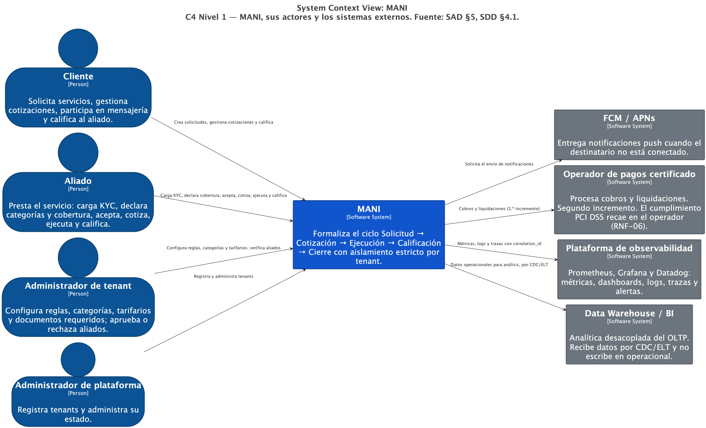

**Nivel 2 — Contenedores**

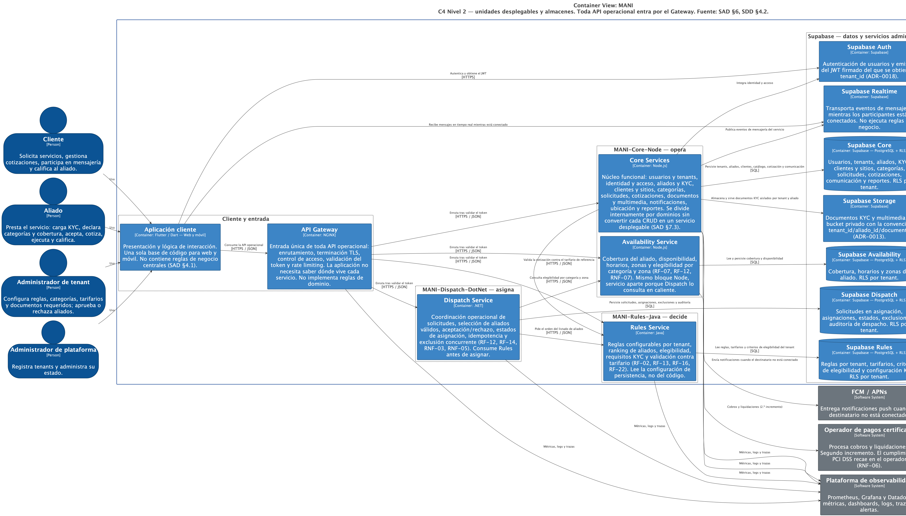

**Nivel 3 — Componentes por servicio**

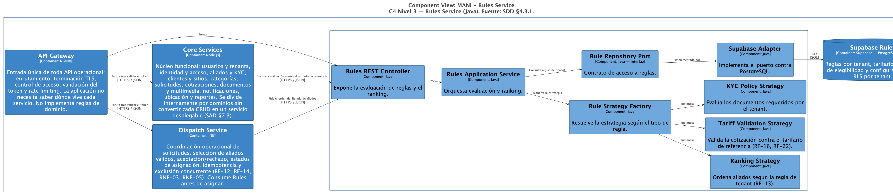

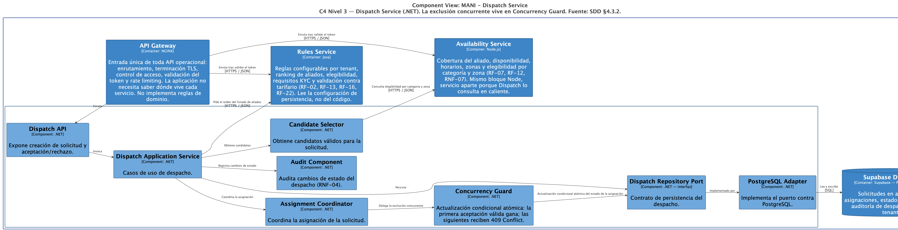

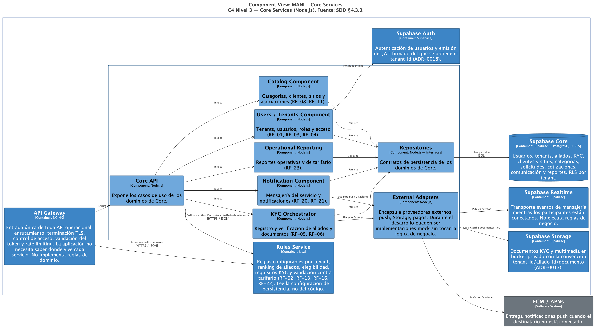

**Despliegue — producción**

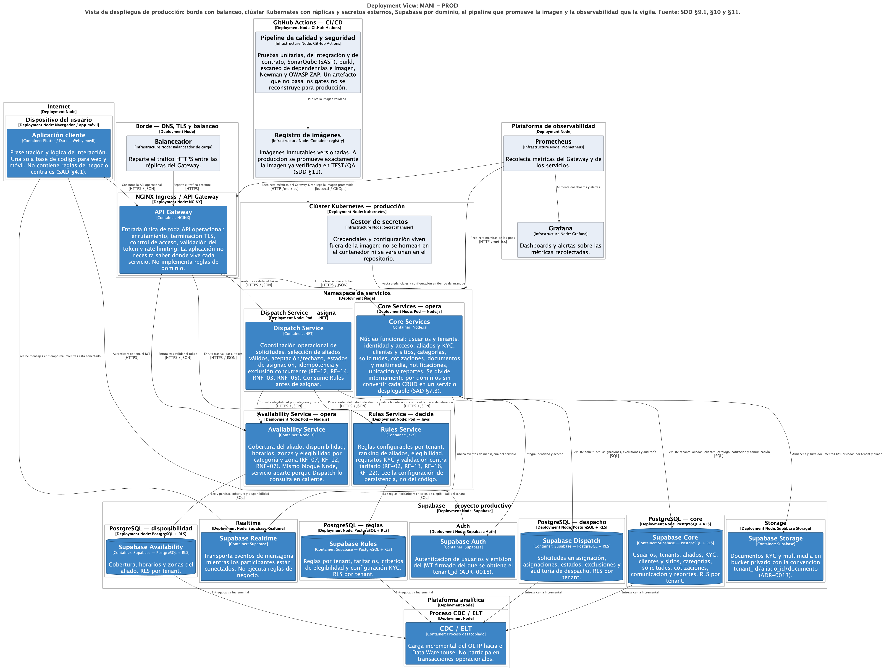

**Panorama — System Landscape**

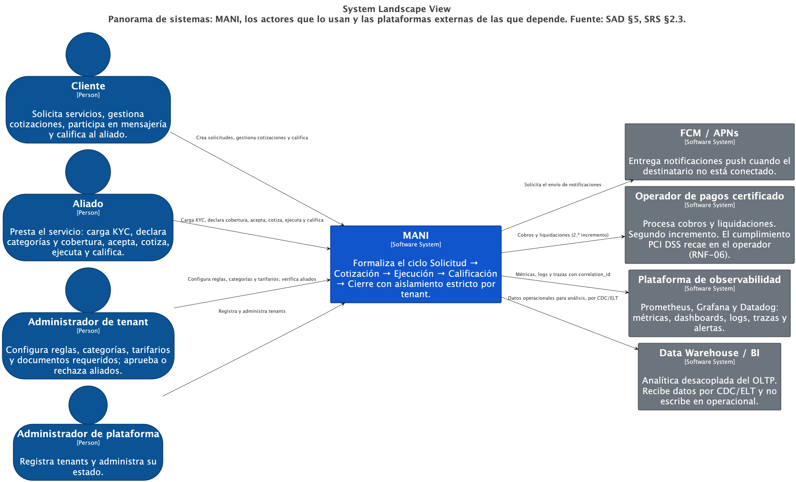

**Vistas dinámicas**

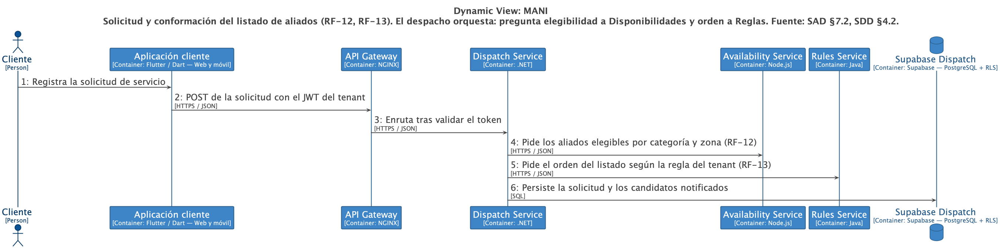

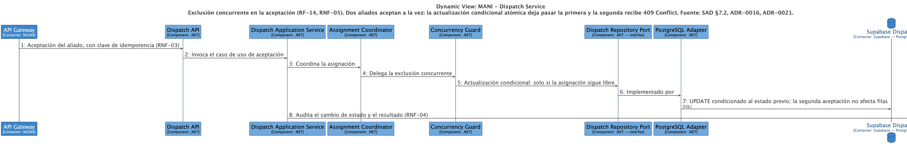

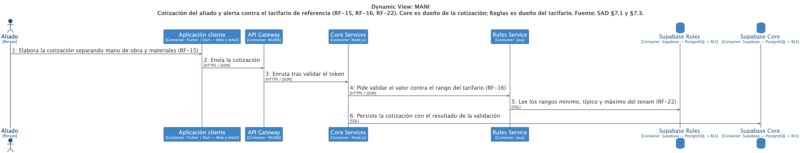

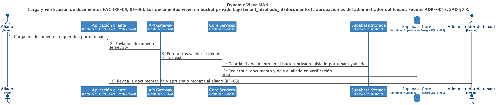

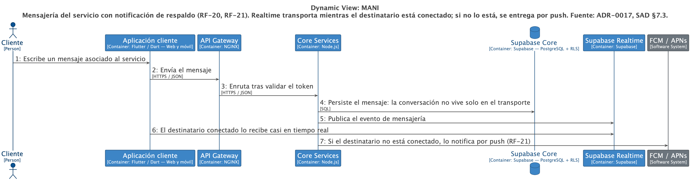

### Diagramas de alto nivel (DHL) — los referencia el [`SAD.md`](../../architecture/SAD.md)


## Política

ADR-0008: los diagramas deben ser localizables, versionables y coherentes con la documentación arquitectónica vigente. Las herramientas concretas son parte del Tech Radar y pueden cambiar sin nueva decisión ([ADR-0020](../../adr/ADR-0020-herramientas-visuales.md), `Superseded`).

Otros diagramas del proyecto: el DER lógico y el modelo dimensional viven en [`architecture/ModeloDatos.md`](../../architecture/ModeloDatos.md) §5 y §9–§10.
